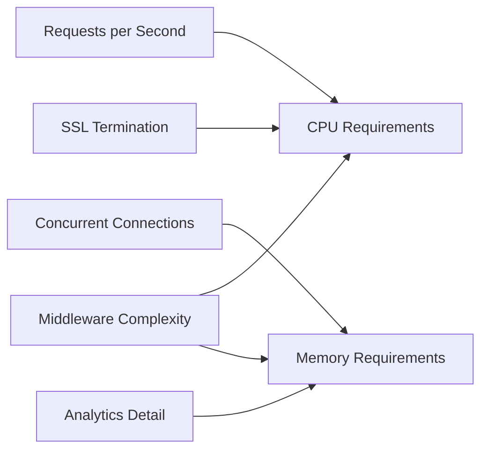

# Capacity Planning for Tyk Deployments

This guide provides a systematic approach to capacity planning for Tyk deployments, helping you estimate resource requirements, plan for growth, and optimize your infrastructure for different traffic patterns and deployment scenarios.

## Capacity Planning Fundamentals

### Importance of Capacity Planning

Effective capacity planning for Tyk deployments is essential for:

- **Performance assurance**: Ensuring your API platform meets performance requirements
- **Cost optimization**: Right-sizing infrastructure to avoid over-provisioning
- **Growth accommodation**: Planning for future traffic increases
- **Reliability**: Preventing resource exhaustion and service degradation
- **Budget planning**: Forecasting infrastructure costs accurately

### Capacity Planning Process

Follow this systematic process for capacity planning:

1. **Gather requirements**: Identify performance targets and constraints
2. **Estimate traffic**: Forecast API request volumes and patterns
3. **Calculate resources**: Determine required infrastructure resources
4. **Test and validate**: Verify capacity estimates through testing
5. **Implement monitoring**: Track actual usage against capacity
6. **Review regularly**: Adjust capacity plans as needs evolve

### Key Metrics for Capacity Planning

Focus on these key metrics when planning capacity:

- **Requests per second (RPS)**: Total API request volume
- **Peak RPS**: Maximum request rate during peak periods
- **Request latency**: Response time requirements
- **Concurrent connections**: Number of simultaneous connections
- **Data transfer**: Network bandwidth requirements
- **Analytics volume**: Amount of analytics data generated
- **Storage needs**: Database and log storage requirements

## Component Resource Requirements

### Gateway Resource Requirements



Tyk Gateway resource requirements depend on several factors:

- **CPU**: Scales with request volume and complexity
  - Base: 2 CPU cores for up to 1,000 RPS
  - Add 2 cores for each additional 1,000 RPS
  - Add 1-2 cores for complex middleware or plugins
  - Add 1-2 cores for SSL termination at high volumes

- **Memory**: Scales with connections and configuration
  - Base: 2GB RAM for up to 1,000 RPS
  - Add 1GB for each additional 1,000 RPS
  - Add 1-2GB for extensive API definitions
  - Add 1-2GB for response caching
  - Add 1GB for detailed analytics

- **Network**: Scales with request volume and payload size
  - Calculate based on: RPS × Average payload size × 2 (request/response)
  - Add 20-30% overhead for TLS and protocol overhead

### Dashboard Resource Requirements

Tyk Dashboard resource requirements:

- **CPU**: 
  - Base: 2 CPU cores for up to 50 concurrent users
  - Add 1 core for each additional 50 users
  - Add 1 core for Portal with high traffic

- **Memory**:
  - Base: 4GB RAM
  - Add 2GB for extensive use of the Dashboard
  - Add 2GB for high-traffic Developer Portal

### Pump Resource Requirements

Tyk Pump resource requirements:

- **CPU**:
  - Base: 1 CPU core for up to 1,000 RPS
  - Add 1 core for each additional 2,000 RPS
  - Add 1 core for complex aggregation or multiple pumps

- **Memory**:
  - Base: 2GB RAM
  - Add 1GB for each additional 2,000 RPS
  - Add 1GB for multiple pump destinations

### Redis Resource Requirements

Redis resource requirements:

- **Memory**:
  - Base: 2GB RAM
  - Key storage: ~1GB per 1 million keys
  - Analytics: ~1GB per 5,000 RPS (depends on purge delay)
  - Add 50% overhead for Redis operations

- **CPU**:
  - Base: 2 CPU cores for up to 5,000 RPS
  - Add 2 cores for each additional 5,000 RPS

### Database Resource Requirements

MongoDB/PostgreSQL resource requirements:

- **Disk**:
  - Base: 50GB
  - Analytics growth: ~1GB per million requests (varies by detail level)
  - Consider SSD for performance-critical deployments

- **Memory**:
  - Base: 4GB RAM
  - Add 4GB for high analytics volume
  - Add 2GB for query optimization

## Sizing Guidelines

### Small Deployment Sizing

Suitable for development, testing, or small production environments:

- **Traffic characteristics**:
  - Up to 1,000 RPS
  - Up to 100 APIs
  - Up to 10 administrative users

- **Component sizing**:
  - Gateway: 2 CPU cores, 2-4GB RAM (2+ instances)
  - Dashboard: 2 CPU cores, 4GB RAM (1-2 instances)
  - Redis: 2 CPU cores, 4GB RAM
  - MongoDB: 2 CPU cores, 4GB RAM, 50GB storage
  - Pump: 1 CPU core, 2GB RAM

### Medium Deployment Sizing

Suitable for moderate production environments:

- **Traffic characteristics**:
  - 1,000-5,000 RPS
  - 100-500 APIs
  - 10-50 administrative users

- **Component sizing**:
  - Gateway: 4-8 CPU cores, 4-8GB RAM (3+ instances)
  - Dashboard: 4 CPU cores, 8GB RAM (2 instances)
  - Redis: 4 CPU cores, 8GB RAM (with replication)
  - MongoDB: 4 CPU cores, 8GB RAM, 100GB storage (with replication)
  - Pump: 2 CPU cores, 4GB RAM (2 instances)

### Large Deployment Sizing

Suitable for large-scale production environments:

- **Traffic characteristics**:
  - 5,000-20,000 RPS
  - 500+ APIs
  - 50+ administrative users

- **Component sizing**:
  - Gateway: 8-16 CPU cores, 16-32GB RAM (5+ instances)
  - Dashboard: 8 CPU cores, 16GB RAM (2-3 instances)
  - Redis: 8 CPU cores, 16-32GB RAM (Cluster or Sentinel)
  - MongoDB: 8 CPU cores, 16-32GB RAM, 500GB+ storage (replica set)
  - Pump: 4 CPU cores, 8GB RAM (3+ instances)

## Traffic Pattern Analysis

### Identifying Traffic Patterns

Analyze your API traffic patterns to inform capacity planning:

- **Peak vs. average analysis**:
  - Identify peak traffic periods (time of day, day of week)
  - Calculate peak-to-average ratio
  - Plan capacity for peak plus buffer (typically 50-100%)

- **Geographic distribution**:
  - Map user locations and traffic sources
  - Consider regional deployment for global user bases
  - Account for regional traffic patterns

- **Request characteristics**:
  - Analyze request payload sizes
  - Identify resource-intensive endpoints
  - Understand authentication patterns

### Planning for Peak Traffic

Strategies for handling peak traffic:

- **Capacity buffer**: Plan for 2-3x average traffic
- **Auto-scaling**: Implement dynamic scaling based on load
- **Traffic shaping**: Consider rate limiting and quotas
- **Caching**: Implement caching for popular resources
- **Graceful degradation**: Plan for non-critical feature disabling

### Growth Forecasting

Techniques for forecasting growth:

- **Historical trend analysis**: Extrapolate from past growth
- **Business driver correlation**: Link API traffic to business metrics
- **Scenario planning**: Develop multiple growth scenarios
- **Regular reassessment**: Update forecasts quarterly

## Capacity Testing

### Load Testing Methodology

Implement effective load testing:

1. **Define test scenarios**:
   - Realistic user journeys
   - Representative API call patterns
   - Proper authentication and authorization

2. **Create test environment**:
   - Production-like configuration
   - Isolated from production
   - Realistic data volumes

3. **Execute incremental tests**:
   - Start at low volume
   - Gradually increase to target load
   - Continue to failure point
   - Measure resource utilization throughout

Example load testing tool configuration (k6):

```javascript
import http from 'k6/http';
import { check, sleep } from 'k6';

export let options = {
  stages: [
    { duration: '5m', target: 100 }, // Ramp up to 100 RPS
    { duration: '10m', target: 100 }, // Stay at 100 RPS
    { duration: '5m', target: 500 }, // Ramp up to 500 RPS
    { duration: '10m', target: 500 }, // Stay at 500 RPS
    { duration: '5m', target: 1000 }, // Ramp up to 1000 RPS
    { duration: '10m', target: 1000 }, // Stay at 1000 RPS
    { duration: '5m', target: 0 }, // Ramp down to 0 RPS
  ],
  thresholds: {
    http_req_duration: ['p(95)<500'], // 95% of requests must complete within 500ms
    http_req_failed: ['rate<0.01'], // Less than 1% of requests can fail
  },
};

export default function() {
  let response = http.get('https://api.example.com/resource', {
    headers: { 'Authorization': 'Bearer ' + __ENV.API_KEY },
  });
  
  check(response, {
    'status is 200': (r) => r.status === 200,
    'response time < 200ms': (r) => r.timings.duration < 200,
  });
  
  sleep(1);
}
```

### Performance Benchmarks

Establish performance benchmarks:

- **Gateway throughput**: Requests per second per instance
- **Latency profile**: Response time at different load levels
- **Resource utilization**: CPU, memory, network at different loads
- **Scaling efficiency**: Performance gain per additional instance
- **Maximum capacity**: Breaking point for different configurations

Example benchmark results:

| Configuration | RPS per Instance | p95 Latency | Max Concurrent Connections |
|---------------|------------------|-------------|----------------------------|
| 2 CPU, 4GB RAM | 1,000 | 150ms | 5,000 |
| 4 CPU, 8GB RAM | 2,500 | 120ms | 10,000 |
| 8 CPU, 16GB RAM | 5,000 | 100ms | 20,000 |
| 16 CPU, 32GB RAM | 9,000 | 90ms | 40,000 |

## Implementation Example: E-commerce API Platform

This example demonstrates capacity planning for an e-commerce API platform with variable traffic patterns.

### Requirements:

- **Normal traffic**: 2,000 RPS average
- **Peak traffic**: 10,000 RPS during sales events
- **Latency requirements**: 95% of requests under 200ms
- **Availability target**: 99.99% uptime
- **Growth projection**: 50% year-over-year

### Capacity Analysis:

1. **Traffic Pattern Analysis**:
   - Daily peak: 2x average (4,000 RPS)
   - Sale events: 5x average (10,000 RPS)
   - Geographic distribution: 70% North America, 20% Europe, 10% Asia
   - Peak hours: 9 AM - 5 PM in each region

2. **Resource Calculation**:
   - Gateway: 20 CPU cores, 40GB RAM total (5 instances)
   - Redis: 8 CPU cores, 16GB RAM (Sentinel with 3 nodes)
   - MongoDB: 8 CPU cores, 16GB RAM, 200GB storage (replica set)
   - Dashboard: 4 CPU cores, 8GB RAM (2 instances)
   - Pump: 4 CPU cores, 8GB RAM (2 instances)

3. **Scaling Strategy**:
   - Auto-scaling Gateway instances: 5-15 based on load
   - Pre-scaling before known sale events
   - Regional deployment in North America and Europe
   - Caching for product catalog APIs (high-read, low-write)

### Results:

- Successfully handled 12,000 RPS during Black Friday sale
- Maintained 99.99% uptime throughout the year
- 95th percentile latency remained under 150ms
- Scaled efficiently to accommodate 60% year-over-year growth
- Optimized infrastructure costs by 25% through right-sizing

## Best Practices

### Documentation

- Document capacity requirements for each component
- Record assumptions used in capacity planning
- Maintain historical performance data
- Update documentation as requirements change

### Regular Review

- Review capacity plans quarterly
- Adjust based on actual usage patterns
- Update forecasts based on business changes
- Perform capacity testing after significant changes

### Capacity Buffer

- Plan for 2-3x average traffic
- Consider seasonal variations
- Account for unexpected traffic spikes
- Balance buffer against cost considerations

### Testing Cadence

- Perform baseline capacity tests quarterly
- Test before major releases or changes
- Conduct stress tests to identify breaking points
- Validate capacity after infrastructure changes

## Next Steps

- [Scaling Strategies](/api-management/managing-deployments/operations/scaling-strategies)
- [Performance Tuning](/api-management/managing-deployments/operations/performance-tuning)
- [Monitoring and Alerting](/api-management/managing-deployments/operations/monitoring-alerting)
