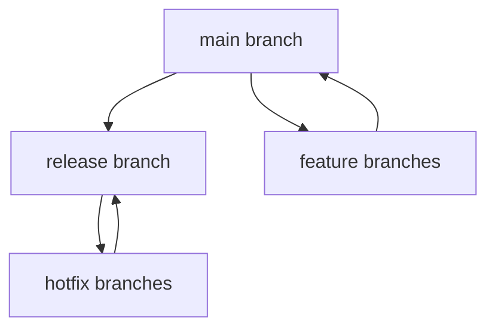
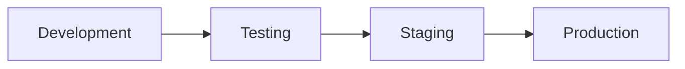

# Configuration Management for Tyk Deployments

This guide covers strategies and best practices for managing Tyk configurations, implementing version control, and establishing robust governance for API definitions, policies, and system configurations.

## Configuration Management Fundamentals

### Configuration Types in Tyk

Tyk involves several types of configurations that need management:

- **API definitions**: The core configurations that define your APIs
- **Policies**: Security and access control configurations
- **Security configurations**: Authentication, certificates, and security policies
- **System configurations**: Gateway, Dashboard, and Pump configurations
- **Environment-specific settings**: Settings that vary between environments

### Configuration Management Challenges

Managing Tyk configurations presents several challenges:

- **Configuration complexity**: Large deployments can have hundreds of API definitions
- **Environment differences**: Configurations vary across environments
- **Change tracking**: Maintaining history of configuration changes
- **Configuration drift**: Ensuring consistency across environments
- **Validation**: Verifying configurations before deployment
- **Governance**: Enforcing standards and compliance

### Configuration Management Principles

Effective configuration management follows these principles:

- **Version control**: Store all configurations in a version control system
- **Configuration as code**: Manage configurations as code artifacts
- **Validation**: Verify configurations before deployment
- **Promotion workflow**: Establish clear processes for promoting configurations
- **Auditability**: Maintain complete history of configuration changes
- **Automation**: Automate configuration management tasks where possible

## Version Control for Tyk Configurations

### Repository Structure

Organize your Tyk configurations in a version control repository:

```
/
├── apis/                  # API definitions
│   ├── internal/          # Internal APIs
│   └── external/          # External APIs
├── policies/              # Security policies
├── certificates/          # TLS certificates (or references)
├── system/                # System configurations
│   ├── gateway/           # Gateway configurations
│   ├── dashboard/         # Dashboard configurations
│   └── pump/              # Pump configurations
├── templates/             # Configuration templates
├── environments/          # Environment-specific variables
│   ├── development/
│   ├── testing/
│   ├── staging/
│   └── production/
├── scripts/               # Automation scripts
└── README.md              # Documentation
```

### Branching Strategy

Implement an effective branching strategy:



- **Main branch**: Represents the current development state
- **Feature branches**: For developing new APIs or changes
- **Release branches**: For preparing releases
- **Hotfix branches**: For emergency fixes to production

### Change Management Process

Establish a clear change management process:

1. **Request**: Document the required configuration change
2. **Development**: Create or modify configurations in a feature branch
3. **Review**: Conduct peer review via pull/merge requests
4. **Validation**: Automatically validate configurations
5. **Testing**: Test changes in a non-production environment
6. **Approval**: Obtain necessary approvals
7. **Deployment**: Deploy to production
8. **Verification**: Verify successful deployment

## Configuration as Code

### API Definitions as Code

Store API definitions as code:

```json
{
  "name": "Payment API",
  "api_id": "payment-api",
  "org_id": "{{.OrgID}}",
  "use_keyless": false,
  "auth": {
    "auth_header_name": "Authorization"
  },
  "version_data": {
    "not_versioned": true,
    "versions": {
      "Default": {
        "name": "Default",
        "use_extended_paths": true
      }
    }
  },
  "proxy": {
    "listen_path": "/payment/",
    "target_url": "{{.PaymentServiceURL}}",
    "strip_listen_path": true
  },
  "rate_limit": {
    "rate": 100,
    "per": 60
  },
  "active": true
}
```

### Policies as Code

Store policies as code:

```json
{
  "name": "Standard Rate Limit",
  "rate": 100,
  "per": 60,
  "quota_max": 10000,
  "quota_renewal_rate": 3600,
  "access_rights": {
    "payment-api": {
      "api_name": "Payment API",
      "api_id": "payment-api",
      "versions": ["Default"]
    }
  },
  "active": true
}
```

### Configuration Templates

Use templates for consistent configurations:

```json
{
  "name": "{{.APIName}}",
  "api_id": "{{.APIID}}",
  "org_id": "{{.OrgID}}",
  "use_keyless": {{.UseKeyless}},
  "auth": {
    "auth_header_name": "{{.AuthHeaderName}}"
  },
  "proxy": {
    "listen_path": "/{{.ListenPath}}/",
    "target_url": "{{.TargetURL}}",
    "strip_listen_path": true
  },
  "active": true
}
```

### Environment Variables

Manage environment-specific variables:

```json
{
  "development": {
    "OrgID": "DevOrgID",
    "PaymentServiceURL": "http://payment-service-dev:8080",
    "AnalyticsConfig": {
      "enable_detailed_recording": true
    }
  },
  "production": {
    "OrgID": "ProdOrgID",
    "PaymentServiceURL": "http://payment-service-prod:8080",
    "AnalyticsConfig": {
      "enable_detailed_recording": false
    }
  }
}
```

## Configuration Validation

### Static Validation

Implement static validation for configurations:

- **Schema validation**: Ensure configurations match the expected schema
- **Linting**: Check for style and best practice violations
- **Policy validation**: Verify policies meet security requirements
- **Dependency checking**: Ensure all referenced resources exist

Example validation script:

```bash
#!/bin/bash
# Validate API definitions

for file in ./apis/**/*.json; do
  echo "Validating $file"
  
  # Check JSON syntax
  jq . "$file" > /dev/null
  if [ $? -ne 0 ]; then
    echo "Error: Invalid JSON in $file"
    exit 1
  fi
  
  # Validate against schema
  jsonschema -i "$file" ./schemas/api-schema.json
  if [ $? -ne 0 ]; then
    echo "Error: Schema validation failed for $file"
    exit 1
  fi
done

echo "All API definitions are valid"
```

### Dynamic Validation

Implement dynamic validation:

- **Deployment testing**: Test configurations in a sandbox environment
- **Integration testing**: Verify interactions with other systems
- **Security testing**: Check for security vulnerabilities
- **Performance testing**: Verify performance impact

## Configuration Promotion Workflows

### Environment Hierarchy

Establish a clear environment hierarchy:



- **Development**: Initial development and testing
- **Testing**: Formal testing environment
- **Staging**: Pre-production verification
- **Production**: Live environment

### Promotion Patterns

Implement promotion patterns:

- **Manual promotion**: Manually apply configurations to each environment
- **Automated promotion**: Automatically promote configurations through CI/CD
- **Approval gates**: Require approvals before promotion to higher environments
- **Environment-specific transforms**: Apply environment-specific changes during promotion

### Configuration Drift Detection

Implement configuration drift detection:

- **Regular comparison**: Compare running configurations with version control
- **Automated reconciliation**: Automatically correct drift
- **Drift alerts**: Notify when drift is detected
- **Audit logging**: Record all configuration changes

Example drift detection script:

```bash
#!/bin/bash
# Detect configuration drift

# Export current configurations
tyk-sync dump -d="http://dashboard:3000" -s="$DASHBOARD_SECRET" -t="./current"

# Compare with expected configurations
diff -r ./expected ./current > drift.log

if [ -s drift.log ]; then
  echo "Configuration drift detected:"
  cat drift.log
  
  # Send alert
  ./scripts/send-alert.sh "Configuration drift detected" drift.log
  
  exit 1
else
  echo "No configuration drift detected"
fi
```

## Tools for Configuration Management

### Tyk Sync

Use Tyk Sync for configuration management:

```bash
# Export configurations
tyk-sync dump -d="http://dashboard:3000" -s="$DASHBOARD_SECRET" -t="./dump"

# Update specific APIs
tyk-sync update -d="http://dashboard:3000" -s="$DASHBOARD_SECRET" -p="./dump/policies" -a="./dump/apis"

# Publish APIs to Gateway
tyk-sync publish -d="http://dashboard:3000" -s="$DASHBOARD_SECRET" -p="./dump/policies" -a="./dump/apis"
```

### Tyk Operator

Use Tyk Operator for Kubernetes-native configuration management:

```yaml
apiVersion: tyk.tyk.io/v1alpha1
kind: ApiDefinition
metadata:
  name: httpbin
spec:
  name: httpbin
  use_keyless: false
  protocol: http
  active: true
  proxy:
    target_url: http://httpbin.org
    listen_path: /httpbin
    strip_listen_path: true
  version_data:
    default_version: Default
    not_versioned: true
  auth:
    use_keyless: false
    auth_header_name: Authorization
  org_id: acme
```

### Dashboard API

Use the Dashboard API for configuration management:

```bash
# Create an API
curl -X POST \
  https://dashboard:3000/api/apis \
  -H 'Authorization: $DASHBOARD_KEY' \
  -H 'Content-Type: application/json' \
  -d '{
    "api_definition": {
      "name": "My API",
      "slug": "my-api",
      "proxy": {
        "listen_path": "/my-api/",
        "target_url": "http://my-api.internal",
        "strip_listen_path": true
      },
      "active": true
    }
  }'
```

## Implementation Example: Financial Services API Platform

This example demonstrates configuration management for a financial services API platform with strict governance requirements.

### Requirements:

- Multiple environments (Dev, Test, Staging, Production)
- Strict change control and approval process
- Compliance with financial regulations
- Complete audit trail for all changes
- Automated validation and testing

### Implementation:

1. **Repository Structure**:
   - Git repository with branch protection
   - Separate directories for APIs, policies, and system configurations
   - Environment-specific variables in separate files
   - Validation schemas and scripts

2. **Workflow Implementation**:
   - Feature branches for all changes
   - Pull request reviews required
   - Automated validation in CI pipeline
   - Approval gates for environment promotion
   - Automated drift detection

3. **Tooling**:
   - Tyk Sync for configuration management
   - Custom validators for compliance checks
   - Jenkins pipeline for CI/CD
   - Slack integration for notifications
   - Audit logging to compliance system

### Results:

- 100% compliance with financial regulations
- Complete audit trail for all API changes
- 90% reduction in configuration errors
- Streamlined promotion process
- Consistent configurations across environments

## Best Practices

### Documentation

- Document the configuration management process
- Maintain README files in the repository
- Document environment-specific configurations
- Create runbooks for common procedures
- Document validation rules and requirements

### Validation

- Implement comprehensive validation
- Validate before deployment
- Include security and compliance validation
- Test configurations in sandbox environments
- Validate environment-specific settings

### Governance

- Establish clear ownership of configurations
- Implement appropriate access controls
- Require peer reviews for all changes
- Maintain audit trails of all changes
- Regularly review and update governance policies

### Automation

- Automate repetitive tasks
- Implement CI/CD pipelines
- Automate validation and testing
- Use infrastructure as code
- Automate drift detection and reporting

## Next Steps

- [Automation & CI/CD](/api-management/managing-deployments/operations/automation-cicd)
- [Multi-Environment Management](/api-management/managing-deployments/operations/multi-environment-management)
- [Security Hardening](/api-management/managing-deployments/operations/security-hardening)
