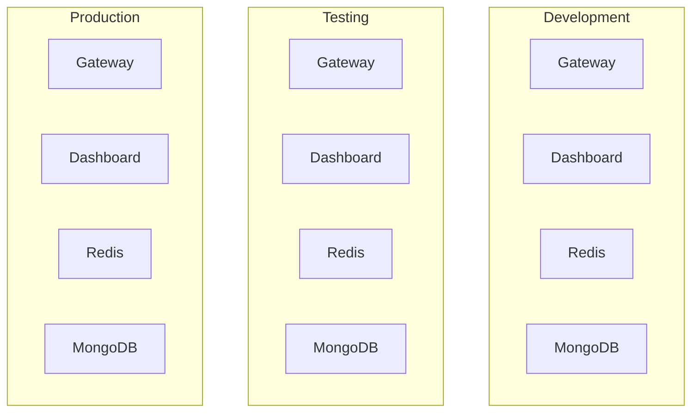
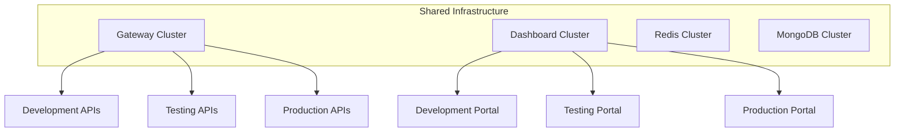

# Multi-Environment Management for Tyk Deployments

This guide covers strategies and best practices for managing Tyk across multiple environments such as development, testing, staging, and production, helping you implement a robust software development lifecycle for your API management platform.

## Multi-Environment Fundamentals

### Understanding Environment Separation

Managing multiple environments is essential for a robust API development lifecycle:

- **Risk mitigation**: Isolate changes to prevent production impact
- **Quality assurance**: Test changes thoroughly before production
- **Compliance**: Meet regulatory requirements for change control
- **Team collaboration**: Enable parallel work on different features
- **Operational stability**: Maintain stable production while developing

### Environment Types

Different environment types serve specific purposes in the API lifecycle:

- **Development environments**:
  - Purpose: Active development and initial testing
  - Characteristics: Frequent changes, less stable, relaxed security
  - Users: Developers, internal testers

- **Testing/QA environments**:
  - Purpose: Formal testing and quality assurance
  - Characteristics: More stable than development, test automation
  - Users: QA teams, automated test systems

- **Staging/Pre-production environments**:
  - Purpose: Final verification before production
  - Characteristics: Production-like, stable, full security
  - Users: QA teams, business stakeholders, limited external users

- **Production environments**:
  - Purpose: Live service delivery
  - Characteristics: Highly stable, fully secured, optimized performance
  - Users: End users, customers, partners

### Multi-Environment Strategy

Develop a comprehensive multi-environment strategy:

- **Environment topology**: Define number and types of environments
- **Separation approach**: Determine physical vs. logical separation
- **Promotion workflow**: Establish processes for moving changes between environments
- **Access control**: Define who can access and modify each environment
- **Monitoring strategy**: Implement appropriate monitoring for each environment

## Environment Separation Approaches

### Physical Separation



Physical separation involves completely separate Tyk installations:

- **Advantages**:
  - Complete isolation between environments
  - Independent scaling and resource allocation
  - Simplified security boundaries
  - No risk of cross-environment impact

- **Considerations**:
  - Higher infrastructure costs
  - More complex management
  - Potential resource inefficiency
  - Additional operational overhead

### Logical Separation



Logical separation uses shared infrastructure with logical boundaries:

- **Advantages**:
  - Lower infrastructure costs
  - Simplified management
  - Better resource utilization
  - Reduced operational overhead

- **Considerations**:
  - Risk of cross-environment impact
  - More complex security configuration
  - Potential noisy neighbor issues
  - Shared resource constraints

### Hybrid Separation

Hybrid separation combines physical and logical approaches:

- **Advantages**:
  - Balance of isolation and efficiency
  - Production separation for security
  - Cost optimization
  - Appropriate isolation by environment type

- **Implementation approach**:
  - Shared infrastructure for lower environments
  - Dedicated infrastructure for production
  - Mix of organizational and infrastructure separation
  - Environment-specific security controls

## Environment-Specific Configurations

### API Definition Management

Manage API definitions across environments:

- **Environment-specific endpoints**:
  ```json
  {
    "proxy": {
      "listen_path": "/payment-api/",
      "target_url": "{{.TargetURL}}",
      "strip_listen_path": true
    }
  }
  ```

- **Feature enablement by environment**:
  ```json
  {
    "enable_batch_requests": {{.EnableBatch}},
    "enable_detailed_recording": {{.EnableDetailedRecording}}
  }
  ```

### Policy Configuration

Manage policies across environments:

- **Rate limiting differences**:
  ```json
  {
    "rate": {{.RateLimit}},
    "per": {{.RateLimitPeriod}},
    "quota_max": {{.QuotaMax}},
    "quota_renewal_rate": {{.QuotaRenewal}}
  }
  ```

### Environment Variables

Manage environment-specific variables:

- **Environment variable files**:
  ```json
  // development.json
  {
    "TargetURL": "http://dev-payment-service:8080",
    "RateLimit": 1000,
    "RateLimitPeriod": 60,
    "UseKeyless": true,
    "EnableDetailedRecording": true
  }
  
  // production.json
  {
    "TargetURL": "http://prod-payment-service:8080",
    "RateLimit": 100,
    "RateLimitPeriod": 60,
    "UseKeyless": false,
    "EnableDetailedRecording": false
  }
  ```

## Promotion Workflows

### Promotion Process Design

Design an effective promotion process:

- **Stage definition**: Clear criteria for each stage
- **Validation requirements**: Tests that must pass for promotion
- **Approval workflow**: Who must approve each promotion
- **Documentation**: What must be documented for each promotion
- **Rollback provisions**: How to roll back if issues occur

### Manual Promotion

Implement manual promotion workflows:

1. **Export configurations**: Export from source environment
   ```bash
   tyk-sync dump -d="http://source-dashboard:3000" -s="$SOURCE_SECRET" -t="./dump"
   ```

2. **Apply environment-specific changes**:
   ```bash
   # Process configurations with environment variables
   ./scripts/apply-env-vars.sh ./dump ./env/target-env.json
   ```

3. **Import to target environment**:
   ```bash
   tyk-sync sync -d="http://target-dashboard:3000" -s="$TARGET_SECRET" -p="./dump/policies" -a="./dump/apis"
   ```

### Automated Promotion

Implement automated promotion with CI/CD:

```yaml
# Example GitHub Actions workflow
name: Promote to Testing

on:
  push:
    branches: [ main ]

jobs:
  promote:
    runs-on: ubuntu-latest
    steps:
      - uses: actions/checkout@v2
      
      - name: Install Tyk Sync
        run: go install github.com/TykTechnologies/tyk-sync@latest
        
      - name: Process environment variables
        run: ./scripts/apply-env-vars.sh ./apis ./env/testing.json
        
      - name: Deploy to Testing
        run: tyk-sync sync -d="${{ secrets.TESTING_DASHBOARD_URL }}" -s="${{ secrets.TESTING_DASHBOARD_SECRET }}" -p="./policies" -a="./apis"
        
      - name: Verify deployment
        run: ./scripts/verify-deployment.sh testing
```

### Rollback Procedures

Implement effective rollback procedures:

1. **Maintain version history**: Keep previous versions
   ```bash
   # Tag each deployment
   git tag -a "prod-$(date +%Y%m%d-%H%M%S)" -m "Production deployment"
   ```

2. **Rollback script**:
   ```bash
   #!/bin/bash
   # Rollback to previous version
   
   VERSION=$1
   
   # Checkout previous version
   git checkout $VERSION
   
   # Deploy previous version
   tyk-sync sync -d="$DASHBOARD_URL" -s="$DASHBOARD_SECRET" -p="./policies" -a="./apis"
   ```

## Environment-Specific Operations

### Monitoring Strategy

Implement environment-specific monitoring:

- **Development**: Focus on debugging and performance
- **Testing**: Focus on test success and coverage
- **Staging**: Mirror production monitoring
- **Production**: Comprehensive monitoring and alerting

### Maintenance Windows

Plan environment-specific maintenance:

- **Development**: Minimal restrictions, quick updates
- **Testing**: Coordinate with test schedules
- **Staging**: Simulate production maintenance procedures
- **Production**: Formal change control, off-peak scheduling

### Incident Response

Tailor incident response by environment:

- **Development**: Informal, focus on quick resolution
- **Testing**: Document for test improvement
- **Staging**: Practice production procedures
- **Production**: Formal incident management process

## Implementation Patterns

### Development to Production

Basic implementation pattern:

1. **Development**: Initial API creation and testing
2. **Testing**: Formal testing with test data
3. **Staging**: Final verification with production-like data
4. **Production**: Live deployment with monitoring

### Feature Branch Environments

Dynamic environments for feature branches:

1. **Feature branch creation**: Triggers new environment
2. **Automated deployment**: Deploy to feature environment
3. **Feature testing**: Test in isolated environment
4. **Merge**: Promote to main development environment

## Implementation Example: Enterprise API Platform

This example demonstrates multi-environment management for an enterprise API platform.

### Environment Setup:

- **Development**: Shared infrastructure, developer access
- **Testing**: Dedicated infrastructure, automated testing
- **Staging**: Production-like environment, limited access
- **Production**: Fully isolated, strict access controls

### Promotion Workflow:

1. **Development to Testing**:
   - Automated promotion on commit to main branch
   - Requires unit test success
   - Automated API tests run post-deployment

2. **Testing to Staging**:
   - Weekly promotion cycle
   - Requires QA approval
   - Full regression test suite

3. **Staging to Production**:
   - Bi-weekly release cycle
   - Requires business and technical approval
   - Scheduled maintenance window
   - Canary deployment approach

### Results:

- 99.9% production uptime
- 80% reduction in production issues
- Streamlined release process
- Consistent environments
- Reliable rollback capability

## Best Practices

### Environment Design

- Start with clear requirements for each environment
- Plan for growth and changing needs
- Consider security boundaries from the beginning
- Document environment architecture and purpose
- Review and refine environment strategy regularly

### Promotion Workflow

- Define clear stages and criteria
- Automate where possible
- Include validation at each stage
- Maintain audit trail of all promotions
- Practice rollbacks regularly

### Documentation

- Document environment topology
- Maintain promotion procedures
- Record configuration differences between environments
- Update runbooks regularly
- Share knowledge across teams

## Next Steps

- [Configuration Management](/api-management/managing-deployments/operations/configuration-management)
- [Automation & CI/CD](/api-management/managing-deployments/operations/automation-cicd)
- [Monitoring and Alerting](/api-management/managing-deployments/operations/monitoring-alerting)
