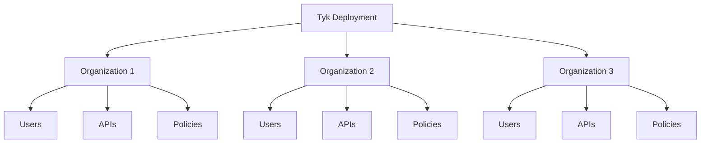
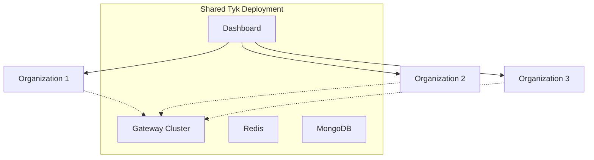
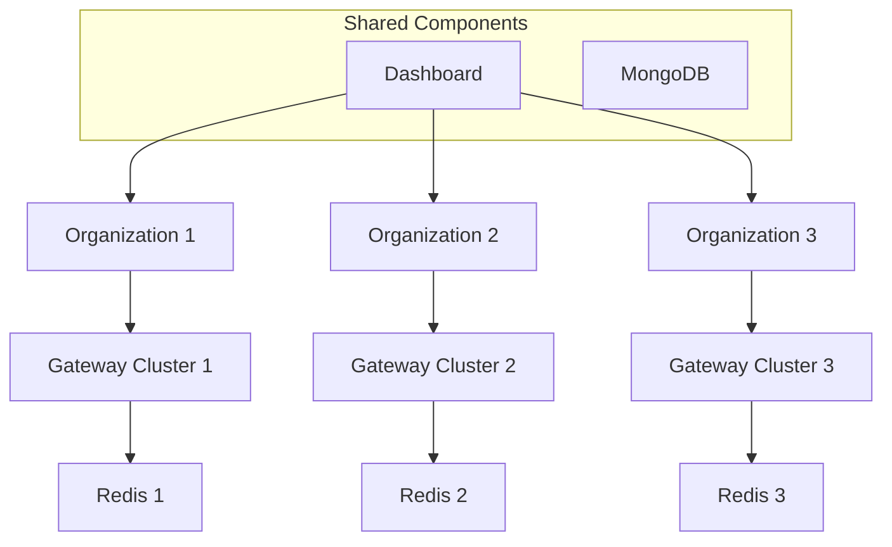

# Multi-Tenant Deployments with Tyk Organizations

This guide covers strategies and best practices for implementing multi-tenant architectures using Tyk's organization features, allowing you to securely serve multiple clients, business units, or teams from a single Tyk deployment.

## Multi-Tenant Fundamentals

### Understanding Multi-Tenancy

Multi-tenancy in API management refers to serving multiple distinct groups (tenants) from a shared infrastructure:

- **Tenant definition**: A logical grouping of users, APIs, and resources
- **Isolation requirements**: Separation of data, configurations, and access
- **Resource sharing**: Efficient use of shared infrastructure
- **Governance model**: Managing across multiple tenants

Multi-tenancy benefits include:
- Cost efficiency through shared infrastructure
- Simplified management and operations
- Consistent governance and security
- Scalable onboarding of new tenants

### Tyk's Organization Model



Tyk implements multi-tenancy through Organizations:

- **Organization**: The primary tenant boundary in Tyk
- **Resources**: APIs, policies, keys, and users belong to organizations
- **Isolation**: Data and access are isolated between organizations
- **Management**: Super admin can manage all organizations

Key organization capabilities:
- Separate API catalogs and developer portals
- Independent user management and authentication
- Isolated analytics and reporting
- Organization-specific settings and configurations

## Tenant Isolation Approaches

### Logical Isolation



Logical isolation uses Tyk's organization feature for tenant separation:

- **Advantages**:
  - Efficient resource utilization
  - Simplified infrastructure management
  - Lower operational overhead
  - Easier tenant onboarding

- **Considerations**:
  - Shared infrastructure risks
  - Potential noisy neighbor issues
  - More complex security configuration
  - Limited customization per tenant

### Physical Isolation with Shared Components



Physical isolation with shared components provides a hybrid approach:

- **Advantages**:
  - Better performance isolation
  - Customizable resource allocation
  - Reduced noisy neighbor issues
  - Maintained management efficiency

- **Considerations**:
  - Higher infrastructure costs
  - More complex architecture
  - Additional operational overhead
  - Shared component dependencies

### Hybrid Isolation

Hybrid isolation combines approaches based on tenant requirements:

- **Tiered tenant model**:
  - Premium tenants: Dedicated infrastructure
  - Standard tenants: Shared infrastructure
  - Basic tenants: Shared everything

- **Isolation by data sensitivity**:
  - High-security tenants: Complete isolation
  - Standard tenants: Logical isolation

## Organization Design Patterns

### Business Unit Separation

Organizing tenants by business unit:

- **Structure**:
  - One organization per business unit
  - Centralized governance and standards
  - Decentralized API management
  - Shared infrastructure

- **Governance model**:
  - Central API team for standards and platform
  - Business unit teams for API implementation
  - Cross-unit coordination for shared APIs
  - Chargeback or showback for resource usage

### Client/Customer Separation

Organizing tenants by external client:

- **Structure**:
  - One organization per client
  - Client-specific configurations
  - Isolated resources and data
  - Customized portals and documentation

- **Governance model**:
  - Provider team manages platform
  - Client teams manage their APIs
  - Provider enforces standards and security
  - Client-specific SLAs and support

### Functional Separation

Organizing tenants by function:

- **Structure**:
  - Organizations for different API types
  - Separation by security classification
  - Division by lifecycle stage
  - Grouping by technology stack

## Implementing Multi-Tenant Architecture

### Organization Creation and Management

Create and manage organizations:

```bash
# Create a new organization via API
curl -X POST \
  https://dashboard:3000/admin/organisations \
  -H "admin-auth: $ADMIN_SECRET" \
  -H "Content-Type: application/json" \
  -d '{
    "owner_name": "Tenant Admin",
    "owner_slug": "tenant-admin",
    "cname_enabled": true,
    "cname": "tenant1.api.example.com"
  }'
```

Organization management best practices:
- Use consistent naming conventions
- Document organization metadata
- Implement organization lifecycle management
- Automate organization creation for scalability

### User Management Across Organizations

Manage users in multi-tenant deployments:

```bash
# Create a user in a specific organization
curl -X POST \
  https://dashboard:3000/api/users \
  -H "admin-auth: $ADMIN_SECRET" \
  -H "Content-Type: application/json" \
  -d '{
    "first_name": "John",
    "last_name": "Doe",
    "email_address": "john.doe@tenant1.com",
    "password": "tempPassword123",
    "active": true,
    "org_id": "tenant1_org_id",
    "user_permissions": {
      "IsAdmin": "admin",
      "ResetPassword": true
    }
  }'
```

User management best practices:
- Define standard roles across organizations
- Implement proper user lifecycle management
- Consider single sign-on for enterprise scenarios
- Audit user access regularly

### API Catalog Management

Manage API catalogs for multiple tenants:

- **Catalog separation**:
  - APIs belong to specific organizations
  - Visibility controls within organizations
  - Cross-organization API sharing (if needed)
  - Organization-specific documentation

- **Catalog governance**:
  - Consistent API standards across organizations
  - Organization-specific approval workflows
  - Centralized monitoring of all catalogs
  - Cross-organization API discovery

### Policy Management

Manage policies in multi-tenant deployments:

- **Organization-specific policies**:
  - Policies belong to organizations
  - Organization-specific rate limits and quotas
  - Tenant-specific security requirements
  - Custom policy templates by tenant

## Security Considerations

### Tenant Isolation Security

Ensure proper tenant isolation:

- **API access isolation**:
  - APIs are only accessible within their organization
  - Cross-organization access requires explicit sharing
  - API keys are scoped to organizations
  - Analytics data is isolated by organization

- **User isolation**:
  - Users belong to specific organizations
  - Cross-organization access is controlled
  - User actions are limited to their organization
  - Authentication is organization-specific

- **Data isolation**:
  - Analytics data is separated by organization
  - Configuration data is organization-specific
  - Logs are tagged with organization identifiers
  - Backups maintain organization boundaries

### Admin Access Control

Manage administrative access:

- **Super admin role**:
  - Limited to essential personnel
  - Full access across all organizations
  - Heavily audited and monitored
  - Used only for cross-organization management

- **Organization admin role**:
  - Full access within a specific organization
  - No access to other organizations
  - Manages users and resources within organization
  - Configures organization-specific settings

## Operational Considerations

### Monitoring Multi-Tenant Deployments

Implement comprehensive monitoring:

- **Tenant-specific monitoring**:
  - Organization-specific dashboards
  - Tenant usage and performance metrics
  - Tenant-specific alerts and notifications
  - SLA monitoring by tenant

- **Cross-tenant monitoring**:
  - Overall platform health
  - Resource utilization across tenants
  - Tenant comparison and benchmarking
  - Noisy neighbor detection

### Tenant Onboarding and Offboarding

Establish tenant lifecycle processes:

- **Onboarding process**:
  - Organization creation
  - Initial user setup
  - Resource allocation
  - Documentation and training
  - Welcome and verification

- **Offboarding process**:
  - Data export and handover
  - Resource decommissioning
  - User deactivation
  - Final billing and reporting
  - Organization deactivation

## Implementation Example: SaaS API Platform

This example demonstrates a multi-tenant implementation for a SaaS API management provider serving multiple client organizations.

### Requirements:

- Support for 50+ client organizations
- Client-specific branding and portals
- Isolated API catalogs and analytics
- Tiered service levels with different resource allocations
- Centralized management and monitoring

### Implementation:

1. **Tenant Architecture**:
   - Shared Dashboard and MongoDB for all tenants
   - Premium tier: Dedicated Gateway clusters and Redis
   - Standard tier: Shared Gateway clusters with priority
   - Basic tier: Shared Gateway clusters with standard priority

2. **Organization Structure**:
   - One organization per client
   - Organization metadata for tier and billing information
   - Custom domains for each organization's portal
   - Organization-specific API catalog

3. **Resource Allocation**:
   - Premium tier: Dedicated resources with guaranteed performance
   - Standard tier: Shared resources with higher rate limits
   - Basic tier: Shared resources with standard rate limits

### Results:

- Successfully scaled to 75+ tenant organizations
- 99.99% tenant isolation with no cross-tenant breaches
- Efficient resource utilization with 40% cost savings
- Streamlined tenant onboarding (1 hour from request to live)
- Comprehensive tenant-specific analytics and reporting

## Best Practices

### Planning and Design

- Start with clear multi-tenancy requirements
- Design for tenant isolation from the beginning
- Consider future growth and scaling
- Document tenant architecture and boundaries
- Plan for tenant lifecycle management

### Implementation

- Use consistent naming conventions
- Implement proper access controls
- Automate tenant management where possible
- Test isolation boundaries thoroughly
- Document tenant-specific configurations

### Governance

- Establish clear ownership of tenant management
- Implement consistent policies across tenants
- Regular security reviews of tenant isolation
- Monitor resource usage across tenants
- Document tenant management procedures

## Next Steps

- [Multi-Environment Management](/api-management/managing-deployments/operations/multi-environment-management)
- [Security Hardening](/api-management/managing-deployments/operations/security-hardening)
- [Configuration Management](/api-management/managing-deployments/operations/configuration-management)
