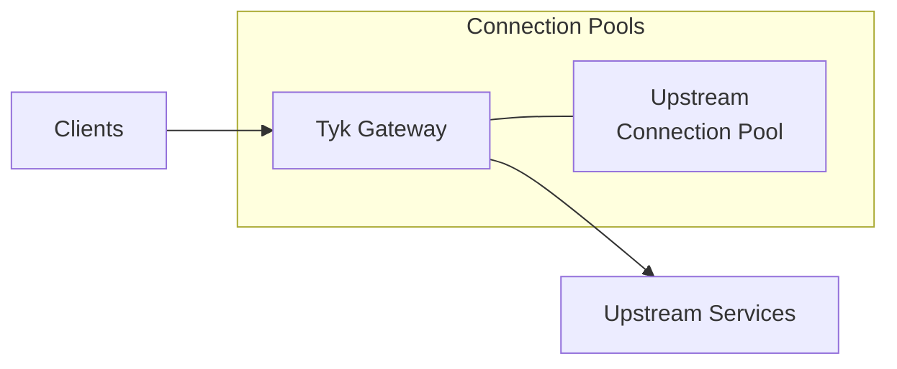
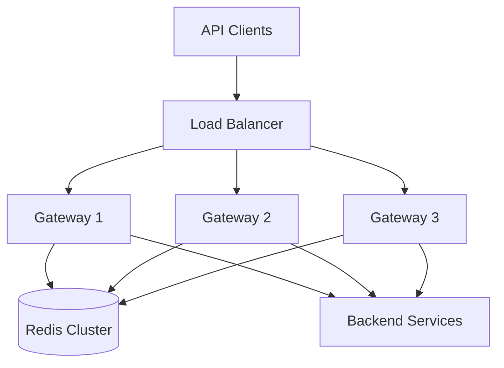

# Performance Tuning for Tyk Deployments

This guide provides strategies and best practices for optimizing the performance of your Tyk deployment, helping you achieve maximum throughput, minimize latency, and efficiently utilize resources.

## Performance Tuning Fundamentals

### Understanding Tyk Performance

Tyk performance is influenced by several factors:

- **Gateway configuration**: Connection limits, timeouts, and middleware
- **Redis performance**: Memory, network, and persistence settings
- **Database performance**: Query efficiency and connection management
- **Network configuration**: Latency, bandwidth, and connection handling
- **API complexity**: Middleware, transformations, and validation
- **Infrastructure resources**: CPU, memory, and network capacity

### Key Performance Metrics

Focus on these metrics when tuning performance:

- **Request latency**: Time to process requests (p50, p95, p99 percentiles)
- **Throughput**: Requests per second (RPS) handled
- **Error rate**: Percentage of failed requests
- **Resource utilization**: CPU, memory, network, and disk usage
- **Connection counts**: Active and idle connections
- **Queue lengths**: Request and analytics processing queues

### Performance Testing Methodology

Before tuning, establish baseline performance:

1. **Define test scenarios**: Common API patterns and edge cases
2. **Create realistic load profiles**: Gradual ramp-up to peak load
3. **Measure key metrics**: Latency, throughput, errors, resources
4. **Identify bottlenecks**: CPU, memory, network, or configuration
5. **Apply changes incrementally**: One change at a time
6. **Verify improvements**: Compare against baseline
7. **Document results**: Record configurations and outcomes

## Gateway Performance Tuning

### Connection Management Optimization



Optimize connection settings in your Gateway configuration:

```json
{
  "max_idle_connections_per_host": 500,
  "max_idle_connections": 2000,
  "max_conn_time": 30,
  "close_connections": false,
  "enable_custom_domains": false,
  "http_server_options": {
    "enable_websockets": false,
    "use_ssl": true,
    "read_timeout": 10,
    "write_timeout": 10,
    "use_ssl_le": false
  }
}
```

Key settings to tune:

- **max_idle_connections_per_host**: Increase for many upstream services
- **max_idle_connections**: Total idle connections across all hosts
- **close_connections**: Set to false for connection reuse
- **read_timeout** and **write_timeout**: Adjust based on upstream response times
- **enable_custom_domains**: Disable if not needed (performance impact)
- **enable_websockets**: Disable if not needed (performance impact)

### Middleware Optimization

Middleware adds processing overhead. Optimize by:

- Removing unnecessary middleware
- Ordering middleware efficiently (authentication first)
- Using caching where appropriate
- Optimizing custom middleware
- Disabling detailed analytics for high-throughput APIs

Example API definition with optimized middleware:

```json
{
  "name": "Optimized API",
  "use_keyless": false,
  "use_oauth2": false,
  "use_openid": false,
  "enable_jwt": true,
  "enable_signature_checking": false,
  "use_basic_auth": false,
  "enable_coprocess_auth": false,
  "jwt_signing_method": "hmac",
  "jwt_source": "query",
  "jwt_identity_base_field": "sub",
  "jwt_client_base_field": "aud",
  "jwt_policy_field_name": "pol",
  "cache_options": {
    "cache_timeout": 60,
    "enable_cache": true,
    "cache_all_safe_requests": true,
    "cache_response_codes": [200]
  },
  "response_processors": [],
  "disable_rate_limit": false,
  "disable_quota": true,
  "custom_middleware": {
    "pre": [],
    "post": [],
    "post_key_auth": [],
    "auth_check": {
      "name": "MyAuthCheck",
      "path": "/opt/tyk-gateway/middleware/MyAuthCheck.js",
      "require_session": false
    },
    "response": [],
    "driver": "otto",
    "id_extractor": {
      "extract_from": "",
      "extract_with": "",
      "extractor_config": {}
    }
  }
}
```

### Analytics Configuration

Analytics processing impacts performance. Optimize with:

```json
{
  "enable_analytics": true,
  "analytics_config": {
    "type": "redis",
    "enable_detailed_recording": false,
    "enable_geo_ip": false,
    "normalise_urls": {
      "enabled": true,
      "normalise_uuids": true,
      "normalise_numbers": true,
      "custom_patterns": []
    },
    "pool_size": 50,
    "records_buffer_size": 1000,
    "storage_expiration_time": 60
  }
}
```

Key settings to tune:

- **enable_detailed_recording**: Disable for high-throughput APIs
- **enable_geo_ip**: Disable if location data isn't needed
- **normalise_urls**: Enable to reduce cardinality in analytics
- **pool_size**: Increase for high-volume analytics
- **records_buffer_size**: Increase for burst traffic
- **storage_expiration_time**: Lower for reduced Redis memory usage

## Redis Performance Tuning

Redis is critical for Tyk performance. Optimize with:

### Memory Configuration

```json
{
  "maxmemory": "4gb",
  "maxmemory-policy": "volatile-ttl",
  "maxmemory-samples": 5
}
```

Key settings to tune:

- **maxmemory**: Set to 60-70% of available RAM
- **maxmemory-policy**: Use volatile-ttl for Tyk
- **maxmemory-samples**: Increase for more accurate eviction (5-10)

### Persistence Configuration

```json
{
  "save": "900 1 300 10 60 10000",
  "appendonly": "yes",
  "appendfsync": "everysec"
}
```

Key settings to tune:

- **save**: Adjust RDB snapshot frequency based on data change rate
- **appendonly**: Enable for better durability (performance trade-off)
- **appendfsync**: Use "everysec" for balance of performance and durability

### Connection Pooling

In Tyk Gateway configuration:

```json
{
  "storage": {
    "optimisation_max_idle": 2000,
    "optimisation_max_active": 4000
  }
}
```

Key settings to tune:

- **optimisation_max_idle**: Maximum idle connections in pool
- **optimisation_max_active**: Maximum active connections in pool

## Caching Strategies

Implement effective caching to dramatically improve performance:

### Gateway Response Caching

```json
{
  "cache_options": {
    "enable_cache": true,
    "cache_timeout": 60,
    "cache_all_safe_requests": true,
    "cache_response_codes": [200, 301, 302],
    "enable_upstream_cache_control": true,
    "cache_control_ttl_header": ""
  }
}
```

Key settings to tune:

- **enable_cache**: Enable caching for the API
- **cache_timeout**: Set appropriate TTL based on data freshness
- **cache_all_safe_requests**: Cache all GET, OPTIONS, HEAD requests
- **cache_response_codes**: Specify which response codes to cache
- **enable_upstream_cache_control**: Respect upstream cache headers

### Endpoint-Specific Caching

For fine-grained control, configure caching per endpoint:

```json
{
  "extended_paths": {
    "cached": [
      {
        "path": "/products",
        "method": "GET",
        "cache_key_regex": "",
        "cache_response_codes": [200],
        "cache_timeout": 300
      },
      {
        "path": "/products/{id}",
        "method": "GET",
        "cache_key_regex": "",
        "cache_response_codes": [200],
        "cache_timeout": 60
      }
    ]
  }
}
```

### Cache Invalidation Strategies

Implement cache invalidation for data consistency:

- Use short TTLs for frequently changing data
- Implement webhook-based cache invalidation for important updates
- Consider stale-while-revalidate patterns for high-traffic APIs
- Use cache tags for targeted invalidation

## Network Optimization

### TLS Optimization

```json
{
  "http_server_options": {
    "use_ssl": true,
    "ssl_certificates": ["cert1.pem"],
    "ssl_ciphers": [
      "TLS_ECDHE_ECDSA_WITH_AES_128_GCM_SHA256",
      "TLS_ECDHE_RSA_WITH_AES_128_GCM_SHA256"
    ],
    "prefer_server_ciphers": true,
    "min_version": 771,
    "max_version": 772
  }
}
```

Key settings to tune:

- **ssl_ciphers**: Use modern, efficient ciphers
- **min_version**: Set to TLS 1.2 (771) or TLS 1.3 (772)
- **prefer_server_ciphers**: Enable to use server's cipher preferences

### HTTP/2 and HTTP/3

Enable HTTP/2 for improved performance:

```json
{
  "http_server_options": {
    "enable_http2": true
  }
}
```

Benefits:
- Multiplexed connections
- Header compression
- Server push capabilities
- Reduced latency

## Common Bottlenecks and Solutions

### CPU Bottlenecks

Symptoms:
- High CPU utilization
- Increased latency under load
- Reduced throughput

Solutions:
- Scale horizontally by adding more Gateway instances
- Enable caching to reduce processing load
- Optimize middleware and custom plugins
- Reduce analytics detail level
- Use profiling tools to identify hotspots

### Memory Bottlenecks

Symptoms:
- Increasing memory usage over time
- Frequent garbage collection pauses
- Out of memory errors

Solutions:
- Tune garbage collection (GOGC environment variable)
- Optimize Redis memory usage
- Check for memory leaks in custom middleware
- Increase memory allocation if needed
- Monitor memory usage patterns

### Redis Bottlenecks

Symptoms:
- High Redis CPU usage
- Increased command latency
- Connection errors

Solutions:
- Optimize Redis configuration
- Consider Redis Cluster for sharding
- Separate analytics Redis from key management Redis
- Monitor Redis INFO command output
- Ensure sufficient memory allocation

### Network Bottlenecks

Symptoms:
- High network utilization
- Increased connection establishment time
- Timeout errors

Solutions:
- Optimize connection pooling
- Enable keep-alive connections
- Implement proper timeout settings
- Consider regional deployment for global traffic
- Use HTTP/2 where possible

## Implementation Example: Financial Services API Gateway

This example demonstrates performance tuning for a financial services API gateway handling 5,000 requests per second with strict latency requirements.



### Initial Performance Issues:

- P95 latency: 250ms (target: < 100ms)
- Maximum throughput: 2,000 RPS (target: 5,000 RPS)
- CPU utilization: 85-95% under load
- Occasional timeout errors under peak load

### Optimization Steps:

1. **Gateway Connection Tuning**:
    ```json
    {
        "max_idle_connections_per_host": 500,
        "max_idle_connections": 3000,
        "close_connections": false
    }
    ```

2. **Analytics Optimization**:
   ```json
   {
     "analytics_config": {
       "enable_detailed_recording": false,
       "enable_geo_ip": false,
       "normalise_urls": {
         "enabled": true,
         "normalise_uuids": true,
         "normalise_numbers": true
       },
       "pool_size": 100,
       "records_buffer_size": 5000
     }
   }
   ```

3. **Redis Optimization**:
   - Implemented Redis Cluster with 3 shards
   - Optimized maxmemory-policy to volatile-ttl
   - Increased connection pool settings

4. **Caching Implementation**:
   - Added 60-second cache for read-heavy endpoints
   - Implemented cache tags for targeted invalidation
   - Added stale-while-revalidate pattern for critical endpoints

5. **Middleware Optimization**:
   - Removed unnecessary middleware
   - Optimized custom authentication plugin
   - Reordered middleware for efficient processing

### Results:

- P95 latency: 45ms (82% improvement)
- Maximum throughput: 7,500 RPS (275% improvement)
- CPU utilization: 40-60% under load
- Zero timeout errors during peak testing
- 30% reduction in Redis memory usage

## Performance Tuning Best Practices

### Incremental Approach

- Make one change at a time
- Measure impact before making additional changes
- Document all changes and their effects
- Maintain a performance change log

### Regular Testing

- Establish performance testing as part of CI/CD
- Test with realistic traffic patterns
- Include burst testing for peak traffic
- Compare results against baseline and requirements

### Monitoring

- Implement comprehensive monitoring
- Set alerts for performance degradation
- Track performance trends over time
- Correlate configuration changes with performance metrics

## Next Steps

- [Scaling Strategies](/api-management/managing-deployments/operations/scaling-strategies)
- [Monitoring and Alerting](/api-management/managing-deployments/operations/monitoring-alerting)
- [Capacity Planning](/api-management/managing-deployments/operations/capacity-planning)