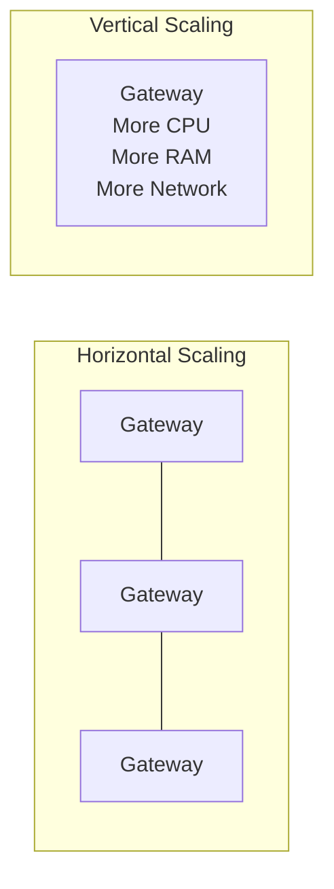
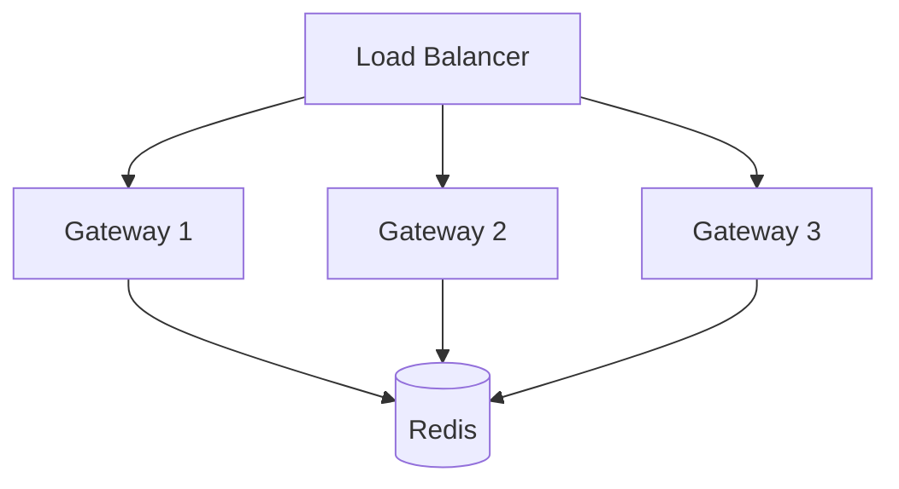
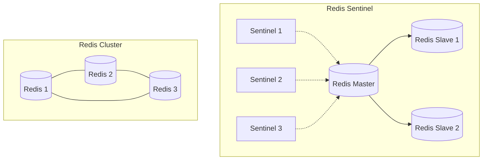
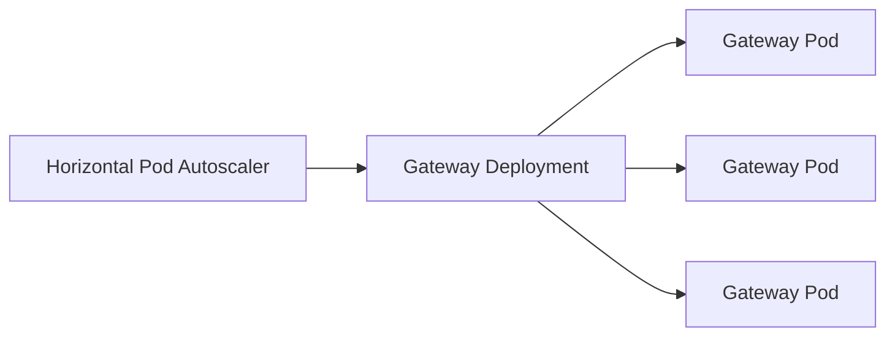
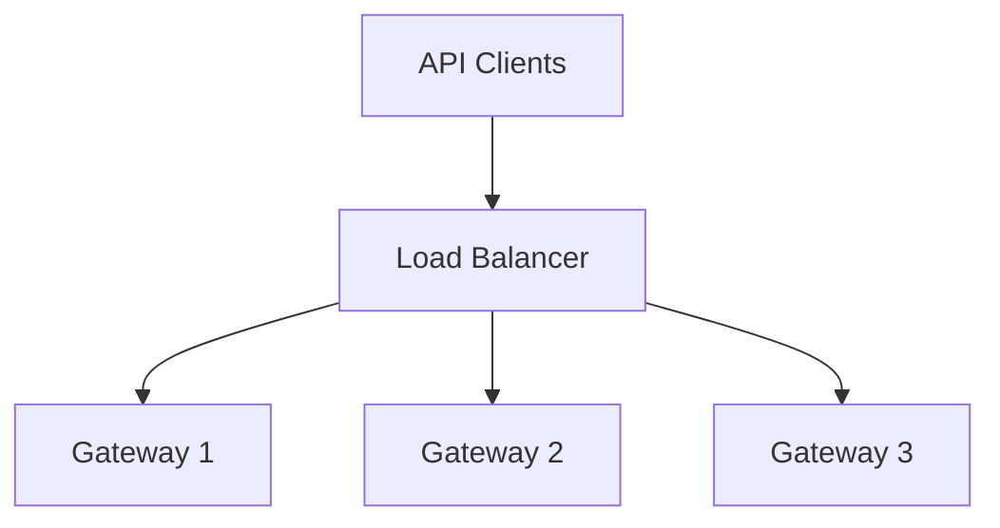
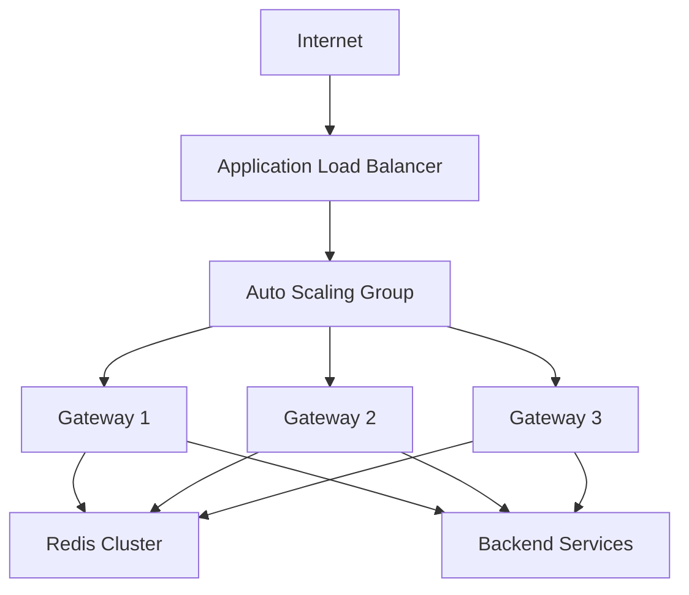

# Scaling Strategies for Tyk Deployments

As your API traffic grows, you'll need to scale your Tyk deployment to maintain performance and reliability. This guide covers approaches and best practices for scaling Tyk components to handle increasing load.

## Scaling Fundamentals

### Understanding Scaling Needs

Before implementing scaling strategies, identify the indicators that scaling is needed:

- **Increased latency**: Response times growing beyond acceptable thresholds
- **High resource utilization**: CPU, memory, or network approaching capacity
- **Request queue growth**: Increasing backlog of requests
- **Error rate increases**: Growing number of timeouts or connection errors
- **Planned traffic growth**: Upcoming marketing campaigns or product launches

### Horizontal vs. Vertical Scaling



#### Horizontal Scaling

Adding more instances of a component:

- **Advantages**:
  - Linear scaling capability
  - Improved fault tolerance
  - No downtime for scaling operations
  - Better resource utilization

- **Considerations**:
  - Requires load balancing
  - More complex infrastructure
  - Potential for increased licensing costs
  - Network overhead

#### Vertical Scaling

Increasing resources for existing instances:

- **Advantages**:
  - Simpler implementation
  - No additional instances to manage
  - Lower network overhead
  - Often simpler licensing

- **Considerations**:
  - Upper limits to scaling
  - Potential downtime during scaling
  - Less fault tolerance
  - Risk of resource waste

### Scaling Metrics

Key metrics to monitor for scaling decisions:

- **Request rate**: Requests per second handled by Gateways
- **Latency**: Response time for API requests
- **CPU utilization**: Across all components
- **Memory usage**: Particularly for Redis and Gateways
- **Connection counts**: Active connections to Gateways
- **Queue lengths**: For Redis and analytics processing
- **Error rates**: Failed requests and timeouts

## Component-Specific Scaling

### Gateway Scaling

The Gateway is the most commonly scaled component as it handles all API traffic.

#### Horizontal Gateway Scaling



Implementation considerations:
- Gateway instances are stateless and can be added dynamically
- All instances should have identical configuration
- Use a load balancer to distribute traffic
- Monitor request distribution across instances
- Consider regional deployment for global traffic

Typical scaling triggers:
- CPU utilization > 70%
- Memory utilization > 80%
- Average latency increasing
- Request rate approaching capacity

#### Vertical Gateway Scaling

When to consider:
- Limited infrastructure capacity for new instances
- Simple deployment with moderate traffic growth
- Testing environment with variable load
- Cost optimization for smaller deployments

Implementation:
- Increase CPU allocation
- Add memory (particularly for heavy analytics or complex middleware)
- Enhance network capacity
- Optimize disk I/O for logging

### Dashboard Scaling

The Dashboard typically requires less scaling as it handles administrative traffic, not API requests.

#### Dashboard Scaling Considerations

- Scale based on number of users and API operations
- Consider session management when scaling horizontally
- Ensure database can handle increased connections
- Monitor during peak administrative periods

Typical implementation:
- 1-3 Dashboard instances for most deployments
- Load balancer with sticky sessions
- Shared database for configuration

### Redis Scaling

Redis is critical for performance and requires careful scaling.

#### Redis Scaling Options



**Redis Sentinel**:
- Master-slave replication
- Good for most deployments
- Simpler configuration
- Limited to vertical scaling for write operations

**Redis Cluster**:
- Sharded data across multiple nodes
- Horizontal scaling for both reads and writes
- More complex configuration
- Better for very high traffic deployments

Implementation considerations:
- Monitor Redis memory usage closely
- Ensure sufficient memory for keys and analytics
- Consider separate Redis instances for analytics
- Optimize Redis configuration for performance

### Pump Scaling

Scale Tyk Pump based on analytics volume:

- Add Pump instances for high analytics volume
- Configure different Pumps for different data sinks
- Consider regional Pumps for distributed deployments
- Monitor queue length and processing time

### Database Scaling

MongoDB or PostgreSQL scaling:

- Implement replication for read scaling
- Ensure sufficient connection capacity
- Monitor query performance under load
- Consider sharding for very large deployments
- Implement connection pooling

## Deployment-Specific Scaling

### Kubernetes Scaling



Kubernetes-specific scaling strategies:
- Use Horizontal Pod Autoscaler (HPA) for Gateway
- Set appropriate resource requests and limits
- Configure readiness and liveness probes
- Consider node affinity for component separation
- Use StatefulSets for Redis and databases

Example HPA configuration:

```yaml
apiVersion: autoscaling/v2
kind: HorizontalPodAutoscaler
metadata:
  name: tyk-gateway
spec:
  scaleTargetRef:
    apiVersion: apps/v1
    kind: Deployment
    name: tyk-gateway
  minReplicas: 3
  maxReplicas: 10
  metrics:
  - type: Resource
    resource:
      name: cpu
      target:
        type: Utilization
        averageUtilization: 70
```

### Cloud Provider Scaling

Cloud-specific scaling strategies:

**AWS**:
- Use Auto Scaling Groups for EC2-based deployments
- Consider AWS ElastiCache for Redis
- Implement Application Load Balancer for Gateway
- Use CloudWatch metrics for scaling triggers

**Azure**:
- Implement Virtual Machine Scale Sets
- Consider Azure Cache for Redis
- Use Application Gateway for load balancing
- Configure Azure Monitor for scaling metrics

**Google Cloud**:
- Use Managed Instance Groups
- Consider Memorystore for Redis
- Implement Cloud Load Balancing
- Configure Cloud Monitoring for scaling metrics

### On-Premises Scaling

Scaling strategies for on-premises deployments:

- Implement virtualization for flexible resource allocation
- Use hardware load balancers or HAProxy/Nginx
- Consider Redis Enterprise for advanced Redis scaling
- Implement monitoring with Prometheus and Grafana
- Plan capacity based on peak traffic projections

## Auto-Scaling Implementation

### Auto-Scaling Fundamentals

Auto-scaling automatically adjusts resources based on demand:

- **Scale-out**: Add instances when load increases
- **Scale-in**: Remove instances when load decreases
- **Stabilization**: Prevent rapid scaling oscillations
- **Predictive scaling**: Scale based on patterns or schedules

### Gateway Auto-Scaling

Implementing Gateway auto-scaling:

1. **Select metrics**:
   - CPU utilization (most common)
   - Request rate
   - Memory usage
   - Custom metrics

2. **Define thresholds**:
   - Scale-out: CPU > 70% for 3+ minutes
   - Scale-in: CPU < 30% for 10+ minutes
   - Consider different thresholds for different environments

3. **Configure scaling policies**:
   - Step scaling for predictable response
   - Target tracking for maintaining specific metric value
   - Schedule-based for predictable patterns

4. **Set constraints**:
   - Minimum instance count (for high availability)
   - Maximum instance count (for cost control)
   - Scale-in protection for critical instances

Example AWS Auto Scaling configuration:

```json
{
  "AutoScalingGroupName": "tyk-gateway-asg",
  "MinSize": 3,
  "MaxSize": 10,
  "DesiredCapacity": 3,
  "HealthCheckType": "ELB",
  "HealthCheckGracePeriod": 300,
  "VPCZoneIdentifier": ["subnet-1", "subnet-2", "subnet-3"],
  "TargetGroupARNs": ["arn:aws:elasticloadbalancing:..."],
  "Tags": [
    {
      "Key": "Name",
      "Value": "tyk-gateway",
      "PropagateAtLaunch": true
    }
  ]
}
```

### Auto-Scaling Limitations

Be aware of these limitations:

- **Cold start delay**: New instances take time to initialize
- **License considerations**: Ensure licensing supports dynamic scaling
- **Cost implications**: Auto-scaling can increase costs if not properly configured
- **Analytics impact**: Consider how scaling affects analytics collection

## Load Balancing Strategies

### Gateway Load Balancing



Load balancing algorithm selection:

- **Round Robin**: Equal distribution, good for homogeneous instances
- **Least Connections**: Routes to instance with fewest active connections
- **Least Response Time**: Routes to instance with fastest response
- **IP Hash**: Consistent routing based on client IP (not typically needed for Gateway)

Load balancer configuration:

- Health checks to detect unhealthy instances
- Proper timeouts and keep-alive settings
- SSL termination considerations
- Connection draining for instance removal

### Global Load Balancing

For multi-region deployments:

- **DNS-based routing**: GeoDNS or latency-based routing
- **Anycast IP**: Network-level routing to closest instance
- **Global load balancers**: AWS Global Accelerator, Azure Front Door, etc.
- **CDN integration**: Cloudflare, Akamai, Fastly for edge caching and routing

## Cost Optimization

### Right-Sizing Resources

Optimize resource allocation:

- Start with recommended sizing and adjust based on metrics
- Consider different instance types for different components
- Implement scheduled scaling for predictable patterns
- Use spot/preemptible instances for non-critical components

### Scaling Schedule Implementation

Implement scheduled scaling for predictable patterns:

- Business hours vs. off-hours scaling
- Weekend scaling adjustments
- Seasonal scaling for retail or tax seasons
- Event-based scaling for marketing campaigns

Example scheduled scaling (AWS):

```json
{
  "ScheduledActionName": "business-hours-scale-up",
  "AutoScalingGroupName": "tyk-gateway-asg",
  "MinSize": 5,
  "MaxSize": 10,
  "DesiredCapacity": 5,
  "Recurrence": "0 8 * * MON-FRI",
  "TimeZone": "America/New_York"
}
```

## Implementation Example: E-commerce API Platform

This example demonstrates scaling strategies implemented for an e-commerce platform with variable traffic patterns.



### Infrastructure:

- **Gateway Layer**:
  - AWS Auto Scaling Group with 3-10 instances
  - c5.xlarge instances (4 vCPU, 8GB RAM)
  - Application Load Balancer with health checks
  - Target tracking scaling policy based on CPU utilization

- **Redis Layer**:
  - ElastiCache Redis Cluster with 3 shards
  - Each shard with 1 primary, 2 replicas
  - cache.m5.large instances (2 vCPU, 6.38GB RAM)

- **Dashboard Layer**:
  - 2 fixed instances in different availability zones
  - Application Load Balancer with sticky sessions

- **Pump Layer**:
  - 2 dedicated instances for analytics processing
  - Auto Scaling Group with CPU-based scaling

### Scaling Policies:

- **Normal Operations**:
  - Gateway: Min 3, Max 10, Target 70% CPU utilization
  - Pump: Min 2, Max 5, Target 60% CPU utilization

- **Sale Events**:
  - Scheduled scaling to Min 6, Max 20 during major sales
  - Pre-warming of load balancers
  - Increased Redis capacity

- **Off-Hours**:
  - Scheduled scaling to Min 2, Max 5 during overnight hours
  - Reduced capacity for non-critical environments

### Results:

- Successfully handled 5x traffic increase during flash sales
- 99.99% uptime during peak traffic periods
- 40% cost reduction through right-sizing and scheduled scaling
- Average API latency maintained below 100ms even during peak loads

## Best Practices

### Planning and Testing

- Start with performance testing to establish baselines
- Test scaling behavior before implementing in production
- Document resource requirements for different traffic levels
- Create scaling runbooks for predictable events

### Implementation

- Scale incrementally when possible
- Monitor closely during scaling events
- Implement proper health checks for all components
- Ensure configuration consistency across scaled instances

### Monitoring

- Set up alerts for scaling events
- Monitor for scaling oscillations
- Track cost implications of scaling
- Regularly review scaling metrics and thresholds

## Next Steps

- [Performance Tuning](/api-management/managing-deployments/operations/performance-tuning)
- [Capacity Planning](/api-management/managing-deployments/operations/capacity-planning)
- [Monitoring and Alerting](/api-management/managing-deployments/operations/monitoring-alerting)
- [High Availability](/api-management/managing-deployments/single-data-plane/high-availability)
