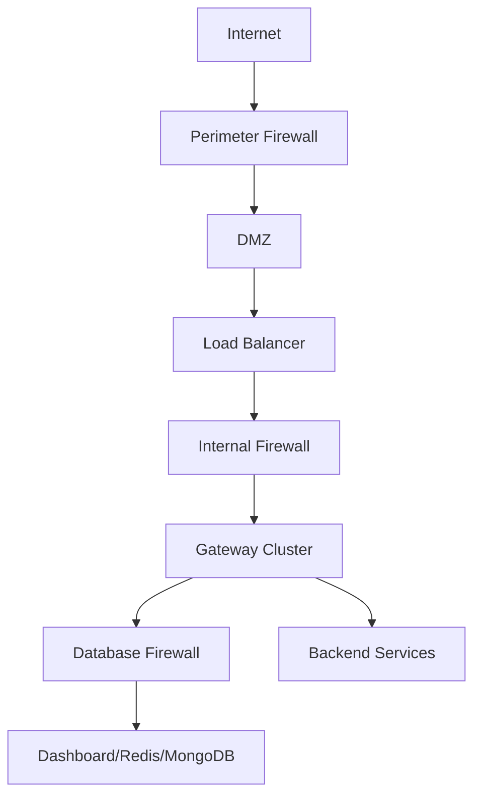

# Security Hardening for Tyk Deployments

This guide provides comprehensive security hardening strategies and best practices for Tyk deployments, helping you protect your API management infrastructure from threats and vulnerabilities.

## Security Hardening Fundamentals

### Security Principles for API Management

Effective security for API management follows these key principles:

- **Defense in depth**: Multiple layers of security controls
- **Principle of least privilege**: Minimal access rights for users and systems
- **Secure by default**: Secure configurations out of the box
- **Separation of concerns**: Clear security boundaries between components
- **Continuous security improvement**: Ongoing security assessment and enhancement

### Security Risks in API Management

API management platforms face several security risks:

- **Unauthorized access**: Unauthorized users accessing APIs or management interfaces
- **Data exposure**: Sensitive data leaking through APIs or logs
- **API abuse**: Rate limiting bypass, injection attacks, or parameter tampering
- **Infrastructure compromise**: Vulnerabilities in underlying systems
- **Insider threats**: Malicious actions by authorized users
- **Denial of service**: Attacks that disrupt API availability

## Network Security

### Network Architecture



Implement a secure network architecture:

- **Network segmentation**: Separate components into appropriate network zones
- **DMZ implementation**: Place public-facing components in a DMZ
- **Internal segmentation**: Separate management, Gateway, and data components
- **Micro-segmentation**: Granular network controls between components
- **Traffic flow control**: Restrict traffic to necessary paths only

### Firewall Configuration

Implement strict firewall rules:

- **Gateway access**:
  - Allow inbound on API ports (typically 80/443)
  - Restrict management port access (8080)
  - Allow outbound to upstream services only
  - Block all other traffic

- **Dashboard access**:
  - Restrict to management networks only
  - Allow specific ports (3000, 443)
  - Implement IP allowlisting
  - Block all other traffic

Example firewall rules for Gateway:

```
# Allow API traffic
-A INPUT -p tcp --dport 443 -j ACCEPT
-A INPUT -p tcp --dport 80 -j ACCEPT

# Allow management from internal networks only
-A INPUT -p tcp --dport 8080 -s 10.0.0.0/8 -j ACCEPT

# Allow outbound to Redis
-A OUTPUT -p tcp --dport 6379 -d 10.0.1.5 -j ACCEPT

# Default deny
-A INPUT -j DROP
-A OUTPUT -j DROP
```

### TLS Implementation

Implement strong TLS configurations:

- **Certificate management**:
  - Use trusted CA-signed certificates
  - Implement proper certificate rotation
  - Monitor certificate expiration
  - Secure private key storage

- **TLS configuration**:
  - Enforce TLS 1.2+ only
  - Use strong cipher suites
  - Implement perfect forward secrecy
  - Enable OCSP stapling

Example Gateway TLS configuration:

```json
{
  "http_server_options": {
    "use_ssl": true,
    "ssl_certificates": ["cert1.pem"],
    "ssl_ciphers": [
      "TLS_ECDHE_ECDSA_WITH_AES_128_GCM_SHA256",
      "TLS_ECDHE_RSA_WITH_AES_128_GCM_SHA256"
    ],
    "prefer_server_ciphers": true,
    "min_version": 771,
    "max_version": 772
  }
}
```

## Access Control and Authentication

### Gateway Authentication Hardening

Secure Gateway authentication:

- **API key security**:
  - Enforce strong key entropy
  - Implement key rotation policies
  - Use secure key transmission
  - Monitor for key abuse

- **JWT configuration**:
  - Use strong signing algorithms (RS256, ES256)
  - Validate all JWT claims
  - Implement proper key management
  - Set appropriate token expiration

Example JWT security configuration:

```json
{
  "enable_jwt": true,
  "jwt_signing_method": "rsa",
  "jwt_source": "header",
  "jwt_identity_base_field": "sub",
  "jwt_policy_field_name": "pol",
  "jwt_default_policies": ["5d8929d27cb0d1e0a20104a8"],
  "jwt_scope_to_policy_mapping": {
    "read:api": "readonly-policy",
    "write:api": "writeonly-policy",
    "admin:api": "admin-policy"
  },
  "jwt_scope_claim_name": "scope"
}
```

### Dashboard Access Security

Secure Dashboard access:

- **Strong authentication**:
  - Enforce complex password policies
  - Implement multi-factor authentication
  - Set appropriate session timeouts
  - Limit failed login attempts

- **Role-based access control**:
  - Implement least privilege principle
  - Define clear role boundaries
  - Regularly review access rights
  - Audit role assignments

Example Dashboard security configuration:

```json
{
  "security": {
    "allow_admin_reset_password": false,
    "login_failure_username_limit": 3,
    "login_failure_ip_limit": 10,
    "login_failure_expiration": 900,
    "audit_log_path": "/var/log/tyk-dashboard/audit.log",
    "enable_audit_logging": true,
    "force_first_login_pw_reset": true,
    "password_min_length": 12
  }
}
```

## Component Hardening

### Gateway Hardening

Secure the Tyk Gateway:

- **Secure configuration**:
  - Remove unnecessary features
  - Implement secure defaults
  - Restrict management endpoints
  - Limit middleware capabilities

Example Gateway hardening configuration:

```json
{
  "allow_insecure_configs": false,
  "coprocess_options": {
    "enable_coprocess": false
  },
  "enable_custom_domains": false,
  "enable_jsvm": false,
  "enforce_org_data_age": true,
  "enforce_org_quotas": true,
  "http_server_options": {
    "enable_websockets": false
  }
}
```

### Redis Hardening

Secure Redis:

- **Authentication**:
  - Enable Redis authentication
  - Use strong passwords
  - Implement role-based access control (Redis 6+)
  - Restrict command execution

- **Network security**:
  - Bind to specific interfaces
  - Implement firewall rules
  - Use TLS for Redis connections
  - Disable direct internet access

Example Redis hardening configuration:

```
# /etc/redis/redis.conf
bind 127.0.0.1 10.0.1.5
protected-mode yes
port 0
tls-port 6379
tls-cert-file /path/to/redis.crt
tls-key-file /path/to/redis.key
tls-ca-cert-file /path/to/ca.crt
requirepass StrongRedisPassword
rename-command FLUSHALL ""
rename-command CONFIG ""
```

### Database Hardening

Secure MongoDB or PostgreSQL:

- **Authentication**:
  - Use strong authentication
  - Implement role-based access
  - Disable anonymous access
  - Use dedicated service accounts

- **Authorization**:
  - Implement least privilege
  - Restrict database actions
  - Limit administrative access
  - Regularly review permissions

Example MongoDB hardening configuration:

```yaml
# /etc/mongod.conf
security:
  authorization: enabled
  keyFile: /path/to/keyfile
  
net:
  bindIp: 127.0.0.1,10.0.1.6
  ssl:
    mode: requireSSL
    PEMKeyFile: /path/to/mongodb.pem
    CAFile: /path/to/ca.pem
```

## Data Protection

### Data Encryption

Implement comprehensive encryption:

- **Data at rest**:
  - Database encryption
  - File system encryption
  - Secure key storage
  - Backup encryption

- **Data in transit**:
  - TLS for all connections
  - Strong cipher suites
  - Certificate validation
  - Secure key exchange

### Sensitive Data Handling

Protect sensitive data:

- **PII identification**:
  - Identify personal data
  - Classify data sensitivity
  - Map data flows
  - Document data handling

- **Data minimization**:
  - Collect only necessary data
  - Implement appropriate retention
  - Anonymize where possible
  - Purge unnecessary data

Example sensitive data configuration:

```json
{
  "analytics_config": {
    "type": "redis",
    "enable_detailed_recording": false,
    "sanitize_field_names": [
      "authorization",
      "password",
      "credit_card",
      "card_number"
    ]
  }
}
```

## Vulnerability Management

### Security Patching

Implement effective patch management:

- **Regular updates**:
  - Subscribe to security announcements
  - Implement regular update schedule
  - Test updates before deployment
  - Document update procedures

- **Emergency patching**:
  - Define emergency patch process
  - Test critical patches quickly
  - Implement with minimal disruption
  - Verify patch effectiveness

### Security Scanning

Implement regular security scanning:

- **Vulnerability scanning**:
  - Scan infrastructure regularly
  - Check for known vulnerabilities
  - Prioritize findings by risk
  - Track remediation progress

- **Penetration testing**:
  - Conduct regular penetration tests
  - Test API security specifically
  - Address findings promptly
  - Verify remediation effectiveness

## Implementation Example: Financial Services API Platform

This example demonstrates security hardening for a financial services API platform with strict compliance requirements.

### Requirements:

- Compliance with financial regulations
- Protection of sensitive customer data
- Defense against sophisticated threats
- Comprehensive audit capabilities
- High availability with security

### Implementation:

1. **Network Security**:
   - Multi-layer firewall architecture
   - Network segmentation with micro-segmentation
   - TLS 1.2+ with strong cipher suites
   - Web Application Firewall for API traffic

2. **Access Control**:
   - Multi-factor authentication for Dashboard
   - Certificate-based authentication for Gateways
   - JWT with RS256 for API authentication
   - Strict RBAC implementation

3. **Component Hardening**:
   - Minimal feature enablement
   - Regular security patching
   - Secure configuration baselines
   - Comprehensive logging and monitoring

4. **Data Protection**:
   - Encryption for all sensitive data
   - Data masking in logs and analytics
   - Strict data retention policies
   - Regular data access auditing

### Results:

- Successfully passed financial security audits
- Zero security breaches over 24 months
- Comprehensive security monitoring
- Automated compliance reporting
- Minimal security-related incidents

## Best Practices

### Security Architecture

- Implement defense in depth
- Establish clear security boundaries
- Document security controls
- Review architecture regularly
- Conduct threat modeling

### Configuration Management

- Use secure default configurations
- Implement configuration as code
- Validate security configurations
- Track configuration changes
- Regularly review for hardening opportunities

### Operational Security

- Implement least privilege access
- Conduct regular security training
- Establish incident response procedures
- Perform regular security testing
- Monitor for security events

## Next Steps

- [Monitoring and Alerting](/api-management/managing-deployments/operations/monitoring-alerting)
- [Disaster Recovery](/api-management/managing-deployments/operations/disaster-recovery)
- [Configuration Management](/api-management/managing-deployments/operations/configuration-management)
