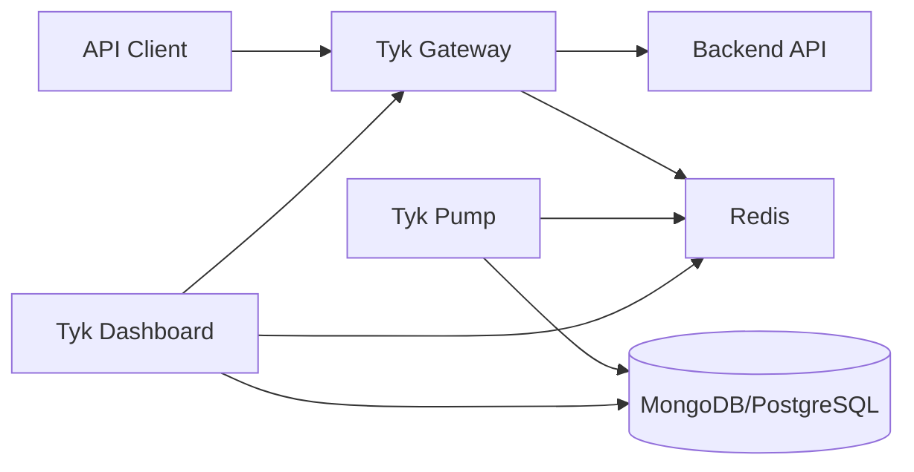

# Tyk Single Data Plane Architecture

A single data plane architecture is the standard deployment model for Tyk Pro, where all components are deployed in a single logical environment. This page explains how these components work together to provide a complete API management solution.

## Components Overview

[Diagram showing all components and their relationships]

A Tyk single data plane deployment consists of these core components:

### Tyk Gateway

The Gateway is the heart of Tyk, responsible for:
- Processing all API requests
- Enforcing policies and security
- Handling authentication and authorization
- Collecting analytics data
- Applying transformations and middleware

### Tyk Dashboard

The Dashboard provides management capabilities:
- Web UI for API management
- API for automation and integration
- User and organization management
- Analytics visualization
- Developer portal

### Tyk Pump

The Pump handles analytics processing:
- Collects analytics from Gateway (via Redis)
- Processes and aggregates data
- Exports to various data stores
- Enables reporting and monitoring
- Manages analytics storage

### Redis

Redis serves as the primary data store:
- Stores API definitions and policies
- Manages keys and OAuth tokens
- Handles rate limiting and quotas
- Provides inter-component communication
- Temporarily stores analytics data

### MongoDB/PostgreSQL

The persistent database stores:
- Dashboard configuration
- User accounts and permissions
- Long-term analytics data
- Audit logs
- Portal content

## Component Relationships

### Data Flow



The data flows through the system as follows:

1. **API Requests**: Clients send requests to the Gateway
2. **Processing**: Gateway processes requests and forwards to backend services
3. **Analytics**: Gateway writes analytics to Redis
4. **Pump Processing**: Pump collects analytics from Redis and stores in the database
5. **Management**: Dashboard reads/writes configuration to Redis and database
6. **Configuration Updates**: Gateway pulls configuration from Redis

### Control Flow

The control flow for API management:

1. **API Creation**: APIs are created in Dashboard and stored in Redis
2. **Policy Management**: Policies are defined in Dashboard and stored in Redis
3. **Key Management**: Keys are created, stored in Redis, and used by Gateway
4. **Configuration Changes**: Changes in Dashboard are immediately available to Gateway via Redis

## Deployment Patterns

### All-in-One Deployment

[Diagram of all-in-one deployment]

All components on a single server:
- Simplest deployment model
- Suitable for development, testing, or small production environments
- Minimal network configuration
- Limited scalability and redundancy

Example server requirements:
- 4+ CPU cores
- 8+ GB RAM
- 50+ GB storage
- Ubuntu 18.04/20.04 or similar

### Component Separation

[Diagram of component separation deployment]

Components deployed on separate servers:
- Gateway on dedicated servers
- Dashboard and Pump on separate server(s)
- Redis on dedicated server or cluster
- Database on dedicated server or cluster

Benefits:
- Independent scaling of components
- Better resource allocation
- Improved security isolation
- Enhanced performance

### High Availability Deployment

[Diagram of high availability deployment]

Redundant components for high availability:
- Multiple Gateway instances behind load balancer
- Dashboard cluster with load balancer
- Redis in HA configuration (Sentinel or Cluster)
- Database with replication
- Multiple Pump instances

For detailed HA configuration, see [High Availability](/api-management/managing-deployments/single-data-plane/high-availability).

## Scaling Considerations

### Gateway Scaling

The Gateway is stateless and scales horizontally:
- Add more Gateway instances as traffic increases
- Place behind a load balancer
- Consider regional deployment for global traffic
- Typically scales linearly with instance count

### Dashboard Scaling

The Dashboard has moderate scaling requirements:
- Handles administrative traffic, not API traffic
- Can be scaled horizontally for larger teams
- Session management requires sticky sessions or shared storage
- Consider separate Dashboard for very large deployments

### Redis Scaling

Redis is critical for performance:
- Optimize for memory and network performance
- Consider Redis Cluster for large deployments
- Monitor memory usage and connections
- Ensure sufficient memory for key data and analytics

For detailed scaling strategies, see [Scaling Strategies](/api-management/managing-deployments/operations/scaling-strategies).

## Implementation Example: Mid-Size Enterprise Deployment

This example shows a production deployment for a mid-size enterprise with moderate API traffic.

[Detailed diagram of mid-size enterprise deployment]

### Infrastructure:

- **Gateway Tier**: 
  - 3 Gateway instances (4 cores, 8GB RAM each)
  - Nginx load balancer with SSL termination
  - Auto-scaling group with minimum 3 instances

- **Management Tier**:
  - 2 Dashboard instances (4 cores, 8GB RAM each)
  - 2 Pump instances (2 cores, 4GB RAM each)
  - Load balancer with sticky sessions

- **Data Tier**:
  - Redis: 3-node Sentinel setup (primary + 2 replicas)
  - MongoDB: 3-node replica set
  - Separate storage volumes for data

### Configuration Highlights:

```json
{
  "listen_port": 8080,
  "secret": "REDACTED",
  "template_path": "/opt/tyk-gateway/templates",
  "use_db_app_configs": true,
  "db_app_conf_options": {
    "connection_string": "redis://redis-sentinel:26379",
    "node_is_segmented": false
  },
  "enable_analytics": true,
  "analytics_config": {
    "type": "redis",
    "enable_detailed_recording": true
  },
  "health_check": {
    "enable_health_checks": true,
    "health_check_value_timeouts": 60
  }
}
```

### Results:

- Handles 2,000 requests per second with sub-50ms latency
- Supports 500+ APIs and 50+ administrative users
- 99.99% uptime with no single point of failure
- Seamless scaling during traffic spikes

## Next Steps

- [High Availability](/api-management/managing-deployments/single-data-plane/high-availability)
- [Performance Tuning](/api-management/managing-deployments/operational-guidance/performance-tuning)
- [Monitoring and Alerting](/api-management/managing-deployments/operational-guidance/monitoring-alerting)
- [Scaling Strategies](/api-management/managing-deployments/operational-guidance/scaling-strategies)