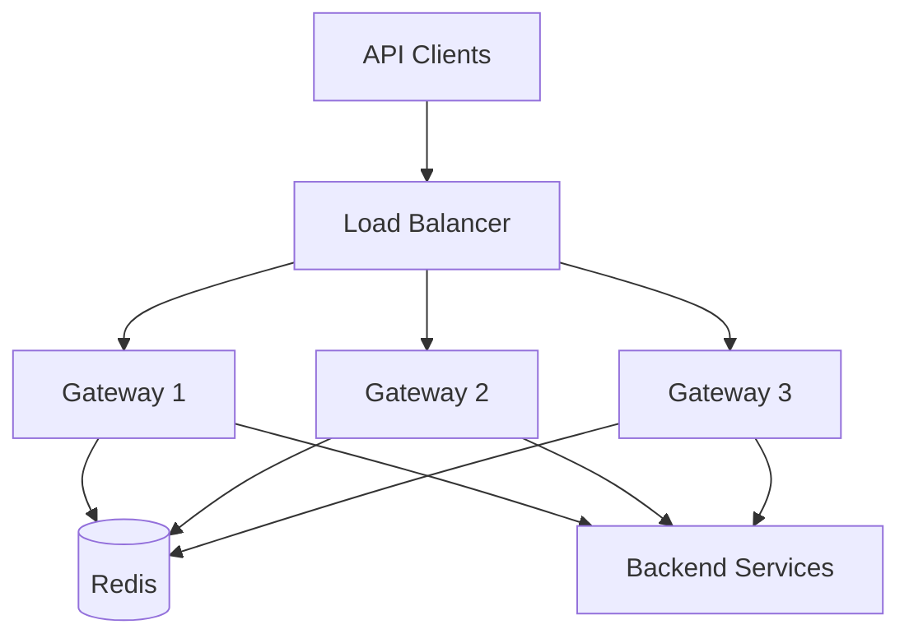
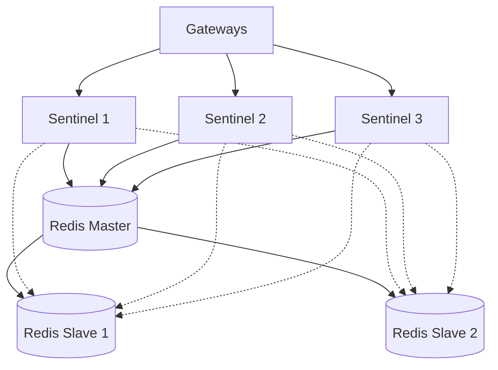

# High Availability for Tyk Single Data Plane

High availability (HA) is critical for production API deployments to ensure continuous service availability. This guide explains how to implement HA for each component in a Tyk single data plane deployment.

## HA Architecture Overview

[Diagram showing complete HA architecture for single data plane]

A high availability Tyk deployment requires redundancy at multiple levels:

- **Gateway Layer**: Multiple Gateway instances behind a load balancer
- **Management Layer**: Redundant Dashboard instances
- **Data Layer**: Redis in HA configuration and replicated database
- **Analytics Layer**: Multiple Pump instances

This architecture eliminates single points of failure and enables maintenance without downtime.

## Gateway High Availability

### Gateway Clustering

Tyk Gateways are stateless and can be deployed in a cluster:

- Each Gateway operates independently
- Configuration is shared via Redis
- No direct communication between Gateways
- Identical configuration across all instances

### Load Balancing Gateways

Implement load balancing for Gateway instances:



Load balancer configuration:
- Health checks to detect Gateway failures
- Session affinity not required (stateless)
- Equal distribution or weighted by capacity
- SSL termination (optional)

### Gateway Failover

Configure automatic failover:
- Load balancer removes unhealthy Gateways
- New requests go to healthy instances
- Failed Gateway can be automatically replaced
- No session data loss during failover

## Dashboard High Availability

### Dashboard Clustering

The Dashboard can be deployed in an active-active configuration:

- Multiple Dashboard instances
- Shared database for configuration
- Shared Redis for real-time data
- Session management considerations

### Load Balancing Dashboard

Implement load balancing for Dashboard:

[Diagram showing Dashboard load balancing]

Load balancer configuration:
- Health checks for Dashboard instances
- Session persistence (sticky sessions)
- SSL termination (recommended)
- Authentication pass-through

### Dashboard Failover

Handle Dashboard failover:
- User sessions may be lost during failover
- Configuration changes are preserved in database
- Automatic redirection to available instances
- Minimal impact on Gateway operation

## Redis High Availability

Redis is critical for Tyk operation and requires robust HA configuration.

### Redis Sentinel

Implement Redis Sentinel for automatic failover:



Configuration requirements:
- Minimum 3 Sentinel instances
- At least 2 Redis slaves
- Quorum setting for failure detection
- Automatic failover configuration

Example Sentinel configuration:

```
sentinel monitor mymaster 192.168.1.10 6379 2
sentinel down-after-milliseconds mymaster 5000
sentinel failover-timeout mymaster 60000
sentinel parallel-syncs mymaster 1
```

### Redis Cluster

For larger deployments, consider Redis Cluster:

- Automatic data sharding across nodes
- No single master node
- Built-in replication
- Automatic failover
- Linear scalability

### Redis Persistence

Configure persistence for data durability:

- RDB snapshots for point-in-time recovery
- AOF for transaction logging
- Combined RDB+AOF for optimal durability
- Regular backup of persistence files

## Database High Availability

### MongoDB Replica Sets

For MongoDB, implement replica sets:

[Diagram showing MongoDB replica set]

Configuration requirements:
- Minimum 3 nodes (primary + 2 secondaries)
- Automatic failover configuration
- Appropriate write concern settings
- Regular backups

Example MongoDB replica set configuration:

```javascript
rs.initiate({
  _id: "tyk_mongo_set",
  members: [
    { _id: 0, host: "mongo1:27017" },
    { _id: 1, host: "mongo2:27017" },
    { _id: 2, host: "mongo3:27017" }
  ]
})
```

### PostgreSQL High Availability

For PostgreSQL, implement replication:

- Primary-standby replication
- Automatic failover with tools like Patroni
- Connection pooling with PgBouncer
- Regular backups

## Pump High Availability

### Multiple Pump Instances

Deploy multiple Pump instances:

- Each Pump operates independently
- All read from the same Redis instance
- Configure for different analytics destinations
- No direct communication between Pumps

### Pump Failover

Handle Pump failures:
- Analytics temporarily stored in Redis
- Failed Pump can be replaced without data loss
- Consider different purge delays for redundancy
- Monitor Pump operation and analytics flow

## Network Considerations

### Network Redundancy

Implement network redundancy:

- Redundant network paths
- Multiple network interfaces
- Different ISPs for internet connectivity
- Internal network segmentation

### Load Balancer Redundancy

Ensure load balancer redundancy:

- Redundant load balancer instances
- Automatic failover configuration
- Health checks for backend services
- Proper SSL certificate management

## Monitoring HA Deployments

### Component Health Monitoring

Implement comprehensive monitoring:

- Gateway instance health
- Dashboard availability
- Redis master/slave status
- Database replication status
- Pump operation
- End-to-end API availability

### Failover Detection

Monitor and alert on failover events:

- Redis master changes
- Database primary changes
- Gateway instance failures
- Dashboard instance failures
- Automatic recovery verification

## Implementation Steps

### 1. Gateway HA Implementation

1. Deploy multiple Gateway instances
2. Configure load balancer with health checks
3. Ensure identical Gateway configuration
4. Test failover by stopping instances

### 2. Dashboard HA Implementation

1. Deploy multiple Dashboard instances
2. Configure load balancer with sticky sessions
3. Ensure shared database configuration
4. Test user experience during failover

### 3. Redis HA Implementation

1. Set up Redis master and slaves
2. Configure Sentinel or Cluster
3. Update Gateway and Dashboard configurations
4. Test failover by stopping Redis master

### 4. Database HA Implementation

1. Set up database replication
2. Configure automatic failover
3. Update connection strings in Dashboard
4. Test failover by stopping primary database

## Implementation Example: Financial Services API Platform

This example demonstrates a high availability implementation for a financial services company with strict uptime requirements.

[Diagram showing complete HA implementation for financial services]

### Infrastructure:

- **Gateway Layer**:
  - 6 Gateway instances across 3 availability zones
  - AWS Network Load Balancer with health checks
  - Auto-scaling group with minimum 2 instances per zone

- **Management Layer**:
  - 3 Dashboard instances across 3 availability zones
  - Application Load Balancer with sticky sessions
  - Auto-scaling group with minimum 1 instance per zone

- **Data Layer**:
  - Redis: 3-node Sentinel with 1 master, 2 slaves
  - MongoDB: 3-node replica set with automated backups
  - Cross-AZ deployment for all data components

### Configuration Highlights:

Gateway configuration for Redis Sentinel:

```json
{
  "storage": {
    "type": "redis",
    "host": "",
    "port": 0,
    "username": "",
    "password": "",
    "database": 0,
    "optimisation_max_idle": 2000,
    "optimisation_max_active": 4000,
    "enable_cluster": false,
    "hosts": null,
    "sentinel_master_name": "tyk-redis-master",
    "sentinel_addresses": [
      "sentinel-1:26379",
      "sentinel-2:26379",
      "sentinel-3:26379"
    ]
  }
}
```

### Results:

- 99.995% uptime over 12 months
- Survived multiple component failures without service interruption
- Enabled zero-downtime upgrades and maintenance
- Automatic recovery from instance and availability zone failures

## Next Steps

- [Single Data Plane Architecture](/api-management/managing-deployments/single-data-plane/architecture)
- [Disaster Recovery](/api-management/managing-deployments/operations/disaster-recovery)
- [Monitoring and Alerting](/api-management/managing-deployments/operations/monitoring-alerting)
