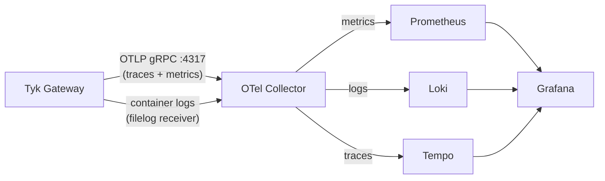

## Introduction

Tyk Gateway exports all three observability signals (structured logs, distributed traces, and metrics) via the OpenTelemetry Protocol (OTLP). This guide shows you how to enable each signal and route them to a local Grafana stack (Prometheus, Loki, Tempo) using an OpenTelemetry Collector.

By the end of this guide you will have:

- Structured JSON access logs from Tyk Gateway shipping to Loki
- Distributed traces exporting to Tempo
- Gateway metrics (request rate, latency, error rate) flowing to Prometheus
- A Grafana instance wired up to all three backends

## Availability

| Signal | Minimum Gateway version |
|--------|------------------------|
| Structured JSON logs (`log_format: json`) | 5.6.0 |
| Access logs (`access_logs.enabled`) | 5.8.0 |
| Distributed traces (OTLP) | 5.3.0 |
| OTLP metrics | 5.13.0 |

## Prerequisites

- [Docker](https://docs.docker.com/get-docker/) and [Docker Compose](https://docs.docker.com/compose/install/) installed
- A running Tyk Self-Managed deployment. We recommend following the [Tyk Self-Managed getting started guide](https://tyk.io/docs/getting-started/quick-start#getting-started-with-tyk-self-managed) to set up a local Docker environment
- Basic familiarity with Docker Compose

## Architecture

All three signals flow from Tyk Gateway to a single OpenTelemetry Collector endpoint. The Collector fans them out to the appropriate backend. Grafana queries all three.



<Note>
Tyk Gateway does not export logs via OTLP. It writes structured JSON to stdout. The OTel Collector reads those logs from the Docker container log path using the `filelog` receiver.
</Note>

## Instructions

## Step 1: Configure Tyk Gateway

Add the following environment variables to your `tyk-gateway` service. These enable all three signals:

```yaml expandable
services:
  tyk-gateway:
    environment:
      # Structured JSON logs (requires v5.6.0+)
      - TYK_GW_LOGFORMAT=json
      # Per-request access logs with trace ID correlation (requires v5.8.0+)
      - TYK_GW_ACCESSLOGS_ENABLED=true

      # Distributed tracing
      - TYK_GW_OPENTELEMETRY_TRACES_ENABLED=true
      - TYK_GW_OPENTELEMETRY_TRACES_ENDPOINT=otel-collector:4317
      - TYK_GW_OPENTELEMETRY_TRACES_SAMPLING_TYPE=TraceIDRatioBased
      - TYK_GW_OPENTELEMETRY_TRACES_SAMPLING_RATE=1.0

      # OTLP metrics
      - TYK_GW_OPENTELEMETRY_METRICS_ENABLED=true
      - TYK_GW_OPENTELEMETRY_METRICS_ENDPOINT=otel-collector:4317
      - TYK_GW_OPENTELEMETRY_METRICS_EXPORTINTERVAL=15
```

If you prefer `tyk.conf`, the equivalent configuration is:

```json expandable
{
  "log_format": "json",
  "access_logs": {
    "enabled": true
  },
  "opentelemetry": {
    "traces": {
      "enabled": true,
      "endpoint": "otel-collector:4317",
      "sampling": {
        "type": "TraceIDRatioBased",
        "rate": 1.0
      }
    },
    "metrics": {
      "enabled": true,
      "endpoint": "otel-collector:4317",
      "export_interval": 15
    }
  }
}
```

<Note>
`sampling.rate: 1.0` captures every request, which is suitable for getting started. In production, lower this to `0.1` (10%) or use `ParentBased` sampling. See the [Tyk Gateway configuration reference](/tyk-oss-gateway/configuration#opentelemetrysampling) for all options.
</Note>

## Step 2: Add the OTel Collector

Create an `otelcol-config.yml` file in your deployment directory:

```yaml expandable
receivers:
  otlp:
    protocols:
      grpc:
        endpoint: 0.0.0.0:4317
      http:
        endpoint: 0.0.0.0:4318

  filelog/tyk-gateway:
    include: ["/var/lib/docker/containers/*/*-json.log"]
    include_file_name: false
    include_file_path: true
    start_at: end
    operators:
      - type: json_parser
        parse_from: body
        parse_to: attributes.docker
        on_error: drop
      - type: move
        from: attributes.docker.log
        to: body
      - type: json_parser
        parse_from: body
        parse_to: attributes.tyk
        on_error: drop
      - type: filter
        expr: 'attributes.tyk.prefix == nil and attributes.tyk.msg == nil'
      - type: time_parser
        parse_from: attributes.tyk.time
        layout: '%Y-%m-%dT%H:%M:%SZ'
        on_error: send_quiet
      - type: severity_parser
        parse_from: attributes.tyk.level
        on_error: send_quiet

processors:
  batch: {}
  resource/tyk_gateway_logs:
    attributes:
      - action: upsert
        key: service.name
        value: tyk-gateway
  memory_limiter:
    check_interval: 1s
    limit_percentage: 75
    spike_limit_percentage: 20
  transform/tyk_gw_resource_attrs:
    error_mode: ignore
    metric_statements:
      - context: datapoint
        statements:
          - set(attributes["tyk_gw_id"], resource.attributes["tyk.gw.id"]) where resource.attributes["tyk.gw.id"] != nil
          - set(attributes["tyk_gw_group_id"], resource.attributes["tyk.gw.group.id"]) where resource.attributes["tyk.gw.group.id"] != nil
          - set(attributes["tyk_gw_tags"], resource.attributes["tyk.gw.tags"]) where resource.attributes["tyk.gw.tags"] != nil

exporters:
  otlphttp/prometheus:
    endpoint: "http://prometheus:9090/api/v1/otlp"
    tls:
      insecure: true
  otlphttp/loki:
    endpoint: "http://loki:3100/otlp"
    tls:
      insecure: true
  otlp/tempo:
    endpoint: "tempo:4317"
    tls:
      insecure: true

service:
  pipelines:
    traces:
      receivers: [otlp]
      processors: [memory_limiter, batch]
      exporters: [otlp/tempo]
    metrics:
      receivers: [otlp]
      processors: [memory_limiter, transform/tyk_gw_resource_attrs, batch]
      exporters: [otlphttp/prometheus]
    logs/otlp:
      receivers: [otlp]
      processors: [memory_limiter, batch]
      exporters: [otlphttp/loki]
    logs/filelog:
      receivers: [filelog/tyk-gateway]
      processors: [memory_limiter, resource/tyk_gateway_logs, batch]
      exporters: [otlphttp/loki]
```

Then add the `otel-collector` service to your `docker-compose.yml`:

```yaml expandable
services:
  otel-collector:
    image: ghcr.io/open-telemetry/opentelemetry-collector-releases/opentelemetry-collector-contrib:0.133.0
    user: "0"   # Required — without this, permission denied reading /var/lib/docker/containers
    volumes:
      - ./otelcol-config.yml:/etc/otelcol-contrib/config.yaml
      - /var/lib/docker/containers:/var/lib/docker/containers:ro
      - /var/run/docker.sock:/var/run/docker.sock:ro
    ports:
      - "4317:4317"
      - "4318:4318"
    networks:
      - tyk
```

The volume mounts give the Collector read access to Docker container logs for the `filelog` receiver.

## Step 3: Add the Grafana stack

Add Prometheus, Loki, Tempo, and Grafana to your `docker-compose.yml`:

```yaml expandable
services:
  prometheus:
    image: prom/prometheus:v3.4.0
    command:
      - --config.file=/etc/prometheus/prometheus.yml
      - --web.enable-otlp-receiver
    volumes:
      - ./prometheus.yml:/etc/prometheus/prometheus.yml
    ports:
      - "9090:9090"
    networks:
      - tyk

  loki:
    image: grafana/loki:3.5.0
    command: -config.file=/etc/loki/local-config.yaml
    ports:
      - "3100:3100"
    networks:
      - tyk

  tempo:
    image: grafana/tempo:2.7.2
    command: -config.file=/etc/tempo.yaml
    volumes:
      - ./tempo.yaml:/etc/tempo.yaml
    ports:
      - "3200:3200"
      - "4317"
    networks:
      - tyk

  grafana:
    image: grafana/grafana:12.0.0
    environment:
      - GF_AUTH_ANONYMOUS_ENABLED=true
      - GF_AUTH_ANONYMOUS_ORG_ROLE=Admin
    volumes:
      - ./grafana/provisioning:/etc/grafana/provisioning
    ports:
      - "3001:3000"
    networks:
      - tyk
    depends_on:
      - prometheus
      - loki
      - tempo
```

<Note>
Grafana is mapped to port `3001` to avoid conflicting with Tyk Dashboard on port `3000`. Adjust if needed.
</Note>

Create a minimal `prometheus.yml` to allow OTLP ingest:

```yaml
global:
  scrape_interval: 15s

storage:
  tsdb:
    out_of_order_time_window: 10m
```

Create a minimal `tempo.yaml`:

```yaml expandable
server:
  http_listen_port: 3200

distributor:
  receivers:
    otlp:
      protocols:
        grpc:
          endpoint: 0.0.0.0:4317

storage:
  trace:
    backend: local
    local:
      path: /tmp/tempo/blocks
```

### Provision Grafana datasources

Create `grafana/provisioning/datasources/tyk.yaml`:

```yaml expandable
apiVersion: 1
datasources:
  - name: Prometheus
    type: prometheus
    url: http://prometheus:9090
    isDefault: true

  - name: Loki
    type: loki
    url: http://loki:3100

  - name: Tempo
    type: tempo
    url: http://tempo:3200
```

## Step 4: Start and verify

Restart your deployment to apply the gateway configuration changes and bring up the new services:

```bash
docker compose up -d
```

Send test requests through Tyk Gateway, then open Grafana at **http://localhost:3001** and verify each signal.

<Note>
If you are following this guide using the Tyk Self-Managed getting started setup, an **httpbingo** API is pre-configured. Generate test traffic with:

```bash
for i in $(seq 1 10); do curl -s -o /dev/null -w "HTTP %{http_code}\n" \
  -H "Authorization: <your-api-key>" http://localhost:8080/httpbingo/get; done
```
</Note>

**Metrics**: in Explore, select the Prometheus datasource and run:
```promql
{__name__="tyk.http.requests_total"}
```
You should see request counts rise as traffic flows through the gateway.


**Logs**: in Explore, select the Loki datasource and run:
```logql
{service_name="tyk-gateway"} | json
```
You should see structured access log entries with fields like `api_id`, `path`, `status`, `latency_total`, and `trace_id`.


**Traces**: in Explore, select the Tempo datasource and search for recent traces. Each trace should show one span for the request.


<Tip>
If traces are not appearing, verify that `TYK_GW_OPENTELEMETRY_TRACES_ENABLED=true` is set and that the gateway can reach `otel-collector:4317`. Check the OTel Collector logs with `docker compose logs otel-collector` for any connection errors.
</Tip>

## Next steps

- **Explore default metrics**: see all gateway metrics available out of the box in [Default Metrics](/api-management/logs-metrics)
- **Add custom metrics**: attach request headers, JWT claims, and response codes as metric dimensions using [Custom Metrics](/api-management/metrics/custom-metrics)
- **See it all in action**: the [OpenTelemetry Demo](/api-management/opentelemetry-demo) runs a pre-built observability stack with four Grafana dashboards wired up and a live load generator
- **Kubernetes deployment**: for log collection in Kubernetes using the OTel Collector DaemonSet, see [Collecting Gateway Logs with OTel on Kubernetes](/api-management/collecting-gateway-logs-otel-kubernetes)
