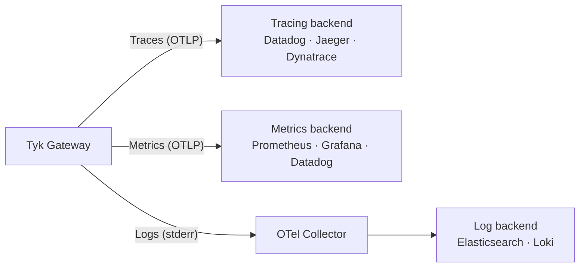

[OpenTelemetry](https://opentelemetry.io/docs/what-is-opentelemetry/) is an open-source observability framework providing a vendor-neutral standard for collecting traces, metrics, and logs. Since Tyk Gateway v5.2, it is the recommended observability approach for Tyk Gateway.

Tyk supports all three signals. Traces and metrics are exported natively via the [OpenTelemetry Protocol (OTLP)](https://opentelemetry.io/docs/specs/otlp/) to any compatible backend. Logs are written as structured JSON to stderr and collected by an external agent. No additional components are required alongside Tyk to get started.



## Tracing

Distributed tracing gives you an end-to-end view of individual API requests as they flow through Tyk Gateway and into your upstream services. Traces help you pinpoint latency bottlenecks, trace error propagation across services, and understand the full request lifecycle.

Tyk generates parent and child [spans](https://opentelemetry.io/docs/concepts/signals/traces/#spans) for each proxied request. For each API, you can optionally enable **detailed tracing** to produce a span per middleware, giving granular visibility into authentication, rate limiting, transformation, and routing steps.

**Supported propagation formats:** W3C TraceContext (default), B3, and custom or composite header modes for proprietary correlation headers.

**Supported backends:** Datadog, Dynatrace, Jaeger, New Relic, Elastic, and any OTLP-compatible endpoint.

For configuration details and vendor-specific integration guides, see [Distributed Tracing with Tyk](/api-management/traces).

## Metrics

Tyk Gateway natively pushes metrics to any OTLP-compatible backend with a configurable push interval. No sidecar or agent is required alongside the Gateway.

When enabled, the Gateway automatically exports three groups of metrics:

- **Request metrics:** Rate, Errors, and Duration (RED) with a three-way latency split: total, Gateway-only, and upstream-only
- **Go runtime metrics:** Memory usage, goroutine count, and GC health
- **Configuration state metrics:** Number of APIs and policies loaded, config reload counts and durations

You can extend these with [custom counters and histograms](/api-management/metrics/custom-metrics) that use request context, JWT claims, session data, response headers, or static API metadata as dimensions.

**Compatible backends:** Prometheus, Grafana Mimir, Datadog, New Relic, Dynatrace, Elastic, and any OTel Collector.

For full configuration details, see:

- [OpenTelemetry Metrics Configuration](/api-management/logs-metrics): enabling metrics, export config, and cardinality control
- [Default Gateway Metrics](/api-management/metrics/default-metrics): all automatically exported metrics and their dimensions
- [Custom Metrics](/api-management/metrics/custom-metrics): defining your own counters and histograms

## Logs

Tyk Gateway writes logs to `stdout`/`stderr` in structured JSON format. It does not have a native OTLP log exporter. To ship gateway logs to an observability backend, deploy the [OpenTelemetry Collector](https://opentelemetry.io/docs/collector/) with the [Filelog Receiver](https://github.com/open-telemetry/opentelemetry-collector-contrib/tree/main/receiver/filelogreceiver). The Collector tails container log files on each Kubernetes node, optionally enriches them with pod and namespace metadata, and forwards them to a backend like Elasticsearch.

For a step-by-step guide, see [Collecting Gateway Logs with OTel on Kubernetes](/api-management/collecting-gateway-logs-otel-kubernetes).

<Note>
If you don't need a full OTel pipeline, [Tyk Pump](/api-management/tyk-pump) provides built-in API traffic analytics out of the box, with no external collector required.
</Note>

## Resource Attributes

All OTel signals produced by Tyk Gateway include resource attributes: metadata set once at startup that identifies the source instance. Use these to filter and correlate signals across nodes, edge groups, and environments.

| Attribute | Always Present | Description |
|:----------|:--------------|:------------|
| `tyk.gw.id` / `service.instance.id` | Yes | Unique ID for this Gateway instance. |
| `tyk.gw.dataplane` | Yes | Whether the Gateway is running in a distributed Data Plane. |
| `tyk.gw.group.id` | No | Data Plane group ID. Populated only for Gateways in distributed Data Planes. |
| `tyk.gw.tags` | No | Segment tags. Populated only when the Gateway is [segmented](api-management/multiple-environments#what-is-api-sharding-). |

Standard OTel attributes (`service.name`, `service.version`, `host.name`, `host.arch`, `host.ip`, `process.pid`) are also included automatically.

<Note>
All OpenTelemetry configuration options are documented in the [Tyk Gateway configuration reference](/tyk-oss-gateway/configuration#opentelemetry).
</Note>

## Signal Correlation

Tyk's three signal types (traces, metrics, and logs) are produced independently, but three mechanisms let you correlate them in your observability backend.

### Trace and Span IDs in Logs

When OpenTelemetry tracing is enabled, Tyk Gateway injects trace context into both log types:

[**Access logs**](/api-management/logs#access-logs) include `trace_id`, the W3C trace ID for the request, matching the root span exported to your tracing backend.

```
... status=200 trace_id=4bf92f3577b34da6a3ce929d0e0e4736 upstream_latency=61 ...
```

[**Application logs**](/api-management/logs#application-logs) include both `trace_id` and `span_id` on all request-scoped entries (middleware execution, errors, debug output):

```
... level=error msg="Rate limit exceeded" prefix=rate-limit api_id=b1a41c9a89984ffd7bb7d4e3c6844ded trace_id=4bf92f3577b34da6a3ce929d0e0e4736 span_id=00f067aa0ba902b7
```

The `span_id` identifies the exact span active when the log was emitted, so you can navigate from an error log directly to the span in a trace waterfall.

For the full log field reference, see [Logging in Tyk](/api-management/logs).

<Note>
Trace and span IDs are only present in log entries associated with a sampled request. Non-request-scoped entries (startup, configuration reload, health-checks) and unsampled requests do not carry these fields.
</Note>

### Exemplars in Histogram Metrics

When both OpenTelemetry tracing and metrics are enabled, Tyk Gateway automatically attaches exemplars whenever a histogram is recorded during an active sampled request.

An exemplar embeds the `trace_id` and `span_id` of the active request directly inside a histogram bucket, creating a direct link from an aggregated metric to a specific trace.

**What this enables:** When you see a latency spike on a `http.server.request.duration` histogram in Grafana, click the exemplar marker on the chart to navigate directly to the offending trace in Jaeger or Tempo, with no manual trace ID search required.

For full setup details, see [Exemplars](/api-management/metrics/default-metrics#exemplars) in the default metrics reference.

### Resource Attributes Across All Signals

Traces and metrics both carry the same [resource attributes](#resource-attributes) set at Gateway startup. The key correlating attribute is `tyk.gw.id` (also exported as `service.instance.id`), which uniquely identifies the Gateway that produced each signal.

When running multiple Gateway replicas, this lets you filter metrics to a specific instance using `tyk.gw.id` and find that same Gateway's traces using the same attribute.

## What's Next

- **Getting Started:** A hands-on walkthrough spinning up a full observability stack (Loki, Grafana, Tempo, Prometheus) with Tyk Gateway. *(Coming soon)*
- **[Best Practices](/api-management/observability/guides/best-practices):** Production guidance on export topology, cardinality control, trace sampling, and log collection.
- **[Gateway Observability Playbook](/api-management/observability/guides/gateway-playbook):** Diagnosing common failures using RED metrics, response flags, and PromQL alert rules.
