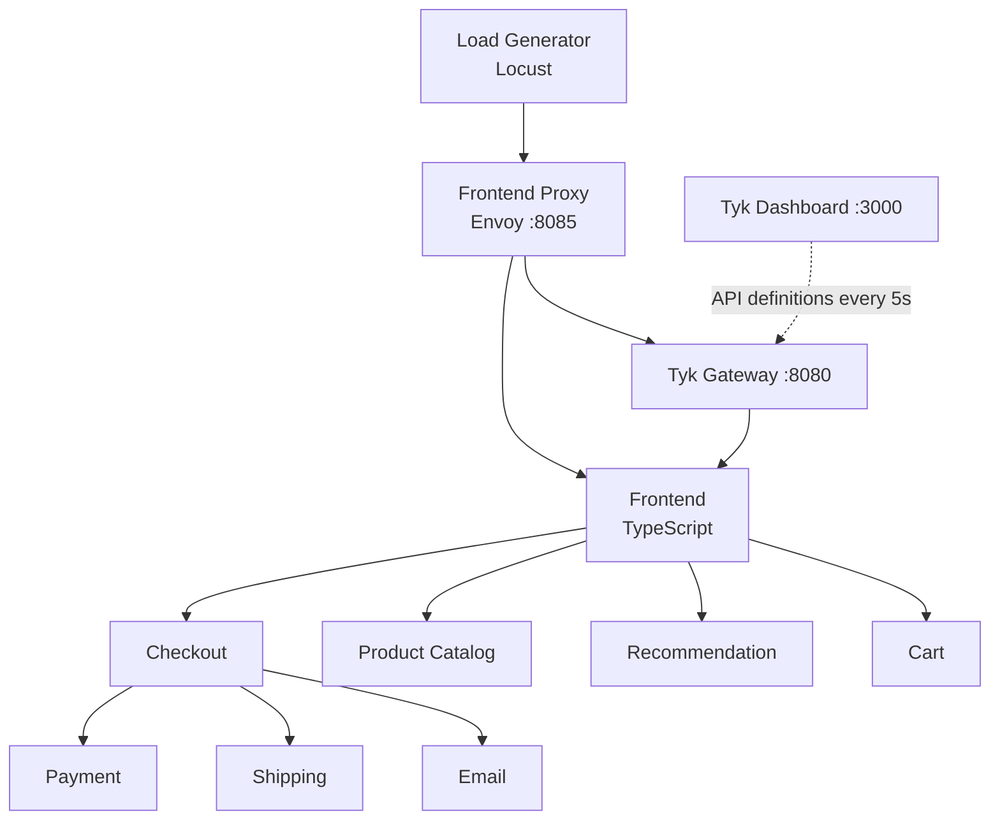
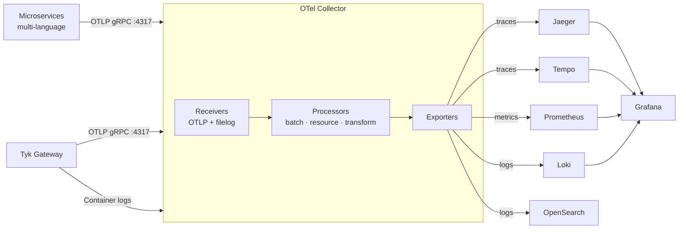

## Introduction

The [tyk-demo](https://github.com/TykTechnologies/tyk-demo) `opentelemetry-demo` deployment runs the community [OpenTelemetry Demo](https://opentelemetry.io/docs/demo/) application alongside Tyk Gateway with a complete, pre-configured observability stack. With a single command you get a working environment with realistic API traffic, structured logs, distributed traces, and metrics flowing through Grafana.

This guide covers:
- Running the full stack locally with `./up.sh opentelemetry-demo`
- Navigating the four pre-built Tyk Grafana dashboards
- Understanding the Tyk Gateway configuration that enables OTLP export
- Understanding the OTel Collector pipeline that routes telemetry to Grafana backends
- Adapting the configuration to your own Docker Compose environment

Whether you're evaluating Tyk's observability capabilities or looking for a working reference to replicate in production, this guide serves both purposes.

## Prerequisites

- [tyk-demo](https://github.com/TykTechnologies/tyk-demo) repository cloned locally
- [Docker](https://docs.docker.com/get-docker/) and [Docker Compose](https://docs.docker.com/compose/install/) installed
- At least **8 GB RAM** available — the full stack runs approximately 25 containers
- A Tyk licence (the demo uses Tyk Self-Managed)

## Quick Start

From the tyk-demo repository root, run:

```bash
./up.sh opentelemetry-demo
```

This starts the OpenTelemetry Demo microservices, OTel Collector, Prometheus, Loki, Tempo, Grafana, and registers seven APIs in Tyk Gateway. The built-in [Locust](https://locust.io/) load generator starts automatically and produces realistic API traffic to populate the dashboards.

Allow 2–3 minutes for all services to initialise. Once ready, the following endpoints are available:

| Service | URL |
|---|---|
| OpenTelemetry Demo UI | http://localhost:8085 |
| Grafana | http://localhost:8085/grafana/ |
| Load Generator UI | http://localhost:8085/loadgen/ |
| Feature Flags | http://localhost:8085/feature/ |
| Jaeger UI | http://localhost:8085/jaeger/ui |
| Tyk Dashboard | http://localhost:3000 |

<Note>
Grafana is pre-provisioned with all data sources and dashboards. No manual setup is required — navigate to **http://localhost:8085/grafana/** and open the **Tyk** folder to find the four dashboards.
</Note>

## Architecture

### Traffic Flow

The demo wires together a multi-language e-commerce application through Tyk Gateway:



The Frontend Proxy (Envoy) routes all `/api/*` traffic through Tyk Gateway, which applies rate limiting, authentication, and telemetry enrichment before forwarding to the frontend microservice. Tyk Dashboard manages API definitions centrally.

### Telemetry Data Flow

All services — both the microservices and Tyk Gateway — send telemetry to a single OpenTelemetry Collector endpoint. The Collector enriches, transforms, and fans out to multiple backends that Grafana queries:



The key architectural point is that the OTel Collector is the **single ingestion endpoint** for all telemetry. Services only need to know one address (`otel-collector:4317`). The Collector handles routing, enrichment, and fan-out — so changing a backend requires only a Collector config change, not changes to every service.

## Grafana Dashboards

## How It Works: Tyk Gateway Observability Configuration

## How It Works: OTel Collector Pipeline

## Adapting to Your Environment
