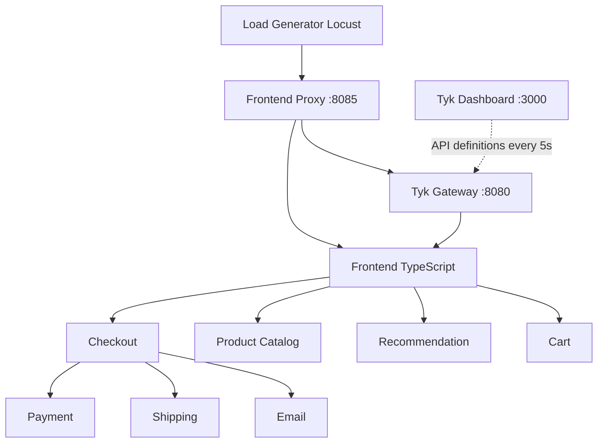
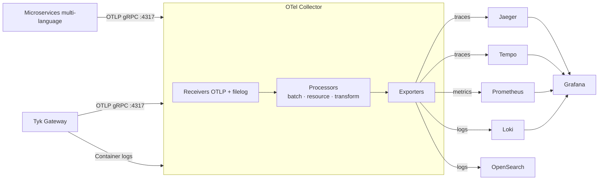

## Introduction

The [tyk-demo](https://github.com/TykTechnologies/tyk-demo) `opentelemetry-demo` deployment runs the community [OpenTelemetry Demo](https://opentelemetry.io/docs/demo/) application alongside Tyk Gateway with a complete, pre-configured observability stack. With a single command you get a working environment with realistic API traffic, structured logs, distributed traces, and metrics flowing through Grafana.

This guide covers:
- Running the full stack locally with `./up.sh opentelemetry-demo`
- Navigating the four pre-built Tyk Grafana dashboards
- Understanding the Tyk Gateway configuration that enables OTLP export
- Understanding the OTel Collector pipeline that routes telemetry to Grafana backends
- Adapting the configuration to your own Docker Compose environment

Whether you're evaluating Tyk's observability capabilities, looking for a working reference to replicate in production, or exploring how to design dashboards and alerts for critical failure scenarios — the demo's built-in feature flags let you trigger error conditions on demand to see how the observability stack responds.

## Prerequisites

- [tyk-demo](https://github.com/TykTechnologies/tyk-demo) repository cloned locally
- [Docker](https://docs.docker.com/get-docker/) and [Docker Compose](https://docs.docker.com/compose/install/) installed
- At least **8 GB RAM** available — the full stack runs approximately 25 containers
- A Tyk licence (the demo uses Tyk Self-Managed)

## Quick Start

Before running the command below, complete the initial repository setup described in the [tyk-demo README](https://github.com/TykTechnologies/tyk-demo#readme) — this includes configuring your Tyk licence and any other prerequisites.

From the tyk-demo repository root, run:

```bash
./up.sh opentelemetry-demo
```

This starts the OpenTelemetry Demo microservices, OTel Collector, Prometheus, Loki, Tempo, Grafana, and registers seven APIs in Tyk Gateway. The built-in [Locust](https://locust.io/) load generator starts automatically and produces realistic API traffic to populate the dashboards.

Allow 2–3 minutes for all services to initialise. Once ready, the following endpoints are available:

| Service | URL |
|---|---|
| OpenTelemetry Demo UI | http://localhost:8085 |
| Grafana | http://localhost:8085/grafana/ |
| Load Generator UI | http://localhost:8085/loadgen/ |
| Feature Flags | http://localhost:8085/feature/ |
| Tyk Dashboard | http://localhost:3000 |

<Note>
Grafana is pre-provisioned with all data sources and dashboards. No manual setup is required — navigate to **http://localhost:8085/grafana/** and open the **Tyk Demo** folder to find the four dashboards.
</Note>

## Architecture

### Traffic Flow

The demo wires together a multi-language e-commerce application through Tyk Gateway. For the full service architecture of the underlying OpenTelemetry Demo application, see the [OpenTelemetry Demo architecture](https://opentelemetry.io/docs/demo/architecture/).



The Frontend Proxy routes all `/api/*` traffic through Tyk Gateway, which applies rate limiting, authentication, and telemetry enrichment before forwarding to the frontend microservice. Tyk Dashboard manages API definitions centrally.

### Telemetry Data Flow

All services — both the microservices and Tyk Gateway — send telemetry to a single OpenTelemetry Collector endpoint. The Collector enriches, transforms, and fans out to multiple backends that Grafana queries:



The key architectural point is that the OTel Collector is the **single ingestion endpoint** for all telemetry. Services only need to know one address (`otel-collector:4317`). In this setup, the Collector fans out traces to both Jaeger and Tempo, and logs to both Loki and OpenSearch — demonstrating how OTel Collector's pipeline configuration lets you route signals to multiple backends without touching service code. The pre-built Grafana dashboards query Tempo for traces and Loki for logs.

## Grafana Dashboards

Open Grafana at **http://localhost:8085/grafana/** and navigate to **Dashboards → Tyk Demo** folder. Four dashboards are pre-provisioned.

### Fleet Health

**Audience:** Platform engineers and DevOps managing multiple gateway instances.

Shows the operational health of your gateway fleet: instance count and APIs loaded, a config drift gauge (whether all instances are serving the same API set), Go runtime health (heap, GC, goroutines), per-gateway request rates, and error log streams sourced from Loki. Use this dashboard to quickly confirm all gateway instances are healthy and in sync before investigating API-level issues.

### API Portfolio Overview

**Audience:** API platform leads and on-call SRE.

Provides a high-level view of the full API estate: request rate, error rate, P95 latency, and active API count as KPIs; per-API leaderboards ranked by traffic, latency, and error rate; multi-tenancy breakdown by organisation and `X-Tenant-ID` header; consumer segmentation by API key, OAuth client ID, and developer portal application; and SLO tracking with error budget and burn rate. Clicking an API bar links directly to the Troubleshooting dashboard for that API.

### API Troubleshooting

**Audience:** Backend engineers and SRE investigating a specific API.

Scoped to a single API (use the **api_id** variable at the top). Shows latency attribution split between gateway processing time and upstream response time, error breakdown by [response flag](https://tyk.io/docs/api-management/observability#response-flags) (for example `URS` = upstream 5xx, `UT` = upstream timeout), recent and error-filtered distributed traces via Grafana Tempo, and structured access log analysis with trace ID correlation. Use this dashboard to answer "where is the slowness?" and correlate logs with specific traces.

### OTLP Metrics Explorer

**Audience:** Engineers evaluating or customising Tyk's OTLP instrumentation.

A reference dashboard showing all metrics that Tyk Gateway exports out of the box: request counts, latency histograms, error tracking, and dimension-rich counters segmented by API key, OAuth client, tenant ID, custom response headers, and context variables. No application code changes are needed to get these — all dimensions are enriched by the gateway at the proxy layer.

## How It Works: Tyk Gateway Observability Configuration

Tyk Gateway exports all three telemetry signals — traces, logs, and metrics — to the OTel Collector. Each signal is enabled and configured independently.

### Traces

Enable distributed tracing and configure the OTel Collector as the export endpoint:

<Tabs>
<Tab title="Environment Variables">
```bash
TYK_GW_OPENTELEMETRY_TRACES_ENABLED=true
TYK_GW_OPENTELEMETRY_TRACES_ENDPOINT=otel-collector:4317
TYK_GW_OPENTELEMETRY_TRACES_SAMPLING_TYPE=TraceIDRatioBased
TYK_GW_OPENTELEMETRY_TRACES_SAMPLING_RATE=0.1
```
</Tab>
<Tab title="tyk.conf">
```json
{
  "opentelemetry": {
    "traces": {
      "enabled": true,
      "endpoint": "otel-collector:4317",
      "sampling": {
        "type": "TraceIDRatioBased",
        "rate": 0.1
      }
    }
  }
}
```
</Tab>
</Tabs>

`TraceIDRatioBased` with a rate of `0.1` samples 10% of traces — a reasonable default for production. To capture all traces while debugging, set the rate to `1.0` or use `AlwaysOn`. For full sampling configuration options, see the [Tyk Gateway configuration reference](/tyk-oss-gateway/configuration#opentelemetrysampling).

When tracing is enabled, Tyk generates two spans per request: a parent span covering the full request lifecycle and a child span for the upstream call. You can enable [detailed tracing](/api-management/traces#detailed-tracing) per API to also generate a span for each middleware step.

### Logs

Tyk Gateway writes structured logs to stdout/stderr. Two settings work together to make gateway logs useful in Grafana:

<Tabs>
<Tab title="Environment Variables">
```bash
TYK_GW_LOGFORMAT=json
TYK_GW_ACCESSLOGS_ENABLED=true
```
</Tab>
<Tab title="tyk.conf">
```json
{
  "log_format": "json",
  "access_logs": {
    "enabled": true
  }
}
```
</Tab>
</Tabs>

**`log_format: json`** (requires Tyk Gateway v5.6.0+): outputs all application logs as JSON objects, which the OTel Collector can parse and index without custom extraction logic.

**`access_logs.enabled: true`** (requires Tyk Gateway v5.8.0+): enables per-request access log entries including `api_id`, `api_name`, `path`, `method`, `status`, `latency_total`, `upstream_latency`, and `client_ip`. When tracing is also enabled, each access log entry includes a `trace_id` field, enabling direct correlation between an access log line and the corresponding distributed trace in Grafana Tempo.

<Note>
Gateway logs are not exported via OTLP. Instead, the OTel Collector reads them from the Docker container log path using the `filelog` receiver. See [How It Works: OTel Collector Pipeline](#how-it-works-otel-collector-pipeline) below for details.
</Note>

### Metrics

Enable OTLP metrics export and configure the push interval:

<Tabs>
<Tab title="Environment Variables">
```bash
TYK_GW_OPENTELEMETRY_METRICS_ENABLED=true
TYK_GW_OPENTELEMETRY_METRICS_ENDPOINT=otel-collector:4317
TYK_GW_OPENTELEMETRY_METRICS_EXPORTINTERVAL=5
```
</Tab>
<Tab title="tyk.conf">
```json
{
  "opentelemetry": {
    "metrics": {
      "enabled": true,
      "endpoint": "otel-collector:4317",
      "export_interval": 5
    }
  }
}
```
</Tab>
</Tabs>

`export_interval` controls how often (in seconds) the gateway pushes metrics to the collector. The default is 30 seconds; the demo uses 5 seconds for more responsive dashboard updates.

Tyk exports [default gateway metrics](/api-management/metrics/default-metrics) (request rate, latency, error rate, Go runtime) automatically. You can add custom counters and histograms that attach API gateway context — request headers, response headers, session data, JWT claims — as metric dimensions. The demo configures 19 such instruments via `TYK_GW_OPENTELEMETRY_METRICS_APIMETRICS`. Here is one example:

```json
{
  "name": "tyk.requests.by.tenant",
  "type": "counter",
  "description": "Request count per tenant from X-Tenant-ID request header",
  "dimensions": [
    {"source": "header", "key": "X-Tenant-ID", "label": "tenant_id", "default": "unknown"},
    {"source": "metadata", "key": "api_id", "label": "api_id"},
    {"source": "metadata", "key": "response_code", "label": "response_code"}
  ]
}
```

This creates a counter with three dimensions — tenant ID (extracted from the `X-Tenant-ID` request header), API ID, and HTTP status code — with no changes to upstream application code. For the full list of available dimension sources and the complete demo metric set, see [Custom Metrics](/api-management/metrics/custom-metrics).

## How It Works: OTel Collector Pipeline

The OTel Collector acts as the central telemetry hub. Its configuration (`otelcol-config.yml`) defines what data it receives, how it processes it, and where it sends it.

### Receivers

Two receivers handle Tyk's telemetry:

**OTLP receiver** — accepts traces and metrics pushed directly from Tyk Gateway:

```yaml
receivers:
  otlp:
    protocols:
      grpc:
        endpoint: 0.0.0.0:4317
      http:
        endpoint: 0.0.0.0:4318
```

**Filelog receiver** — tails Tyk Gateway container logs from the Docker log path:

```yaml
  filelog/tyk-gateway:
    include: ["/hostfs/var/lib/docker/containers/*/*-json.log"]
    include_file_name: false
    include_file_path: true
    start_at: end
    operators:
      # Parse Docker JSON wrapper and extract container metadata
      - type: container
        format: docker
        add_metadata_from_filepath: true
      # Keep only tyk-gateway container logs
      - type: filter
        expr: 'attributes.attrs == nil or attributes.attrs.tag == nil or attributes.attrs.tag != "tyk-gateway"'
      # Parse the inner Tyk JSON log payload; extract timestamp and severity
      - type: json_parser
        parse_from: body
        parse_to: attributes.tyk
        timestamp:
          parse_from: attributes.tyk.time
          layout: '%Y-%m-%dT%H:%M:%SZ'
        severity:
          parse_from: attributes.tyk.level
        on_error: send_quiet
```

The receiver mounts the Docker socket path (`/hostfs/var/lib/docker/containers`) so the Collector can read log files from the host. The filter step ensures only `tyk-gateway` container logs are processed. The JSON parser extracts the inner Tyk log payload (timestamp, severity, fields) from the Docker JSON wrapper.

<Note>
This filelog configuration is specific to Docker. For Kubernetes, the log path and parser differ — see [Collecting Gateway Logs with OTel on Kubernetes](/api-management/collecting-gateway-logs-otel-kubernetes).
</Note>

### Processors

A Tyk-specific processor promotes gateway resource attributes into metric datapoint labels, making them available as Grafana variables:

```yaml
processors:
  transform/tyk_gw_resource_attrs:
    error_mode: ignore
    metric_statements:
      - context: datapoint
        statements:
          - set(attributes["tyk_gw_id"], resource.attributes["tyk.gw.id"]) where resource.attributes["tyk.gw.id"] != nil
          - set(attributes["tyk_gw_group_id"], resource.attributes["tyk.gw.group.id"]) where resource.attributes["tyk.gw.group.id"] != nil
          - set(attributes["tyk_gw_tags"], resource.attributes["tyk.gw.tags"]) where resource.attributes["tyk.gw.tags"] != nil
          - set(attributes["tyk_gw_dataplane"], resource.attributes["tyk.gw.dataplane"]) where resource.attributes["tyk.gw.dataplane"] != nil
```

Tyk Gateway sets [resource attributes](/api-management/opentelemetry#resource-attributes) (`tyk.gw.id`, `tyk.gw.group.id`, `tyk.gw.tags`, `tyk.gw.dataplane`) once at startup. This processor copies them into every metric datapoint's attribute set so you can filter or group by gateway instance in Grafana dashboards.

### Export Pipelines

Three pipelines route telemetry to the appropriate backends:

```yaml
service:
  pipelines:
    traces:
      receivers: [otlp]
      processors: [resourcedetection, memory_limiter, transform, batch]
      exporters: [otlp, otlp/tempo]         # → Jaeger + Tempo

    metrics:
      receivers: [otlp, spanmetrics, hostmetrics, nginx, postgresql, redis, httpcheck/frontend-proxy]
      processors: [resourcedetection, memory_limiter, transform/tyk_gw_resource_attrs, batch]
      exporters: [otlphttp/prometheus]       # → Prometheus

    logs:
      receivers: [otlp, filelog/tyk-gateway]
      processors: [resourcedetection, memory_limiter, batch]
      exporters: [opensearch, otlphttp/loki] # → OpenSearch + Loki
```

The metrics pipeline includes a `spanmetrics` connector — this automatically derives RED metrics (rate, errors, duration) from traces, producing latency histograms and request counts without separate instrumentation.

## Adapting to Your Environment

To replicate this observability stack in your own Docker Compose deployment, you need three changes: Tyk Gateway environment variables, an OTel Collector service and configuration, and Grafana dashboard provisioning.

### 1. Tyk Gateway Service

Add these environment variables to your `tyk-gateway` service in `docker-compose.yml`:

```yaml
services:
  tyk-gateway:
    environment:
      # Log format and access logs
      - TYK_GW_LOGFORMAT=json
      - TYK_GW_ACCESSLOGS_ENABLED=true
      # Distributed tracing
      - TYK_GW_OPENTELEMETRY_TRACES_ENABLED=true
      - TYK_GW_OPENTELEMETRY_TRACES_ENDPOINT=otel-collector:4317
      - TYK_GW_OPENTELEMETRY_TRACES_SAMPLING_TYPE=TraceIDRatioBased
      - TYK_GW_OPENTELEMETRY_TRACES_SAMPLING_RATE=0.1
      # Metrics
      - TYK_GW_OPENTELEMETRY_METRICS_ENABLED=true
      - TYK_GW_OPENTELEMETRY_METRICS_ENDPOINT=otel-collector:4317
      - TYK_GW_OPENTELEMETRY_METRICS_EXPORTINTERVAL=30
```

`TYK_GW_LOGFORMAT` requires Tyk Gateway v5.6.0+. `TYK_GW_ACCESSLOGS_ENABLED` requires Tyk Gateway v5.8.0+.

### 2. OTel Collector Service and Configuration

Add an `otel-collector` service to your `docker-compose.yml`:

```yaml
services:
  otel-collector:
    image: ghcr.io/open-telemetry/opentelemetry-collector-releases/opentelemetry-collector-contrib:0.133.0
    volumes:
      - ./otelcol-config.yml:/etc/otelcol-contrib/config.yaml
      - /var/lib/docker/containers:/hostfs/var/lib/docker/containers:ro
      - /var/run/docker.sock:/var/run/docker.sock:ro
    ports:
      - "4317:4317"   # OTLP gRPC
      - "4318:4318"   # OTLP HTTP
    networks:
      - tyk
```

The volume mounts give the Collector read access to Docker container logs so the `filelog` receiver can tail gateway logs.

Create `otelcol-config.yml` alongside your `docker-compose.yml`:

```yaml
receivers:
  otlp:
    protocols:
      grpc:
        endpoint: 0.0.0.0:4317
      http:
        endpoint: 0.0.0.0:4318

  filelog/tyk-gateway:
    include: ["/hostfs/var/lib/docker/containers/*/*-json.log"]
    include_file_name: false
    include_file_path: true
    start_at: end
    operators:
      - type: container
        format: docker
        add_metadata_from_filepath: true
      - type: filter
        expr: 'attributes.attrs == nil or attributes.attrs.tag == nil or attributes.attrs.tag != "tyk-gateway"'
      - type: json_parser
        parse_from: body
        parse_to: attributes.tyk
        timestamp:
          parse_from: attributes.tyk.time
          layout: '%Y-%m-%dT%H:%M:%SZ'
        severity:
          parse_from: attributes.tyk.level
        on_error: send_quiet

processors:
  batch:
  memory_limiter:
    check_interval: 1s
    limit_percentage: 75
    spike_limit_percentage: 20
  resourcedetection:
    detectors: [env, docker, system]
  transform/tyk_gw_resource_attrs:
    error_mode: ignore
    metric_statements:
      - context: datapoint
        statements:
          - set(attributes["tyk_gw_id"], resource.attributes["tyk.gw.id"]) where resource.attributes["tyk.gw.id"] != nil
          - set(attributes["tyk_gw_group_id"], resource.attributes["tyk.gw.group.id"]) where resource.attributes["tyk.gw.group.id"] != nil
          - set(attributes["tyk_gw_tags"], resource.attributes["tyk.gw.tags"]) where resource.attributes["tyk.gw.tags"] != nil
          - set(attributes["tyk_gw_dataplane"], resource.attributes["tyk.gw.dataplane"]) where resource.attributes["tyk.gw.dataplane"] != nil

exporters:
  otlphttp/prometheus:
    endpoint: "http://prometheus:9090/api/v1/otlp"
    tls:
      insecure: true
  otlphttp/loki:
    endpoint: "http://loki:3100/otlp"
    tls:
      insecure: true
  otlp/tempo:
    endpoint: "tempo:4317"
    tls:
      insecure: true

service:
  pipelines:
    traces:
      receivers: [otlp]
      processors: [resourcedetection, memory_limiter, batch]
      exporters: [otlp/tempo]

    metrics:
      receivers: [otlp]
      processors: [resourcedetection, memory_limiter, transform/tyk_gw_resource_attrs, batch]
      exporters: [otlphttp/prometheus]

    logs:
      receivers: [otlp, filelog/tyk-gateway]
      processors: [resourcedetection, memory_limiter, batch]
      exporters: [otlphttp/loki]
```

This is a minimal configuration covering Tyk's signals only. The [full tyk-demo configuration](https://github.com/TykTechnologies/tyk-demo/blob/opentelemetry-demo/deployments/opentelemetry-demo/src/otel-collector/otelcol-config.yml) adds host metrics, infrastructure receivers (PostgreSQL, Redis, nginx), and additional exporters.

Update the exporter endpoints to match your own Prometheus, Loki, and Tempo service names or addresses.

### 3. Grafana Dashboards

The four Tyk dashboards are available as JSON provisioning files in the tyk-demo repository at:

```text
deployments/opentelemetry-demo/src/grafana/provisioning/dashboards/tyk-demo/
├── tyk-gateway-fleet-health.json
├── tyk-api-portfolio.json
├── tyk-api-troubleshooting.json
└── tyk-gateway-otlp-metrics.json
```

To use them in an existing Grafana instance:

1. Copy the JSON files into your Grafana dashboard provisioning directory (typically mapped via `grafana/provisioning/dashboards/`)
2. Ensure Prometheus, Loki, and Tempo datasources are configured in Grafana
3. Open each dashboard JSON and update the `datasource.uid` values to match your datasource UIDs (find these in Grafana under **Connections → Data sources**)

<Tip>
The dashboards use [Grafana variables](https://grafana.com/docs/grafana/latest/dashboards/variables/) for datasource selection, so you can also configure them at import time rather than editing JSON files.
</Tip>
