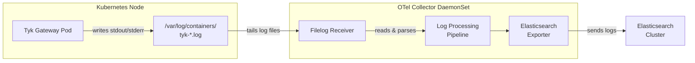

## Introduction

Collecting and centralizing logs from your Tyk Gateway is essential for maintaining visibility into API traffic, debugging issues, and meeting compliance requirements. In Kubernetes environments, where pods are ephemeral and logs can disappear when containers restart, having a reliable log collection pipeline is critical.

The [OpenTelemetry Collector](https://opentelemetry.io/docs/collector/) provides a vendor-neutral, standardized way to collect, process, and export telemetry data, including logs. By using its [Filelog Receiver](https://github.com/open-telemetry/opentelemetry-collector-contrib/tree/main/receiver/filelogreceiver), you can tail Tyk Gateway log files directly from the node filesystem and ship them to any supported backend such as Elasticsearch, Loki, or Splunk.

<Note>
While Tyk Gateway natively supports [OpenTelemetry for distributed tracing](/api-management/logs-metrics#opentelemetry) since v5.2, native OTel log emission is on our roadmap. This guide shows how to use the OTel Collector to collect Tyk's existing file-based logs, bridging the gap until native support is available.
</Note>

This guide walks you through deploying the OpenTelemetry Collector alongside your Tyk Gateway on Kubernetes and configuring it to collect Tyk logs and forward them to Elasticsearch. The architecture looks like this:



### Log Collection Patterns in Kubernetes

There are three common approaches for collecting container logs in Kubernetes:

| Pattern | How it works | Best for |
| :------ | :----------- | :------- |
| **DaemonSet** | A collector pod runs on every node and tails container log files from the node filesystem (`/var/log/containers/`). | Most Kubernetes deployments. Efficient, low overhead, and does not modify application pods. |
| **Sidecar** | A collector container runs alongside the application container in the same pod, sharing a volume for log files. | Applications that write logs to files (not stdout) or when you need per-pod log processing. |
| **Log Forwarder** | The application sends logs directly to a remote collector or aggregator endpoint over the network. | When you want to avoid filesystem dependencies, or when using managed logging services. |

This guide uses the **DaemonSet pattern**, which is the recommended approach for most Kubernetes deployments. The OTel Collector runs as a DaemonSet, reading container log files that the kubelet writes to the node's filesystem.

## Prerequisites

Before you begin, ensure you have the following:

- A **Kubernetes cluster** (v1.23+) with `kubectl` configured
- **Helm** v3 installed
- An **Elasticsearch cluster** accessible from your Kubernetes cluster (v7.x or v8.x)
- Basic familiarity with Kubernetes, Helm, and YAML configuration

## Overview of Steps

1. **Install Tyk Stack on Kubernetes** — Deploy Tyk Gateway using the official Tyk Helm charts.
2. **Deploy OpenTelemetry Collector with Filelog Receiver** — Install the OTel Collector as a DaemonSet using the OpenTelemetry Helm chart.
3. **Configure Filelog Receiver to Tail Tyk Gateway Logs** — Set up the receiver to target Tyk Gateway container logs and parse them.
4. **Set Up Exporter to Send Logs to Elasticsearch** — Configure the Elasticsearch exporter to forward processed logs.
5. **Validate Log Collection and Troubleshooting Tips** — Verify logs are flowing end-to-end and resolve common issues.

## Step 1: Install Tyk Stack on Kubernetes

If you already have a Tyk Gateway running on Kubernetes, you can skip this step.

Add the Tyk Helm chart repository and install the Tyk Stack:

```bash
# Add Tyk Helm repo
helm repo add tyk-helm https://helm.tyk.io/public/helm/charts/
helm repo update

# Create namespace for Tyk
kubectl create namespace tyk

# Install Tyk Stack (Gateway + Dashboard + Pump)
helm install tyk-stack tyk-helm/tyk-stack -n tyk \
  --set global.secrets.APISecret=your-api-secret \
  --set global.secrets.AdminSecret=your-admin-secret \
  --set global.redis.addrs="{redis.tyk.svc:6379}" \
  --set global.mongo.mongoURL="mongodb://mongo.tyk.svc:27017/tyk_analytics"
```

<Note>
For a complete list of configuration options, refer to the [Tyk Helm Charts documentation](/product-stack/tyk-charts/overview). Adjust the Redis and MongoDB connection strings to match your environment.
</Note>

To enable JSON-formatted logs (recommended for structured log parsing), set the `TYK_LOGFORMAT` environment variable on the Tyk Gateway deployment:

```bash
kubectl set env deployment/gateway-tyk-stack -n tyk TYK_LOGFORMAT=json
```

The JSON format produces logs like:

```json
{"level":"info","msg":"Tyk API Gateway v5.6.0","prefix":"main","time":"2024-09-05T09:01:23Z"}
```

This structured format simplifies parsing in the OTel Collector pipeline, compared to the default format.

Verify that the Gateway pods are running:

```bash
kubectl get pods -n tyk -l app=gateway-tyk-stack
```

## Step 2: Deploy OpenTelemetry Collector as a DaemonSet

Install the OpenTelemetry Collector using the official Helm chart. The DaemonSet mode ensures a collector instance runs on every node to tail local log files.

```bash
# Add the OpenTelemetry Helm repo
helm repo add open-telemetry https://open-telemetry.github.io/opentelemetry-helm-charts
helm repo update
```

Create a values file `otel-collector-values.yaml` for the Helm chart. This is the core configuration that ties everything together:

```yaml
mode: daemonset

presets:
  logsCollection:
    enabled: true

config:
  receivers:
    filelog:
      include:
        - /var/log/containers/gateway-tyk-*_tyk_*.log
      exclude:
        - /var/log/containers/otel-*.log
      start_at: beginning
      include_file_path: true
      include_file_name: false
      operators:
        # Parse the CRI container log format
        - type: container
          id: container-parser

        # Parse JSON-formatted Tyk Gateway log body
        - type: json_parser
          id: tyk-json-parser
          if: body != nil and body != ""
          parse_from: body
          timestamp:
            parse_from: attributes.time
            layout: "%Y-%m-%dT%H:%M:%SZ"
            layout_type: gotime
          severity:
            parse_from: attributes.level
            mapping:
              debug: debug
              info: info
              warn: warn
              error: error
              fatal: fatal
              panic: panic

  processors:
    batch:
      timeout: 5s
      send_batch_size: 1024

    resource:
      attributes:
        - key: service.name
          value: tyk-gateway
          action: upsert
        - key: k8s.namespace.name
          value: tyk
          action: upsert

    attributes:
      actions:
        - key: prefix
          from_attribute: prefix
          action: upsert
        - key: log.level
          from_attribute: level
          action: upsert

  exporters:
    elasticsearch:
      endpoints:
        - "https://elasticsearch.elastic.svc:9200"
      logs_index: tyk-gateway-logs
      auth:
        authenticator: basicauth
      tls:
        insecure_skip_verify: false

  extensions:
    basicauth:
      client_auth:
        username: "${env:ES_USERNAME}"
        password: "${env:ES_PASSWORD}"

  service:
    extensions:
      - basicauth
    pipelines:
      logs:
        receivers:
          - filelog
        processors:
          - batch
          - resource
          - attributes
        exporters:
          - elasticsearch
```

<Note>
The `include` glob pattern `/var/log/containers/gateway-tyk-*_tyk_*.log` targets Tyk Gateway container logs specifically. Kubernetes container log filenames follow the pattern `<pod-name>_<namespace>_<container-name>-<container-id>.log`. Adjust this pattern if your Tyk Gateway pods use a different naming convention.
</Note>

Install the OTel Collector with the values file:

```bash
helm install otel-collector open-telemetry/opentelemetry-collector \
  -n tyk \
  -f otel-collector-values.yaml \
  --set extraEnvs[0].name=ES_USERNAME \
  --set extraEnvs[0].value=elastic \
  --set extraEnvs[1].name=ES_PASSWORD \
  --set extraEnvs[1].value=your-elasticsearch-password
```

## Step 3: Configure Filelog Receiver to Tail Tyk Gateway Logs

The Filelog Receiver configuration in the values file above handles three key tasks:

### Targeting Tyk Gateway Logs

The `include` pattern ensures only Tyk Gateway container logs are collected:

```yaml
include:
  - /var/log/containers/gateway-tyk-*_tyk_*.log
```

In Kubernetes, the container runtime (containerd or CRI-O) writes container stdout/stderr to log files on the node. The kubelet manages these files at `/var/log/containers/`, with filenames that encode the pod name, namespace, and container name.

### Parsing the Container Log Format

The `container` operator strips the CRI log wrapper (timestamp, stream identifier, and log flags) and extracts the raw log message:

```yaml
operators:
  - type: container
    id: container-parser
```

### Parsing Tyk JSON Logs

The `json_parser` operator parses the structured JSON log body emitted by Tyk Gateway when `TYK_LOGFORMAT=json` is set:

```yaml
operators:
  - type: json_parser
    id: tyk-json-parser
    if: body != nil and body != ""
    parse_from: body
    timestamp:
      parse_from: attributes.time
      layout: "%Y-%m-%dT%H:%M:%SZ"
      layout_type: gotime
    severity:
      parse_from: attributes.level
```

This extracts the timestamp and severity level from the JSON fields, making them available as first-class OpenTelemetry log record fields. The `msg` and `prefix` fields are preserved as log attributes for filtering and searching in your backend.

### Handling Default (Non-JSON) Log Format

If you are using the default log format instead of JSON, replace the `json_parser` operator with a regex parser:

```yaml
operators:
  - type: container
    id: container-parser

  - type: regex_parser
    id: tyk-default-parser
    if: body != nil and body != ""
    regex: 'time="(?P<time>[^"]+)" level=(?P<level>\w+) msg="(?P<msg>[^"]*)"(?:\s+prefix=(?P<prefix>\w+))?'
    timestamp:
      parse_from: attributes.time
      layout: "%b %d %H:%M:%S"
      layout_type: gotime
    severity:
      parse_from: attributes.level
```

## Step 4: Set Up Exporter to Send Logs to Elasticsearch

The Elasticsearch exporter in the configuration above sends parsed logs to your Elasticsearch cluster. Here's what each setting does:

```yaml
exporters:
  elasticsearch:
    endpoints:
      - "https://elasticsearch.elastic.svc:9200"
    logs_index: tyk-gateway-logs
    auth:
      authenticator: basicauth
    tls:
      insecure_skip_verify: false
```

- **`endpoints`**: The Elasticsearch cluster URL. Update this to match your deployment.
- **`logs_index`**: The index name where Tyk Gateway logs will be stored. You can use [dynamic index names](https://github.com/open-telemetry/opentelemetry-collector-contrib/tree/main/exporter/elasticsearchexporter#configuration) with date patterns (e.g., `tyk-gateway-logs-%{+yyyy.MM.dd}`) for time-based index rotation.
- **`auth`**: Uses the `basicauth` extension for credentials. Credentials are injected via environment variables to avoid hardcoding secrets.
- **`tls`**: Set `insecure_skip_verify: true` only for development environments with self-signed certificates.

### Alternative Backends

You can replace the Elasticsearch exporter with any [OTel Collector exporter](https://github.com/open-telemetry/opentelemetry-collector-contrib/tree/main/exporter). For example:

**Loki:**

```yaml
exporters:
  loki:
    endpoint: "http://loki.monitoring.svc:3100/loki/api/v1/push"
```

**Splunk HEC:**

```yaml
exporters:
  splunk_hec:
    token: "${env:SPLUNK_HEC_TOKEN}"
    endpoint: "https://splunk-hec.example.com:8088"
    source: "tyk-gateway"
    index: "tyk-logs"
```

## Step 5: Validate Log Collection and Troubleshooting Tips

### Verify the OTel Collector is Running

```bash
kubectl get pods -n tyk -l app.kubernetes.io/name=opentelemetry-collector
```

All pods should show `Running` status with `1/1` containers ready.

### Check Collector Logs for Errors

```bash
kubectl logs -n tyk -l app.kubernetes.io/name=opentelemetry-collector --tail=50
```

Look for messages confirming that the Filelog Receiver has started tailing files. You should see entries like:

```
Started watching file  {"kind": "receiver", "name": "filelog", "path": "/var/log/containers/gateway-tyk-..."}
```

### Query Elasticsearch for Tyk Logs

```bash
curl -u elastic:your-password -X GET \
  "https://elasticsearch.example.com:9200/tyk-gateway-logs/_search?pretty&size=5" \
  -H 'Content-Type: application/json' \
  -d '{"query": {"match_all": {}}}'
```

You should see log documents with parsed fields including `level`, `msg`, `prefix`, and `time`.

### Common Issues and Fixes

| Issue | Cause | Fix |
| :---- | :---- | :-- |
| No logs appearing in Elasticsearch | OTel Collector cannot read node log files | Verify the DaemonSet has the correct volume mounts for `/var/log`. The Helm chart's `logsCollection` preset handles this automatically. |
| Logs appear but are unparsed (raw strings) | `TYK_LOGFORMAT` not set to `json`, or parser misconfigured | Check the Gateway env vars with `kubectl exec`. Verify the `json_parser` operator config matches the log format. |
| Authentication errors to Elasticsearch | Incorrect credentials or TLS misconfiguration | Verify `ES_USERNAME` and `ES_PASSWORD` env vars. Check TLS settings match your Elasticsearch cluster configuration. |
| Duplicate logs after collector restart | Filelog Receiver lost its checkpoint | The receiver stores file offsets in a checkpoint file. Ensure the DaemonSet has a persistent `hostPath` volume for `/var/lib/otelcol/file_storage`. |
| High memory usage on collector pods | Too many files being tailed or large batch sizes | Narrow the `include` glob pattern. Reduce `send_batch_size`. Add `max_concurrent_files` to the Filelog Receiver config. |

### Enable Debug Logging on the Collector

If you need to troubleshoot the collector pipeline itself, enable debug logging:

```yaml
service:
  telemetry:
    logs:
      level: debug
```

<Note>
Debug logging on the collector generates a high volume of output. Use it only for troubleshooting and disable it once the issue is resolved.
</Note>

## Next Steps

- Combine log collection with Tyk's native [OpenTelemetry distributed tracing](/api-management/logs-metrics#opentelemetry) for full observability coverage.
- Explore the [OpenTelemetry Collector Contrib](https://github.com/open-telemetry/opentelemetry-collector-contrib) repository for additional processors such as the `transform` processor for log enrichment, or the `filter` processor for dropping unwanted log entries.
- Refer to the [Tyk Helm Charts documentation](/product-stack/tyk-charts/overview) for advanced Kubernetes deployment options.
- Consider setting up [Tyk Pump](/api-management/tyk-pump) alongside OTel log collection for a complete API analytics and logging solution.
