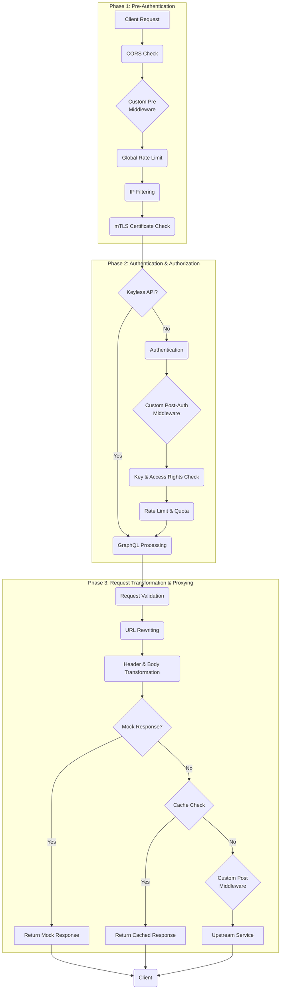

# API Request Lifecycle in Tyk Gateway

When an API request hits the Tyk Gateway, it passes through a sequence of middleware before being proxied to your upstream service. Understanding this lifecycle is key to configuring your APIs effectively and troubleshooting unexpected behavior.

The request lifecycle is divided into three main phases:

1.  **Phase 1: Pre-Authentication**: Initial validation and rules that don't require knowing the caller's identity.
2.  **Phase 2: Authentication & Authorization**: Identifying the caller and checking their permissions.
3.  **Phase 3: Request Transformation & Proxying**: Modifying the request and applying final rules before sending it to the upstream service.

## Visualizing the Lifecycle

The following diagram shows the flow of a request through these three phases and the key middleware involved at each stage.

## Common User-Configurable Middleware

While the Tyk Gateway has many built-in middleware, here are some of the most commonly configured by API owners:

### Phase 1: Pre-Authentication

*   **CORS Middleware**: Manages Cross-Origin Resource Sharing to allow or deny requests from different domains.
*   **Global Rate Limiting**: Protects your API from being overwhelmed by traffic, applied to all users.
*   **IP Filtering**: Whitelist or blacklist IP addresses to control access.
*   **Mutual TLS (mTLS)**: Enforces client certificate validation for enhanced security.

### Phase 2: Authentication & Authorization

*   **Authentication**: Secure your API with a variety of methods, including:
    *   Standard Tyk API Keys
    *   OAuth 2.0
    *   JSON Web Tokens (JWT)
    *   OpenID Connect (OIDC)
    *   Basic Authentication
*   **Access Rights Check**: Control which APIs and versions a specific key can access.
*   **Rate Limiting & Quotas**: Enforce usage limits per key to prevent abuse and manage capacity.

### Phase 3: Request Transformation & Proxying

*   **GraphQL Middleware**: Process, secure, and manage GraphQL queries.
*   **Request Validation**: Validate incoming requests against a JSON or OpenAPI (OAS) schema to ensure data integrity.
*   **URL Rewriting**: Modify the request path before it reaches your upstream service.
*   **Header & Body Transformation**: Add, remove, or modify headers and transform the request body.
*   **Mock Responses**: Return a mock response directly from the gateway without hitting your upstream, useful for testing and development.
*   **Caching**: Cache responses to improve performance and reduce load on your upstream service.

For a more detailed, technical breakdown of the entire middleware chain and for information on building custom plugins, see the [Plugin Developer Guide](./plugins/plugin-developer-guide).
