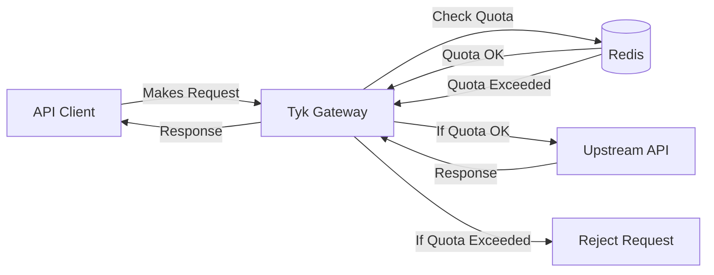
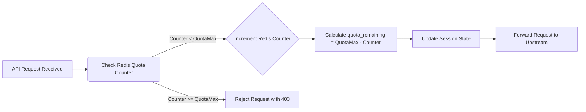

## Introduction

Request Quotas in Tyk Gateway allow you to set a maximum number of API requests for a specific API key or Policy over longer, defined periods (e.g., day, week, month). This feature is distinct from rate limiting (which controls requests per second), and it is essential for managing API consumption, enforcing service tiers, and protecting your backend services from sustained overuse over time.



### Key Benefits

*   **Enforce Usage Limits:** Cap the total number of requests allowed over extended periods (days, weeks, months) per consumer.
*   **Implement Tiered Access:** Easily define different usage allowances for various subscription plans (e.g., Free, Basic, Pro).
*   **Protect Backend Services:** Prevent individual consumers from overwhelming upstream services with consistently high volume over long durations.
*   **Enable Usage-Based Monetization:** Provide a clear mechanism for charging based on consumption tiers.

---
## Quick Start 

### Overview

In this tutorial, we will configure Request Quotas on a Tyk Security Policy to limit the number of requests an API key can make over a defined period. Unlike rate limits (requests per second), quotas control overall volume. We'll set a low quota limit with a short renewal period for easy testing, associate a key with the policy, observe blocked requests once the quota is exhausted, and verify that the quota resets after the period elapses. This guide primarily uses the Tyk Dashboard for configuration.

### Prerequisites

-   **Working Tyk Environment:** You need access to a running Tyk instance that includes both the Tyk Gateway and Tyk Dashboard components. For setup instructions using Docker, please refer to the [Tyk Quick Start](https://github.com/TykTechnologies/tyk-pro-docker-demo?tab=readme-ov-file#quick-start).
-   **Curl, Seq and Sleep**: These tools will be used for testing.

### Instructions

#### Create an API

1.  **Create an API:**
    1. Log in to your Tyk Dashboard.
    2. Navigate to **API Management > APIs**
    3. Click **Add New API**
    4. Click **Import**
    5. Select **Import Type** as **Tyk API**
    6. Copy the below Tyk OAS definition in the text box and click **Import API** to create an API.

        

    <Expandable title={'Click to expand API Definition'}>
    ```json
            {
              "components": {
                "securitySchemes": {
                  "authToken": {
                    "in": "header",
                    "name": "Authorization",
                    "type": "apiKey"
                  }
                }
              },
              "info": {
                "title": "Request Quota Test",
                "version": "1.0.0"
              },
              "openapi": "3.0.3",
              "paths": {},
              "security": [
                {
                  "authToken": []
                }
              ],
              "servers": [
                {
                  "url": "http://tyk-gateway.localhost:8080/request-quota-test/"
                }
              ],
              "x-tyk-api-gateway": {
                "info": {
                  "name": "Request Quota Test",
                  "state": {
                    "active": true
                  }
                },
                "middleware": {
                  "global": {
                    "contextVariables": {
                      "enabled": true
                    },
                    "trafficLogs": {
                      "enabled": true
                    }
                  }
                },
                "server": {
                  "authentication": {
                    "enabled": true,
                    "securitySchemes": {
                      "authToken": {
                        "enabled": true
                      }
                    }
                  },
                  "listenPath": {
                    "strip": true,
                    "value": "/request-quota-test/"
                  }
                },
                "upstream": {
                  "url": "http://httpbin.org/"
                }
              }
            }
            ```
    </Expandable>


<h4 id="policy-setup">Configure Policy and Quota</h4>
2.  **Create and Configure a Security Policy with a Request Quota:**

    

    <Expandable title={'Click to expand to see detailed steps to configure a Request Quota in the Tyk Dashboard UI'}>
    1. Navigate to **API Security > Policies** in the Tyk Dashboard sidebar.
        2. Click the **Add Policy** button.
        3. Under the **1. Access Rights** tab, in the **Add API Access Rule** section, select the `Request Quota Test` API.
        4. Scroll down to the **Global Limits and Quota** section (still under the **1. Access Rights** tab):
            * **Important:** Disable **Rate Limiting** by selecting **Disable rate limiting** option, so it doesn't interfere with testing the quota.
            * Set the following values for `Usage Quotas`:
              * Uncheck the `Unlimited requests` checkbox
              * Enter `10` into the **Max Requests per period** field. (This is our low quota limit for testing).
              * Select `1 hour` from the **Quota resets every:** dropdown. (In the next step, we will modify it to 60 seconds via API for quick testing, as 1 hour is a very long period. From the dashboard, we can only select pre-configured options.)
        5. Select the **2. Configuration** tab.
        6. In the **Policy Name** field, enter `Request Quota Policy`.
        7. From the **Key expire after** dropdown, select `1 hour`.
        8. Click the **Create Policy** button.
    </Expandable>


    

4.  **Update Quota Reset Period via API:**

    As the Dashboard UI doesn't allow setting a shorter duration, we will set the Quota reset period to a value of 1 minute for testing purposes. The following commands search for the policy, modify its `quota_renewal_rate` to 60 seconds, and update the API.

    **Note:** Obtain your Dashboard API key by clicking on the User profile at the top right corner, then click on `Edit Profile`, and select the key available under `Tyk Dashboard API Access Credentials`. Now in the below command replace `<your-api-key>` with the API key you obtained from the Dashboard UI.

    ```
    curl -s --location 'http://localhost:3000/api/portal/policies/search?q=Request%20Quota%20Policy' \
    -H "Authorization: <your-api-key>" \
    -H "Accept: application/json" > policy.json

    jq '.Data[0] | .quota_renewal_rate = 60' policy.json > updated_policy.json
    jq -r '.Data[0]._id' policy.json > policy_id.txt

    curl --location "http://localhost:3000/api/portal/policies/$(cat policy_id.txt)" \
    -H "Authorization: <your-api-key>" \
    -H "Content-Type: application/json" \
    -H "Accept: application/json" \
    -X PUT \
    -d @updated_policy.json
    ```

3.  **Associate an Access Key with the Policy:**

    

    <Expandable title={'Click to expand to see detailed steps to Associate an Access Key with the Policy in the Tyk Dashboard UI'}>
    1. Navigate to **API Security > Keys** in the Tyk Dashboard sidebar.
        2. Click the **Add Key** button.
        3. Under the **1. Access Rights** tab:
            * In the **Apply Policy** section, select the `Request Quota Policy`.
        4. Select the **2. Configuration** tab.
        5. In the **Alias** field, enter `Request Quota Key`. This provides a human-readable identifier.
        6. From the **Expires** dropdown, select `1 hour`.
        7. Click the **Create Key** button.
        8. A pop-up window **"Key created successfully"** will appear displaying the key details. **Copy the Key ID** value shown and save it securely. You will need this key to make API requests in the following steps.
        9. Click **OK** to close the pop-up.
    </Expandable>


#### Testing

4.  **Test Quota Exhaustion:**

    We've set a quota of 10 requests per 60 seconds. Let's send more than 10 requests within that window to observe the quota being enforced.

    1. Open your terminal.
    2. Execute the following command, replacing `<replace-with-key-id>` with the API Key ID you saved earlier. This command attempts to send 15 requests sequentially.

    ```bash
    for i in $(seq 1 15); do \
        echo -n "Request $i: "; \
        curl -s -o /dev/null -w "%{http_code}\n" -H "Authorization: <replace-with-key-id>" http://tyk-gateway.localhost:8080/request-quota-test/get; \
        sleep 0.1; \
    done
    ```
        
    *(Note: The `sleep 0.1` adds a tiny delay, but ensure all 15 requests execute well within the 60-second quota window).*

    3.  **Expected Observation:** You should see the first 10 requests succeed, returning an HTTP status code `200`. After the 10th request, the subsequent requests (11 through 15) should be blocked by the quota limit, returning an HTTP status code `403` (Forbidden).

    **Sample Output:**

    ```bash
    Request 1: 200
    Request 2: 200
    Request 3: 200
    Request 4: 200
    Request 5: 200
    Request 6: 200
    Request 7: 200
    Request 8: 200
    Request 9: 200
    Request 10: 200
    Request 11: 403
    Request 12: 403
    Request 13: 403
    Request 14: 403
    Request 15: 403
    ```

5.  **Test Quota Reset:**

    Now, let's wait for the quota period (60 seconds) to elapse and then send another request to verify that the quota allowance has been reset.

    1. Wait slightly longer than the reset period in the same terminal. The command below waits for 70 seconds.

        ```bash
        echo "Waiting for quota to reset (70 seconds)..."
        sleep 70
        echo "Wait complete. Sending one more request..."
        ```

    2. Send one more request using the same API key:

        ```bash
        curl -s -o /dev/null -w "%{http_code}\n" -H "Authorization: <replace-with-key-id>" http://tyk-gateway.localhost:8080/request-quota-test/get
        ```

    3.  **Expected Observation:** This request should now succeed, returning an HTTP status code `200`. This demonstrates that because the 60-second quota period ended, the *next* request made after that period triggered the quota reset, replenishing the allowance.

    **Sample Output:**

    ```bash
    Waiting for quota to reset (70 seconds)...
    Wait complete. Sending one more request...
    200
    ```

This quick start demonstrates the fundamental behaviour of Request Quotas: they limit the total number of requests allowed within a specific period and automatically reset the allowance once that period renews (triggered by the next request).

---
## Configuration Options

Request Quotas in Tyk can be configured at various levels.

The configuration involves setting two specific fields:

1. **QuotaMax**: The maximum number of requests allowed during the quota period.
   - Set to `-1` for unlimited requests
   - Set to a positive integer (e.g., `1000`) to limit total requests

2. **QuotaRenewalRate**: The time in seconds for which the quota applies.
   - Example: `3600` for the hourly quota (1 hour = 3600 seconds)
   - Example: `86400` for the daily quota (24 hours = 86400 seconds)
   - Example: `2592000` for the monthly quota (30 days = 2592000 seconds)

### System-Level Configuration

Global quota settings are configured in the Tyk Gateway configuration file (`tyk.conf`). These settings affect how quotas are enforced across the entire gateway.

<Tabs>
<Tab title="Config File">

```json
{
// Partial config from tyk.conf
  "enforce_org_quotas": true,
  "enforce_org_data_detail_logging": false,
  "monitor": {
    "enable_trigger_monitors": true,
    "global_trigger_limit": 80.0,
    "monitor_user_keys": true,
    "monitor_org_keys": true
  },
// ... more config follows
}
```

- `enforce_org_quotas`: When set to `true`, enables organization-level quota enforcement
- `monitor.enable_trigger_monitors`: Enables quota monitoring and webhook triggers
- `monitor.global_trigger_limit`: Percentage of quota usage that triggers alerts (e.g., 80.0 means 80%)
- `monitor.monitor_user_keys`: Enables monitoring for individual API keys
- `monitor.monitor_org_keys`: Enables monitoring for organization quotas

</Tab>
<Tab title="Environment Variable">
```bash
export TYK_GW_ENFORCEORGQUOTAS=true
```
</Tab>
</Tabs>

Refer to the [Tyk Gateway Configuration Reference](/tyk-oss-gateway/configuration#enforce_org_quotas) for more details on this setting.

{/* Why we are commenting org quotas: Organization quotas are a hangover from the Classic Cloud, where all clients shared a deployment. They are not documented anywhere presently, and I’m not sure why we would start to do so - but if we’re going to, we need to be very careful not to add complexity to the way users configure things. */}

{/* ### Organization-Level Configuration

Organization quotas limit the total number of requests across all APIs for a specific organization. These are enforced by the `OrganizationMonitor` middleware when `enforce_org_quotas` is enabled.

- `quota_max`: Maximum number of requests allowed during the quota period
- `quota_renewal_rate`: Time in seconds for the quota period (e.g., 3600 for hourly quotas)

Organization quotas are configured through the Tyk Dashboard API or Gateway API:

```bash
curl -X POST -H "Authorization: {your-api-key}" \
  -H "Content-Type: application/json" \
  -d '{
    "quota_max": 1000,
    "quota_renewal_rate": 3600,
  }' \
  http://tyk-gateway:8080/tyk/org/keys/{org-id}
``` */}

### API-Level Configuration

You **cannot set** quota values within an API Definition, but you can **disable** quota checking entirely for all requests proxied through that specific API, regardless of Key or Policy settings. This is useful if an API should never have quota limits applied.

<Tabs>

<Tab title="Tyk OAS API Definition">

In a Tyk OAS API Definition, you can globally disable quotas for specific APIs:

- **skipQuota**: When set to true, disables quota enforcement for the API.
- **skipQuotaReset**: When set to true, prevents quota counters from being reset when creating or updating quotas.

```json
{
  // Partial config from Tyk OAS API Definition
  "middleware": {
    "global": {
      "skipQuota": true,
      "skipQuotaReset": false
    }
  },
  // ... more config follows
}
```

Refer to the [Tyk OAS API Definition reference](/api-management/gateway-config-tyk-oas#global) for details.

</Tab>
<Tab title="Tyk Classic API Definition">

In a Tyk Classic API Definition (JSON), set the `disable_quota` field to `true`.

```json
{
  // Partial config from Tyk Classic API Definition
  "disable_quota": true // Set to true to disable quota checks
  // ... more config follows
}

```

Refer to the [Tyk Classic API Definition reference](/api-management/gateway-config-tyk-classic) for details.

</Tab>

</Tabs>


### Configure via UI

The Tyk Dashboard provides a straightforward interface to set request quota parameters on Security Policies and Access Keys.

<Tabs>

<Tab title="Security Policy">

The image below shows a policy with request quotas. Any key using this policy will inherit the quota settings and behave as follows: each key will be permitted 1000 requests per 24-hour (86400 seconds) cycle before the quota resets.


<br />
<Expandable title={'Click to expand to see detailed steps to configure Request Quotas in the Tyk Dashboard UI'}>
1. Navigate to **API Security > Policies** in the Tyk Dashboard sidebar
2. Click the **Add Policy** button
3. Under the **1. Access Rights** tab and in the **Add API Access Rule** section, select the required API
4. Scroll down to the **Global Limits and Quota** section (still under the **1. Access Rights** tab):
    * Enable `Request Quotas` by setting the following values in the `Usage Quotas` section:
        * Uncheck the `Unlimited Requests` checkbox
        * Field **Requests (or connection attempts) per period** - Enter the total number of requests a client can use during the defined quota period.
        * Field **Quota resets every:** - Select the duration of the quota period.
5. Select the **2. Configuration** tab
6. In the **Policy Name** field, enter a name
7. From the **Key expire after** dropdown, select an option
8. Click the **Create Policy** button
</Expandable>

</Tab>

<Tab title="Access Key">

The image below shows an access key with request quotas. This access key behaves as follows: each key will be permitted 1000 requests per 24-hour (86400 seconds) cycle before the quota resets.

**Note:** Direct key configuration overrides policy settings only for that specific key.


<br />
<Expandable title={'Click to expand to see detailed steps to configure Request Quota in the Tyk Dashboard UI'}>
1. Navigate to **API Security > Keys** in the Tyk Dashboard sidebar
2. Click the **Create Key** button
3. Under the **1. Access Rights** tab:
    * Select **Choose API**
    * In the **Add API Access Rule** section, select the required API
4. Scroll down to the **Global Limits and Quota** section (still under the **1. Access Rights** tab):
    * Enable `Request Quotas` by setting the following values in the `Usage Quotas` section:
        * Uncheck the `Unlimited Requests` checkbox
        * Field **Requests (or connection attempts) per period** - Enter the total number of requests a client can use during the defined quota period.
        * Field **Quota resets every:** - Select the duration of the quota period.
5. Select the **2. Configuration** tab
6. In the **Alias** field, enter a name. This human-readable identifier makes tracking and managing this specific access key easier in your analytics and logs.
7. From the **Expires** dropdown, select an option
8. Click the **Create Key** button
</Expandable>

</Tab>

</Tabs>

### Configure via API

These are the fields that you can set directly in the Policy object or the Access Key:

```json
{
  // Partial policy/session object fields
  "quota_max": 1000,       // Allow one thousand requests
  "quota_renewal_rate": 86400,    // 1 day or 24 hours
  // ... more config follows
}
```

<Tabs>

<Tab title="Security Policy">

To update the policy, do the following:
1. Retrieve the policy object using `GET /api/portal/policies/{POLICY_ID}`
2. Add or modify the `quota_max` and `quota_renewal_rate` fields within the policy JSON object
3. Update the policy using `PUT /api/portal/policies/{POLICY_ID}` with the modified object, or create a new one using `POST /api/portal/policies/`

**Explanation:**
The above adds request quotas to a policy. Any key using this policy will inherit the quotas settings and behaves as follows: each key will be permitted 1000 requests per 24-hour (86400 seconds) cycle before the quota resets.

</Tab>

<Tab title="Access Key">

**Note:** Direct key configuration overrides policy settings only for that specific key.

To update the access key do the following:
1. Retrieve the key's session object using `GET /api/keys/{KEY_ID}`
2. Add or modify the `quota_max` and `quota_renewal_rate` fields within the session object JSON
3. Update the key using `PUT /api/keys/{KEY_ID}` with the modified session object

**Explanation:**
The above adds quotas to an access key. Any request made by the key will behave as follows: each key will be permitted 1000 requests per 24-hour (86400 seconds) cycle before the quota resets.

</Tab>

</Tabs>

### Important Considerations

*   **Policy Precedence:** Quotas set on a Security Policy apply to all keys using that policy *unless* overridden by a specific quota set directly on the key (using the "Set per API Limits and Quota" option).
*   **Unlimited Quota:** Setting `quota_max` to `-1` grants unlimited requests for the quota period.
*   **Event-Driven Resets:** Quotas reset *after* the `quota_renewal_rate` (in seconds) has passed *and* upon the next request using the key. They do not reset automatically on a fixed schedule (e.g., precisely at midnight or the 1st of the month) unless external automation updates the session object.
*   **Response Headers:** When quotas are active, Tyk typically adds `X-RateLimit-Limit`, `X-RateLimit-Remaining`, and `X-RateLimit-Reset` headers to responses, allowing clients to track their usage. (Note: Header names might be configurable).

---
## How It Works

Request Quotas in Tyk limit a client's total number of API requests within a defined period (hours, days, months). Unlike rate limits that control the frequency of requests over short intervals (like seconds or minutes) to prevent immediate system overload, Request Quotas control the total volume of requests allowed over much longer periods to manage overall consumption and align with service tiers. 

When clients reach their quota limit, further requests are rejected until the quota period renews. It helps API providers implement usage-based pricing tiers, prevent API abuse, control infrastructure costs, and ensure fair resource distribution among clients.

Think of Request Quotas as a prepaid phone plan with a fixed number of minutes per month. When you sign up, you get allocated a specific number of call minutes (API requests) that you can use over the billing period. You can make calls (API requests) at any pace you want – all at once or spread throughout the month – but once you've used up your allocated minutes, you can't make any more calls until the next billing cycle begins.


### How Tyk Implements Quotas

Tyk implements request quotas using a Redis-based counter mechanism with time-based expiration. Here's a detailed breakdown of the implementation:



#### Core Components

1. **Redis Storage**: Quotas are tracked in Redis using incrementing counters for each API key. The TTL is set to the quota renewal period, and the counter is reset to 0 on the next request after expiration.

    Here is a sample Redis key for a  Request Quota:
    ```
    quota-[scope]-[key_hash]
    ```

    Where:
        - `scope` is optional and represents an API-specific allowance scope
        - `key_hash` is the hashed API key (if hash keys are enabled)

2. **Session State**: Quota configuration is stored in the user's `SessionState`, which contains several quota-related fields:

    - `QuotaMax`: Maximum number of requests allowed during the quota period.
    - `QuotaRemaining`: Number of requests remaining for the current period. **Note:** This is a derived value, not the primary counter.
    - `QuotaRenews`: Unix timestamp when the quota will reset.
    - `QuotaRenewalRate`: Time in seconds for the quota period (e.g., 3600 for hourly quotas).

3. **Middleware**: The quota check is performed by the `RateLimitAndQuotaCheck` middleware

#### Quota Enforcement

The core logic for checking and enforcing Request Quotas is executed within the `RateLimitAndQuotaCheck` middleware, which is a step in the request processing pipeline. Here's a breakdown of this process:

1.  **Initiation:** As a request enters the Tyk Gateway, it passes through configured middleware. The quota validation process begins when it hits the `RateLimitAndQuotaCheck` middleware.

2.  **Applicability Check:** The middleware first determines if quota enforcement is relevant:
    * It checks the API Definition to see if quotas are globally disabled. If so, the process stops here for quotas and the request proceeds.
    * It identifies the API key for the request and retrieves its associated `SessionState`.

3.  **Retrieve Limits:** The middleware accesses the `SessionState` to get the specific quota parameters applicable to this key and potentially the specific API being accessed (if per-API quotas are configured):
    *   `QuotaMax`: The maximum number of requests allowed.
    *   `QuotaRenewalRate`: The duration (in seconds) of the quota period for setting the TTL in Redis.

4.  **Redis Interaction & Enforcement:** This is the core enforcement step, interacting directly with Redis:
    *   **Construct Key:** Generates the unique Redis key for tracking this specific quota counter (e.g., `quota-{scope}-{api-key-hash}`).
    *   **Check Expiry/Existence:** It checks Redis to see if the key exists and if its TTL is still valid.
    *   **Handle Renewal (If Expired/Missing):** If the key doesn't exist or its TTL has passed, Tyk initiates the renewal logic described previously (attempting a distributed lock, setting the counter to 0, and applying the `QuotaRenewalRate` as the new TTL).
    *   **Increment Counter:** Tyk atomically increments the Redis counter value. This operation returns the *new* value of the counter *after* the increment.
    *   **Compare Against Limit:** The middleware compares this *new* counter value against the `QuotaMax` retrieved from the session state.
    *   **Decision:**
        * If `new_counter_value <= QuotaMax`: The request is within the allowed quota.
        * If `new_counter_value > QuotaMax`: This request has exceeded the quota limit.

5.  **Outcome:**
    *   **Quota OK:** The middleware allows the request to proceed to the next stage in the processing pipeline (e.g., other middleware, upstream service).
    *   **Quota Exceeded:** The middleware halts further request processing down the standard pipeline. It prepares and returns an error response to the client, typically `HTTP 403 Forbidden` with a "Quota exceeded" message.

6.  **Session State Update:** Regardless of whether the request was allowed or blocked due to the quota, the middleware calls an internal function (like `updateSessionQuota`) to update the in-memory `SessionState` associated with the API key. This update synchronizes the `QuotaRemaining` field in the session with the latest calculated state based on the Redis counter and its expiry. It ensures that subsequent operations within the same request lifecycle (if any) or diagnostic information have access to the most recent quota status.

#### Quota Reset Mechanisms

The available allowance (`QuotaRemaining`) for an API key is replenished back to its maximum (`QuotaMax`) through several distinct mechanisms:

1.  **Event-Driven Renewal (Primary Mechanism):**
    *   **Condition:** This occurs *after* the time duration specified by `QuotaRenewalRate` (in seconds) has elapsed since the quota period began (i.e., since the last reset or key creation/update). In Redis, this corresponds to the Time-To-Live (TTL) expiring on the quota tracking key.
    *   **Trigger:** The reset is **not** automatic based on a timer. It is triggered by the **next API request** made using that specific key *after* the `QuotaRenewalRate` duration has passed (and the Redis TTL has expired).
    *   **Process:** Upon detecting the expired TTL during that next request, Tyk resets the Redis counter (typically by setting it to 0 and immediately incrementing it to 1 for the current request) and applies a *new* TTL based on the `QuotaRenewalRate`. This effectively makes the full `QuotaMax` available for the new period starting from that moment.

    ```mermaid
    graph LR
    A[Request After Quota Period] --> B{Redis Key Expired?};
    B -- Yes --> C[Reset Counter to 0];
    C --> D[Set New Expiration];
    D --> E[Process Request Normally];
    B -- No --> F[Continue Normal Processing];
    ```

2.  **Manual Reset via API:**
    *   **Mechanism:** You can force an immediate quota reset for a specific API key by calling an endpoint on the Tyk Gateway Admin API.
    *   **Effect:** This action directly deletes the corresponding quota tracking key in Redis. The *next* request using this API key will find no existing key, triggering the renewal logic (Step 1) as if the period had just expired, immediately granting the full `QuotaMax` and setting a new TTL. This provides an immediate, on-demand refresh of the quota allowance.

3.  **Key Creation or Update:**
    *   **Trigger:** When a new API key is created or an existing key's configuration is updated (e.g., via the Dashboard or the Gateway API), Tyk reapplies the quota settings based on the current policy or key-specific configuration.
    *   **Process:** This typically involves setting the `QuotaRemaining` value to `QuotaMax` in the key's session data and ensuring the corresponding Redis key is created with the correct initial value (or implicitly reset) and its TTL set according to the `QuotaRenewalRate`. This ensures the key starts with a fresh quota allowance according to its defined limits.
    *   **Exception:** This behavior can be suppressed if the API definition includes the `DontSetQuotasOnCreate` field (referred to as `SkipQuotaReset` in the OAS specification), which prevents automatic quota resets during key creation or updates.
  
#### Key Technical Aspects

1. **Time-Based Reset**: Unlike rate limiting, which uses sliding windows, quotas have a fixed renewal time determined by `QuotaRenewalRate` (in seconds)

2. **Atomic Operations**: Redis pipelining is used to ensure atomic increment and expiration setting:

3. **Race Condition Handling**: Distributed locks prevent multiple servers from simultaneously resetting quotas

4. **Quota Scope Support**: The implementation supports both global quotas and API-specific quotas through the scoping mechanism

---
## FAQs

<AccordionGroup>
<Accordion title={'What are Request Quotas in Tyk?'}>
Request Quotas in Tyk limit the total number of API requests a client can make within a specific time period. Unlike rate limits (which control requests per second), quotas control the total number of requests over longer periods like hours, days, or months. Once a quota is exhausted, further requests are rejected until the quota is renewed.
</Accordion>

<Accordion title={'How do Request Quotas differ from Rate Limits?'}>
While both control API usage, they serve different purposes:
- **Rate Limits** control the frequency of requests (e.g., 10 requests per second) to prevent traffic spikes and ensure consistent performance
- **Request Quotas** control the total volume of requests over a longer period (e.g., 10,000 requests per month) to manage overall API consumption and often align with business/pricing models
</Accordion>

<Accordion title={'How are Request Quotas configured in Tyk?'}>
Refer this [documentation](/#configuration-options).
</Accordion>

<Accordion title={'What are the key parameters for Request Quotas?'}>
The main parameters for configuring quotas are:
- `quota_max`: Maximum number of requests allowed during the quota period
- `quota_remaining`: Number of requests remaining for the current period
- `quota_renewal_rate`: Time in seconds during which the quota is valid (e.g., 3600 for hourly quotas)
- `quota_renews`: Timestamp indicating when the quota will reset
</Accordion>

<Accordion title={'Can I disable Request Quotas for specific APIs?'}>
You can disable quotas for specific APIs by setting the `disable_quota` flag to `true` in the API definition. This config will bypass quota checking for all requests to that API, regardless of any quotas set at the key or policy level.

Refer this [documentation](/#api-level-configuration).
</Accordion>

<Accordion title={'What happens when a Request Quota is exceeded?'}>
When a quota is exceeded:
1. The request is rejected with a 403 Forbidden status code
2. A "QuotaExceeded" event is triggered (which can be used for notifications or monitoring)
3. The client must wait until the quota renewal period before making additional requests
4. The quota violation is logged and can be monitored in the Tyk Dashboard
</Accordion>

<Accordion title={'How are Request Quotas tracked and stored?'}>
Tyk stores quota information in Redis:
- Quota keys are prefixed with "quota-" followed by the key identifier
- For each request, Tyk increments a counter in Redis and checks if it exceeds the quota_max
- When a quota period expires, the counter is reset
- For distributed deployments, quota information is synchronized across all Tyk nodes
</Accordion>

<Accordion title={'Can I set different quotas for different endpoints within the same API?'}>
Yes, you can implement per-endpoint quotas using policies enabling the "per_api" partitioning. This config allows you to define different quota limits for API endpoints, giving you fine-grained control over resource usage.
</Accordion>

<Accordion title={'How do organization-level quotas work?'}>
Organization quotas allow you to limit the total number of requests across all keys belonging to an organization. When enabled (using `enforce_org_quotas`), Tyk tracks the combined usage of all keys in the organization and rejects requests when the organization quota is exceeded, regardless of individual key quotas.
</Accordion>

<Accordion title={'Can I monitor quota usage and receive notifications before quotas are exceeded?'}>
Yes, Tyk provides quota monitoring capabilities:
- You can set up trigger monitors with percentage thresholds
- When usage reaches a threshold (e.g., 80% of quota), Tyk can trigger notifications
- These notifications can be sent via webhooks to external systems
- The monitoring configuration is set in the `monitor` section of your Tyk configuration
</Accordion>

<Accordion title={'Why isn&#39;t my quota resetting automatically at midnight?'}>
Tyk's quota renewal is event-driven rather than time-driven. Quotas don't automatically reset at specific times (like midnight); instead, they reset when the first request is made after the renewal period has passed. If no requests are made after renewal, the quota counter remains unchanged until the next request triggers the check and renewal process.
</Accordion>

<Accordion title={'How can I manually reset a quota for a specific key?'}>
You can manually reset a quota for a specific key in two ways:

**Via Tyk Dashboard:**
1. Navigate to the "Keys" section
2. Find and select the key you want to reset
3. Click on "Reset Quota" button

**Via Tyk Gateway API:**
```
POST /tyk/keys/reset/{key_id}
Authorization: {your-gateway-secret}
```
This endpoint will immediately reset the quota for the specified key, allowing the key to make requests up to its quota limit again.
</Accordion>

<Accordion title={'Does Tyk count failed requests against my quota?'}>
Yes, by default, Tyk counts all requests against the quota regardless of the response status code (2xx, 4xx, 5xx). This means that even failed requests with error responses will decrement the available quota. This behavior is designed to prevent abuse and ensure consistent quota enforcement regardless of the upstream API's response.
</Accordion>

<Accordion title={'Why are my quota counts inconsistent in a multi-gateway setup?'}>
In multi-datacenter or multi-region setups, quota inconsistencies can occur due to:

1. **Redis replication lag**: If you're using separate Redis instances with replication, there may be delays in syncing quota information
2. **Network latency**: In geographically distributed setups, network delays can cause temporary inconsistencies
3. **Configuration issues**: Each gateway must be properly configured to use the same Redis database for quota storage

To resolve this, ensure all gateways are configured to use the same Redis database or a properly configured Redis cluster with minimal replication lag. Consider using Redis Enterprise or a similar solution with cross-region synchronization capabilities for multi-region deployments.
</Accordion>

<Accordion title={'Why do I see &quot;Quota disabled&quot; error logs when I&#39;ve intentionally disabled quotas?'}>
In some older versions of Tyk, setting `quota_max` to -1 (to disable quotas) would generate an error log message: `Quota disabled: quota max <= 0`. This was a known issue that has been fixed in more recent versions.

If you're still seeing these logs, consider:
1. Upgrading to the latest version of Tyk
2. Adjusting your log level to reduce noise
3. Using the API definition's `disable_quota` flag instead of setting `quota_max` to -1

This log message is informational and doesn't indicate a functional problem with your API.
</Accordion>

<Accordion title={'Can I set quotas to only count successful requests?'}>
By default, Tyk counts all requests against the quota regardless of the response code. There is no built-in configuration to count only successful (2xx) responses toward quota limits.

If you need this functionality, you have two options:
1. Implement a custom middleware plugin that conditionally decrements the quota based on response codes
2. Use the Tyk Pump to track successful vs. failed requests separately in your analytics platform and implement quota management at the application level
</Accordion>

<Accordion title={'What happens if I change a quota mid-period?'}>
If you modify a quota configuration mid-period (before the renewal time):

1. For **increasing** the quota: The new maximum will apply, but the current remaining count stays the same
2. For **decreasing** the quota: If the new quota is less than what's already been used, further requests will be rejected
3. For **changing the renewal rate**: The new renewal period will apply from the next renewal

Changes to quota settings take effect immediately, but don't reset the current usage counter. Use the "Reset Quota" functionality to apply new settings and reset the counter immediately.
</Accordion>

<Accordion title={'Can I implement different quota plans for different users?'}>
Yes, Tyk provides several ways to implement different quota plans:

1. **Policies**: Create different policies with varying quota limits and assign them to keys based on subscription level
2. **Key-specific settings**: Override policy quotas for individual keys when necessary
3. **Meta Data**: Use key metadata to adjust quota behavior through middleware dynamically
4. **Multiple APIs**: Create separate API definitions with different quota configurations for different service tiers

This flexibility allows you to implement complex quota schemes that align with your business model and customer tiers.
</Accordion>

<Accordion title={'How do I troubleshoot quota issues?'}>
When troubleshooting quota issues:

1. **Check Redis**: Ensure Redis is functioning properly and examine the quota keys directly
2. **Review logs**: Look for quota-related messages in the Tyk Gateway logs
3. **Verify configuration**: Confirm that quota settings are correctly configured in policies and API definitions
4. **Test with the API**: Use the Tyk Gateway API to check quota status for specific keys
5. **Monitor request headers**: Examine the `X-Rate-Limit-Remaining` headers in API responses

For multi-gateway setups, verify that all gateways use the same Redis instance and that there are no synchronization issues between Redis clusters.
</Accordion>
</AccordionGroup>

