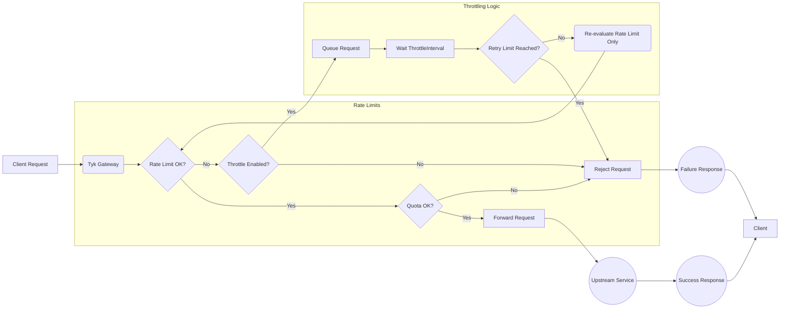

## Introduction

Tyk's Request Throttling feature provides a mechanism to manage traffic spikes by queuing and automatically retrying client requests that exceed [rate limits](/api-management/rate-limit), rather than immediately rejecting them. This helps protect upstream services from sudden bursts and improves the resilience of API interactions during temporary congestion.

---
## Quick Start

### Overview

In this tutorial, we will configure Request Throttling on a Tyk Security Policy to protect a backend service from sudden traffic spikes. We'll start by defining a basic rate limit on a policy, then enable throttling with specific retry settings to handle bursts exceeding that limit, associate a key with the policy, and finally test the behaviour using simulated traffic. This guide primarily uses the Tyk Dashboard for configuration.

### Prerequisites

- **Working Tyk Environment:** You need access to a running Tyk instance that includes both the Tyk Gateway and Tyk Dashboard components. For setup instructions using Docker, please refer to the [Tyk Quick Start](https://github.com/TykTechnologies/tyk-pro-docker-demo?tab=readme-ov-file#quick-start).
- **Curl, seq and xargs**: These tools will be used for testing.

### Instructions

#### Create an API

1.  **Create an API:**
    1. Log in to your Tyk Dashboard.
    2. Navigate to **API Management > APIs**
    3. Click **Add New API**
    4. Click **Import**
    5. Select **Import Type** as **Tyk API**
    6. Copy the below Tyk OAS definition in the text box and click **Import API** to create an API

        

    <Expandable title={'Click to expand API Definition'}>
    ```json
            {
                "components": {
                    "securitySchemes": {
                        "authToken": {
                            "in": "header",
                            "name": "Authorization",
                            "type": "apiKey"
                        }
                    }
                },
                "info": {
                    "title": "Request Throttling Test",
                    "version": "1.0.0"
                },
                "openapi": "3.0.3",
                "paths": {},
                "security": [
                    {
                        "authToken": []
                    }
                ],
                "servers": [
                    {
                        "url": "http://tyk-gateway.localhost:8080/request-throttling-test/"
                    }
                ],
                "x-tyk-api-gateway": {
                    "info": {
                        "name": "Request Throttling Test",
                        "state": {
                            "active": true
                        }
                    },
                    "middleware": {
                        "global": {
                            "contextVariables": {
                                "enabled": true
                            },
                            "trafficLogs": {
                                "enabled": true
                            }
                        }
                    },
                    "server": {
                        "authentication": {
                            "enabled": true,
                            "securitySchemes": {
                                "authToken": {
                                    "enabled": true
                                }
                            }
                        },
                        "listenPath": {
                            "strip": true,
                            "value": "/request-throttling-test/"
                        }
                    },
                    "upstream": {
                        "url": "http://httpbin.org/"
                    }
                }
            }
            ```
    </Expandable>


<h4 id="policy-setup">Configure Policy and Rate Limit</h4>
2.  **Create and Configure an Security Policy with Rate Limiting:**

    

    <Expandable title={'Click to expand to see a detailed steps to configure rate limit in the Tyk Dashboard UI'}>
    1.  Navigate to **API Security > Policies** in the Tyk Dashboard sidebar
        2.  Click the **Add Policy** button
        3.  Under the **1. Access Rights** tab, in the **Add API Access Rule** section, select the `Request Throttling Test` API
        4.  Scroll down to the **Global Limits and Quota** section (still under the **1. Access Rights** tab):
            *   Set the following values for `Rate Limiting`
            *   Enter `5` into the **Requests (or connection attempts)** field
            *   Enter `10` into the **Per (seconds):** field
        5.  Select the **2. Configuration** tab
        6.  In the **Policy Name** field, enter `Request Throttling Policy`
        7.  From the **Key expire after** dropdown, select `1 hour`
        8.  Click the **Create Policy** button
    </Expandable>


    

3.  **Associate an Access Key with the Policy:**

    

    <Expandable title={'Click to expand to see a detailed steps to Associate an Access Key with the Policy in the Tyk Dashboard UI'}>
    1.  Navigate to **API Security > Keys** in the Tyk Dashboard sidebar
        2.  Click the **Add Key** button
        3.  Under the **1. Access Rights** tab:
            *   In the **Apply Policy** section, select the `Request Throttling Policy` API
        5.  Select the **2. Configuration** tab
        6.  In the **Alias** field, enter `Request Throttling Key`. This provides a human-readable identifier that makes tracking and managing this specific access key easier in your analytics and logs.
        7.  From the **Expires** dropdown, select `1 hour`
        8.  Click the **Create Key** button
        9.  A pop-up window **"Key created successfully"** will appear displaying the key details. **Copy the Key ID** value shown and save it securely. You will need this key to make API requests in the following steps
        10. Click **OK** to close the pop-up
    </Expandable>


4. **Test Rate Limit**

    So far, we've created a policy for an API definition and created a key that complies with that policy. Before enabling throttling, let's observe the standard rate limiting behaviour. We'll send 10 requests in parallel using `xargs` to simulate a burst that exceeds our configured limit (5 requests per 10 seconds).

    1.  Open your terminal.
    2.  Execute the following command, replacing `<replace-with-key-id>` with the API Key ID you saved earlier:

        ```bash
        seq 10 | xargs -n1 -P10 -I {} bash -c 'curl -s -I -H "Authorization: <replace-with-key-id>" http://tyk-gateway.localhost:8080/request-throttling-test/ | head -n 1'
        ```

    3.  **Expected Observation:** You should see some requests succeed with `HTTP/1.1 200 OK`, and other requests failing with `HTTP/1.1 429 Too Many Requests` as the rate limit is immediately enforced. The order of `200s` vs `429s` might vary depending upon the processing time, but you will see immediate rejections once the limit is hit.

    **Sample Output (Illustrative):**

    ```bash
    HTTP/1.1 429 Too Many Requests
    HTTP/1.1 429 Too Many Requests
    HTTP/1.1 429 Too Many Requests
    HTTP/1.1 429 Too Many Requests
    HTTP/1.1 429 Too Many Requests
    HTTP/1.1 200 OK
    HTTP/1.1 200 OK
    HTTP/1.1 200 OK
    HTTP/1.1 200 OK
    HTTP/1.1 200 OK
    ```

#### Configure Throttling

Now that the policy enforces a basic rate limit, we will enable and configure Request Throttling. This adds the queue-and-retry behavior for requests that exceed the limit, preventing immediate rejection and helping to smooth out traffic spikes.

5.  **Configure Request Throttling by Updating the Security Policy**

    1.  Navigate to **API Security > Policies** in the Tyk Dashboard sidebar
    2.  Click on the `Request Throttling Policy`
    3.  Under the **1. Access Rights** tab:
        *   In the **Global Limits and Quota** section
        *   Set the following values for `Throttling`
        *   Uncheck the `Disable Throttling` checkbox
        *   Enter `3` into the **Throttle retries (or connection attempts)** field
        *   Enter `5` into the **Per (seconds):** field
    4.  Click the **Update** button
    5.  A pop-up window will appear to confirm the changes. Click **Update** to close the pop-up

#### Testing

6. **Test Request Throttling**

    1.  **Repeat the Test:** Open your terminal and execute the *exact same command* as in step 4:

        ```bash
        seq 10 | xargs -n1 -P10 -I {} bash -c 'curl -s -I -H "Authorization: <replace-with-key-id>" http://tyk-gateway.localhost:8080/request-throttling-test/ | head -n 1'
        ```

    2.  **Expected Observation:**
        *   You will still see the first ~5 requests return `HTTP/1.1 200 OK` quickly
        *   Critically, the subsequent requests (6 through 10) will **not** immediately return `429`. Instead, you should observe a **delay** before their status lines appear
        *   After the delay (`throttle_interval`), Tyk will retry the queued requests. Some might now succeed (return `200 OK`) if the rate limit window allows
        *   If a request is retried `throttle_retry_limit` (3) times and still encounters the rate limit, *then* it will finally return `HTTP/1.1 429 Too Many Requests`
        *   Overall, you might see more `200 OK` responses compared to the previous test, and any `429` responses will appear significantly later

    **Sample Output (Illustrative - timing is key):**

    ```bash
    HTTP/1.1 200 OK  # Appears quickly
    HTTP/1.1 200 OK  # Appears quickly
    HTTP/1.1 200 OK  # Appears quickly
    HTTP/1.1 200 OK  # Appears quickly
    HTTP/1.1 200 OK  # Appears quickly
    # --- Noticeable pause here ---
    HTTP/1.1 200 OK
    # --- Noticeable pause here ---
    HTTP/1.1 200 OK
    # --- Noticeable pause here ---
    HTTP/1.1 200 OK
    HTTP/1.1 200 OK
    HTTP/1.1 200 OK
    ```
    *(The exact mix of 200s and 429s on the delayed requests depends heavily on timing relative to the 10-second rate limit window reset and the retry attempts).*

This comparison clearly shows how Request Throttling changes the behaviour from immediate rejection to queued retries, smoothing the traffic flow and potentially allowing more requests to succeed during bursts.

---
## Configuration Options

Request Throttling is configured within Tyk [Security Policies](/api-management/policies) or directly on individual [Access Keys](/api-management/authentication/bearer-token).

The configuration involves setting two specific fields:

- `throttle_interval`: Defines the wait time (in seconds) between retry attempts for a queued request. (*Note*: Do not set it to `0`. If you do, no delay is applied, and the request is immediately retried. This will creates a “busy waiting” scenario that consumes more resources than a positive interval value)
- `throttle_retry_limit`: Sets the maximum number of retry attempts before the request is rejected. (*Note*: Do not set it to `0`. Setting it to `0` means that there will be no throttling on the request)

To enable throttling, both fields must be set to a value greater than `0`. 

### Disable throttling

The default value is `-1` and means it is disabled by default.
Setting `throttle_interval` and `throttle_retry_limit` values to any number smaller than `0`, to ensure the feature is diabled.

You can configure these settings using either the Tyk Dashboard UI or the Tyk Dashboard API.

### Configure via UI

The Tyk Dashboard provides a straightforward interface to set throttling parameters on both Security Policies and Access Keys.

<Tabs>

<Tab title="Security Policy">

The image below shows a policy with throttling. Any key using this policy will inherit the throttling settings and behaves as follows: wait 2 seconds between retries for queued requests, attempting up to 3 times before failing (so overall 6 seconds before getting another 429 error response).


<br />
<Expandable title={'Click to expand to see a detailed steps to configure Request Throttling in the Tyk Dashboard UI'}>
1.  Navigate to **API Security > Policies** in the Tyk Dashboard sidebar
2.  Click the **Add Policy** button
3.  Under the **1. Access Rights** tab and in the **Add API Access Rule** section, select the required API
4.  Scroll down to the **Global Limits and Quota** section (still under the **1. Access Rights** tab):
    *   To enable *Throttling*,  we must configure *Rate Limiting* in the policy.
        *   Field **Requests (or connection attempts)**  - Enter the number of requests you want to allow before rate limit is applied.
        *   Field **Per (seconds):** - Enter the time window in seconds during which the number of requests specified above is allowed.
    *   Now enable `Throttling` by setting the following values in the `Throttling` section:
        *   Uncheck the `Disable Throttling` checkbox
        *   Field **Throttle retries (or connection attempts)** - Enter the maximum number of times Tyk should attempt to retry a request after it has been queued due to exceeding a rate limit or quota.
        *   Field **Per (seconds):** - Enter the time interval in seconds Tyk should wait between each retry attempt for a queued request.
5.  Select the **2. Configuration** tab
6.  In the **Policy Name** field, enter a name
7.  From the **Key expire after** dropdown, select an option
8.  Click the **Create Policy** button
</Expandable>

</Tab>

<Tab title="Access Key">

The image below shows an access key with throttling. This access key behaves as follows: wait 2 seconds between retries for queued requests, attempting up to 3 times before failing (so overall 6 seconds before getting another 429 error response).

**Note:** Direct key configuration overrides policy settings only for that specific key.


<br />
<Expandable title={'Click to expand to see a detailed steps to configure Request Throttling in the Tyk Dashboard UI'}>
1.  Navigate to **API Security > Keys** in the Tyk Dashboard sidebar
2.  Click the **Create Key** button
3.  Under the **1. Access Rights** tab:
    *   Select **Choose API**
    *   In the **Add API Access Rule** section, select the required API
4.  Scroll down to the **Global Limits and Quota** section (still under the **1. Access Rights** tab):
    *   To enable *Throttling*,  we must configure *Rate Limiting* in the Access Key.
        *   Field **Requests (or connection attempts)**  - Enter the number of requests you want to allow before rate limit is applied.
        *   Field **Per (seconds):** - Enter the time window in seconds during which the number of requests specified above is allowed.
    *   Now enable `Throttling` by setting the following values in the `Throttling` section:
        *   Uncheck the `Disable Throttling` checkbox
        *   Field **Throttle retries (or connection attempts)** - Enter the maximum number of times Tyk should attempt to retry a request after it has been queued due to exceeding a rate limit or quota.
        *   Field **Per (seconds):** - Enter the time interval in seconds Tyk should wait between each retry attempt for a queued request.
5.  Select the **2. Configuration** tab
6.  In the **Alias** field, enter a name. This provides a human-readable identifier that makes tracking and managing this specific access key easier in your analytics and logs.
7.  From the **Expires** dropdown, select an option
8.  Click the **Create Key** button
</Expandable>

</Tab>

</Tabs>

### Configure via API

These are the fields that you can set directly in the Policy object or the Access Key:

```json
{
  // Partial policy/session object fields
  "throttle_interval": 2,       // Wait 2 second between retries
  "throttle_retry_limit": 3,    // Attempt a maximum of 3 retries
  // ... more config follows
}
```

<Tabs>

<Tab title="Security Policy">

To update the policy, do the following:
1. Retrieve the policy object using `GET /api/portal/policies/{POLICY_ID}`
2. Add or modify the `throttle_interval` and `throttle_retry_limit` fields within the policy JSON object
3. Update the policy using `PUT /api/portal/policies/{POLICY_ID}` with the modified object, or create a new one using `POST /api/portal/policies/`

**Explanation:**
The above adds throttling to a policy. Any key using this policy will inherit the throttling settings and behaves as follows: wait 1 second between retries for queued requests, attempting up to 5 times before failing (so overall 5 seconds before getting another 429 error response).

</Tab>

<Tab title="Access Key">

Note: Direct key configuration overrides policy settings only for that specific key.

To update the access key do the following:
1. Retrieve the key's session object using `GET /api/keys/{KEY_ID}`
2. Add or modify the `throttle_interval` and `throttle_retry_limit` fields within the session object JSON
3. Update the key using `PUT /api/keys/{KEY_ID}` with the modified session object


**Explanation:**
The above adds throttling to a key. Any request made by the key will behave as follows: wait 1 second between retries for queued requests, attempting up to 5 times before failing (so overall 5 seconds before getting another 429 error response).

</Tab>

</Tabs>

---
## How It Works



Tyk's Request Throttling intercepts API requests *after* they have exceeded a configured [Rate Limit](/api-management/rate-limit). 

Instead of immediately rejecting these requests with a `429 Too Many Requests` error (which is the default rate-limiting behaviour), the Gateway temporarily holds them in a queue. After waiting for a specified duration (`throttle_interval`), Tyk attempts to process the request again, re-checking the rate limit status. 

This retry cycle repeats until either the request can be successfully processed (if capacity becomes available) or a configured maximum number of retries (`throttle_retry_limit`) is reached. Only after exhausting all retries does Tyk return the `429` error to the client.

Think of it like trying to access a service with a restriction on how many people can enter per minute (Rate Limit). If you arrive when the per-minute limit is full, standard behaviour is to turn you awa
y immediately. With Throttling enabled, the service instead asks you to wait briefly (the interval) and tries your entry again shortly, checking if the rate limit has freed up capacity, repeating this a f
ew times (the retry limit) before finally turning you away if access is still restricted.

---
## FAQ


<AccordionGroup>
<Accordion title={'What is Request Throttling in Tyk?'}>
Request Throttling in Tyk is a mechanism that allows for graceful handling of rate limit violations. Instead of immediately rejecting requests that exceed rate limits, throttling gives clients a chance to retry after a specified delay.
</Accordion>

<Accordion title={'How does Request Throttling differ from Rate Limiting?'}>
Rate Limiting is a mechanism to restrict the number of requests a client can make in a given time period (e.g., 100 requests per minute). Request Throttling is an extension of rate limiting that provides a retry mechanism when rate limits are exceeded. Instead of immediately failing with a 429 status code, throttling allows the gateway to wait and retry the request internally.
</Accordion>

<Accordion title={'Does Request Throttling work with Request Quotas?'}>
No, Request Throttling in Tyk is exclusively linked to rate limits and does not work with request quotas. When a quota is exceeded, the request is immediately rejected without any throttling or retry attempts. Throttling is only applied when rate limits are exceeded.
</Accordion>

<Accordion title={'How do I configure Request Throttling in Tyk?'}>
Refer to this [documentation](/#configuration-options).
</Accordion>

<Accordion title={'How does Request Throttling affect response times?'}>
Request Throttling can increase response times for requests that exceed rate limits, as the gateway will wait for the specified `ThrottleInterval` between retry attempts. The maximum additional latency would be `ThrottleInterval × ThrottleRetryLimit` seconds. This trade-off provides better success rates at the cost of potentially longer response times for some requests.
</Accordion>

<Accordion title={'Can I monitor throttled requests in Tyk?'}>
Yes, Tyk tracks throttled requests in its health check metrics. You can monitor the `ThrottledRequestsPS` (throttled requests per second) metric to see how often requests are being throttled. Additionally, when a request is throttled, Tyk emits a `RateLimitExceeded` event that can be captured in your monitoring system.
</Accordion>

<Accordion title={'Is Request Throttling enabled by default?'}>
No, Request Throttling is not enabled by default. To enable throttling, you need to explicitly set `ThrottleRetryLimit` to a value greater than 0 and configure an appropriate `ThrottleInterval`. These settings can be applied through policies or directly in access keys.
</Accordion>
</AccordionGroup> 