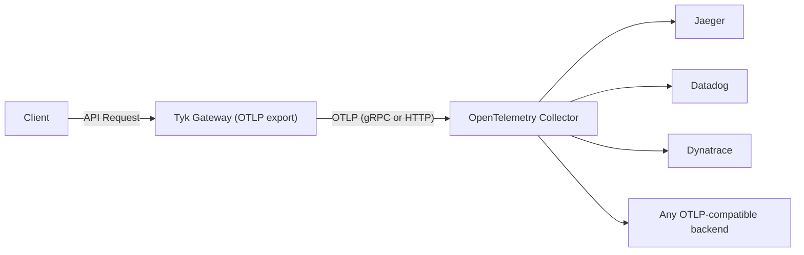
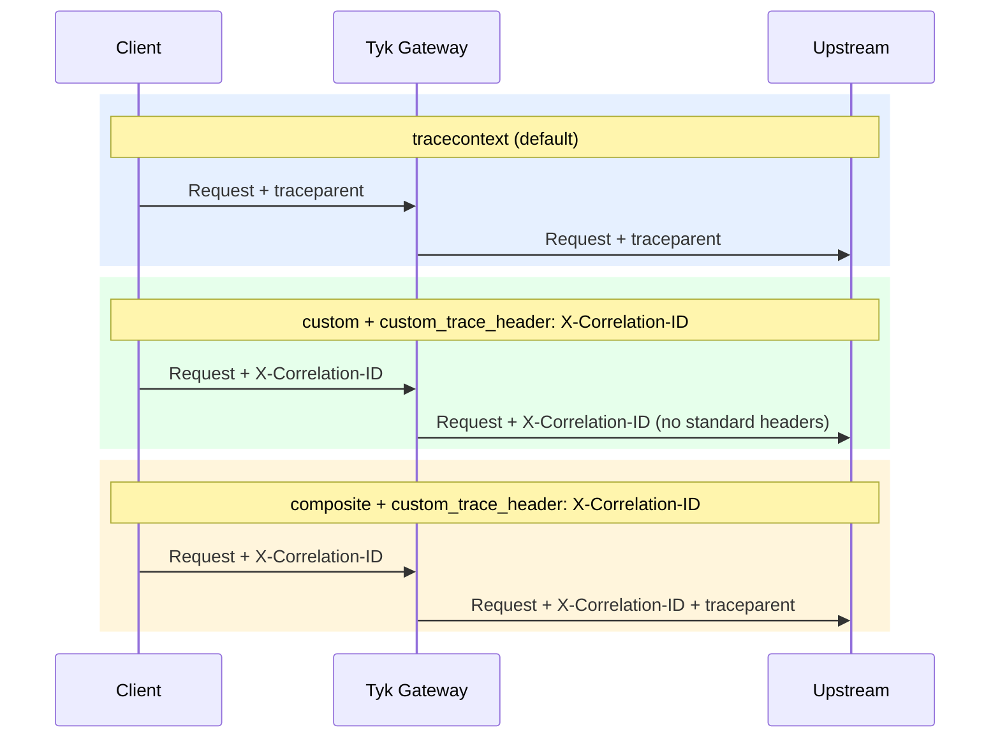
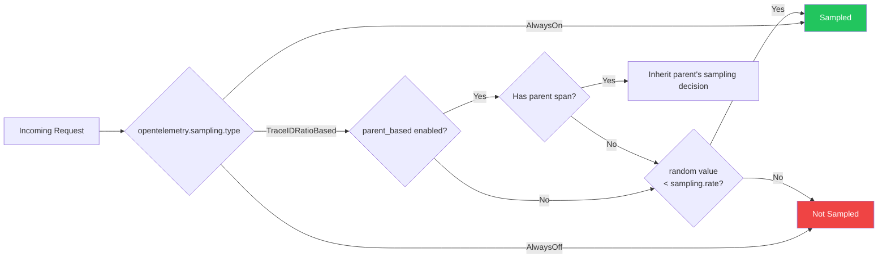

Distributed traces provide a detailed, end-to-end view of a single API request or transaction as it traverses through various services and components. Traces are crucial for understanding the flow of requests and identifying bottlenecks or latency issues. Here’s how you can make use of traces for API observability:

- **End-to-end request tracing:** Implement distributed tracing across your microservices architecture to track requests across different services and gather data about each service's contribution to the overall request latency.
    
- **Transaction Flow:** Visualize the transaction flow by connecting traces to show how requests move through different services, including entry points (e.g., API gateway), middleware and backend services.
    
- **Latency Analysis:** Analyze trace data to pinpoint which service or component is causing latency issues, allowing for quick identification and remediation of performance bottlenecks.
    
- **Error Correlation:** Use traces to correlate errors across different services to understand the root cause of issues and track how errors propagate through the system.

## OpenTelemetry Tracing

Since v5.2, Tyk Gateway supports distributed tracing via [OpenTelemetry](https://opentelemetry.io/docs/what-is-opentelemetry/). The gateway exports traces using the [OpenTelemetry Protocol (OTLP)](https://opentelemetry.io/docs/specs/otlp/), making it compatible with any modern tracing backend: Jaeger, Datadog, Dynatrace, Elasticsearch, New Relic, and others.



Tyk also supports the legacy [OpenTracing](#opentracing-deprecated) approach (now deprecated). Migrate to OpenTelemetry for vendor-neutral, actively maintained tracing.

## Configuration

### Enable Tracing

Enable OpenTelemetry tracing at the Gateway level in `tyk.conf`:

<Tabs>
  <Tab title="Config File (tyk.conf)">
```json
{
  "opentelemetry": {
    "traces": {
      "enabled": true
    }
  }
}
```
  </Tab>
  <Tab title="Environment Variable">
     Set the environment variable `TYK_GW_OPENTELEMETRY_TRACES_ENABLED=true`.
  </Tab>
</Tabs>

By default, spans are exported via gRPC to `localhost:4317`.

| Field | Description | Default |
|-------|-------------|---------|
| [opentelemetry.traces.enabled](/tyk-oss-gateway/configuration#opentelemetry-traces-enabled) | Enable distributed tracing | `false` |
| [opentelemetry.traces.exporter](/tyk-oss-gateway/configuration#opentelemetry-traces-exporter) | Export protocol: `grpc` or `http` | `grpc` |
| [opentelemetry.traces.endpoint](/tyk-oss-gateway/configuration#opentelemetry-traces-endpoint) | OTLP collector endpoint | `localhost:4317` |
| [opentelemetry.traces.connection_timeout](/tyk-oss-gateway/configuration#opentelemetry-traces-connection_timeout) | Connection timeout in seconds | `1` |
| [opentelemetry.traces.headers](/tyk-oss-gateway/configuration#opentelemetry-traces-headers) | Additional HTTP headers sent with each OTLP export request | — |
| [opentelemetry.traces.tls](/tyk-oss-gateway/configuration#opentelemetry-traces-tls) | TLS configuration for the OTLP connection | — |
| [opentelemetry.traces.context_propagation](/tyk-oss-gateway/configuration#opentelemetry-traces-context_propagation) | Trace context format: `tracecontext`, `b3`, `custom`, or `composite` | `tracecontext` |
| [opentelemetry.traces.custom_trace_header](/tyk-oss-gateway/configuration#opentelemetry-traces-custom_trace_header) | Custom propagation header name (used with `custom` or `composite` modes) | — |
| [opentelemetry.traces.span_processor_type](/tyk-oss-gateway/configuration#opentelemetry-traces-span_processor_type) | Span processing mode: `batch` or `simple` | `batch` |
| [opentelemetry.traces.span_batch_config.max_queue_size](/tyk-oss-gateway/configuration#opentelemetry-traces-span_batch_config-max_queue_size) | Maximum number of spans buffered before export | `2048` |
| [opentelemetry.traces.span_batch_config.max_export_batch_size](/tyk-oss-gateway/configuration#opentelemetry-traces-span_batch_config-max_export_batch_size) | Maximum number of spans per export batch | `512` |
| [opentelemetry.traces.span_batch_config.batch_timeout](/tyk-oss-gateway/configuration#opentelemetry-traces-span_batch_config-batch_timeout) | Seconds to wait before forcing an export | `5` |
| [opentelemetry.traces.sampling.type](/tyk-oss-gateway/configuration#opentelemetry-traces-sampling-type) | Sampling strategy: `AlwaysOn`, `AlwaysOff`, or `TraceIDRatioBased` | `AlwaysOn` |
| [opentelemetry.traces.sampling.rate](/tyk-oss-gateway/configuration#opentelemetry-traces-sampling-rate) | Fraction of traces to sample when using `TraceIDRatioBased` (0.0–1.0) | `0.5` |
| [opentelemetry.traces.sampling.parent_based](/tyk-oss-gateway/configuration#opentelemetry-traces-sampling-parentbased) | Inherit the parent span's sampling decision | `false` |

<Note>
The root-level `opentelemetry.enabled`, `opentelemetry.exporter`, and `opentelemetry.endpoint` fields are deprecated from Tyk 5.13.0. They continue to work for backward compatibility but should be replaced with the `opentelemetry.traces.*` equivalents in new deployments.
</Note>

Tyk Gateway will now generate two spans for each request made to your APIs, encapsulating the entire request lifecycle. These spans include attributes and tags but lack fine-grained details. The parent span represents the total time from request reception to response and the child span represent the time spent in the upstream service.


### Detailed Tracing

Enable detailed tracing per API to generate a span for each middleware in the request pipeline. These spans offer detailed insights, including the time taken for each middleware execution and the sequence of invocations.

Set the [server.detailedTracing](/api-management/gateway-config-tyk-oas#detailedtracing) flag in the Tyk OAS API definition, or toggle **OpenTelemetry Tracing** in the Tyk OAS API Designer.


For Tyk Classic APIs, use the [detailed_tracing](/api-management/gateway-config-tyk-classic#opentelemetry) field in the API definition.

### Span Processor Configuration

A span processor controls how completed spans are batched and sent to the tracing backend. This is configured in the Tyk Gateway configuration file under `opentelemetry.traces`.

When using `span_processor_type: batch` (the default), you can tune the batch processor to avoid span loss under high traffic. Use the `span_batch_config` block to configure the following fields:

```json
{
  "opentelemetry": {
    "traces": {
      "span_processor_type": "batch",
      "span_batch_config": {
        "max_queue_size": 8192,
        "max_export_batch_size": 1024,
        "batch_timeout": 3
      }
    }
  }
}
```

| Field | Default | Description |
|-------|---------|-------------|
| [`max_queue_size](/tyk-oss-gateway/configuration#opentelemetry-span_batch_config-max_queue_size) | `2048` | maximum number of spans buffered before export |
| [`max_export_batch_size](/tyk-oss-gateway/configuration#opentelemetry-span_batch_config-max_export_batch_size) | `512` | maximum number of spans per export batch |
| [`batch_timeout](/tyk-oss-gateway/configuration#opentelemetry-span_batch_config-batch_timeout) | `5` | seconds to wait before forcing an export |

Increase `max_queue_size` and `max_export_batch_size` in high-throughput environments where spans are being dropped before they can be exported.

## Understanding The Traces

Tyk Gateway exposes a helpful set of *span attributes* and *resource attributes* with the generated spans. These attributes provide useful insights for analyzing your API requests. A clear analysis can be obtained by observing the specific actions and associated context within each request/response. This is where span and resource attributes play a significant role.

### Span Attributes

A span is a named, timed operation that represents an operation. Multiple spans represent different parts of the workflow and are pieced together to create a trace. While each span includes a duration indicating how long the operation took, the span attributes provide additional contextual metadata.

Span attributes are key-value pairs that provide contextual metadata for individual spans. Tyk automatically sets the following span attributes:

- `tyk.api.name`: API name.
- `tyk.api.orgid`: Organization ID.
- `tyk.api.id`: API ID.
- `tyk.api.path`: API listen path.
- `tyk.api.tags`: If tagging is enabled in the API definition, the tags are added here.
- `tyk.api.apikey.alias`: The identity alias of the authenticated client. Populated for APIs using JWT authentication or multi-auth (compliant mode).


### Resource Attributes

Resource attributes provide contextual information about the entity that produced the telemetry data. Tyk exposes following resource attributes:

### Service Attributes

The service attributes supported by Tyk are:

| Attribute             | Type   | Description | 
| :--------------------- | :-------- | :- | 
| `service.name`        | String | Service name for Tyk API Gateway:  `tyk-gateway`                                                                          |
| `service.instance.id` and `tyk.gw.id` | String | The Node ID assigned to the gateway. Example `solo-6b71c2de-5a3c-4ad3-4b54-d34d78c1f7a3` | 
| `service.version`     | String | Represents the service version. Example `v5.2.0`                                    |
| `tyk.gw.dataplane` | Bool     | Whether the Tyk Gateway is hybrid (`slave_options.use_rpc=true`)                                 | 
| `tyk.gw.group.id`  | String   | Represents the `slave_options.group_id` of the gateway. Populated only if the gateway is hybrid. | 
| `tyk.gw.tags`      | []String | Represents the gateway `segment_tags`. Populated only if the gateway is segmented.               | 

By understanding and using these resource attributes, you can gain better insights into the performance of your API Gateways.

### Common HTTP Span Attributes

Tyk follows the OpenTelemetry semantic conventions for HTTP spans. You can find detailed information on common attributes [here](https://github.com/open-telemetry/semantic-conventions/blob/main/docs/http/http-spans.md#common-attributes).

Some of these common attributes include:

- `http.method`: HTTP request method.
- `http.scheme`: URL scheme.
- `http.status_code`: HTTP response status code.
- `http.url`: Full HTTP request URL.

For the full list and details, refer to the official [OpenTelemetry Semantic Conventions](https://github.com/open-telemetry/semantic-conventions/blob/main/docs/http/http-spans.md#common-attributes).

## Advanced Configuration

### Context Propagation

This setting allows you to specify the type of context propagator to use for trace data. This is essential for ensuring compatibility and data integrity between different services in your architecture.

<Tabs>
  <Tab title="Config File (tyk.conf)">

[opentelemetry.traces.context_propagation](/tyk-oss-gateway/configuration#opentelemetry-traces-context_propagation) controls which trace context format the gateway reads from incoming requests and writes to upstream requests.

```json
{
  "opentelemetry": {
    "traces": {
      "context_propagation": ""
    }
  }
}
```
  </Tab>
  <Tab title="Environment Variable">
     Set the environment variable [TYK_GW_OPENTELEMETRY_TRACES_CONTEXTPROPAGATION](/tyk-oss-gateway/configuration#opentelemetry-context_propagation).
  </Tab>
</Tabs>

The available options are:

| Value | Behavior |
|-------|-----------|
| `tracecontext` (default) | [W3C Trace Context](https://www.w3.org/TR/trace-context/) format |
| `b3` | [B3 multi-header](https://github.com/openzipkin/b3-propagation) format |
| `custom` | Reads and writes only the custom header set in `custom_trace_header`. No standard headers written to upstream |
| `composite` | Reads from the custom header (priority) or standard headers (fallback). Writes both the custom header and `traceparent` to upstream |

<Note>
`custom` and `composite` are available from Tyk Gateway v5.12.0 and require [opentelemetry.custom_trace_header](/tyk-oss-gateway/configuration#opentelemetry) to be set.
</Note>

The diagram below shows which headers the Gateway reads from the client and writes to the upstream for each mode:



### Custom Trace Header

If your upstream systems use a proprietary correlation header (for example, `X-Correlation-ID`), set `custom_trace_header` to that header name. The behavior depends on `context_propagation`:

<Tabs>
  <Tab title="Tracecontext">
**Tracecontext mode** (`tracecontext` + `custom_trace_header`): reads from the custom header (with fallback to `traceparent`), writes only the standard `traceparent` header to upstream.

```json
{
  "opentelemetry": {
    "traces": {
      "enabled": true,
      "context_propagation": "tracecontext",
      "custom_trace_header": "X-Correlation-ID"
    }
  }
}
```
  </Tab>
  <Tab title="Custom">
**Custom mode** (`custom` + `custom_trace_header`) — reads from and writes to the custom header only. No standard headers are involved.

```json
{
  "opentelemetry": {
    "traces": {
      "enabled": true,
      "context_propagation": "custom",
      "custom_trace_header": "X-Correlation-ID"
    }
  }
}
```
  </Tab>
  <Tab title="Composite">
**Composite mode** (`composite` + `custom_trace_header`) — reads from the custom header (priority) or standard headers (fallback), and writes both the custom header and `traceparent` to upstream.

```json
{
  "opentelemetry": {
    "traces": {
      "enabled": true,
      "context_propagation": "composite",
      "custom_trace_header": "X-Correlation-ID"
    }
  }
}
```
  </Tab>
</Tabs>

In all modes, if the custom header is absent from the incoming request, the gateway falls back to standard headers or generates a new trace ID. The custom header is never generated if it wasn't present in the original request.

### Sampling

Tyk supports configuring the following sampling strategies using [opentelemetry.sampling](/tyk-oss-gateway/configuration#opentelemetry) in `tyk.conf`.



#### Sampling Type

This setting dictates the sampling policy that OpenTelemetry uses to decide if a trace should be sampled for analysis. The decision is made at the start of a trace and applies throughout its lifetime. By default, the setting is `AlwaysOn`.

Set the [opentelemetry.traces.sampling.type](/tyk-oss-gateway/configuration#opentelemetry-traces-sampling-type) field in the Tyk Gateway configuration file or use the equivalent environment variable. Allowed values for this setting are:

| Value | Behavior |
|-------|-----------|
| `AlwaysOn` (default) | All traces are sampled |
| `AlwaysOff` | No traces are sampled |
| `TraceIDRatioBased` | Samples a fraction of traces based on the configured [sampling rate](/api-management/traces#sampling-rate) |

#### Sampling Rate

The [opentelemetry.traces.sampling.rate](/tyk-oss-gateway/configuration#opentelemetry-traces-sampling-rate) field is used to control what fraction of total traces will be sampled when the `TraceIDRatioBased` sampling is configured. It accepts a value between 0.0 and 1.0. For example, a `rate` set to 0.5 implies that approximately 50% of the traces will be sampled. The default value is 0.5.

- **Environment Variable**: Use [TYK_GW_OPENTELEMETRY_SAMPLING_RATE](/tyk-oss-gateway/configuration#opentelemetry-sampling-rate).
- **Configuration File**: Update the `opentelemetry.traces.sampling.rate` field in the configuration file.

#### ParentBased Sampling

Parent based sampling ensures sampling consistency between parent and child spans. Specifically, if a parent span is sampled, all its child spans will be sampled at the same rate.

This is particularly effective when used with `TraceIDRatioBased` sampling, as it helps to keep the entire transaction story together. Using `ParentBased` with `AlwaysOn` or `AlwaysOff` may not be as useful, since in these cases, either all or no spans are sampled.

Enable parent based sampling by setting [opentelemetry.traces.sampling.parent_based](/tyk-oss-gateway/configuration#opentelemetry-traces-sampling-parentbased) or the equivalent environment variable. The default value is `false`.

- **Environment Variable**: Use [TYK_GW_OPENTELEMETRY_TRACES_SAMPLING_PARENTBASED](/tyk-oss-gateway/configuration#opentelemetry-traces-sampling-parentbased).
- **Configuration File**: Update the `opentelemetry.traces.sampling.parent_based` field in the configuration file.

## Tracing Backends

For step-by-step setup guides connecting Tyk Gateway traces to a specific backend:

- [Datadog](/api-management/traces/datadog)
- [Dynatrace](/api-management/traces/dynatrace)
- [Elasticsearch](/api-management/traces/elasticsearch)
- [New Relic](/api-management/traces/new-relic)
- [Jaeger](/api-management/traces/jaeger)

All configuration options are documented in the [Tyk Gateway configuration reference](/tyk-oss-gateway/configuration#opentelemetry).

## OpenTracing (deprecated)

<Warning>
**Deprecation**

The CNCF has archived the OpenTracing project. Tyk introduced [OpenTelemetry](#opentelemetry) support in v5.2.

Migrate to OpenTelemetry for active support and wider vendor compatibility. OpenTracing is deprecated in all Tyk products.
</Warning>

### Enabling OpenTracing

Configure OpenTracing at the Gateway level in `tyk.conf`:

```json
{
  "tracing": {
    "enabled": true,
    "name": "${tracer_name}",
    "options": {}
  }
}
```

| Field | Environment variable | Description |
|-------|----------------------|-------------|
| `tracing.enabled` | `TYK_GW_TRACER_ENABLED` | Set to `true` to enable tracing |
| `tracing.name` | `TYK_GW_TRACER_NAME` | Name of the supported tracer |
| `tracing.options` | `TYK_GW_TRACER_OPTIONS` | Key-value pairs for configuring the tracer. See the tracer's documentation for details |

Tyk automatically propagates tracing headers to upstream APIs when tracing is enabled.

### Legacy Vendor Configurations

<Tabs>
  <Tab title="Jaeger">
    <Note>
    Tyk's OpenTelemetry tracing works with Jaeger. Follow the [Jaeger guide](/api-management/traces/jaeger) instead.
    </Note>

    Prior to Tyk 5.2, use [OpenTracing](https://opentracing.io/) with the [Jaeger client libraries](https://www.jaegertracing.io/docs/1.11/client-libraries/).

    ```json
    {
      "tracing": {
        "enabled": true,
        "name": "jaeger",
        "options": {
          "baggage_restrictions": null,
          "disabled": false,
          "headers": null,
          "reporter": {
            "BufferFlushInterval": "0s",
            "collectorEndpoint": "",
            "localAgentHostPort": "jaeger:6831",
            "logSpans": true,
            "password": "",
            "queueSize": 0,
            "user": ""
          },
          "rpc_metrics": false,
          "sampler": {
            "maxOperations": 0,
            "param": 1,
            "samplingRefreshInterval": "0s",
            "samplingServerURL": "",
            "type": "const"
          },
          "serviceName": "tyk-gateway",
          "tags": null,
          "throttler": null
        }
      }
    }
    ```
  </Tab>
  <Tab title="New Relic">
    <Note>
    Tyk's OpenTelemetry tracing works with New Relic. Follow the [New Relic guide](/api-management/traces/new-relic) instead.
    </Note>

    Prior to Tyk 5.2, use [OpenTracing](https://opentracing.io/) with Zipkin format to send traces to New Relic.

    ```json
    {
      "tracing": {
        "enabled": true,
        "name": "zipkin",
        "options": {
          "reporter": {
            "url": "https://trace-api.newrelic.com/trace/v1?Api-Key=NEW_RELIC_LICENSE_KEY&Data-Format=zipkin&Data-Format-Version=2"
          }
        }
      }
    }
    ```
  </Tab>
  <Tab title="Zipkin">
    Prior to Tyk 5.2, use [OpenTracing](https://opentracing.io/) with the [Zipkin Go tracer](https://zipkin.io/pages/tracers_instrumentation).

    ```json
    {
      "tracing": {
        "enabled": true,
        "name": "zipkin",
        "options": {
          "reporter": {
            "url": "http://localhost:9411/api/v2/spans"
          }
        }
      }
    }
    ```
  </Tab>
</Tabs>
