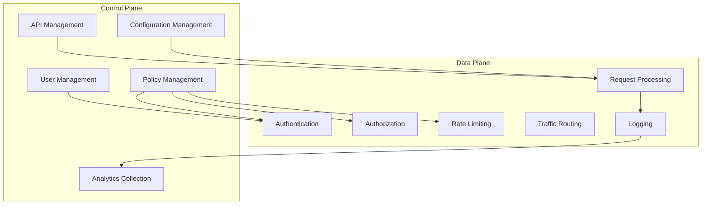
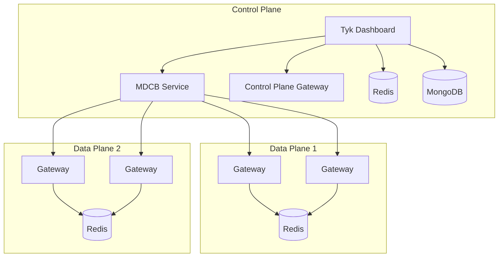

# Control Plane and Data Plane Architecture in API Management

This guide explains the concept of control plane and data plane separation in API management, how it benefits large-scale deployments, and how Tyk implements this architecture pattern.

## Understanding Control Plane and Data Plane

### Architectural Separation

The control plane and data plane architecture pattern separates API management into two distinct functional layers:

- **Control Plane**: Manages the configuration, policies, and administration of the API management platform
  - API definition and configuration
  - Security policy management
  - Developer portal and documentation
  - Analytics and reporting
  - User and organization management

- **Data Plane**: Handles the runtime execution of API traffic
  - Request and response processing
  - Authentication and authorization
  - Rate limiting and quota enforcement
  - Traffic routing and transformation
  - Caching and optimization
  - Logging and monitoring

### Key Characteristics

This architectural pattern has several key characteristics:

- **Separation of concerns**: Clear division between management and runtime functions
- **Independent scaling**: Each plane can scale according to its specific requirements
- **Resilience**: Data plane can continue operating if control plane is unavailable
- **Distributed deployment**: Components can be deployed across different locations
- **Centralized management**: Single control point for distributed data plane instances

## Benefits of Control Plane and Data Plane Separation

### Scalability Benefits

Separating control and data planes improves scalability:

- **Traffic scaling**: Data plane scales with API traffic volume
- **Management scaling**: Control plane scales with administrative activity
- **Independent scaling**: Each plane scales based on its own requirements
- **Efficient resource utilization**: Right-size each plane for its specific needs
- **Elastic scaling**: Easily add or remove data plane nodes based on demand

### Geographic Distribution

Enables global API deployment:

- **Local traffic processing**: Data planes close to API consumers
- **Reduced latency**: Process requests in the nearest region
- **Global management**: Centralized control of all regions
- **Regional compliance**: Meet data residency requirements
- **Disaster recovery**: Geographic redundancy and failover

### Operational Benefits

Improves operational efficiency:

- **Simplified management**: Single control point for all API gateways
- **Consistent configuration**: Synchronized policies across all data planes
- **Reduced operational overhead**: Centralized monitoring and management
- **Improved reliability**: Data plane continues functioning during control plane maintenance
- **Easier upgrades**: Update control plane without affecting runtime traffic

## Tyk's Implementation

### Tyk MDCB Architecture

Tyk implements control plane and data plane separation through Multi Data Center Bridge (MDCB):

- **Control Plane Components**:
  - **Tyk Dashboard**: Management UI and API for configuration
  - **MDCB Service**: Synchronizes configuration to data planes
  - **Control Plane Gateway**: Local Gateway for Dashboard API
  - **Redis**: Stores configurations and analytics
  - **MongoDB/PostgreSQL**: Stores Dashboard data and analytics

- **Data Plane Components**:
  - **Gateway Instances**: Process API traffic
  - **Local Redis**: Stores configurations and local data
  - **Optional Pump**: Processes analytics locally

### Synchronization Mechanism

Tyk MDCB synchronizes configurations between planes:

- **RPC Communication**: Secure RPC protocol between MDCB and Gateways
- **Configuration Push**: Changes pushed from control plane to data planes
- **Selective Synchronization**: Synchronize specific configurations to specific data planes
- **Fallback Operation**: Data planes continue operating with last configuration if disconnected
- **Reconnection Handling**: Automatic resynchronization when connection is restored

## Deployment Scenarios

### Global API Deployment

Distributed deployment across multiple regions:

- **Control Plane**: Centralized in primary region
- **Data Planes**: Deployed in each geographic region
- **Traffic Routing**: Regional traffic directed to local data plane
- **Configuration**: Managed centrally, deployed globally
- **Analytics**: Collected locally, aggregated centrally

### Hybrid Cloud Deployment

Spanning multiple cloud providers or on-premises/cloud:

- **Control Plane**: Deployed in primary location (cloud or on-premises)
- **Data Planes**: Deployed across multiple clouds or on-premises locations
- **Connectivity**: Secure connections between environments
- **Consistency**: Uniform API experience regardless of location
- **Flexibility**: Deploy data planes based on specific requirements

### Edge API Deployment

Extending to edge locations:

- **Control Plane**: Centralized management
- **Data Planes**: Lightweight deployments at edge locations
- **Caching**: Enhanced caching at the edge
- **Reduced Latency**: Process requests closer to users
- **Scalability**: Easily add new edge locations

## Implementation Considerations

### Connectivity Requirements

Ensure proper connectivity between planes:

- **Network Connectivity**: Reliable connection between control and data planes
- **Firewall Configuration**: Allow necessary traffic between planes
- **Security**: Encrypted communication between planes
- **Bandwidth**: Sufficient bandwidth for configuration synchronization
- **Latency**: Low enough latency for effective management

### Security Considerations

Implement proper security between planes:

- **Authentication**: Secure authentication between planes
- **Authorization**: Proper access controls for management
- **Encryption**: Encrypt all inter-plane communication
- **Segmentation**: Network segmentation between planes
- **Monitoring**: Security monitoring of plane communication

### Failure Handling

Plan for component failures:

- **Control Plane Unavailability**: Data planes continue operating
- **Data Plane Failure**: Traffic redirected to healthy data planes
- **Network Partition**: Graceful handling of connectivity loss
- **Recovery Process**: Automatic recovery and resynchronization
- **Disaster Recovery**: Geographic redundancy for critical components

## Best Practices

### Architecture Design

- Start with clear requirements for geographic distribution
- Consider traffic patterns and user locations
- Plan for appropriate isolation between environments
- Document communication patterns between planes
- Design for failure scenarios and recovery

### Deployment Strategy

- Begin with a pilot deployment in one region
- Gradually expand to additional regions
- Implement proper monitoring before scaling
- Test failover and recovery procedures
- Document regional deployment differences

### Operational Considerations

- Implement comprehensive monitoring across all planes
- Establish clear operational procedures for each plane
- Create runbooks for common scenarios
- Train teams on distributed architecture management
- Regularly test failover and recovery procedures

## Next Steps

- [MDCB Architecture](/api-management/managing-deployments/distributed-deployments/mdcb-architecture)
- [Global Deployment Implementation](/api-management/managing-deployments/distributed-deployments/global-deployments)
- [Data Residency & Sovereignty](/api-management/managing-deployments/distributed-deployments/data-residency)
