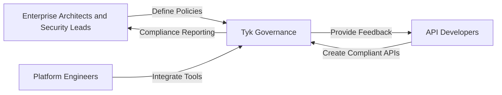

## Overview

Tyk Governance is a universal API governance hub that enables organizations to establish, enforce, and monitor governance policies across multiple API platforms and gateways. It solves the challenge of fragmented API management by providing a centralized approach to governance, regardless of where your APIs are hosted or which technologies they use.

In today's complex API ecosystems, organizations struggle with inconsistent standards, security vulnerabilities, and compliance gaps across different API platforms. Tyk Governance bridges these gaps by creating a unified governance layer that works seamlessly with Tyk and extends to third-party API platforms, such as AWS API Gateway.

## Key Benefits

* **Universal Governance** - Define and enforce consistent policies across multiple API platforms and styles (REST, GraphQL, event-driven) from a single control plane
* **Reduced Duplication** - Identify redundant or shadow APIs across different departments, reducing maintenance costs and security risks
* **Early Feedback** - Catch governance violations during design and development, not after deployment, reducing rework by up to 60%
* **Collaborative Improvement** - Enable teams to work together with shared visibility and clear ownership of APIs across the organization
* **Measurable API Maturity** - Track and improve API quality with quantifiable metrics across technical excellence, business impact, and developer experience

## Who Should Use Tyk Governance

Tyk Governance transforms API governance from a fragmented, post-deployment concern into a proactive, continuous, and scalable process across your entire API ecosystem.

### Enterprise Architects & Security Leads

Enterprise architects and security leads use Tyk Governance to establish organization-wide standards and ensure strategic alignment of the API program. They benefit from:

* Centralized visibility across all API platforms
* Comprehensive compliance reporting
* The ability to define tiered governance policies based on API criticality

**Example:** An enterprise architect at a financial services company uses Tyk Governance to ensure all customer-facing APIs comply with security and regulatory requirements, while allowing internal APIs to follow a lighter governance model.

### Platform Engineers

Platform engineers leverage Tyk Governance to build and maintain internal developer platforms that streamline API development. They value:

* Seamless integration of governance into CI/CD pipelines
* Self-service tools that empower developers
* Unified monitoring across environments

**Example:** A platform engineer integrates Tyk Governance into Tyk Dashboard and other API platforms, providing API templates that automatically incorporate security best practices and compliance requirements.

### API Developers

API developers rely on Tyk Governance to design and implement APIs that meet organizational standards from day one. They appreciate:

* Clear guidance on governance requirements
* Real-time feedback during development
* Reduced rework and faster release cycles

**Example:** An API developer receives immediate feedback that their new payment API is missing required rate-limiting policies, allowing them to fix the issue before submitting for review.