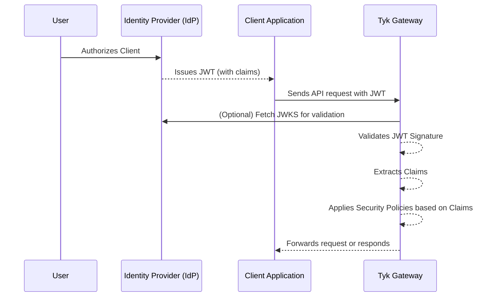

## Introduction

JSON Web Token (JWT) is an open standard ([RFC 7519](https://datatracker.ietf.org/doc/html/rfc7519)) that defines a compact and self-contained way for securely transmitting claims between parties as a JSON object. The information in the JSON object is digitally signed using either a secret (with the HMAC algorithm) or a public/private key pair (using RSA or ECDSA encryption) allowing the JWT to be used for client authentication.

### JWT Workflow

JWTs are commonly used in OAuth 2.0 and OpenID Connect flows to authenticate users and authorize access to APIs. The following diagram illustrates the typical flow of JWT authentication with Tyk Gateway:



1. **Token Issuance by Identity Provider (IdP):**
   The Identity Provider (IdP) issues a JWT with the appropriate claims. These claims represent the permissions granted by the user to the client application.

2. **Client as Token Bearer:**
   The Client Application acts as the *bearer* of the JWT (access token). Although the client may have access to multiple APIs, the user's delegated scopes restrict actual access. For example, a client with access to 5 APIs might only get a token allowing access to 2, depending on the user's delegation.

3. **JWT Presented to Tyk Gateway:**
   The client includes the JWT in its API requests to the Tyk Gateway as an access token.

4. **JWT Validation via JWK/JWKS:**
   Tyk validates the JWT's signature using a JSON Web Key (JWK). This key can be statically configured or dynamically fetched from the IdP via a JSON Web Key Set (JWKS) endpoint, supporting key rotation and multiple keys.

5. **Authorization via Claims and Policies:**
   Claims within the JWT can be used by Tyk Gateway's authorization process to configure rate and quota limits via Tyk's [Security Policy](/docs/api-management/policies) system. Within the API definition, JWT claims can be "mapped" onto security policies which will then be applied to the request.

6. **Stateless Authentication:**
   A key advantage of JWT authentication is that Tyk does not store any user credentials or session data. It never sees the user directly - it trusts the authorization server to have authenticated the user and issued a valid token.

### Key Benefits

This documentation is focused on how to use Tyk's JWT Auth and there are many excellent sources online where you can learn more about JWTs so we won't deep-dive into that topic, but to whet your appetite, here are some of the benefits from using JWT with Tyk:

- **Stateless Authentication**: Eliminates the need for server-side session storage, improving scalability.
- **Flexible Integration**: Works with multiple identity providers including Auth0, Okta, and custom JWT issuers.
- **Enhanced Security**: Supports multiple signature validation methods (RSA, ECDSA, HMAC) and claim verification.
- **Granular Access Control**: Leverage JWT claims for policy enforcement and scope-based permissions.
- **Performance Optimized**: Efficient token validation with minimal overhead and support for JWKS caching.

## Quick Start: Securing APIs with Auth0 or Keycloak

In this tutorial, we'll secure a Tyk OAS API using JWT authentication with either Auth0 or Keycloak as the identity provider.


<Note>
If you want to try out JWT Auth without linking up to a third-party IdP then you can skip step 1 and provide the base64 encoded public key for your JWT (in the `source` field rather than configuring `jwksURIs`) in step 3. You'll need to generate a JWT for the request, but otherwise everything stays the same. 

Now back to the tutorial...
</Note>


We'll start by configuring the identity provider, then set up JWT validation in Tyk, create a security policy, configure the API to use the policy, and finally test the secured API with a valid token.

### Prerequisites

- A Tyk installation (Cloud or Self-Managed) with Tyk Dashboard license
- An Auth0 account or Keycloak installation
- An existing Tyk OAS API (see [this tutorial](/docs/api-management/gateway-config-managing-oas#using-tyk-dashboard-api-designer-to-create-an-api))
- Postman, cURL, or another API testing tool

### Step-by-Step Guide

1. **Configure Your Identity Provider to obtain your JWKS URI**

    The first step is to configure your Identity Provider (IdP) to issue JWTs and provide a JWKS URI that Tyk can use to validate the tokens. Below are instructions for both Auth0 and Keycloak.

    <Tabs>
    <Tab title="Auth0 Setup">

    1. Log in to your Auth0 dashboard
    2. Navigate to Applications > APIs and click Create API
    3. Enter a name and identifier (audience) for your API
    4. Note your Auth0 domain (e.g. `your-tenant.auth0.com`)
    5. Your JWKS URI will be: `https://your-tenant.auth0.com/.well-known/jwks.json`

    </Tab>

    <Tab title="Keycloak Setup">

    1. Log in to your Keycloak admin console
    2. Create or select a realm (e.g. `tyk-demo`)
    3. Navigate to Clients and create a new client with:
          - Client ID: `tyk-api-client`
          - Client Protocol: `openid-connect`
          - Access Type: `confidential`
    4. After saving, go to the Installation tab and select "OIDC JSON" format
    5. Your JWKS URI will be: `http://your-keycloak-host/realms/tyk-demo/protocol/openid-connect/certs`

    </Tab>

    </Tabs>

2. **Create a Security Policy**

    1. In the Tyk Dashboard, navigate to **Policies**
    2. Click **Add Policy**
    3. Configure the policy:
          - Name: `JWT Auth Policy`
          - APIs: Select your Tyk OAS API
          - Access Rights: Configure appropriate paths and methods
          - Authentication: Select JWT
          - JWT Scope Claim Name: Enter the JWT claim that contains scopes (e.g. `scope` or `permissions`)
          - Required Scopes: Add any required scopes for access (optional)
    4. Click Create to save your policy

3. **Configure JWT Authentication in Tyk OAS API**

    1. Navigate to APIs and select your API
    2. Click **Edit**
    3. Enable **Authentication** in the **Server** section, select **JSON Web Token (JWT)** as the authentication method
    4. Configure the JWT settings:
          - Token Signing Method: Select `RSA Public Key`
          - Subject identity claim: Set to `sub`
          - JWKS Endpoint: Enter your JWKS URI for your IdP obtained in step 1
          - Policy claim: Set to `pol`
          - Default policy: Select `JWT Auth Policy` (the policy you created previously)
          - Clock Skew (optional): Set to accommodate time differences (e.g. `10`)
          - Authentication Token Location: `header`
          - Header Name: `Authorization`
          - Strip Authorization Data: `Enabled`
    5. Click **Save API**

4. **Test your API**

    1. Obtain a JWT from your IdP
    2. Make a request to your API providing the JWT as a Bearer token in the `Authorization` header; Tyk will validate the JWT using the JWKS that it retrieves from your JWKS URI
    3. Observe that the request is successful

    ```bash
        curl -X GET {API URL}  -H "Accept: application/json" -H "Authorization: Bearer {token}"
    ```

## How JWT Authentication works with Tyk

This diagram outlines the flow when using JWT Auth to secure access to your API.


1. Alice (the *user* or *resource owner*) authenticates with the Identity Provider (IdP) and consents to delegate specific permissions to a client application (steps 1 and 2).

2. The client application receives an authorization code, which it then exchanges for an access token (step 3). This is a bearer token, meaning that the client can present it to access protected resources on behalf of the user (resource owner / Alice).

3. When the client sends a request to the API gateway , it includes the access token (JWT) in the request - usually in the Authorization header as a Bearer token (step 4).

4. Tyk validates the token's signature, using the public key(s) of the trusted issuer (IdP):
    - locate the JWT in the request (header, cookie or query parameter)
    - decode the JWT
    - extract the `kid` (Key ID) from the token header
    - fetch the public keys from all configured JWKS URIs (or use locally declared static public key)
    - merge all the retrieved public keys into a single list
    - search this list for a public key matching the extracted `kid`
        - if no match is found, the validation fails, and the request is rejected
    - if a matching key is found, the JWT signature is validated using the parameters in the JWK
        - if signature validation fails, the request is rejected
    - if the token is valid and not expired, the request is authenticated as coming from the client, and is accepted

5. Next, Tyk will create an internal session for the request which will be used to control access rights, consumption limits and to identify the request in tracking logs (step 5). The session is linked to Alice using an identity that is [extracted from the JWT claims](/docs/api-management/authentication/jwt-authorization#identifying-the-session-owner).

6. In step 6 Tyk will proceed to enforce authorization by checking other claims to determine which Security Policies should be applied to the session:
    - check for the value in the policy claim within the JWT (identified by the value stored in `basePolicyClaims`)
    - use this to identify the Tyk Security Policy (or policies) to be applied to the request
        - if there is no direct policy mapping, then the `defaultPolicy` will be used
    - apply the identified policies to the session, configuring access rights, rate limits and usage quota 


## Configuring your API to use JWT authentication

The OpenAPI Specification treats JWT authentication as a variant of [bearer authentication](https://swagger.io/docs/specification/v3_0/authentication/bearer-authentication/) in the `components.securitySchemes` object using the `type: http`, `scheme: bearer` and `bearerFormat: jwt`:

```yaml
components:
  securitySchemes:
    myAuthScheme:
      type: http
      scheme: bearer
      bearerFormat: jwt

security:
  - myAuthScheme: []
```

With this configuration provided by the OpenAPI description, in the Tyk Vendor Extension we need to enable authentication, to select this security scheme and to indicate where Tyk should look for the credentials. Usually the credentials will be provided in the `Authorization` header, but Tyk is configurable, via the Tyk Vendor Extension, to support custom header keys and credential passing via query parameter or cooke.

```yaml
x-tyk-api-gateway:
  server:
    authentication:
      enabled: true
      securitySchemes:
        myAuthScheme:
          enabled: true
          header:
            enabled: true
            name: Authorization
```

**Note:** that URL query parameter keys and cookie names are case sensitive, whereas header names are case insensitive.

You can optionally [strip the user credentials](/docs/api-management/client-authentication#managing-authorization-data) from the request prior to proxying to the upstream using the `authentication.stripAuthorizationData` field (Tyk Classic: `strip_auth_data`).

With the JWT method selected, you'll need to configure Tyk to handle the specific configuration of JSON Web Tokens that clients will be providing. All of the JWT specific configuration is performed within the `authentication.jwt` object in the [Tyk Vendor Extension](/docs/api-management/gateway-config-tyk-oas#jwt).

### Locating the JWT in the Request

The OpenAPI Specification provides a `securitySchemes` mechanism that lets you define where the JWT should be located, for example in the request header. However, in practice, different clients may supply the token in different locations, such as a query parameter.

While OAS does not support this natively, the Tyk Vendor Extension does this by allowing configuration of alternative locations in the JWT entry in `server.authentication.securitySchemes`. Building on the previous example, we can add optional query and cookie locations as follows:

```yaml
x-tyk-api-gateway:
  server:
    authentication:
      enabled: true
      securitySchemes:
        myAuthScheme:
          enabled: true
          header:
            enabled: true
            name: Authorization
          query:
            enabled: true
            name: query-auth
          cookie:
            enabled: true
            name: cookie-auth
```

### Using Tyk Classic APIs

As noted in the Tyk Classic API [documentation](/docs/api-management/gateway-config-tyk-classic#configuring-authentication-for-tyk-classic-apis), you can select JSON Web Token authentication using the `use_jwt` option. Tyk Classic APIs do not natively support multiple JWKS endpoints, though a [custom authentication plugin](/docs/api-management/plugins/plugin-types#authentication-plugins) could be used to implement this functionality.