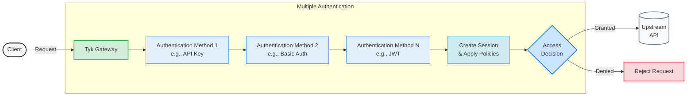

## Introduction 

Tyk provides flexible multi-authentication capabilities, allowing you to combine various [authentication methods](/docs/nightly/api-management/client-authentication#what-does-tyk-support) using different logical approaches:

- AND logic: All configured authentication methods must succeed before granting access
- OR logic: Any one of the configured authentication methods can grant access _(Tyk OAS APIs only)_

This enables scenarios such as requiring both Bearer Token authentication and Basic Auth simultaneously, or allowing access via either JWT validation or API key authentication.



## Use Cases

- **Multi-tenant APIs**: Different tenants using different identity providers
- **Migration scenarios**: Supporting both legacy and modern auth during transitions  
- **Partner integrations**: External partners use mTLS while internal users use JWT
- **Mobile + Web**: Different auth methods for different client types

{/* ## Quick Start

<TODO: Work in Progress>

In this quick-start guide, we will configure a Tyk OAS API with multiple authentication methods. We will demonstrate how to set up an API that supports both Basic Auth and API Key authentication, allowing clients to authenticate using either method.

### Prerequisites

- **Working Tyk Environment:** You need access to a running Tyk instance that includes both the Tyk Gateway and Tyk Dashboard components. For setup instructions using Docker, please refer to the [Tyk Quick Start](https://github.com/TykTechnologies/tyk-pro-docker-demo?tab=readme-ov-file#quick-start).
- **Curl**: These tools will be used for testing.

### Instructions

#### Create an API

#### Configuration

#### Testing */}

## Understanding Authentication Modes

```mermaid
graph LR
    Client([Client]) -->|Request| Gateway[Tyk Gateway]
    
    subgraph "Tyk Multiple Authentication"
        Gateway --> AuthConfig{Authentication<br />Configuration}
        
        %% Legacy Mode
        AuthConfig -->|Legacy Mode| LegacyAuth["AND Logic<br />(All must pass)"]
        LegacyAuth --> Auth1[Auth Method 1]
        Auth1 --> Auth2[Auth Method 2]
        Auth2 --> SessionCreation["Create Session<br />(from BaseIdentityProvider)"]
        
        %% Compliant Mode
        AuthConfig -->|Compliant Mode| CompliantAuth["OR Logic<br />(Any group can pass)"]
        CompliantAuth --> Group1["Group 1<br />(AND Logic)"]
        CompliantAuth --> Group2["Group 2<br />(AND Logic)"]
        
        Group1 --> G1Auth1["Auth Method A"]
        G1Auth1 --> G1Auth2["Auth Method B"]
        
        Group2 --> G2Auth1["Auth Method C"]
        G2Auth1 --> G2Auth2["Auth Method D"]
        
        G1Auth2 --> DynamicSession1["Create Session<br />(from last auth in group)"]
        G2Auth2 --> DynamicSession2["Create Session<br />(from last auth in group)"]
        
        SessionCreation --> AccessDecision
        DynamicSession1 --> AccessDecision
        DynamicSession2 --> AccessDecision
        
        AccessDecision{Access<br />Decision}
    end
    
    AccessDecision -->|Granted| Upstream[(Upstream<br />API)]
    AccessDecision -->|Denied| Reject[Reject Request]
    
    %% Styling
    classDef client fill:#f9f9f9,stroke:#333,stroke-width:2px
    classDef gateway fill:#d4edda,stroke:#28a745,stroke-width:2px
    classDef auth fill:#e2f0fb,stroke:#0275d8,stroke-width:1px
    classDef group fill:#fff3cd,stroke:#ffc107,stroke-width:1px
    classDef session fill:#d1ecf1,stroke:#17a2b8,stroke-width:1px
    classDef decision fill:#cce5ff,stroke:#0275d8,stroke-width:2px
    classDef upstream fill:#f8f9fa,stroke:#6c757d,stroke-width:2px
    classDef reject fill:#f8d7da,stroke:#dc3545,stroke-width:2px
    
    class Client client
    class Gateway gateway
    class Auth1,Auth2,G1Auth1,G1Auth2,G2Auth1,G2Auth2,LegacyAuth,CompliantAuth auth
    class Group1,Group2 group
    class SessionCreation,DynamicSession1,DynamicSession2 session
    class AuthConfig,AccessDecision decision
    class Upstream upstream
    class Reject reject
```



Tyk OAS offers two modes for configuring multiple authentication methods:

- **Legacy Mode** (Default): Maintains backward compatibility with existing Tyk implementations using AND logic only
- **Compliant Mode**: Introduced in 5.10.0, provides enhanced flexibility by supporting both AND and OR logic between authentication methods


    <Note>
    Tyk Classic APIs and pre-5.10 Tyk OAS APIs only support the legacy mode.
    </Note>


### Legacy Mode

The Legacy mode is the traditional implementation of multi-auth, supported by Tyk Classic APIs and Tyk OAS APIs prior to Tyk 5.10. 

In this mode, all configured authentication methods must be satisfied in the request (i.e., they are combined using AND logic).

**How does the operation differ between Tyk Classic and Tyk OAS APIs?**

- **Tyk Classic API**: All configured authentication methods must be satisfied in the request

- **Tyk OAS API**: Only the **first** security requirement object in the OpenAPI description's `security` array is processed. All the authentication methods in the first object must be satisfied in the request, together with any proprietary auth methods `enabled` in the Tyk Vendor Extension.

    ```
    security:
      - api_key: []      # this security requirement is processed: both methods must be satisfied
        basic_auth: []  
      - jwt_auth: []     # Ignored in Legacy mode
    ```

#### Session Object Handling

In Legacy mode, the `baseIdentityProvider` setting determines which authentication method provides the [session object](/docs/nightly/api-management/policies#what-is-a-session-object). This setting must be configured to one of auth methods in the logical rule using the following mapping:

- `auth_token` - for token-based authentication
- `jwt_claim` - for JWT authentication
- `basic_auth_user` - for Basic Authentication
- `hmac_key` - for HMAC authentication
- `custom_auth` - for custom authentication plugin


### Compliant Mode

The Compliant mode is named as such because Tyk complies with the security requirements declared in the OpenAPI description, combining different authentication methods using AND and OR logic as required.

#### OpenAPI Security Requirements

In OpenAPI, security is defined using **Security Requirement Objects** in the `security` section:

```
security:
  - api_key: []
    basic_auth: []  
  - jwt_auth: []
    oauth2: []
```

- Each security requirement object in the OAS `security` array represents an **alternative**, these are evaluated with **OR** logic.
- Within a single security requirement object, multiple security schemes can be declared and will combined using **AND** logic (i.e., all listed schemes must succeed together).
- A request is authorized if **any one** of the defined security requirement objects is successfully validated.
- The session object is determined dynamically based on which security requirement is satisfied
- This structure enables **multi-auth configurations**, supporting both **combined (AND)** and **alternative (OR)** authentication methods.

#### How OR Logic Works

When using Compliant mode with multiple security requirements:

- Tyk attempts each authentication method in sequence
- If any method succeeds, the request is authorized
- If all methods fail, the request is rejected with the error from the last attempted method

#### How AND Logic Works

Within a single security requirement object that contains multiple schemes:

- All schemes within that security requirement must be satisfied (AND logic)
- The request is only authorized if all schemes are valid
- If any scheme fails, the entire security requirement fails, and Tyk moves to the next one
- This allows for combining different authentication methods that must all be present

#### Examples

Here's an example `security` object from an OpenAPI description with both AND and OR logic:

```json
{
  "security": [
    {
      "scheme1": []
    },
    {
      "scheme2": [],
      "scheme3": []
    }
  ]
}
```
You will notice that the `security` object should contain references to security schemes that you've defined in the `components.securitySchemes` section of the OpenAPI description.
In this example, the request will be authorized if either:
- `scheme1` is provided (first security requirement)
- OR
- Both `scheme2` AND `scheme3` are provided (second security requirement with AND logic)

#### Session Object Handling

The [session object](/docs/nightly/api-management/policies#what-is-a-session-object) (determining rate limits, quotas, and access rights) comes from the successful authentication method. This allows different auth methods to have different associated policies and permissions.

When using **Compliant** mode, the session object handling is more dynamic:

1. Between different security requirement objects (OR logic): The first security requirement that successfully authenticates will provide the session object.

2. Within a single security requirement object (AND logic): When multiple authentication methods are specified in the same requirement object (as in your example below), all methods must pass, and the **last** successfully processed authentication method will provide the session object.

Auth methods are always validated in the following order (and skipped if not included in the security requirement):

1. [Tyk OAuth 2.0](/docs/nightly/api-management/authentication/oauth-2)
2. External OAuth (([deprecated](/docs/nightly/api-management/client-authentication#integrate-with-external-authorization-server-deprecated))
3. [Basic Auth](/docs/nightly/api-management/authentication/basic-authentication)
4. [HMAC](/docs/nightly/basic-config-and-security/security/authentication-authorization/hmac-signatures)
5. [JWT](/docs/nightly/basic-config-and-security/security/authentication-authorization/json-web-tokens)
6. OpenID Connect ([deprecated](/docs/nightly/api-management/client-authentication#integrate-with-openid-connect-deprecated))
7. [Custom Plugin Auth](/docs/nightly/api-management/authentication/custom-auth)
8. [Bearer / Auth Token](/docs/nightly/api-management/authentication/bearer-token) (API Key)

For example, if this security requirement is satisfied in the request, the session metadata will come from the Auth Token, despite it being declared first in the security requirement:

```
security:
  - api_key: []
    basic_auth: []  
```


### Choosing the Right Mode

**Use Legacy Mode when:**

- Migrating from or using Tyk Classic APIs
- You need the session metadata to be taken from an auth method earlier in the middleware processing order

**Use Compliant Mode when:**

- You need alternative auth methods (OR logic)
- Supporting multiple client types or identity providers
- For APIs that need to serve diverse client bases with different security requirements
- Building new APIs with flexible authentication requirements

## Configuration Options

### Security Processing Mode

The `securityProcessingMode` option in the Tyk Vendor Extension allows you to specify which mode to use when processing the `security` configuration in your API. This controls how Tyk will interpret the authentication settings in the OpenAPI description and the Vendor Extension.

```yaml
x-tyk-api-gateway:
  server:
    authentication:
      securityProcessingMode: compliant // or legacy
```

### Basic Example: API with Multiple Auth Methods

Here's a simple example of an OpenAPI description that declares JWT and API Key security schemes:

```yaml
# Example: API supporting either JWT OR API Key authentication
components:
  securitySchemes:
    api_key:
      type: apiKey
      name: X-API-Key
      in: header
      description: "API key for service-to-service authentication"
    jwt_auth:
      type: http
      scheme: bearer
      bearerFormat: JWT
      description: "JWT token for user authentication"
security:
  - api_key: []      # Option 1: API key only
  - jwt_auth: []     # Option 2: JWT only
```

- If the `securityProcessingMode` in the Tyk Vendor Extension is set to `compliant`, Tyk will check incoming requests against each `security` option in turn, authenticating requests using Option 1 or Option 2.
- If the `securityProcessingMode` is set to `legacy` (or is omitted), Tyk will check requests only against the first `security` option (Option 1).


### Configuring Multiple Auth Methods in the API Designer

You can configure chained authentication by following these steps:

1. Enable **Authentication** in the **Servers** section

2. Select the **Multiple Authentication Mechanisms** option from the drop-down list.

3. Select the **Authentication Mode** that you wish to use: [Compliant](/docs/nightly/basic-config-and-security/security/authentication-authorization/multiple-auth#compliant-mode) or [Legacy](/docs/nightly/basic-config-and-security/security/authentication-authorization/multiple-auth#legacy-mode)

    <Tabs>
    <Tab title="Compliant mode">

    Select **Compliant mode** for full interpretation of the security requirements declared in the OpenAPI description, allowing for fully flexible authentication of your API clients:
    
        
    
    Use the API Editor view to configure the different security schemes and requirements to satisfy the client authentication needs of your API:
    
     

    </Tab>
    <Tab title="Legacy mode">

    Use Legacy mode for simple scenarios where you can select the **Authentication methods** that the client must satisfy in the request.
    
    You must identify the **Base identity provider** that will provide the session metadata:

      

    You can now configure each authentication method in the usual manner using the options in the API designer.

    

    </Tab>

    </Tabs>  


## Advanced Configuration

### Using Proprietary Auth Methods

Compliant mode allows you to combine standard OpenAPI security schemes with Tyk's proprietary authentication methods by extending the OpenAPI `security` section into the Tyk Vendor Extension:

```yaml
components:
  securitySchemes:
    api_key:
      type: apiKey
      name: Authorization
      in: header
    jwt_auth:
      type: http
      scheme: bearer
      bearerFormat: JWT
security:
  - jwt_auth: []
x-tyk-api-gateway:
  server:
    authentication:
      securityProcessingMode: compliant
      security:
      - - hmac
        - api_key
      - - custom_auth
      securitySchemes:
        hmac:
          enabled: true
        custom_auth:
          enabled: true
          config:
            authType: coprocess
```

The extended security requirements in the vendor extension (`x-tyk-api-gateway.server.authentication.security`) are concatenated onto the requirements declared in the OpenAPI description. This configuration allows three authentication methods: JWT, API Key with HMAC, and Custom Auth.

## Migration Considerations

### Moving from Legacy to Compliant Mode


<Note>
If you change the security processing mode for an existing API from the Dashboard's API Designer, Tyk will add the `securityProcessingMode` field to your Vendor Extension, but will not make any other changes to the API's configuration. You may need to make adjustments to the OpenAPI description or Vendor Extension to ensure that the authentication rules are set correctly.
</Note>


When migrating from Legacy to Compliant mode:

- Review your API's authentication configuration
- Ensure all required security schemes are properly defined, for example any use of Tyk proprietary auth methods (HMAC, custom authentication) will need to be reflected with creation of new security requirements within the Vendor Extension's `security` section and removal of requirements from the OpenAPI description's `security` section
- Test thoroughly, as authentication behavior will change
- Be aware that the session object may come from different sources depending on which auth method succeeds

### Backward Compatibility

*Legacy* mode ensures backward compatibility with existing Tyk implementations. If you're unsure which mode to use, start with *Legacy* mode and migrate to *Compliant* mode when ready.

## Troubleshooting

<AccordionGroup>
<Accordion title={'Authentication Fails Unexpectedly'}>
**Problem**: API returns 401 errors even with valid credentials.

**Possible Causes & Solutions**:

1. Security schemes not properly defined

    ```yaml
    # ❌ Incorrect - missing security scheme definition
    security:
      - api_key: []
    # No corresponding securitySchemes definition

    # ✅ Correct - complete definition
    components:
      securitySchemes:
        api_key:
          type: apiKey
          name: Authorization
          in: header
    security:
      - api_key: []
    ```

2. Security schemes not enabled in Tyk extension

    ```yaml
    x-tyk-api-gateway:
      server:
        authentication:
          securityProcessingMode: compliant
          securitySchemes:
            api_key:
              enabled: true  # ← Must be explicitly enabled
    ```
      
3. Mixed Legacy/Compliant configuration

    - Ensure you're not mixing `baseIdentityProvider` (Legacy) with complex security arrays (Compliant)
    - Check that `securityProcessingMode` matches your intended configuration
</Accordion>

<Accordion title={'Wrong Policies or Rate Limits Applied'}>
**Problem**: Requests are authenticated but get unexpected rate limits or access denials.

**Root Cause**: In Compliant mode, the session object comes from whichever authentication method succeeds first.

**Solutions**:

1. Review security requirement order - Place most restrictive auth methods first:

    ```yaml
    security:
      - premium_jwt: []     # Premium users (higher limits)
      - basic_api_key: []   # Basic users (lower limits)
      ```

2. Ensure consistent policies across auth methods:

    - Verify that API keys and JWT tokens for the same user have similar access rights
    - Check that rate limits align with your business logic

3. Debug session source:

    ```bash
    # Enable debug logging to see which auth method succeeded
    "log_level": "debug"
    ```
</Accordion>

<Accordion title={'Performance Issues'}>
**Problem**: Slower response times with multiple authentication methods.

**Expected Behavior**: Some performance impact is normal due to additional processing.

**Optimization**:

1. Order security requirements by likelihood:

    ```yaml
    security:
      - most_common_auth: []    # Try most common first
      - fallback_auth: []       # Fallback for edge cases
    ```

2. Monitor authentication attempts:

    ```bash
    # Look for "OR wrapper" log entries showing auth attempts
    grep "OR wrapper" /var/log/tyk/tyk.log
    ```
</Accordion>

<Accordion title={'Debugging Tips'}>
Enable detailed logging in your Tyk Gateway to see which authentication methods are being attempted and which one succeeds:

```json
{
  "global": {
    "log_level": "debug"
  }
}
```

Look for these log entries:
- `Processing multiple security requirements (OR conditions)`
    - Confirms Compliant mode is active
- `OR wrapper` entries
    - In Compliant mode, this shows which auth methods are being tried
- `BaseIdentityProvider set to`
    - In Legacy mode, this shows which auth method succeeded
</Accordion>
</AccordionGroup> 
