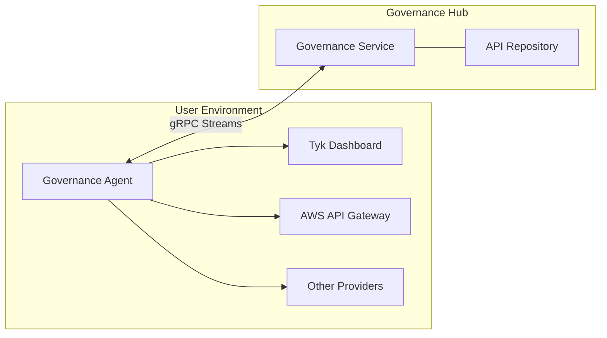

<Note>
**Note for Tyk Cloud Users**

This documentation is for users who run their self-managed agents. If you're using Tyk Cloud, agents are automatically managed for your Tyk Dashboard, and you don't need to worry about installation, access tokens, or configuration. You can use the "Agents" and "API Provider" pages in the Tyk Cloud dashboard to check connection health between the agents and Governance Hub.
</Note>


## Availability

- Version: Available since v0.2

## Overview

Agent and API Provider Management enables you to deploy, configure, and monitor the Tyk Governance agents that discover and synchronize APIs from various providers.

### Understanding Agents and API Providers

**Agents** are lightweight services that act as secure bridges between your API providers and the Tyk Governance Hub. They:

- Run in your environment (on-premises, cloud, or hybrid)
- Connect to one or more API providers to discover APIs
- Securely transmit API data to the Governance Hub
- Support high availability deployments
- Can be monitored through the "Agents" section in the UI

**API Providers** are the systems where your APIs are defined and managed, such as:

- Tyk Dashboard
- AWS API Gateway

Each provider is configured within an agent and can be monitored through the "API Providers" section in the UI, where you can see:

- How many APIs are discovered from each provider
- The connection status of each provider
- The last synchronization time
- Provider-specific details

### Key Benefits

- **Centralized Agent Visibility**: Monitor all agents from a single dashboard
- **Scheduled Synchronization**: Configure automatic API discovery at regular intervals
- **High Availability Deployment**: Deploy multiple agent replicas with automatic leader election
- **Detailed Status Monitoring**: Track agent health, connection status, and synchronization history
- **Secure Communication**: All agent-to-hub communication is encrypted and authenticated

### Dependencies

- Requires Tyk Governance and agents v0.2 or higher
- Agents support Kubernetes-based high availability, which requires Kubernetes cluster access

## Quick Start

In this tutorial, we'll set up a new agent, configure it to connect to an API provider, and monitor its status.

### Prerequisites

- Access to Tyk Governance Hub
- Access to an API provider (Tyk Dashboard or AWS API Gateway)
- A server or container environment to run the agent

### Step-by-Step

1. **Create a New Agent**

    - From the Agents page, click the **New agent** button in the top-right corner.

        

    - In the New agent form, enter:
       - **Name**: A descriptive name for the agent (required)
       - **Description**: Details about the agent's purpose or location (required)

        

    - Click **Create agent** to save the new agent.

        

    - Alternatively, use the API to create a new agent:

        ```sh
        # Replace with your actual Governance URL and API key
        GOVERNANCE_URL="https://your-governance-instance.tyk.io"
        API_KEY="your-access-key"
        AGENT_NAME="My API Provider Agent"

        # Create agent
        curl -s -X POST "${GOVERNANCE_URL}/api/agents/" \
            -H "X-API-Key: ${API_KEY}" \
            -H "Content-Type: application/json" \
            -d '{
                "name": "'"${AGENT_NAME}"'"
            }'
        ```

        Note the agent ID returned in the response:

        ```json
        {"id":"a51d9bd0-bafe-4749-8285-e18641b151f2","name":"My API Provider Agent","last_heartbeat":"0001-01-01T00:00:00Z","status":"INACTIVE","providers":null}
        ```

2. **Generate an Agent Token**

   - In the Agent information section, find the Access token field.

   - If no token exists, click **Generate new access token**.

   - For existing tokens:
        - Click the eye icon to show/hide the token
        - Use the copy icon to copy the token to your clipboard
        - Use this token in your agent configuration file

        

        

    - Alternatively, generate an authentication token for the agent using the API:

        ```sh
        # Replace with the agent ID from the previous step
        AGENT_ID="a51d9bd0-bafe-4749-8285-e18641b151f2"

        # Generate token
        curl -X POST "${GOVERNANCE_URL}/api/auth/token/" \
            -H "X-API-Key: ${API_KEY}" \
            -H "Content-Type: application/json" \
            -d '{
                "agent_id": "'"${AGENT_ID}"'"
            }'
        ```

        Save the token from the response:

        ```json
        {
            "token": "eyJhbGciOiJIUzI1NiIsInR5cCI6IkpXVCJ9..."
        }
        ```

3. **Create Agent Configuration File**

    Create a file named `agent-config.yaml` with the following content:

    ```yaml
    # Tyk Governance Agent Configuration
    governanceDashboard:
        server:
            # The gRPC endpoint URL of the Tyk Governance service
            url: "your-governance-instance.tyk.io:50051"
        
        auth:
            # Authentication token for this agent
            token: "your-agent-token"

    # API Provider Configurations
    instances:
        # Example Tyk Provider Configuration
        - name: "tyk-provider"
        type: "tyk"
        config:
            host: "http://your-tyk-dashboard:3000"
            auth: "your-tyk-dashboard-api-key"
        
        # Example AWS API Gateway Configuration
        - name: "aws-provider"
        type: "aws"
        config:
            accessKeyId: "your-aws-access-key-id"
            accessKeySecret: "your-aws-access-key-secret"
            region: "us-east-1"
    ```

4. **Deploy the Agent**

    Run the agent using Docker or as a Kubernetes Deployment. See [Installation](/docs/tyk-governance/installation#deploy-the-agent) for details.

5. **Monitor Agent Status**

    - Check the agent status in the Governance Hub. A healthy agent will appear as "Healthy":

        

    - Check the agent status in the Governance Hub using API:

        ```sh
        curl "${GOVERNANCE_URL}/api/agents/${AGENT_ID}" \
            -H "X-API-Key: ${API_KEY}"
        ```

        A healthy agent will show:

        ```json
        {
            "id": "a51d9bd0-bafe-4749-8285-e18641b151f2",
            "name": "My API Provider Agent",
            "last_heartbeat": "2025-07-16T12:34:56Z",
            "status": "ACTIVE",
            "providers": [
                {
                    "name": "tyk-provider",
                    "type": "tyk"
                },
                {
                    "name": "aws-provider",
                    "type": "aws"
                }
            ]
        }
        ```

6. **Trigger Initial Synchronization**

    Trigger a [synchronization](/docs/#synchronization-process) to verify the agent is working correctly.

### Validation

- The agent should appear as "Healthy" or have status as "ACTIVE" in the agent list
- The agent's last heartbeat timestamp should be recent
- After synchronization, APIs from your providers should appear in the API Repository

## How It Works

Agent Management works through a distributed architecture where agents deployed in your environments connect to the central Governance Hub using secure gRPC streams.

### Agent Architecture



The agent establishes two persistent gRPC streams with the Governance Hub:

1. **Health Stream**: Sends regular heartbeats to indicate the agent is alive and functioning
2. **Sync Stream**: Used for API synchronization operations

When multiple agent replicas are deployed with leader election enabled, they use Kubernetes leader election to ensure only one instance actively performs synchronization, while others stand by as hot backups.

### Synchronization Process

Synchronization can be triggered in three ways:

1. **Manual Trigger**: Through the Governance Hub UI or API

    

2. **Scheduled Sync**: At regular intervals configured in the agent. See [Understanding Scheduled Synchronization](/docs/#understanding-scheduled-synchronization).
   
3. **Initial Connection**: When an agent first connects to the Governance Hub

#### Understanding Scheduled Synchronization

You can configure scheduled synchronization for each API provider using the **Governance Hub API (Hub-side scheduling)**.

Use the `/api/agents/{id}/sync-jobs` endpoint to configure provider-specific schedules:

```sh
# Schedule sync for a specific provider
curl -X POST "${GOVERNANCE_URL}/api/agents/${AGENT_ID}/sync-jobs" \
   -H "X-API-Key: ${API_KEY}" \
   -H "Content-Type: application/json" \
   -d '{
        "repeat_every": "12h",
        "provider": "tyk-provider",
        "start_from": "2023-06-01T12:00:00Z"
   }'
```

With this approach:
- The Governance Hub's scheduler component manages the schedule
- The Hub initiates synchronization by sending requests to the agent
- It's a "push" model where the Hub tells the agent when to sync
- You can set different schedules for different providers
- Supports Go duration format (e.g., "1h", "12h", "7d")

During synchronization:

1. The agent receives a sync request from the hub (or initiates it based on its schedule)
2. The agent queries each configured API provider for APIs
3. The agent processes and normalizes the API definitions
4. The agent streams the API definitions to the hub
5. The hub processes and stores the API definitions
6. The hub reconciles the API inventory, marking missing APIs as deleted

### Deployment Scenarios

#### Multi-Provider API Discovery

Deploy agents to connect to different API providers across your organization, creating a comprehensive API inventory that spans platforms.

```yaml
# Agent configuration with multiple providers
instances:
  - name: "tyk-dashboard"
    type: "tyk"
    config:
      host: "http://tyk-dashboard:3000"
      auth: "your-tyk-api-key"
  
  - name: "aws-us-east"
    type: "aws"
    config:
      accessKeyId: "your-aws-access-key"
      accessKeySecret: "your-aws-secret-key"
      region: "us-east-1"
  
  - name: "aws-eu-west"
    type: "aws"
    config:
      accessKeyId: "your-aws-access-key"
      accessKeySecret: "your-aws-secret-key"
      region: "eu-west-1"
```

#### High Availability Agent Deployment

Deploy multiple agent replicas in Kubernetes to ensure continuous API discovery even if some instances fail.

```yaml
# Kubernetes deployment with leader election
apiVersion: apps/v1
kind: Deployment
metadata:
  name: governance-agent
spec:
  replicas: 3  # Multiple replicas for redundancy
  template:
    spec:
      containers:
      - name: agent
        env:
        - name: POD_NAME # When leader election is enabled, POD_NAME environment variables must be set
          valueFrom:
            fieldRef:
              fieldPath: metadata.name
        - name: POD_NAMESPACE # When leader election is enabled, POD_NAMESPACE environment variables must be set
          valueFrom:
            fieldRef:
              fieldPath: metadata.namespace
        - name: TYK_AGENT_LEADERELECTION_ENABLED
          value: "true"
```

## Configuration Options

### Agent Configuration File

The agent is configured using a YAML configuration file with the following sections:

#### Core Configuration

```yaml
# Governance Dashboard Connection
governanceDashboard:
  server:
    url: "your-governance-instance.tyk.io:50051"
  auth:
    token: "your-agent-token"

# Log level (debug, info, warn, error)
logLevel: info

# Health probe configuration
healthProbe:
  server:
    port: 5959
```

#### API Provider Configuration

```yaml
# API Provider Configurations
instances:
  # Tyk Provider
  - name: "tyk-provider"
    type: "tyk"
    config:
      host: "http://dashboard:3000"
      auth: "your-tyk-api-key"
  
  # AWS API Gateway Provider
  - name: "aws-provider"
    type: "aws"
    config:
      accessKeyId: "your-aws-access-key-id"
      accessKeySecret: "your-aws-access-key-secret"
      region: "us-east-1"
      # Optional session token for temporary credentials
      sessionToken: "your-aws-session-token"
```

#### gRPC Connection (New in v0.2)

```yaml
rpc:
  # Keepalive configures the keepalive settings for the gRPC connection.
  keepalive:
    # Enabled controls whether keepalive is enabled.
    enabled: true
    # Time is the duration after which if there are no activities, ping will be sent.
    time: 30s
    # Timeout is the duration the client waits for a response to a keepalive ping.
    timeout: 20s
    # PermitWithoutStream if true allows sending pings even without active streams.
    permitWithoutStream: true
```

#### High Availability Configuration (New in v0.2)

```yaml
leaderElection:
  # Enable or disable leader election
  enabled: true
  # Name of the Kubernetes lease object used for leader election
  leaseName: "governance-agent-lock"
  # Namespace where the lease object will be created
  # If not specified, the agent's namespace will be used
  leaseNamespace: ""
  # Duration that non-leader candidates will wait before attempting to acquire leadership
  leaseDuration: "15s"
  # Duration that the acting leader will retry refreshing leadership before giving up
  renewDeadline: "10s"
  # Duration the leader elector clients should wait between leadership acquisition attempts
  retryPeriod: "2s"
```

### Environment Variables

The agent supports configuration through environment variables:

| Environment Variable | Description | Default Value |
| :--------------------- | :------------- | :--------------- |
| `TYK_AGENT_LICENSEKEY` | Your Tyk Governance license key | - |
| `TYK_AGENT_LOGLEVEL` | Log level (debug, info, warn, error) | `info` |
| `TYK_AGENT_GOVERNANCEDASHBOARD_SERVER_URL` | The gRPC endpoint URL of the Tyk Governance service | - |
| `TYK_AGENT_GOVERNANCEDASHBOARD_SERVER_TLS_ENABLED` | Enable TLS for gRPC connections | `false` |
| `TYK_AGENT_GOVERNANCEDASHBOARD_SERVER_TLS_CACERTPATH` | Path to CA certificate | - |
| `TYK_AGENT_GOVERNANCEDASHBOARD_SERVER_TLS_CLIENTCERTPATH` | Path to client certificate (for mTLS) | - |
| `TYK_AGENT_GOVERNANCEDASHBOARD_SERVER_TLS_CLIENTKEYPATH` | Path to client key (for mTLS) | - |
| `TYK_AGENT_GOVERNANCEDASHBOARD_SERVER_TLS_INSECURESKIPVERIFY` | Skip verification of server certificate | `false` |
| `TYK_AGENT_GOVERNANCEDASHBOARD_AUTH_TOKEN` | Authentication token for the agent | - |
| `TYK_AGENT_HEALTHPROBE_SERVER_PORT` | Port for health probe server | `5959` |

### gRPC Connection Variables (New in v0.2)

| Environment Variable | Description | Default Value |
| :--------------------- | :------------- | :--------------- |
|`TYK_AGENT_RPC_KEEPALIVE_ENABLED`|Enables/disables keepalive|`true`|
|`TYK_AGENT_RPC_KEEPALIVE_TIME`|Duration after which ping is sent|`30s`|
|`TYK_AGENT_RPC_KEEPALIVE_TIMEOUT`|Duration client waits for ping response from the server|`20s`|
|`TYK_AGENT_RPC_KEEPALIVE_PERMITWITHOUTSTREAM`|Allows sending pings without active streams|`true`|

### Leader Election Variables (New in v0.2)

| Environment Variable | Description | Default Value |
| :--------------------- | :------------- | :--------------- |
|`TYK_AGENT_LEADERELECTION_ENABLED`|Enable Kubernetes leader election|`false`|
|`TYK_AGENT_LEADERELECTION_LEASENAME`|Name of the lease object|`governance-agent-lock`|
|`TYK_AGENT_LEADERELECTION_LEASENAMESPACE`|Namespace for the lease object|Agent's namespace|
|`TYK_AGENT_LEADERELECTION_LEASEDURATION`|Duration for lease|`15s`|
|`TYK_AGENT_LEADERELECTION_RENEWDEADLINE`|Deadline for renewing leadership|`10s`|
|`TYK_AGENT_LEADERELECTION_RETRYPERIOD`|Period between retry attempts|`2s`|

#### Required Environment Variables for Leader Election

When leader election is enabled, the following environment variables must also be set:

- `POD_NAME`: The name of the pod (used as the identity for leader election)
- `POD_NAMESPACE`: The namespace of the pod (used for creating the lease object)

These are typically set automatically when deploying with Kubernetes using the downward API:

```yaml
env:
  - name: POD_NAME
    valueFrom:
      fieldRef:
        fieldPath: metadata.name
  - name: POD_NAMESPACE
    valueFrom:
      fieldRef:
        fieldPath: metadata.namespace
```

## Use Cases

### Multi-Region API Discovery

For organizations with APIs deployed across multiple geographic regions, deploy region-specific agents to efficiently discover and monitor APIs while respecting network boundaries.

**Implementation:**

1. Deploy agents in each region where APIs are hosted
2. Configure each agent with the appropriate regional API providers
3. Use descriptive names to identify regional agents
4. Monitor all agents from the central Governance Hub

**Benefits:**

- Reduced latency for API discovery operations
- Respect for network boundaries and security zones
- Improved reliability with region-specific agents
- Clear organization of APIs by region

### Secure Environment Bridging

For organizations with strict network segmentation, use agents to securely bridge between isolated environments without compromising security boundaries.

**Implementation:**

1. Deploy agents in each network segment
2. Configure outbound-only connections from agents to the Governance Hub
3. Use separate agents for production and non-production environments
4. Implement appropriate network security controls around agent traffic

**Benefits:**

- Maintain network isolation while enabling governance
- No inbound connections required to sensitive environments
- Granular control over which APIs are discovered
- Separation of concerns between environments

### Automated API Lifecycle Tracking

Use scheduled synchronization to automatically track the lifecycle of APIs, including when they're created, updated, or deleted from source providers.

**Implementation:**

1. Configure agents with scheduled synchronization
2. Set appropriate sync intervals based on change frequency
3. Use the API Repository to monitor API status
4. Create reports showing API lifecycle events

**Benefits:**

- Automatic detection of API changes
- Historical record of API lifecycle events
- Reduced manual tracking effort
- Improved visibility into API landscape evolution

## Best Practices and Recommendations

- **Use descriptive agent names** that indicate their purpose and scope
- **Deploy agents close to API providers** to minimize latency and network issues
- **Configure appropriate sync intervals** based on how frequently your APIs change
- **Use leader election for high availability** when deploying multiple agent replicas
- **Monitor agent health regularly** to ensure continuous API discovery
- **Rotate API provider credentials periodically** for better security
- **Use the principle of least privilege** when configuring API provider credentials
- **Start with manual syncs** before enabling scheduled synchronization
- **Implement network security controls** around agent traffic
- **Maintain agent versions** to ensure compatibility with the Governance Hub

## FAQs

<AccordionGroup>
<Accordion title={'How many agents do I need?'}>
The number of agents depends on your API landscape. Generally, you should consider deploying separate agents for:

- Different network segments or security zones
- Different geographic regions
- Different environments (production vs. non-production)
- Different API provider types with many APIs

A single agent can connect to multiple API providers of different types, so you don't necessarily need one agent per provider.
</Accordion>

<Accordion title={'What happens if an agent goes offline?'}>
If an agent goes offline, it will be marked as "INACTIVE" in the Governance Hub after missing several heartbeats. APIs discovered by that agent will remain in the repository but won't be updated until the agent reconnects or another agent is configured to find out the same APIs.

When using high availability with leader election, if the leader agent goes offline, another replica will automatically take over the leadership role and continue synchronization operations.
</Accordion>

<Accordion title={'How secure is the agent-to-hub communication?'}>
All communication between agents and the Governance Hub is secured using:

- TLS encryption for all traffic
- JWT token-based authentication
- Regular token validation
- Bidirectional stream validation

The agent only requires outbound connectivity to the Governance Hub, with no inbound connections required.
</Accordion>

<Accordion title={'What permissions do agents need for API providers?'}>
Agents require read-only access to API configurations:

- For Tyk Dashboard: An API key with read access to APIs and policies
- For AWS API Gateway: IAM credentials with permissions to list and get API Gateway resources
- For other providers: Similar read-only access to API configurations

The agent never requires write access to API providers.
</Accordion>
</AccordionGroup>

## Troubleshooting

<AccordionGroup>
<Accordion title={'Agent shows as "INACTIVE"'}>
- Check if the agent process is running
- Verify network connectivity to the Governance Hub
- Ensure the agent token is valid and not expired
- Check agent logs for connection errors
- Verify the Governance Hub URL is correct
- Ensure the agent has outbound access to the hub's gRPC port. It is usually 50051 for self-managed instances. For Tyk Cloud managed instance, it is proxied through port 443.
</Accordion>

<Accordion title={'Agent connects but no APIs are discovered'}>
- Verify API provider credentials are correct
- Check agent logs for provider connection errors
- Ensure the provider has APIs configured
- Try triggering a manual sync operation
- Check agent configuration for correct provider URLs
- Verify the agent has network access to the API providers
</Accordion>

<Accordion title={'Multiple agents running when using leader election'}>
- Verify leader election is properly configured
- Check if agents are in the same Kubernetes namespace
- Ensure agents are using the same lock name
- Check Kubernetes permissions for leader election
- Verify Kubernetes API access from agent pods
- Check agent logs for leader election messages
</Accordion>

<Accordion title={'Scheduled sync not working'}>
- Ensure the agent has been running long enough for a scheduled sync
- Check agent logs for scheduled sync messages
- Try restarting the agent to reset the schedule
- Verify the agent is the leader if using leader election
</Accordion>
</AccordionGroup>

