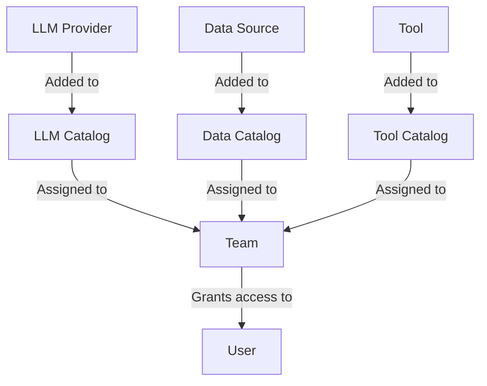

## Availability

| Edition | Deployment Type |
| :------------- | :---------------------- |
| [Enterprise](/nightly/ai-management/ai-studio/overview#enterprise-edition) | Self-Managed, Hybrid |

Catalogs in Tyk AI Studio are collections of AI resources: [LLM providers](/nightly/ai-management/ai-studio/llm-management), [Model Routers](/nightly/ai-management/ai-studio/model-router), [Data sources](/nightly/ai-management/ai-studio/datasources-rag), and [Tools](/nightly/ai-management/ai-studio/tools). You assign catalogs to [Teams](/nightly/ai-management/ai-studio/teams) to manage access. They act as the bridge between the raw AI capabilities and the users who need to consume them.

To record AI assets that AI Studio does not proxy, such as agents and prompts, use the [Asset Catalog](/nightly/ai-management/ai-studio/asset-catalog) plugin.

### Use cases
- **Resource Grouping**: Group all OpenAI models into an "OpenAI Models" catalog and all Anthropic models into an "Anthropic Models" catalog to manage vendor access easily.
- **Environment Separation**: Create a "Production Data" catalog and a "Staging Data" catalog, ensuring that only the production Team has access to the production data sources.
- **Tool Bundling**: Bundle specific tools (like web search and calculators) into a "Research Tools" catalog for your data science Team.

### Community vs Enterprise Edition
In the **Community Edition**, catalog management is automated. There are three built-in **"Default" Catalogs** (one for LLMs, one for Data Sources, and one for Tools). Any new resource you create is automatically added to its respective default catalog, and these catalogs are permanently linked to the "Default" Team.

In the **Enterprise Edition**, you can create custom Catalogs, group specific resources together, and assign them to different Teams to enforce strict resource isolation and Role-Based Access Control (RBAC). The "Default" catalogs still exist and cannot be deleted.

In the Enterprise Edition, catalogs control access. For this reason, AI Studio does not add a new LLM provider, data source, or tool to a Default catalog when you save it. The new resource is not visible in the AI Portal until an administrator adds it to a catalog that one of the user's Teams has. If a new LLM is not visible to users, check its catalogs first.

## What is a Catalog?

A Catalog is a logical grouping of a specific type of AI resource. There are three types of catalogs in Tyk AI Studio:
1. **LLM Catalogs**: Collections of LLM providers (e.g., OpenAI, Anthropic, local models) and [Model Routers](/nightly/ai-management/ai-studio/model-router#publish-a-router-in-the-ai-portal).
2. **Data Catalogs**: Collections of data sources (e.g., vector databases, knowledge bases).
3. **Tool Catalogs**: Collections of tools (e.g., web scrapers, calculators, custom APIs).

Catalogs do not grant access on their own. To make the resources within a catalog available to [Users](/nightly/ai-management/ai-studio/users), the catalog must be assigned to a [Team](/nightly/ai-management/ai-studio/teams).

## Configuration
When configuring a Catalog, the options vary slightly depending on the type:

### LLM Catalog
- **Catalog Name**: A descriptive name for the collection.
- **LLM providers in this catalog**: The LLM providers in the catalog.
- **Model routers in this catalog**: The [Model Routers](/nightly/ai-management/ai-studio/model-router) in the catalog.
- **Semantic routers in this catalog**: The [Semantic Routers](/nightly/ai-management/ai-studio/semantic-router) in the catalog (Enterprise Edition).

### Data Catalog
- **Catalog Name**: A descriptive name for the collection.
- **Short Description**: A brief summary of the data sources included.
- **Long Description**: Detailed information about the catalog's contents.
- **Icon**: A visual identifier for the catalog.
- **Data Sources**: A list where you can add or remove specific data sources.
- **Tags**: Labels to help categorize and filter the catalog.

### Tool Catalog
- **Name**: A descriptive name for the collection.
- **Short Description**: A brief summary of the tools included.
- **Long Description**: Detailed information about the catalog's capabilities.
- **Icon**: A visual identifier for the catalog.
- **Tools**: A list where you can add or remove specific tools.
- **Tags**: Labels to help categorize and filter the catalog.

## How to Create an LLM Catalog
Catalogs are collections of LLM providers and routers that you can assign to specific Teams to manage access easily.

To create a new LLM Catalog in Tyk AI Studio:
1. In the sidebar, select **Catalogs** > **LLM catalogs**.
2. Click **Add catalog**.
3. Enter the **Catalog Name** (Required).
4. In **Add LLM provider**, select the LLM providers to include.
5. (Optional) In **Add model router** and **Add semantic router**, select the routers to include.
6. Click **Create catalog**.
7. Once created, navigate to the [Teams](/nightly/ai-management/ai-studio/teams) section to assign this catalog to a Team.

    

## How to Create a Data Source Catalog
Catalogs are collections of data sources that you can assign to specific Teams to manage access easily.

To create a new Data Catalog in Tyk AI Studio:
1. In the sidebar, select **Catalogs** > **Data catalogs**.
2. Click **Add catalog**.
3. Enter the **Catalog Name** (Required) and **Short Description** (Required).
4. (Optional) Enter a **Long Description** and an **Icon**.
5. In **Add data source**, select the data sources to include.
6. (Optional) In **Add tag**, add tags to label the catalog.
7. Click **Create catalog**.
8. Once created, navigate to the [Teams](/nightly/ai-management/ai-studio/teams) section to assign this catalog to a Team.

    

## How to Create a Tool Catalog
Catalogs are collections of tools that you can assign to specific Teams to manage access easily.

To create a new Tool Catalog in Tyk AI Studio:
1. In the sidebar, select **Catalogs** > **Tool catalogs**.
2. Click **Add catalog**.
3. Enter the **Name** (Required).
4. (Optional) Enter a **Short Description**, **Long Description**, and an **Icon**.
5. In **Add tool**, select the tools to include.
6. (Optional) In **Add tag**, add tags to label the catalog.
7. Click **Create catalog**.
8. Once created, navigate to the [Teams](/nightly/ai-management/ai-studio/teams) section to assign this catalog to a Team.

    