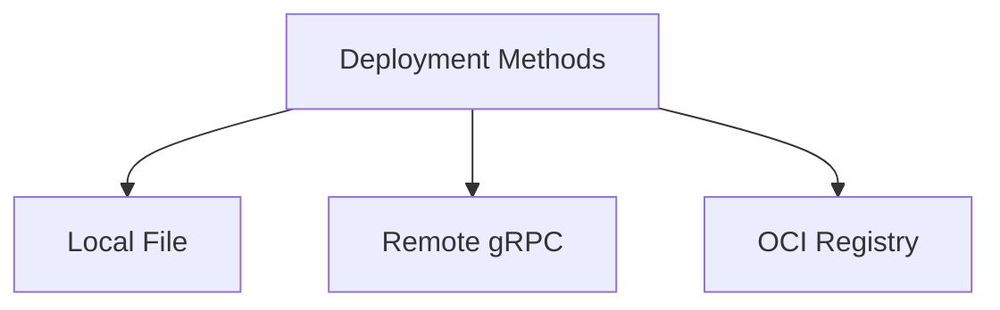

## Availability

| Edition   | Deployment Type |
| :------------- | :---------------------- |
| [Community](/nightly/ai-management/ai-studio/overview#community-edition) & [Enterprise](/nightly/ai-management/ai-studio/overview#enterprise-edition) | Self-Managed, Hybrid |




Tyk AI Studio supports three plugin deployment methods: local filesystem (`file://`), remote gRPC (`grpc://`), and OCI registry (`oci://`). Choose the deployment method based on your environment and requirements.

## Deployment Methods Comparison

| Method | Use Case | Pros | Cons |
|--------|----------|------|------|
| `file://` | Development, testing | Fast, simple, easy debugging | Not suitable for production, requires filesystem access |
| `grpc://` | Production, distributed systems | Remote deployment, scalable | Requires network setup, more complex |
| `oci://` | Production, containerized | Version control, registry management | Requires OCI registry, packaging overhead |

## file:// - Local Filesystem

Deploy plugins from the local filesystem.

> **Safety settings:** By default, local filesystem plugin loading has safety restrictions that prevent loading from arbitrary paths. For development, you may need to adjust these settings in your configuration to allow local path loading and absolute paths. See the Security Considerations section below for details on `ALLOW_INTERNAL_NETWORK_ACCESS` and `PLUGIN_COMMAND_ALLOWLIST`.

### Building Your Plugin

```bash
# Build for current platform
go build -o my-plugin main.go

# Build for Linux (Docker/K8s deployment)
GOOS=linux GOARCH=amd64 go build -o my-plugin-linux main.go

# Make executable
chmod +x my-plugin
```

### Creating Plugin via API

```bash
curl -X POST http://localhost:3000/api/v1/plugins \
  -H "Authorization: Bearer $TOKEN" \
  -H "Content-Type: application/json" \
  -d '{
    "name": "My Plugin",
    "slug": "my-plugin",
    "command": "file:///absolute/path/to/my-plugin",
    "hook_type": "pre_auth",
    "plugin_type": "gateway",
    "is_active": true
  }'
```

**Important**: Use absolute paths with `file://`:

```bash
✅ file:///usr/local/bin/my-plugin
✅ file:///home/user/plugins/my-plugin
❌ file://./my-plugin  # Relative paths not supported
❌ /usr/local/bin/my-plugin  # Missing file:// prefix
```

### Docker Deployment

When deploying with Docker, mount plugins into the container:

```yaml
# docker-compose.yml
services:
  ai-studio:
    image: tykio/ai-studio:latest
    volumes:
      - ./plugins:/plugins
    environment:
      - ALLOW_INTERNAL_NETWORK_ACCESS=true  # For development only
```

Then register with container path:

```bash
curl -X POST http://localhost:3000/api/v1/plugins \
  -d '{"command": "file:///plugins/my-plugin", ...}'
```

### Kubernetes Deployment

Mount plugins via ConfigMap or PersistentVolume:

```yaml Expandable
apiVersion: v1
kind: ConfigMap
metadata:
  name: plugins
binaryData:
  my-plugin: <base64-encoded-binary>
---
apiVersion: apps/v1
kind: Deployment
metadata:
  name: ai-studio
spec:
  template:
    spec:
      containers:
      - name: ai-studio
        image: tykio/ai-studio:latest
        volumeMounts:
        - name: plugins
          mountPath: /plugins
      volumes:
      - name: plugins
        configMap:
          name: plugins
          defaultMode: 0755
```

## grpc:// - Remote gRPC

Deploy plugins as remote gRPC services.

### Running Plugin as gRPC Server

Your plugin already implements gRPC via go-plugin. To run it as a remote service, you need a gRPC wrapper:

```go Expandable
package main

import (
    "log"
    "net"

    "github.com/TykTechnologies/midsommar/v2/pkg/ai_studio_sdk"
    "google.golang.org/grpc"
)

func main() {
    // Create gRPC server
    lis, err := net.Listen("tcp", ":50051")
    if err != nil {
        log.Fatalf("Failed to listen: %v", err)
    }

    grpcServer := grpc.NewServer()

    // Register your plugin
    plugin := &MyPlugin{}
    ai_studio_sdk.RegisterPluginServer(grpcServer, plugin)

    log.Printf("Plugin gRPC server listening on :50051")
    if err := grpcServer.Serve(lis); err != nil {
        log.Fatalf("Failed to serve: %v", err)
    }
}
```

### Deploying with Docker

```dockerfile
FROM golang:1.21-alpine AS builder
WORKDIR /build
COPY . .
RUN go build -o plugin-server main.go

FROM alpine:latest
COPY --from=builder /build/plugin-server /usr/local/bin/
EXPOSE 50051
CMD ["/usr/local/bin/plugin-server"]
```

```bash
# Build and run
docker build -t my-plugin-server .
docker run -d -p 50051:50051 my-plugin-server
```

### Register Remote Plugin

```bash
curl -X POST http://localhost:3000/api/v1/plugins \
  -H "Authorization: Bearer $TOKEN" \
  -d '{
    "name": "My Remote Plugin",
    "slug": "my-remote-plugin",
    "command": "grpc://plugin-server:50051",
    "hook_type": "pre_auth",
    "plugin_type": "gateway",
    "is_active": true
  }'
```

### Network Configuration

#### Internal Network Access

By default, plugins cannot access internal networks. For development:

```bash
export ALLOW_INTERNAL_NETWORK_ACCESS=true
```

For production, use allowlist:

```bash
export PLUGIN_COMMAND_ALLOWLIST="grpc://10.0.0.0/8,grpc://172.16.0.0/12"
```

#### Load Balancing

Use Kubernetes services for load balancing:

```yaml
apiVersion: v1
kind: Service
metadata:
  name: my-plugin
spec:
  selector:
    app: my-plugin
  ports:
  - port: 50051
    targetPort: 50051
  type: ClusterIP
```

Register with service DNS:

```bash
"command": "grpc://my-plugin.default.svc.cluster.local:50051"
```

## oci:// - OCI Registry

Deploy plugins as OCI artifacts in container registries.

### Prerequisites

- Docker or Podman
- OCI-compatible registry (Docker Hub, GHCR, ECR, GCR, Harbor, etc.)
- Registry credentials configured

### Packaging Plugin as OCI Artifact

Create a simple OCI image:

```dockerfile
FROM scratch
COPY my-plugin /plugin
ENTRYPOINT ["/plugin"]
```

Build and push:

```bash
# Build plugin binary
go build -o my-plugin main.go

# Build OCI image
docker build -t registry.example.com/plugins/my-plugin:v1.0.0 .

# Push to registry
docker push registry.example.com/plugins/my-plugin:v1.0.0
```

### Registering OCI Plugin

```bash
curl -X POST http://localhost:3000/api/v1/plugins \
  -H "Authorization: Bearer $TOKEN" \
  -d '{
    "name": "My OCI Plugin",
    "slug": "my-oci-plugin",
    "command": "oci://registry.example.com/plugins/my-plugin:v1.0.0",
    "oci_reference": "registry.example.com/plugins/my-plugin:v1.0.0",
    "hook_type": "pre_auth",
    "plugin_type": "gateway",
    "is_active": true
  }'
```

### Registry Authentication

OCI registry authentication is configured via environment variables using the pattern:

```
OCI_PLUGINS_REGISTRY_<REGISTRY_NAME>_<FIELD>=<value>
```

Where `<REGISTRY_NAME>` is the registry hostname with dots replaced by underscores (e.g., `docker.tyk.io` → `DOCKER_TYK_IO`).

#### Authentication Methods

**Entitlement Token** (Cloudsmith and similar registries):

```bash
# Entitlement token — sent as Basic auth (username: "token", password: entitlement)
OCI_PLUGINS_REGISTRY_DOCKER_TYK_IO_ENTITLEMENT=your-entitlement-token

# Custom username for entitlement (default: "token")
OCI_PLUGINS_REGISTRY_DOCKER_TYK_IO_ENTITLEMENTUSERNAME=custom-user
```

**Username + Password**:

```bash
OCI_PLUGINS_REGISTRY_GHCR_IO_USERNAME=github-user
OCI_PLUGINS_REGISTRY_GHCR_IO_PASSWORDENV=GITHUB_TOKEN  # reads from this env var
```

**OAuth2/Bearer Token**:

```bash
OCI_PLUGINS_REGISTRY_REGISTRY_EXAMPLE_COM_TOKEN=your-access-token
# Or read from env var:
OCI_PLUGINS_REGISTRY_REGISTRY_EXAMPLE_COM_TOKENENV=MY_REGISTRY_TOKEN
```

#### AI Studio vs Microgateway

Both runtimes use the same `OCI_PLUGINS_REGISTRY_*` environment variables for auth. The difference is in how OCI support is enabled:

| Setting | AI Studio | Microgateway |
|---------|-----------|-------------|
| **Enable OCI** | `AI_STUDIO_OCI_CACHE_DIR=/path` | `OCI_PLUGINS_CACHE_DIR=/path` (default: `/var/lib/microgateway/plugins`) |
| **Require signatures** | `AI_STUDIO_OCI_REQUIRE_SIGNATURE=true` | `OCI_PLUGINS_REQUIRE_SIGNATURE=true` |
| **Registry auth** | `OCI_PLUGINS_REGISTRY_*` (shared) | `OCI_PLUGINS_REGISTRY_*` (shared) |

**Important**: `AI_STUDIO_OCI_CACHE_DIR` must be set for OCI plugin support to be enabled in AI Studio. Without it, OCI plugins cannot be installed or loaded, and registry auth configuration is ignored.

#### Signature Verification

When signature verification is enabled (Enterprise Edition), the `cosign` tool verifies plugin signatures against the registry. Cosign uses the standard Docker credential store (`~/.docker/config.json`) for registry authentication — it does **not** use the `OCI_PLUGINS_REGISTRY_*` environment variables.

To configure cosign auth in containerized environments:

```bash
# Create Docker config with registry credentials
mkdir -p ~/.docker
echo '{"auths":{"docker.tyk.io":{"auth":"'$(echo -n 'token:YOUR_ENTITLEMENT' | base64)'"}}}' > ~/.docker/config.json
```

For Kubernetes, mount a Docker config secret:

```yaml
apiVersion: v1
kind: Secret
metadata:
  name: oci-registry-creds
type: kubernetes.io/dockerconfigjson
data:
  .dockerconfigjson: <base64-encoded-docker-config>
```

Configure public keys for signature verification:

```bash
# Public key for verifying plugin signatures
OCI_PLUGINS_PUBLIC_KEY_1=/path/to/cosign.pub
```

#### Cloudsmith-Specific Notes

When using Cloudsmith with a custom Docker domain (e.g., `docker.tyk.io`):

- **Entitlement auth** is the recommended method for programmatic access
- Entitlements bypass the Docker token exchange, which avoids scope issues with Cloudsmith's namespace-level scope requirements
- Each Cloudsmith repository has its own entitlement tokens — use repository-level entitlements
- The `ENTITLEMENT` auth type sends Basic auth directly on every request, which Cloudsmith supports natively

### Version Management

Use tags for version management:

```bash
# Development
oci://registry.example.com/plugins/my-plugin:latest

# Staging
oci://registry.example.com/plugins/my-plugin:v1.2.3-rc.1

# Production
oci://registry.example.com/plugins/my-plugin:v1.2.3

# Immutable digest
oci://registry.example.com/plugins/my-plugin@sha256:abc123...
```

### Caching

OCI plugins are pulled and cached locally:

```bash
# AI Studio
AI_STUDIO_OCI_CACHE_DIR=/var/cache/ai-studio/plugins

# Microgateway (defaults to /var/lib/microgateway/plugins)
OCI_PLUGINS_CACHE_DIR=/var/cache/microgateway/plugins
```

## Security Considerations

### Command Validation

The platform validates plugin commands for security:

1. **Absolute Paths**: `file://` commands must use absolute paths
2. **Internal Network Block**: By default, `grpc://` commands cannot target internal IPs (10.x.x.x, 172.16-31.x.x, 192.168.x.x, 127.x.x.x, localhost)
3. **Allowlist**: Configure allowed commands via `PLUGIN_COMMAND_ALLOWLIST`

Example warnings:

```
⚠️  PLUGIN SECURITY WARNING: Plugin command uses absolute path outside standard directories.
⚠️  PLUGIN SECURITY WARNING: Plugin command targets internal network address
```

### Production Security

For production deployments:

1. **Disable Internal Network Access**:
   ```bash
   export ALLOW_INTERNAL_NETWORK_ACCESS=false
   export PLUGIN_BLOCK_INTERNAL_URLS=true
   ```

2. **Use Allowlist**:
   ```bash
   export PLUGIN_COMMAND_ALLOWLIST="/usr/local/plugins/*,grpc://plugins.prod.svc/*"
   ```

3. **Use OCI with Signed Images**:
   - Sign images with Cosign or Notary
   - Verify signatures before deployment
   - Use content trust

4. **Principle of Least Privilege**:
   - Run plugins with minimal permissions
   - Use read-only filesystems where possible
   - Implement network policies in Kubernetes

## Troubleshooting


<AccordionGroup>

<Accordion title="Plugin Not Loading">

**Symptoms**: Plugin shows as inactive, errors in logs

**Solutions**:
- Verify plugin binary has execute permissions (`chmod +x`)
- Check absolute path is correct for `file://`
- Verify network connectivity for `grpc://`
- Check registry authentication for `oci://`
- Review plugin logs for initialization errors

</Accordion>

<Accordion title="Permission Denied">

**Symptoms**: "Permission denied" error when loading plugin

**Solutions**:

```bash
# Check file permissions
ls -la /path/to/plugin

# Make executable
chmod +x /path/to/plugin

# Check SELinux context (if applicable)
chcon -t container_file_t /path/to/plugin
````

</Accordion>

<Accordion title="Network Connection Errors">

**Symptoms**: "connection refused", "no route to host" for `grpc://`

**Solutions**:

* Verify plugin server is running: `telnet plugin-host 50051`
* Check firewall rules
* Verify Kubernetes service is created
* Check DNS resolution
* Enable internal network access if needed (development only)

</Accordion>

<Accordion title="OCI Pull Failures">

**Symptoms**: "Failed to pull image", "authentication required"

**Solutions**:

* Verify registry URL is correct
* Check credentials are configured
* Test manual pull: `docker pull registry.example.com/plugins/my-plugin:v1.0.0`
* Check registry permissions
* Verify image exists with correct tag

</Accordion>

<Accordion title="Plugin Crashes on Start">

**Symptoms**: Plugin loads but immediately crashes

**Solutions**:

* Check plugin logs for panics
* Verify Go version compatibility
* Check for missing dependencies
* Test plugin standalone: `./my-plugin`
* Review initialization code for errors

</Accordion>

</AccordionGroup>

## Best Practices

### Development Workflow

1. **Local Development**: Use `file://` for fast iteration
2. **Reload Loop**: Use `POST /api/v1/plugins/{id}/reload` to test changes instantly
3. **Testing**: Deploy to staging with `grpc://` or `oci://`
4. **Production**: Use `oci://` with versioned tags

**See [Plugin Development Workflow](/nightly/ai-management/ai-studio/plugins/development-workflow)** for detailed setup, helper scripts, and the fastest development loop.

### Version Management

1. Use semantic versioning
2. Tag releases in Git and OCI registry
3. Never reuse tags (immutable releases)
4. Document breaking changes

### Deployment Pipeline

```bash Expandable
# 1. Build
go build -o plugin main.go

# 2. Test locally
./plugin  # Verify it runs

# 3. Package
docker build -t registry.example.com/plugins/my-plugin:v1.2.3 .

# 4. Push
docker push registry.example.com/plugins/my-plugin:v1.2.3

# 5. Deploy to staging
curl -X POST .../plugins -d '{"command": "oci://registry.../my-plugin:v1.2.3-rc.1", ...}'

# 6. Test in staging
# Run integration tests

# 7. Deploy to production
curl -X POST .../plugins -d '{"command": "oci://registry.../my-plugin:v1.2.3", ...}'
```

### Monitoring

- Monitor plugin health via `/api/v1/plugins/{id}/health`
- Track plugin performance metrics
- Set up alerts for plugin failures
- Log all plugin operations

