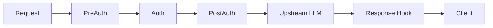

## Availability

| Edition   | Deployment Type |
| :------------- | :---------------------- |
| [Community](/nightly/ai-management/ai-studio/overview#community-edition) & [Enterprise](/nightly/ai-management/ai-studio/overview#enterprise-edition) | Self-Managed, Hybrid |



Microgateway plugins provide middleware hooks in the LLM proxy request/response pipeline using the **Unified Plugin SDK**. Use them for custom authentication, request/response transformation, content filtering, and data collection to external systems.

All Microgateway plugins now use `pkg/plugin_sdk`, which automatically detects the Gateway runtime and provides access to universal services (KV storage, logging) and Gateway-specific services (app management, budget status).

## Plugin Capabilities

Microgateway plugins implement one or more of these capability interfaces:

### 1. PreAuthHandler

**Interface**: `PreAuthHandler`
**Method**: `HandlePreAuth(ctx Context, req *pb.EnrichedRequest) (*pb.PluginResponse, error)`

Executes **before** authentication. Use for:
- Request validation and early rejection
- Request enrichment with metadata
- Header modification
- Logging and auditing

**Working Example**: [`examples/plugins/gateway/request_enricher/`](https://github.com/TykTechnologies/ai-studio/tree/main/examples/plugins/gateway/request_enricher)

### 2. AuthHandler

**Interface**: `AuthHandler`
**Method**: `HandleAuth(ctx Context, req *pb.EnrichedRequest) (*pb.PluginResponse, error)`

**Replaces** default token authentication. Use for:
- Custom authentication schemes (OAuth, JWT, API keys)
- Integration with external identity providers
- Multi-factor authentication
- Custom authorization logic

**Note**: Unified SDK provides credential validation via `ctx.Services.Gateway().ValidateCredential()`

### 3. PostAuthHandler

**Interface**: `PostAuthHandler`
**Method**: `HandlePostAuth(ctx Context, req *pb.EnrichedRequest) (*pb.PluginResponse, error)`

Executes **after** authentication. Most common capability for gateway plugins. Use for:
- Enriching requests with user-specific data
- Per-user request transformation
- Access control enforcement
- Usage quota checks

**Working Example**: [`examples/plugins/gateway/request_enricher/`](https://github.com/TykTechnologies/ai-studio/tree/main/examples/plugins/gateway/request_enricher)

### 4. ResponseHandler

**Interface**: `ResponseHandler`
**Methods**:
- `OnBeforeWriteHeaders(ctx Context, req *pb.ResponseWriteRequest) (*pb.ResponseWriteResponse, error)`
- `OnBeforeWrite(ctx Context, req *pb.ResponseWriteRequest) (*pb.ResponseWriteResponse, error)`

Modifies LLM responses before returning to client. Two-phase processing:
- **OnBeforeWriteHeaders**: Modify response headers
- **OnBeforeWrite**: Modify response body

Use for:
- Response filtering and content moderation
- Response transformation and formatting
- Injecting additional metadata
- Response validation

**Working Example**: [`examples/plugins/gateway/response_modifier/`](https://github.com/TykTechnologies/ai-studio/tree/main/examples/plugins/gateway/response_modifier)

### 5. DataCollector

**Interface**: `DataCollector`
**Methods**:
- `HandleProxyLog(ctx Context, log *pb.ProxyLogData) error`
- `HandleAnalytics(ctx Context, analytics *pb.AnalyticsData) error`
- `HandleBudgetUsage(ctx Context, usage *pb.BudgetUsageData) error`

Intercepts data before database storage. Use for:
- Exporting proxy logs to external systems
- Sending analytics to data warehouses
- Custom budget tracking
- Real-time monitoring and alerting

**Working Examples**:
- [`examples/plugins/unified/data-collectors/file-analytics-collector/`](https://github.com/TykTechnologies/ai-studio/tree/main/examples/plugins/unified/data-collectors/file-analytics-collector) (unified SDK)
- [`examples/plugins/unified/data-collectors/file-budget-collector/`](https://github.com/TykTechnologies/ai-studio/tree/main/examples/plugins/unified/data-collectors/file-budget-collector) (unified SDK)
- [`examples/plugins/unified/data-collectors/file-proxy-collector/`](https://github.com/TykTechnologies/ai-studio/tree/main/examples/plugins/unified/data-collectors/file-proxy-collector) (unified SDK)
- [`examples/plugins/gateway/elasticsearch_collector/`](https://github.com/TykTechnologies/ai-studio/tree/main/examples/plugins/gateway/elasticsearch_collector)

### 6. CustomEndpointHandler

**Interface**: `CustomEndpointHandler`
**Methods**:
- `GetEndpointRegistrations() ([]*pb.EndpointRegistration, error)`
- `HandleEndpointRequest(ctx Context, req *pb.EndpointRequest) (*pb.EndpointResponse, error)`
- `HandleEndpointRequestStream(ctx Context, req *pb.EndpointRequest, stream grpc.ServerStreamingServer[pb.EndpointResponseChunk]) error`

Registers and serves custom HTTP endpoints under `/plugins/{slug}/`. Plugins have full control over the response. Use for:
- Custom APIs (OAuth endpoints, webhooks, health checks)
- MCP Streamable HTTP proxy servers
- Protocol-specific proxies
- Any endpoint that doesn't fit the LLM/Tool/Datasource model

Supports both unary responses and streaming (SSE) via the `stream_response` flag on endpoint registrations.

**Full Guide**: [Custom Endpoints Guide](/nightly/ai-management/ai-studio/plugins/custom-endpoints)

## Quick Start

### 1. Project Setup

```bash
# Create plugin directory
mkdir my-gateway-plugin && cd my-gateway-plugin

# Initialize Go module
go mod init github.com/myorg/my-gateway-plugin

# Add unified SDK dependency
go get github.com/TykTechnologies/midsommar/v2/pkg/plugin_sdk
```

### 2. Implement Plugin Structure

Use the unified SDK with `BasePlugin` convenience struct:

```go Expandable
package main

import (
    "github.com/TykTechnologies/midsommar/v2/pkg/plugin_sdk"
    pb "github.com/TykTechnologies/midsommar/v2/proto"
)

type MyGatewayPlugin struct {
    plugin_sdk.BasePlugin
    apiKey string
}

func NewMyGatewayPlugin() *MyGatewayPlugin {
    return &MyGatewayPlugin{
        BasePlugin: plugin_sdk.NewBasePlugin(
            "my-gateway-plugin",
            "1.0.0",
            "Custom gateway middleware",
        ),
    }
}

// Initialize is called when plugin starts
func (p *MyGatewayPlugin) Initialize(ctx plugin_sdk.Context, config map[string]string) error {
    // Parse configuration
    p.apiKey = config["api_key"]

    ctx.Services.Logger().Info("Plugin initialized",
        "runtime", ctx.Runtime,
    )

    return nil
}

// Shutdown performs cleanup
func (p *MyGatewayPlugin) Shutdown() error {
    return nil
}

func main() {
    plugin_sdk.Serve(NewMyGatewayPlugin())
}
```

### 3. Implement Capability Interfaces

Implement one or more capability interfaces based on your needs:

#### PostAuthHandler (Most Common)

```go Expandable
// Implement PostAuthHandler interface
func (p *MyGatewayPlugin) HandlePostAuth(ctx plugin_sdk.Context, req *pb.EnrichedRequest) (*pb.PluginResponse, error) {
    // Log request
    ctx.Services.Logger().Info("Processing request",
        "app_id", ctx.AppID,
        "user_id", ctx.UserID,
        "path", req.Path,
    )

    // Enrich request with custom header
    if req.Headers == nil {
        req.Headers = make(map[string]string)
    }
    req.Headers["X-Custom-Header"] = "gateway-plugin"
    req.Headers["X-App-ID"] = fmt.Sprintf("%d", ctx.AppID)

    return &pb.PluginResponse{
        Modified: true,
        Request:  req,
    }, nil
}
```

#### PreAuthHandler

```go Expandable
// Implement PreAuthHandler interface
func (p *MyGatewayPlugin) HandlePreAuth(ctx plugin_sdk.Context, req *pb.EnrichedRequest) (*pb.PluginResponse, error) {
    // Validate request early
    if req.Method != "POST" {
        return &pb.PluginResponse{
            Block:        true,
            ErrorMessage: "Only POST requests allowed",
        }, nil
    }

    // Check budget before processing
    if ctx.Runtime == plugin_sdk.RuntimeGateway {
        status, err := ctx.Services.Gateway().GetBudgetStatus(ctx, ctx.AppID)
        if err == nil {
            budgetResp := status.(*gwmgmt.GetBudgetStatusResponse)
            if budgetResp.RemainingBudget <= 0 {
                return &pb.PluginResponse{
                    Block:        true,
                    ErrorMessage: "Budget exceeded",
                }, nil
            }
        }
    }

    return &pb.PluginResponse{Modified: false}, nil
}
```

#### ResponseHandler

```go Expandable
// Implement ResponseHandler interface
func (p *MyGatewayPlugin) OnBeforeWriteHeaders(ctx plugin_sdk.Context, req *pb.ResponseWriteRequest) (*pb.ResponseWriteResponse, error) {
    // Add custom response headers
    if req.Headers == nil {
        req.Headers = make(map[string]string)
    }
    req.Headers["X-Processed-By"] = "gateway-plugin"
    req.Headers["X-Request-ID"] = req.RequestId

    return &pb.ResponseWriteResponse{
        Modified: true,
        Headers:  req.Headers,
    }, nil
}

func (p *MyGatewayPlugin) OnBeforeWrite(ctx plugin_sdk.Context, req *pb.ResponseWriteRequest) (*pb.ResponseWriteResponse, error) {
    // Modify response body if needed
    modifiedBody := transformResponse(req.Body)

    return &pb.ResponseWriteResponse{
        Modified: true,
        Body:     modifiedBody,
    }, nil
}
```

#### DataCollector

```go Expandable
// Implement DataCollector interface
func (p *MyGatewayPlugin) HandleProxyLog(ctx plugin_sdk.Context, log *pb.ProxyLogData) error {
    // Export to external system
    ctx.Services.Logger().Debug("Proxy log received",
        "app_id", log.AppId,
        "vendor", log.Vendor,
        "status", log.ResponseCode,
    )

    return p.sendToElasticsearch(ctx, log)
}

func (p *MyGatewayPlugin) HandleAnalytics(ctx plugin_sdk.Context, analytics *pb.AnalyticsData) error {
    // Process analytics
    ctx.Services.Logger().Debug("Analytics received",
        "llm_id", analytics.LlmId,
        "tokens", analytics.TotalTokens,
        "cost", analytics.Cost,
    )

    return p.sendAnalytics(ctx, analytics)
}

func (p *MyGatewayPlugin) HandleBudgetUsage(ctx plugin_sdk.Context, usage *pb.BudgetUsageData) error {
    // Track budget usage
    ctx.Services.Logger().Debug("Budget usage",
        "app_id", usage.AppId,
        "cost", usage.Cost,
    )

    return p.trackBudget(ctx, usage)
}
```

### 4. Build Plugin

```bash
# Build for current platform
go build -o my-plugin main.go

# Build for Linux (if deploying to Docker/K8s)
GOOS=linux GOARCH=amd64 go build -o my-plugin-linux main.go
```

### 5. Deploy Plugin

Create plugin in AI Studio dashboard or via API:

```bash
curl -X POST http://localhost:3000/api/v1/plugins \
  -H "Authorization: Bearer YOUR_TOKEN" \
  -H "Content-Type: application/json" \
  -d '{
    "name": "My Plugin",
    "slug": "my-plugin",
    "description": "Custom plugin",
    "command": "file:///path/to/my-plugin",
    "hook_type": "pre_auth",
    "is_active": true,
    "plugin_type": "gateway"
  }'
```

### 6. Attach to LLM

Associate the plugin with an LLM to activate it:

```bash
curl -X PUT http://localhost:3000/api/v1/llms/1/plugins \
  -H "Authorization: Bearer YOUR_TOKEN" \
  -H "Content-Type: application/json" \
  -d '{
    "plugin_ids": [1, 2, 3]
  }'
```

## Configuration Schema

Provide JSON Schema for plugin configuration using the `ConfigSchemaProvider` interface:

```go
//go:embed config.schema.json
var configSchema []byte

func (p *MyPlugin) GetConfigSchema() ([]byte, error) {
    return configSchema, nil
}
```

Example `config.schema.json`:

```json Expandable
{
  "$schema": "http://json-schema.org/draft-07/schema#",
  "type": "object",
  "properties": {
    "api_key": {
      "type": "string",
      "description": "API key for external service",
      "minLength": 1
    },
    "endpoint": {
      "type": "string",
      "format": "uri",
      "description": "External service endpoint",
      "default": "https://api.example.com"
    },
    "batch_size": {
      "type": "integer",
      "description": "Batch size for data collection",
      "minimum": 1,
      "maximum": 1000,
      "default": 100
    }
  },
  "required": ["api_key"]
}
```

Configuration values are passed to `Initialize()` and can be updated via the API.

## Complete Examples

### Example 1: Custom Authentication Plugin

This example uses the **Unified SDK** for consistency with other gateway plugins like `llm-firewall` and `llm-cache`.

```go Expandable
package main

import (
    "strings"

    "github.com/TykTechnologies/midsommar/v2/pkg/plugin_sdk"
    pb "github.com/TykTechnologies/midsommar/v2/proto"
)

type CustomAuthPlugin struct {
    plugin_sdk.BasePlugin
    validToken string
}

func NewCustomAuthPlugin() *CustomAuthPlugin {
    return &CustomAuthPlugin{
        BasePlugin: plugin_sdk.NewBasePlugin(
            "custom-auth",
            "1.0.0",
            "Custom token authentication plugin",
        ),
    }
}

func (p *CustomAuthPlugin) Initialize(ctx plugin_sdk.Context, config map[string]string) error {
    // Parse configuration
    if token, ok := config["valid_token"]; ok && token != "" {
        p.validToken = token
    } else {
        p.validToken = "default-token"
    }

    ctx.Services.Logger().Info("CustomAuthPlugin initialized",
        "runtime", ctx.Runtime,
    )

    return nil
}

func (p *CustomAuthPlugin) Shutdown(ctx plugin_sdk.Context) error {
    return nil
}

// HandleAuth implements the AuthHandler interface
func (p *CustomAuthPlugin) HandleAuth(ctx plugin_sdk.Context, req *pb.EnrichedRequest) (*pb.PluginResponse, error) {
    // Extract token from Authorization header
    authHeader := ""
    if req.Request != nil && req.Request.Headers != nil {
        authHeader = req.Request.Headers["Authorization"]
    }

    token := strings.TrimPrefix(authHeader, "Bearer ")

    if token == p.validToken {
        ctx.Services.Logger().Info("Authentication successful",
            "request_id", ctx.RequestID,
        )

        return &pb.PluginResponse{
            Modified: true,
            Credential: &pb.Credential{
                UserID:   "plugin-user",
                Username: "Plugin User",
                Claims: map[string]string{
                    "source": "custom-auth-plugin",
                },
            },
        }, nil
    }

    ctx.Services.Logger().Warn("Authentication failed",
        "request_id", ctx.RequestID,
        "token_provided", token != "",
    )

    return &pb.PluginResponse{
        Block:        true,
        StatusCode:   401,
        ErrorMessage: "Invalid token",
        Headers: map[string]string{
            "WWW-Authenticate": "Bearer",
        },
    }, nil
}

func main() {
    plugin := NewCustomAuthPlugin()
    plugin_sdk.Serve(plugin)
}
```

**Working Example**: See [`community/plugins/llm-firewall/`](https://github.com/TykTechnologies/ai-studio/tree/main/community/plugins/llm-firewall) for a production-ready content filtering plugin using this pattern.

### Example 2: Elasticsearch Data Collector

```go Expandable
package main

import (
    "bytes"
    "context"
    "encoding/json"
    "fmt"
    "net/http"
    "time"

    "github.com/TykTechnologies/midsommar/microgateway/plugins/sdk"
)

type ElasticsearchCollector struct {
    esURL  string
    client *http.Client
}

func (p *ElasticsearchCollector) Initialize(config map[string]interface{}) error {
    if url, ok := config["elasticsearch_url"].(string); ok {
        p.esURL = url
    } else {
        p.esURL = "http://localhost:9200"
    }

    p.client = &http.Client{Timeout: 10 * time.Second}
    return nil
}

func (p *ElasticsearchCollector) GetHookType() sdk.HookType {
    return sdk.HookTypeDataCollection
}

func (p *ElasticsearchCollector) GetName() string {
    return "elasticsearch-collector"
}

func (p *ElasticsearchCollector) GetVersion() string {
    return "1.0.0"
}

func (p *ElasticsearchCollector) Shutdown() error {
    return nil
}

func (p *ElasticsearchCollector) HandleProxyLog(ctx context.Context,
    req *sdk.ProxyLogData,
    pluginCtx *sdk.PluginContext) (*sdk.DataCollectionResponse, error) {

    doc := map[string]interface{}{
        "@timestamp":    req.Timestamp.Format(time.RFC3339),
        "app_id":        req.AppID,
        "user_id":       req.UserID,
        "vendor":        req.Vendor,
        "request_body":  string(req.RequestBody),
        "response_body": string(req.ResponseBody),
        "response_code": req.ResponseCode,
        "request_id":    req.RequestID,
    }

    indexName := fmt.Sprintf("microgateway-proxy-logs-%s",
        req.Timestamp.Format("2006.01.02"))

    if err := p.indexDocument(ctx, indexName, doc); err != nil {
        return &sdk.DataCollectionResponse{
            Success:      false,
            Handled:      false,
            ErrorMessage: err.Error(),
        }, nil
    }

    return &sdk.DataCollectionResponse{
        Success: true,
        Handled: true, // Don't store in database
    }, nil
}

func (p *ElasticsearchCollector) HandleAnalytics(ctx context.Context,
    req *sdk.AnalyticsData,
    pluginCtx *sdk.PluginContext) (*sdk.DataCollectionResponse, error) {

    doc := map[string]interface{}{
        "@timestamp":      req.Timestamp.Format(time.RFC3339),
        "llm_id":         req.LLMID,
        "model_name":     req.ModelName,
        "vendor":         req.Vendor,
        "prompt_tokens":  req.PromptTokens,
        "response_tokens": req.ResponseTokens,
        "total_tokens":   req.TotalTokens,
        "cost":           req.Cost,
        "request_id":     req.RequestID,
    }

    indexName := fmt.Sprintf("microgateway-analytics-%s",
        req.Timestamp.Format("2006.01.02"))

    if err := p.indexDocument(ctx, indexName, doc); err != nil {
        return &sdk.DataCollectionResponse{
            Success:      false,
            Handled:      false,
            ErrorMessage: err.Error(),
        }, nil
    }

    return &sdk.DataCollectionResponse{
        Success: true,
        Handled: true,
    }, nil
}

func (p *ElasticsearchCollector) HandleBudgetUsage(ctx context.Context,
    req *sdk.BudgetUsageData,
    pluginCtx *sdk.PluginContext) (*sdk.DataCollectionResponse, error) {

    doc := map[string]interface{}{
        "@timestamp":      req.Timestamp.Format(time.RFC3339),
        "app_id":         req.AppID,
        "llm_id":         req.LLMID,
        "tokens_used":    req.TokensUsed,
        "cost":           req.Cost,
        "requests_count": req.RequestsCount,
        "period_start":   req.PeriodStart.Format(time.RFC3339),
        "period_end":     req.PeriodEnd.Format(time.RFC3339),
    }

    indexName := fmt.Sprintf("microgateway-budget-%s",
        req.Timestamp.Format("2006.01.02"))

    if err := p.indexDocument(ctx, indexName, doc); err != nil {
        return &sdk.DataCollectionResponse{
            Success:      false,
            Handled:      false,
            ErrorMessage: err.Error(),
        }, nil
    }

    return &sdk.DataCollectionResponse{
        Success: true,
        Handled: true,
    }, nil
}

func (p *ElasticsearchCollector) indexDocument(ctx context.Context,
    indexName string, doc map[string]interface{}) error {

    jsonDoc, err := json.Marshal(doc)
    if err != nil {
        return err
    }

    url := fmt.Sprintf("%s/%s/_doc", p.esURL, indexName)
    req, err := http.NewRequestWithContext(ctx, "POST", url,
        bytes.NewBuffer(jsonDoc))
    if err != nil {
        return err
    }

    req.Header.Set("Content-Type", "application/json")

    resp, err := p.client.Do(req)
    if err != nil {
        return err
    }
    defer resp.Body.Close()

    if resp.StatusCode >= 400 {
        return fmt.Errorf("elasticsearch returned status %d", resp.StatusCode)
    }

    return nil
}

func main() {
    plugin := &ElasticsearchCollector{}
    sdk.ServePlugin(plugin)
}
```

## Plugin Context

The `PluginContext` provides contextual information about the request:

```go
type PluginContext struct {
    RequestID    string                 // Unique request ID
    LLMID        uint                   // LLM being called
    LLMSlug      string                 // LLM slug identifier
    Vendor       string                 // LLM vendor (openai, anthropic, etc.)
    AppID        uint                   // App making the request
    UserID       uint                   // User making the request
    Metadata     map[string]interface{} // Additional metadata
    TraceContext map[string]string      // Distributed tracing headers
}
```

Use this context for logging, tracing, and per-request customization.

## Testing Your Plugin

### Unit Testing

```go Expandable
func TestProcessPreAuth(t *testing.T) {
    plugin := &MyPlugin{}
    plugin.Initialize(map[string]interface{}{
        "setting": "value",
    })

    req := &sdk.PluginRequest{
        Method: "POST",
        Path:   "/v1/chat/completions",
        Body:   []byte(`{"messages": []}`),
    }

    ctx := &sdk.PluginContext{
        RequestID: "test-123",
        LLMID:     1,
    }

    resp, err := plugin.ProcessPreAuth(context.Background(), req, ctx)
    if err != nil {
        t.Fatalf("unexpected error: %v", err)
    }

    if !resp.Modified {
        t.Error("expected response to be modified")
    }
}
```

### Integration Testing

Use `file://` deployment to test with real LLM requests:

```bash Expandable
# Build plugin
go build -o my-plugin main.go

# Create plugin in AI Studio
curl -X POST http://localhost:3000/api/v1/plugins \
  -H "Authorization: Bearer $TOKEN" \
  -d '{
    "command": "file:///full/path/to/my-plugin",
    ...
  }'

# Test LLM request
curl -X POST http://localhost:3000/api/v1/llms/1/proxy/v1/chat/completions \
  -H "Authorization: Bearer $TOKEN" \
  -d '{"messages": [{"role": "user", "content": "test"}]}'
```

## Best Practices

### Performance

- Keep plugin logic lightweight and fast
- Use timeouts for external API calls
- Implement connection pooling for external services
- Cache frequently accessed data
- Return early for requests that don't need processing

### Error Handling

- Log errors with context (request ID, LLM ID, etc.)
- Return descriptive error messages
- Don't panic - return errors properly
- Implement graceful degradation

### Security

- Validate all configuration inputs
- Sanitize user-provided data
- Use secure connections for external services
- Don't log sensitive data (tokens, PII)
- Implement rate limiting for external calls

### Configuration

- Provide sensible defaults
- Use JSON Schema for validation
- Document all configuration options
- Support configuration updates without restart

## Troubleshooting

<AccordionGroup>

<Accordion title="Plugin Not Loading">

- Check plugin command path is absolute with `file://`
- Verify plugin binary has execute permissions
- Check logs for initialization errors
- Ensure plugin implements all required interfaces

</Accordion>

<Accordion title="Plugin Crashes">

- Check plugin logs for panics
- Verify external service connectivity
- Test with minimal configuration
- Use defensive error handling

</Accordion>

<Accordion title="Performance Issues">

- Profile plugin with Go profiler
- Check for blocking operations
- Monitor external service latency
- Review resource usage (CPU, memory)

</Accordion>

</AccordionGroup>

## Gateway Services

Gateway plugins have access to Gateway-specific services via `ctx.Services.Gateway()`:

```go
if ctx.Runtime == plugin_sdk.RuntimeGateway {
    // Get app configuration
    app, err := ctx.Services.Gateway().GetApp(ctx, ctx.AppID)

    // Check budget status
    status, err := ctx.Services.Gateway().GetBudgetStatus(ctx, ctx.AppID)

    // Validate credentials
    valid, err := ctx.Services.Gateway().ValidateCredential(ctx, token)

    // Get LLM configuration
    llm, err := ctx.Services.Gateway().GetLLM(ctx, llmID)
}
```

See [Service API Reference](/nightly/ai-management/ai-studio/plugins/service-api) for complete Gateway Services documentation.

## Sending Data to Control Plane

Gateway plugins can send data back to AI Studio (the control plane) using the `SendToControl` API. This is useful for:
- Aggregating statistics from edge instances
- Synchronizing state across the hub-and-spoke architecture
- Sending alerts or notifications to central plugins

```go Expandable
import "github.com/TykTechnologies/midsommar/v2/microgateway/plugins/sdk"

func (p *MyPlugin) HandlePostAuth(ctx sdk.Context, req *pb.EnrichedRequest) (*pb.PluginResponse, error) {
    // Send JSON data to control plane
    stats := map[string]interface{}{
        "requests": p.requestCount.Load(),
        "errors":   p.errorCount.Load(),
    }

    pendingCount, err := sdk.SendToControlJSON(ctx, stats, "", map[string]string{
        "metric_type": "gateway_stats",
    })
    if err != nil {
        ctx.Services.Logger().Warn("Failed to queue stats", "error", err)
    }

    return &pb.PluginResponse{Modified: false}, nil
}
```

The control plane plugin receives this data via the `EdgePayloadReceiver` interface.

See [Edge-to-Control Communication](/nightly/ai-management/ai-studio/plugins/edge-to-control) for complete documentation.

## Working with Both Runtimes

Plugins using the unified SDK can work in both Gateway and Studio:

```go Expandable
func (p *MyPlugin) HandlePostAuth(ctx plugin_sdk.Context, req *pb.EnrichedRequest) (*pb.PluginResponse, error) {
    // Universal services (always available)
    ctx.Services.Logger().Info("Processing request")
    data, _ := ctx.Services.KV().Read(ctx, "config")

    // Runtime-specific logic
    if ctx.Runtime == plugin_sdk.RuntimeGateway {
        // Gateway-specific code
        app, _ := ctx.Services.Gateway().GetApp(ctx, ctx.AppID)
    } else if ctx.Runtime == plugin_sdk.RuntimeStudio {
        // Studio-specific code
        llms, _ := ctx.Services.Studio().ListLLMs(ctx, 1, 10)
    }

    return &pb.PluginResponse{Modified: false}, nil
}
```

