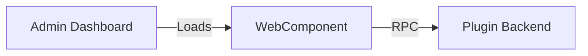

## Availability

| Edition   | Deployment Type |
| :------------- | :---------------------- |
| [Community](/nightly/ai-management/ai-studio/overview#community-edition) & [Enterprise](/nightly/ai-management/ai-studio/overview#enterprise-edition) | Self-Managed, Hybrid |



AI Studio UI plugins extend the **admin dashboard** with custom interfaces using WebComponents. Build rich admin panels, custom dashboards, monitoring tools, and specialized management interfaces that integrate seamlessly with the AI Studio platform using the **Unified Plugin SDK**.

> **Looking for portal (end-user) pages?** See the [AI Portal UI Plugins Guide](/nightly/ai-management/ai-studio/plugins/portal-ui) for building pages visible to portal users, not just admins.

## Overview

UI plugins enable you to:

- **Add Custom Pages**: Register new routes in the dashboard
- **Extend Sidebar**: Add sections, links, and navigation
- **Serve WebComponents**: Use any frontend framework (React, Vue, Lit, etc.)
- **Call Service APIs**: Access LLMs, tools, datasources, analytics, and more
- **Store Plugin Data**: Use built-in key-value storage
- **Define RPC Methods**: Create custom backend endpoints
- **Multi-Capability**: Combine UI with middleware hooks (PostAuth, Response, Object Hooks, etc.)

## Unified SDK Integration

UI plugins use the **Unified Plugin SDK** (`pkg/plugin_sdk`) and can combine UI capabilities with other plugin capabilities like PostAuth, Response, or Object Hooks.

### Key Features

- **BasePlugin**: Convenience struct for lifecycle management
- **UIProvider**: Capability for serving UI assets and RPC methods
- **Context Services**: Access KV storage, logging, and Studio Services
- **Multi-Capability**: Implement multiple interfaces in one plugin
- **Broker Connection**: Automatic Service API access for UI interactions

### Example: Multi-Capability Plugin

A single plugin can provide both UI and middleware functionality:

```go Expandable
import "github.com/TykTechnologies/midsommar/v2/pkg/plugin_sdk"

type MyUIPlugin struct {
    plugin_sdk.BasePlugin
}

// Implement UIProvider capability
func (p *MyUIPlugin) GetAsset(assetPath string) ([]byte, string, error) {
    // Serve UI assets
}

func (p *MyUIPlugin) HandleCall(method string, payload []byte) ([]byte, error) {
    // Handle RPC calls from UI
}

// Implement PostAuthHandler capability (optional)
func (p *MyUIPlugin) HandlePostAuth(ctx plugin_sdk.Context, req *pb.EnrichedRequest) (*pb.PluginResponse, error) {
    // Process requests
}

// Implement ObjectHooks capability (optional)
func (p *MyUIPlugin) GetObjectHookRegistrations() ([]*pb.ObjectHookRegistration, error) {
    // Register hooks
}
```

**Example**: `examples/plugins/studio/llm-rate-limiter-multiphase/` combines UIProvider + PostAuth + Response in one plugin.

##Quick Start

### 1. Project Structure

```
my-ui-plugin/
├── server/
│   ├── main.go              # Plugin server
│   ├── plugin.manifest.json # Plugin manifest
│   └── config.schema.json   # Configuration schema
├── ui/
│   ├── webc/
│   │   └── dashboard.js     # WebComponent
│   └── assets/
│       └── icon.svg         # Static assets
└── go.mod
```

### 2. Create Manifest

[server/manifest.json](https://github.com/TykTechnologies/ai-studio/blob/main/examples/plugins/studio/custom-auth-ui/server/manifest.json):

```json Expandable
{
  "id": "com.example.my-plugin",
  "name": "My Plugin",
  "version": "1.0.0",
  "plugin_type": "ai_studio",
  "permissions": {
    "services": [
      "llms.read",
      "apps.read",
      "kv.readwrite"
    ]
  },
  "ui": {
    "slots": [
      {
        "slot": "sidebar.section",
        "label": "My Plugin",
        "icon": "/assets/icon.svg",
        "items": [
          {
            "type": "route",
            "path": "/admin/my-plugin",
            "title": "Dashboard",
            "mount": {
              "kind": "webc",
              "tag": "my-plugin-dashboard",
              "entry": "/ui/webc/dashboard.js",
              "props": {
                "apiBase": "/plugin/com.example.my-plugin/rpc"
              }
            }
          }
        ]
      }
    ]
  },
  "rpc": {
    "basePath": "/plugin/com.example.my-plugin/rpc"
  }
}
```

### 3. Implement Plugin Server

[server/main.go](https://github.com/TykTechnologies/ai-studio/blob/main/examples/plugins/studio/custom-auth-ui/server/main.go):

```go Expandable
package main

import (
    "context"
    "embed"
    "encoding/json"
    "fmt"
    "log"

    "github.com/TykTechnologies/midsommar/v2/pkg/ai_studio_sdk"
    "github.com/TykTechnologies/midsommar/v2/pkg/plugin_sdk"
    pb "github.com/TykTechnologies/midsommar/v2/proto"
)

//go:embed ui assets plugin.manifest.json
var embeddedAssets embed.FS

type MyPlugin struct {
    plugin_sdk.BasePlugin
}

func NewMyPlugin() *MyPlugin {
    return &MyPlugin{
        BasePlugin: plugin_sdk.NewBasePlugin(
            "my-ui-plugin",
            "1.0.0",
            "Custom UI plugin with dashboard",
        ),
    }
}

// Initialize is called when plugin starts
func (p *MyPlugin) Initialize(ctx plugin_sdk.Context, config map[string]string) error {
    log.Printf("My Plugin initializing")

    // Extract broker ID for Service API access
    brokerIDStr := ""
    if id, ok := config["_service_broker_id"]; ok {
        brokerIDStr = id
    } else if id, ok := config["service_broker_id"]; ok {
        brokerIDStr = id
    }

    if brokerIDStr != "" {
        var brokerID uint32
        fmt.Sscanf(brokerIDStr, "%d", &brokerID)
        ai_studio_sdk.SetServiceBrokerID(brokerID)
        log.Printf("Set broker ID %d for Service API", brokerID)
    }

    return nil
}

// Shutdown is called when plugin stops
func (p *MyPlugin) Shutdown(ctx plugin_sdk.Context) error {
    log.Printf("My Plugin shutting down")
    return nil
}

// GetAsset serves static files
func (p *MyPlugin) GetAsset(assetPath string) ([]byte, string, error) {
    if assetPath[0] == '/' {
        assetPath = assetPath[1:]
    }

    content, err := embeddedAssets.ReadFile(assetPath)
    if err != nil {
        return nil, "", err
    }

    mimeType := detectMimeType(assetPath)
    return content, mimeType, nil
}

// GetManifest returns the plugin manifest
func (p *MyPlugin) GetManifest() ([]byte, error) {
    return embeddedAssets.ReadFile("plugin.manifest.json")
}

// HandleCall processes RPC methods
func (p *MyPlugin) HandleCall(method string, payload []byte) ([]byte, error) {
    ctx := context.Background()

    switch method {
    case "get_data":
        return p.getData(ctx)
    case "save_settings":
        return p.saveSettings(ctx, payload)
    default:
        return nil, fmt.Errorf("unknown method: %s", method)
    }
}

// RPC method implementation
func (p *MyPlugin) getData(ctx context.Context) ([]byte, error) {
    // Call service API to get LLMs
    llmsResp, err := ai_studio_sdk.ListLLMs(ctx, 1, 10)
    if err != nil {
        return nil, err
    }

    // Return data as JSON
    return json.Marshal(map[string]interface{}{
        "llms": llmsResp.Llms,
        "total": llmsResp.TotalCount,
    })
}

func (p *MyPlugin) saveSettings(ctx context.Context, payload []byte) ([]byte, error) {
    // Store settings in KV storage
    _, err := ai_studio_sdk.WritePluginKV(ctx, "settings", payload)
    if err != nil {
        return nil, err
    }

    return json.Marshal(map[string]string{
        "status": "saved",
    })
}

// GetConfigSchema returns configuration schema
func (p *MyPlugin) GetConfigSchema() ([]byte, error) {
    schema := map[string]interface{}{
        "$schema": "http://json-schema.org/draft-07/schema#",
        "type": "object",
        "properties": map[string]interface{}{
            "api_key": map[string]interface{}{
                "type": "string",
                "description": "API key for external service",
            },
        },
    }
    return json.Marshal(schema)
}

func detectMimeType(path string) string {
    if strings.HasSuffix(path, ".js") {
        return "application/javascript"
    } else if strings.HasSuffix(path, ".css") {
        return "text/css"
    } else if strings.HasSuffix(path, ".svg") {
        return "image/svg+xml"
    }
    return "application/octet-stream"
}

func main() {
    log.Printf("Starting My Plugin")
    plugin_sdk.Serve(NewMyPlugin())
}
```

### 4. Create WebComponent

`ui/webc/dashboard.js`:

```javascript Expandable
class MyPluginDashboard extends HTMLElement {
    connectedCallback() {
        this.innerHTML = `
            <div class="plugin-dashboard">
                <h1>My Plugin Dashboard</h1>
                <div id="content">Loading...</div>
                <button id="refresh">Refresh</button>
            </div>
        `;

        this.loadData();

        this.querySelector('#refresh').addEventListener('click', () => {
            this.loadData();
        });
    }

    async loadData() {
        try {
            const apiBase = this.getAttribute('apiBase') || '/plugin/com.example.my-plugin/rpc';

            const response = await fetch(`${apiBase}/get_data`, {
                method: 'POST',
                headers: {
                    'Content-Type': 'application/json',
                    'Authorization': `Bearer ${this.getAuthToken()}`,
                },
                body: JSON.stringify({}),
            });

            const data = await response.json();

            this.querySelector('#content').innerHTML = `
                <p>Found ${data.total} LLMs</p>
                <ul>
                    ${data.llms.map(llm => `<li>${llm.name} (${llm.vendor})</li>`).join('')}
                </ul>
            `;
        } catch (error) {
            console.error('Failed to load data:', error);
            this.querySelector('#content').innerHTML = `<p>Error: ${error.message}</p>`;
        }
    }

    getAuthToken() {
        // Get token from localStorage or session
        return localStorage.getItem('auth_token') || '';
    }
}

customElements.define('my-plugin-dashboard', MyPluginDashboard);
```

### 5. Build and Deploy

```bash Expandable
# Build plugin
cd server
go build -o my-plugin

# Create plugin in AI Studio
curl -X POST http://localhost:3000/api/v1/plugins \
  -H "Authorization: Bearer $TOKEN" \
  -d '{
    "name": "My Plugin",
    "slug": "my-plugin",
    "command": "file:///path/to/my-plugin",
    "hook_type": "studio_ui",
    "plugin_type": "ai_studio",
    "is_active": true,
    "load_immediately": true
  }'
```

## Manifest Structure

### Top-Level Fields

```json
{
  "id": "com.example.plugin",           // Unique identifier (reverse domain)
  "name": "Plugin Name",                // Display name
  "version": "1.0.0",                   // Semantic version
  "plugin_type": "ai_studio",           // Must be "ai_studio"
  "description": "Plugin description",  // Optional
  "permissions": { },                   // Permission scopes
  "ui": { },                            // UI configuration
  "rpc": { },                           // RPC configuration
  "assets": [],                         // Static asset list
  "compat": { }                         // Compatibility info
}
```

### Permissions

```json Expandable
{
  "permissions": {
    "services": [
      "llms.read",           // List and read LLM configurations
      "llms.proxy",          // Call LLMs via proxy
      "llms.write",          // Create/update LLMs
      "tools.read",          // List and read tools
      "tools.execute",       // Execute tools
      "tools.write",         // Create/update tools
      "datasources.read",    // List and read datasources
      "datasources.query",   // Query datasources
      "apps.read",           // List and read apps
      "apps.write",          // Create/update apps
      "plugins.read",        // List and read plugins
      "analytics.read",      // Read analytics data
      "kv.read",             // Read KV storage
      "kv.readwrite"         // Read/write KV storage
    ]
  }
}
```

### UI Configuration

```json Expandable
{
  "ui": {
    "slots": [
      {
        "slot": "sidebar.section",        // UI slot name
        "label": "My Plugin",             // Section label
        "icon": "/assets/icon.svg",       // Icon path
        "items": [
          {
            "type": "route",              // Route type
            "path": "/admin/my-plugin",   // URL path
            "title": "Dashboard",         // Page title
            "mount": {
              "kind": "webc",             // WebComponent
              "tag": "my-dashboard",      // Custom element tag
              "entry": "/ui/webc/dashboard.js",  // JS file
              "props": {                  // Props passed to component
                "apiBase": "/plugin/com.example/rpc"
              }
            }
          }
        ]
      }
    ]
  }
}
```

### Available UI Slots

- `sidebar.section`: Add sidebar section with nested items
- `sidebar.link`: Add individual sidebar link
- `settings.section`: Add settings page section
- `app.detail.tab`: Add tab to app detail page
- `llm.detail.tab`: Add tab to LLM detail page

### RPC Configuration

```json
{
  "rpc": {
    "basePath": "/plugin/com.example/rpc"
  }
}
```

RPC calls are automatically routed to your plugin's `HandleCall()` method.

## Service API Access

The Service API provides 100+ gRPC operations accessible via the SDK:

### LLM Operations

```go
// List LLMs
llmsResp, err := ai_studio_sdk.ListLLMs(ctx, page, limit)

// Get LLM by ID
llm, err := ai_studio_sdk.GetLLM(ctx, llmID)

// Call LLM via proxy (streaming)
stream, err := ai_studio_sdk.CallLLM(ctx, llmID, model, messages,
    temperature, maxTokens, tools, true)

// Simple non-streaming LLM call
response, err := ai_studio_sdk.CallLLMSimple(ctx, llmID, model,
    "Hello, world!")
```

### Tool Operations

```go
// List tools
toolsResp, err := ai_studio_sdk.ListTools(ctx, page, limit)

// Get tool by ID
tool, err := ai_studio_sdk.GetTool(ctx, toolID)

// Execute tool
result, err := ai_studio_sdk.ExecuteTool(ctx, toolID, operationID, params)
```

### Plugin Operations

```go
// List plugins
pluginsResp, err := ai_studio_sdk.ListPlugins(ctx, page, limit)

// Get plugin by ID
plugin, err := ai_studio_sdk.GetPlugin(ctx, pluginID)

// Get counts
pluginsCount, err := ai_studio_sdk.GetPluginsCount(ctx)
llmsCount, err := ai_studio_sdk.GetLLMsCount(ctx)
```

### KV Storage Operations

```go
// Write data
created, err := ai_studio_sdk.WritePluginKV(ctx, key, data)

// Read data
data, err := ai_studio_sdk.ReadPluginKV(ctx, key)

// Delete data
err := ai_studio_sdk.DeletePluginKV(ctx, key)

// List keys
keys, err := ai_studio_sdk.ListPluginKVKeys(ctx, prefix)
```

### App Operations

```go
// List apps
appsResp, err := ai_studio_sdk.ListApps(ctx, page, limit)

// Get app by ID
app, err := ai_studio_sdk.GetApp(ctx, appID)
```

### Analytics Operations

```go
// Get usage statistics
usage, err := ai_studio_sdk.GetUsageStats(ctx, startTime, endTime, filters)

// Get cost analytics
costs, err := ai_studio_sdk.GetCostAnalytics(ctx, startTime, endTime)
```

## Multi-Capability Patterns

UI plugins using the unified SDK can implement multiple capabilities in a single plugin, combining dashboard UI with request/response processing, object validation, or other hooks.

### Combining UI + PostAuth

Create a plugin that both displays data and processes requests:

```go Expandable
type RateLimiterPlugin struct {
    plugin_sdk.BasePlugin
    limits map[uint32]int // app_id -> limit
}

// UIProvider capability - serve dashboard
func (p *RateLimiterPlugin) GetAsset(assetPath string) ([]byte, string, error) {
    return embeddedAssets.ReadFile(assetPath)
}

func (p *RateLimiterPlugin) HandleCall(method string, payload []byte) ([]byte, error) {
    switch method {
    case "get_limits":
        return json.Marshal(p.limits)
    case "set_limit":
        var req struct {
            AppID uint32 `json:"app_id"`
            Limit int    `json:"limit"`
        }
        json.Unmarshal(payload, &req)
        p.limits[req.AppID] = req.Limit
        return json.Marshal(map[string]string{"status": "ok"})
    }
    return nil, fmt.Errorf("unknown method")
}

// PostAuthHandler capability - enforce limits
func (p *RateLimiterPlugin) HandlePostAuth(ctx plugin_sdk.Context, req *pb.EnrichedRequest) (*pb.PluginResponse, error) {
    // Check rate limit from state
    limit, exists := p.limits[ctx.AppID]
    if !exists {
        limit = 100 // default
    }

    // Check current count from KV
    key := fmt.Sprintf("rate:%d", ctx.AppID)
    data, _ := ctx.Services.KV().Read(ctx, key)
    count := 0
    if data != nil {
        json.Unmarshal(data, &count)
    }

    if count >= limit {
        return &pb.PluginResponse{
            Block:        true,
            ErrorMessage: "Rate limit exceeded",
        }, nil
    }

    // Increment counter
    count++
    countData, _ := json.Marshal(count)
    ctx.Services.KV().Write(ctx, key, countData)

    return &pb.PluginResponse{Modified: false}, nil
}
```

### Combining UI + Object Hooks

Create a plugin that validates objects and provides an approval dashboard:

```go Expandable
type ApprovalPlugin struct {
    plugin_sdk.BasePlugin
    pendingApprovals []PendingApproval
}

type PendingApproval struct {
    ID         string
    ObjectType string
    ObjectJSON string
    Status     string
}

// UIProvider - approval dashboard
func (p *ApprovalPlugin) HandleCall(method string, payload []byte) ([]byte, error) {
    switch method {
    case "list_pending":
        return json.Marshal(p.pendingApprovals)
    case "approve":
        var req struct{ ID string }
        json.Unmarshal(payload, &req)
        // Approve and remove from pending
        return json.Marshal(map[string]string{"status": "approved"})
    case "reject":
        var req struct{ ID string }
        json.Unmarshal(payload, &req)
        // Reject and remove from pending
        return json.Marshal(map[string]string{"status": "rejected"})
    }
    return nil, fmt.Errorf("unknown method")
}

// ObjectHooks capability - require approval
func (p *ApprovalPlugin) GetObjectHookRegistrations() ([]*pb.ObjectHookRegistration, error) {
    return []*pb.ObjectHookRegistration{
        {
            ObjectType: "datasource",
            HookTypes:  []string{"before_create"},
            Priority:   10,
        },
    }, nil
}

func (p *ApprovalPlugin) HandleObjectHook(ctx plugin_sdk.Context, req *pb.ObjectHookRequest) (*pb.ObjectHookResponse, error) {
    // Add to pending approvals
    approval := PendingApproval{
        ID:         generateID(),
        ObjectType: req.ObjectType,
        ObjectJSON: req.ObjectJson,
        Status:     "pending",
    }
    p.pendingApprovals = append(p.pendingApprovals, approval)

    // Store in KV for persistence
    data, _ := json.Marshal(p.pendingApprovals)
    ctx.Services.KV().Write(ctx, "pending_approvals", data)

    // Block operation until manual approval
    return &pb.ObjectHookResponse{
        AllowOperation:  false,
        RejectionReason: "Pending manual approval",
    }, nil
}
```

### Combining UI + Response

Monitor and modify responses with a dashboard:

```go Expandable
type ResponseMonitorPlugin struct {
    plugin_sdk.BasePlugin
    stats ResponseStats
}

// UIProvider - monitoring dashboard
func (p *ResponseMonitorPlugin) HandleCall(method string, payload []byte) ([]byte, error) {
    if method == "get_stats" {
        return json.Marshal(p.stats)
    }
    return nil, fmt.Errorf("unknown method")
}

// ResponseHandler capability - track responses
func (p *ResponseMonitorPlugin) OnBeforeWrite(ctx plugin_sdk.Context, req *pb.ResponseWriteRequest) (*pb.ResponseWriteResponse, error) {
    // Track response statistics
    p.stats.TotalResponses++
    p.stats.TotalTokens += req.Tokens

    // Store in KV
    data, _ := json.Marshal(p.stats)
    ctx.Services.KV().Write(ctx, "response_stats", data)

    return &pb.ResponseWriteResponse{Modified: false}, nil
}
```

### Benefits of Multi-Capability Plugins

1. **Unified State**: Share data structures between UI and middleware
2. **Single Deployment**: One plugin provides multiple features
3. **Consistent Configuration**: Single manifest, config, and initialization
4. **Simplified Management**: Deploy, update, and monitor as one unit
5. **Rich Dashboards**: Display real-time data from middleware hooks

### Working Example

See `examples/plugins/studio/llm-rate-limiter-multiphase/` for a complete multi-capability plugin that implements:
- **PostAuth**: Check rate limits before requests
- **Response**: Update counters after responses
- **UI Provider**: Dashboard showing rate limit status

## Complete Example: Rate Limiting Dashboard

Here's a complete example showing all features:

### Manifest

```json Expandable
{
  "id": "com.tyk.rate-limiting-ui",
  "version": "1.0.0",
  "name": "Rate Limiting UI",
  "description": "Enhanced UI for rate limiting configuration",
  "permissions": {
    "services": [
      "plugins.read",
      "llms.read",
      "tools.read",
      "kv.readwrite"
    ]
  },
  "ui": {
    "slots": [
      {
        "slot": "sidebar.section",
        "label": "Rate Limiting",
        "icon": "/assets/rate-limit.svg",
        "items": [
          {
            "type": "route",
            "path": "/admin/rate-limiting/dashboard",
            "title": "Rate Limiting Dashboard",
            "mount": {
              "kind": "webc",
              "tag": "rate-limiting-dashboard",
              "entry": "/ui/webc/dashboard.js"
            }
          },
          {
            "type": "route",
            "path": "/admin/rate-limiting/settings",
            "title": "Global Settings",
            "mount": {
              "kind": "webc",
              "tag": "rate-limiting-settings",
              "entry": "/ui/webc/settings.js"
            }
          }
        ]
      }
    ]
  },
  "rpc": {
    "basePath": "/plugin/com.tyk.rate-limiting-ui/rpc"
  }
}
```

### RPC Methods

```go Expandable
func (p *RateLimitingUIPlugin) HandleCall(method string, payload []byte) ([]byte, error) {
    ctx := context.Background()

    switch method {
    case "get_statistics":
        return p.getStatistics(ctx)
    case "get_rate_limits":
        return p.getRateLimits(ctx)
    case "set_rate_limit":
        return p.setRateLimit(ctx, payload)
    case "get_available_tools":
        return p.getAvailableTools(ctx)
    default:
        return nil, fmt.Errorf("unknown method: %s", method)
    }
}

func (p *RateLimitingUIPlugin) getStatistics(ctx context.Context) ([]byte, error) {
    // Get real plugin and LLM counts
    pluginsCount, err := ai_studio_sdk.GetPluginsCount(ctx)
    if err != nil {
        return nil, err
    }

    llmsCount, err := ai_studio_sdk.GetLLMsCount(ctx)
    if err != nil {
        return nil, err
    }

    stats := map[string]interface{}{
        "total_plugins": pluginsCount,
        "total_llms":    llmsCount,
        "blocked_requests": 142,
        "success_rate": 0.991,
    }

    return json.Marshal(stats)
}

func (p *RateLimitingUIPlugin) getAvailableTools(ctx context.Context) ([]byte, error) {
    // List tools using service API
    toolsResp, err := ai_studio_sdk.ListTools(ctx, 1, 50)
    if err != nil {
        return nil, err
    }

    // Convert to UI format
    tools := make([]map[string]interface{}, len(toolsResp.Tools))
    for i, tool := range toolsResp.Tools {
        tools[i] = map[string]interface{}{
            "id":          tool.Id,
            "name":        tool.Name,
            "slug":        tool.Slug,
            "description": tool.Description,
            "type":        tool.ToolType,
        }
    }

    return json.Marshal(map[string]interface{}{
        "tools": tools,
        "total": toolsResp.TotalCount,
    })
}

func (p *RateLimitingUIPlugin) setRateLimit(ctx context.Context, payload []byte) ([]byte, error) {
    var config map[string]interface{}
    if err := json.Unmarshal(payload, &config); err != nil {
        return nil, err
    }

    // Store in KV storage
    _, err := ai_studio_sdk.WritePluginKV(ctx, "rate_limits", payload)
    if err != nil {
        return nil, err
    }

    return json.Marshal(map[string]string{
        "status": "updated",
    })
}
```

## Frontend Frameworks

### React

```javascript Expandable
import React, { useState, useEffect } from 'react';
import ReactDOM from 'react-dom/client';

function RateLimitingDashboard({ apiBase }) {
    const [stats, setStats] = useState(null);

    useEffect(() => {
        fetchStats();
    }, []);

    async function fetchStats() {
        const response = await fetch(`${apiBase}/get_statistics`, {
            method: 'POST',
            headers: {
                'Authorization': `Bearer ${getAuthToken()}`,
            },
        });
        const data = await response.json();
        setStats(data);
    }

    if (!stats) return <div>Loading...</div>;

    return (
        <div className="dashboard">
            <h1>Rate Limiting Dashboard</h1>
            <div className="stats">
                <div>Plugins: {stats.total_plugins}</div>
                <div>LLMs: {stats.total_llms}</div>
                <div>Blocked: {stats.blocked_requests}</div>
            </div>
        </div>
    );
}

class RateLimitingDashboardElement extends HTMLElement {
    connectedCallback() {
        const apiBase = this.getAttribute('apiBase');
        const root = ReactDOM.createRoot(this);
        root.render(<RateLimitingDashboard apiBase={apiBase} />);
    }
}

customElements.define('rate-limiting-dashboard', RateLimitingDashboardElement);
```

### Vue

```javascript Expandable
import { createApp } from 'vue';

const DashboardApp = {
    data() {
        return {
            stats: null,
        };
    },
    mounted() {
        this.fetchStats();
    },
    methods: {
        async fetchStats() {
            const response = await fetch(`${this.apiBase}/get_statistics`, {
                method: 'POST',
            });
            this.stats = await response.json();
        },
    },
    template: `
        <div class="dashboard">
            <h1>Rate Limiting Dashboard</h1>
            <div v-if="stats">
                <div>Plugins: {{ stats.total_plugins }}</div>
                <div>LLMs: {{ stats.total_llms }}</div>
            </div>
        </div>
    `,
};

class RateLimitingDashboardElement extends HTMLElement {
    connectedCallback() {
        const apiBase = this.getAttribute('apiBase');
        createApp(DashboardApp, { apiBase }).mount(this);
    }
}

customElements.define('rate-limiting-dashboard', RateLimitingDashboardElement);
```

## Best Practices

### Security

- Always validate inputs in RPC methods
- Use HTTPS for production deployments
- Sanitize HTML in WebComponents
- Don't expose sensitive data in frontend
- Use CSP headers in manifest

### Performance

- Lazy-load heavy components
- Cache frequently accessed data
- Use KV storage for plugin state
- Minimize Service API calls
- Bundle and minify assets

### User Experience

- Show loading states
- Handle errors gracefully
- Provide feedback for actions
- Use consistent UI patterns
- Support dark mode if platform does

### Development

- Use TypeScript for type safety
- Add proper error handling
- Log important operations
- Test with different data scenarios
- Document RPC methods

## Troubleshooting

<AccordionGroup>

<Accordion title="Plugin Not Loading">

- Check manifest syntax (valid JSON)
- Verify `plugin_type` is `"ai_studio"`
- Ensure `load_immediately` is `true` in plugin registration
- Check logs for initialization errors

</Accordion>

<Accordion title="WebComponent Not Rendering">

- Verify asset path is correct (leading `/`)
- Check browser console for JS errors
- Ensure custom element is defined
- Verify mime types are correct

</Accordion>

<Accordion title="Service API Calls Failing">

- Check permission scopes in manifest
- Verify SDK is initialized (`ai_studio_sdk.IsInitialized()`)
- Check context has valid authentication
- Review service API error messages

</Accordion>

<Accordion title="Assets Not Serving">

- Ensure assets are embedded (`//go:embed`)
- Check `GetAsset()` normalizes paths correctly
- Verify mime type detection
- Check asset paths in manifest match filesystem

</Accordion>

</AccordionGroup>
