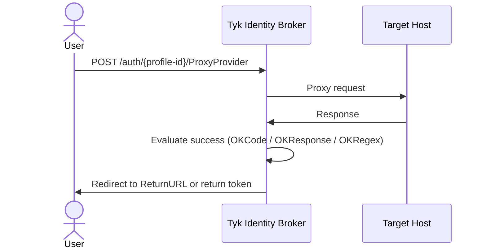

## Introduction

The Proxy Provider (`ProxyProvider`) is a passthrough authentication method that forwards the user's request to a custom or legacy HTTP endpoint and evaluates the response to determine whether authentication succeeded. No browser redirect to an external IdP is involved.

This is useful for integrating with systems that do not support standard protocols such as OIDC, SAML, or LDAP, for example a legacy authentication service that accepts Basic Auth and returns a JSON response.

Before configuring your TIB profile, read [Dashboard SSO](/nightly/tyk-identity-broker/dashboard-sso) or [Portal SSO](/nightly/tyk-stack/tyk-developer-portal/enterprise-developer-portal/managing-access/enable-sso) to understand the `ActionType`, `ReturnURL`, and `IdentityHandlerConfig` fields required for your use case.

## How It Works

TIB proxies the incoming authentication request to the configured `TargetHost` and evaluates the response:



1. The user submits credentials to the TIB endpoint (typically via a form `POST` or HTTP Basic Auth header).
2. TIB proxies the request to `TargetHost`.
3. TIB evaluates the response against the configured success criteria.
4. If successful, TIB extracts the user identity and executes the configured action.

## Evaluating Success

TIB evaluates the upstream response in order. At least one of `OKCode`, `OKResponse`, or `OKRegex` must be configured.

1. **Hard failure**: if the upstream returns HTTP `400` or above, authentication fails immediately.
2. **`OKCode`**: if set (non-zero), the response status code must exactly match this value.
3. **`OKResponse`**: if set, TIB base64-encodes the raw response body and compares it to this value. The configured value must therefore be a base64-encoded string.
4. **`OKRegex`**: if set, TIB applies this regular expression against the raw response body.

All configured criteria must pass for authentication to succeed.

## Extracting User Identity

If authentication succeeds, TIB extracts the user identity to pass to the identity handler:

- If `ResponseIsJson` is `true`, TIB parses the response body as JSON and extracts values using `AccessTokenField` and `UsernameField` as JSON field names.
- If `ExrtactUserNameFromBasicAuthHeader` is `true`, TIB extracts the username from the incoming request's Basic Auth header.
- If no username can be extracted, TIB generates a random identifier and appends `@soSession.com` to form a placeholder email address.

<Warning>
The field name `ExrtactUserNameFromBasicAuthHeader` contains a known typo that is preserved in the TIB codebase to avoid a breaking change. You must spell it exactly as shown.
</Warning>

## TIB Profile

The Proxy Provider configuration goes in the `ProviderConfig` block of the TIB profile. Set `ProviderName` to `ProxyProvider` and `Type` to `passthrough`.

```json expandable
{
  "ProviderName": "ProxyProvider",
  "Type": "passthrough",
  "ProviderConfig": {
    "TargetHost": "http://{upstream-host}/{path}",
    "OKCode": 200,
    "OKResponse": "",
    "OKRegex": "",
    "ResponseIsJson": false,
    "AccessTokenField": "",
    "UsernameField": "",
    "ExrtactUserNameFromBasicAuthHeader": false
  }
}
```

The `ProviderConfig` fields are:

| Field | Description |
|---|---|
| `TargetHost` | URL of the upstream authentication endpoint. |
| `OKCode` | HTTP status code that indicates a successful response. Set to `0` to disable this check. |
| `OKResponse` | Base64-encoded string that the response body must exactly match. Leave empty to disable. |
| `OKRegex` | Regular expression that must match the raw response body. Leave empty to disable. |
| `ResponseIsJson` | Set to `true` if the upstream response body is JSON, enabling field extraction via `AccessTokenField` and `UsernameField`. |
| `AccessTokenField` | JSON field name in the upstream response containing an access token. |
| `UsernameField` | JSON field name in the upstream response containing the username. |
| `ExrtactUserNameFromBasicAuthHeader` | Set to `true` to extract the username from the incoming request's Basic Auth header. See the warning above for the intentional field name typo. |

## Login Page

Since `ProxyProvider` is a passthrough flow, users submit credentials directly to TIB. Create a login page with a form that posts to the TIB authentication endpoint:

```html
<form method="POST" action="http://{tib-host}/auth/{profile-id}/ProxyProvider">
  <input type="text" name="username" />
  <input type="password" name="password" />
  <button type="submit">Log in</button>
</form>
```

Alternatively, credentials can be passed via an HTTP Basic Auth header if `ExrtactUserNameFromBasicAuthHeader` is set to `true`.

## Worked Example

This example proxies a Basic Auth request to an upstream service. TIB evaluates the HTTP `200` response code and extracts the username from the JSON response body.

<Tabs>
<Tab title="Dashboard SSO">

In this example, Tyk Dashboard is running at `http://dashboard.example.com` on port `3000`; replace the example values with your own.

**Tyk Dashboard configuration**

```json
{
  "sso_enable_user_lookup": true,
  "sso_permission_defaults": {
    "apis": "write",
    "keys": "write",
    "policies": "write"
  },
  "sso_default_group_id": "{tyk-user-group-id}"
}
```

With this configuration, registered users (with a Tyk Dashboard user account) get their own permissions; unregistered users fall back to the group specified in `sso_default_group_id`. See [Dashboard SSO](/nightly/tyk-identity-broker/dashboard-sso) for full details.

**TIB profile**

The TIB profile is created via the [Tyk Identity Broker API](/nightly/tyk-identity-broker/tib-rest-api) or the [Tyk Dashboard UI](/nightly/tyk-identity-broker/dashboard-sso#create-a-tib-profile-using-dashboard-ui).

```json expandable
{
  "ID": "proxy-dashboard",
  "Name": "Proxy Provider Dashboard SSO",
  "OrgID": "{tyk-org-id}",
  "ActionType": "GenerateOrLoginUserProfile",
  "Type": "passthrough",
  "ProviderName": "ProxyProvider",
  "ReturnURL": "http://dashboard.example.com:3000/tap",
  "IdentityHandlerConfig": {
    "DashboardCredential": "{tib-service-user-api-key}"
  },
  "ProviderConfig": {
    "TargetHost": "http://{upstream-host}/{auth-path}",
    "OKCode": 200,
    "OKResponse": "",
    "OKRegex": "",
    "ResponseIsJson": true,
    "AccessTokenField": "access_token",
    "UsernameField": "username",
    "ExrtactUserNameFromBasicAuthHeader": false
  }
}
```

- set `DashboardCredential` to the [TIB service account's](/nightly/tyk-identity-broker/dashboard-sso#tib-service-account) Dashboard credentials

**Login page form action**

Your login page form should `POST` to:

```
http://dashboard.example.com:3000/auth/proxy-dashboard/ProxyProvider
```

See [Dashboard SSO](/nightly/tyk-identity-broker/dashboard-sso) for details on session behavior, permissions, and user group mapping.

</Tab>
<Tab title="Portal SSO">

In this example, Tyk Developer Portal is running at `http://portal.example.com` on port `3001`; replace the example values with your own.

**Tyk Developer Portal configuration**

Enable embedded TIB in the Portal configuration:

```json
{
  "TIB": {
    "Enable": true
  }
}
```

**TIB profile**

The TIB profile is created via the Tyk Developer Portal UI under **Settings > SSO Profiles**.

```json expandable
{
  "ID": "proxy-portal",
  "Name": "Proxy Provider Portal SSO",
  "OrgID": "{tyk-org-id}",
  "ActionType": "GenerateOrLoginDeveloperProfile",
  "Type": "passthrough",
  "ProviderName": "ProxyProvider",
  "ReturnURL": "http://portal.example.com:3001/sso",
  "IdentityHandlerConfig": {
    "DashboardCredential": "{portal-api-secret}"
  },
  "ProviderConfig": {
    "TargetHost": "http://{upstream-host}/{auth-path}",
    "OKCode": 200,
    "OKResponse": "",
    "OKRegex": "",
    "ResponseIsJson": true,
    "AccessTokenField": "access_token",
    "UsernameField": "username",
    "ExrtactUserNameFromBasicAuthHeader": false
  }
}
```

- set `ActionType` and `OrgID` based on the audience:
    - Admin Portal (API owners): `ActionType: "GenerateOrLoginUserProfile"`, `OrgID: "0"`
    - Live Portal (API consumers): `ActionType: "GenerateOrLoginDeveloperProfile"`, `OrgID` is not required
- set `DashboardCredential` to the [`PortalAPISecret`](/nightly/product-stack/tyk-enterprise-developer-portal/deploy/configuration#portal_api_secret) used to authenticate with the Portal's management API

**Login page form action**

Your login page form should `POST` to:

```
http://portal.example.com:3001/tib/auth/proxy-portal/ProxyProvider
```

For details on user group mapping and admin vs developer profiles, see [Portal SSO](/nightly/tyk-stack/tyk-developer-portal/enterprise-developer-portal/managing-access/enable-sso).

</Tab>
</Tabs>
