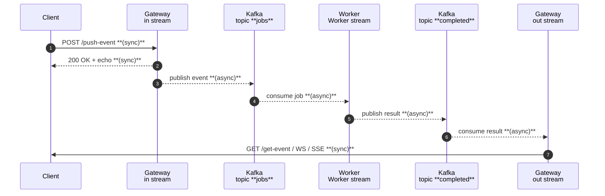

<div style={{position: 'relative', paddingBottom: '64.6900269541779%', height: 0}}><iframe src="https://www.loom.com/embed/4f5a017aa33648c9abb75d01a739a96f?sid=756a81af-170a-48e5-af62-09b26d9b2c26" frameborder="0" webkitallowfullscreen mozallowfullscreen allowfullscreen style={{position: 'absolute', top: 0, left: 0, width: '100%', height: '100%'}}></iframe></div>

## Why Tyk Streams?

Tyk Streams adds a **declarative event layer** on top of the Tyk Gateway, letting you expose or consume broker topics (Kafka, NATS, RabbitMQ…) through normal HTTP channels—REST, WebSocket, Server-Sent Events—without glue code.

You can manage stream definitions in three interchangeable ways:

| Method | When to use |
| :-------- | :------------- |
| **Tyk Dashboard UI** | Rapid prototyping and PoCs |
| **OpenAPI + `x-tyk-streaming`** | “Everything-as-code”, safe for Git |
| **Tyk Operator (Kubernetes CRD)** | GitOps & CI/CD pipelines |

---

## Requirements

* **Tyk Gateway ≥ 5.8** with **Streams** feature enabled  
* **Apache Kafka** reachable on `localhost:9093`  
* *(Optional)* **Prometheus** and **Jaeger** if you enable the commented observability blocks

---

## Architecture

The demo shows a classic pattern: a user request becomes an event on a bus, a worker processes it asynchronously, and the result is delivered back to the same user—without leaking data across tenants.



### Stream-per-responsibility pattern

| Stream | Role | Input | Output |
| :-------- | :------ | :------- | :-------- |
| **`in`** | Edge entrypoint: accepts HTTP, enriches payload (`user_id`, `job_id`), publishes to **`jobs`** and echoes to caller | HTTP | Kafka + sync response |
| **`Worker`** | Background micro-service: listens to **`jobs`**, attaches `result: "bar"`, publishes to **`completed`** | Kafka | Kafka |
| **`out`** | Edge exit point: listens to **`completed`**, drops messages not owned by caller, delivers via REST/WS/SSE | Kafka | HTTP |

---

## Processor mapping (built-in scripting)

Streams pipelines include **processors**. The *mapping* processor embeds [Bloblang](https://www.benthos.dev/docs/guides/bloblang/about/) so you can transform or filter messages inline:

* **Enrich** – `in` adds `user_id` & `job_id`
* **Augment** – `Worker` adds a static field `{ "result": "bar" }`
* **Filter** – `out` calls `deleted()` for non-matching users

Dynamic placeholders (`$tyk_context.…`) can reference query params, headers, JWT claims, or any other context variable—usable anywhere in the Streams config.

---

## Observability (optional)

Uncomment the `metrics:` and `tracer:` blocks to push per-stream Prometheus metrics and Jaeger traces. Tags like `stream: Worker` make end-to-end tracing trivial.

---

## Full OpenAPI definition

Copy/paste into `streams-demo.yaml`, import via Dashboard UI, or apply with Tyk Operator:

```yaml
info:
  title: streams-demo
  version: 1.0.0
openapi: 3.0.3
servers:
  - url: http://tyk-gateway:8282/stream-demo/
x-tyk-streaming:
  streams:
    Worker:
      input:
        kafka:
          addresses:
            - localhost:9093
          consumer_group: worker
          topics:
            - jobs
      output:
        kafka:
          addresses:
            - localhost:9093
          topic: completed
      pipeline:
        processors:
          - mapping: |
              root = this.merge({ "result": "bar" })
#      metrics:
#        prometheus:
#          push_interval: 1s
#          push_job_name: Worker
#          push_url: http://localhost:9091
#      tracer:
#        jaeger:
#          collector_url: http://localhost:14268/api/traces
#          tags:
#            stream: Worker

    in:
      input:
        http_server:
          path: /push-event
          ws_path: /ws-out
      output:
        broker:
          outputs:
            - kafka:
                addresses:
                  - localhost:9093
                topic: jobs
            - sync_response: {}
      pipeline:
        processors:
          - mapping: |
              root = this
              root.user_id = "$tyk_context.request_data_user"  # or $tyk_context.jwt.claims.sub
              root.job_id = uuid_v4()
#      tracer:
#        jaeger:
#          collector_url: http://localhost:14268/api/traces
#          tags:
#            stream: in
#      metrics:
#        prometheus:
#          push_interval: 1s
#          push_job_name: in
#          push_url: http://localhost:9091

    out:
      input:
        kafka:
          addresses:
            - localhost:9093
          consumer_group: $tyk_context.request_data_user
          topics:
            - completed
      output:
        http_server:
          path: /get-event
          ws_path: /ws-in
      pipeline:
        processors:
          - mapping: |
              root = if this.user_id != "$tyk_context.request_data_user" {
                deleted()
              }
#      tracer:
#        jaeger:
#          collector_url: http://localhost:14268/api/traces
#          tags:
#            stream: out
#      metrics:
#        prometheus:
#          push_interval: 1s
#          push_job_name: out
#          push_url: http://localhost:9091
security: []
paths: {}
components:
  securitySchemes: {}
x-tyk-api-gateway:
  info:
    name: stream-demo
    state:
      active: true
      internal: false
  middleware:
    global:
      contextVariables:
        enabled: true
      trafficLogs:
        enabled: true
  server:
    listenPath:
      strip: true
      value: /stream-demo/
  upstream:
    proxy:
      enabled: false
      url: ""
```

---

## Running the demo

1. **Start Kafka** (e.g. docker-compose).
2. **Launch Tyk Gateway 5.8+** with the YAML above.
3. **Send an event**  
   ```bash
   curl -X POST "http://localhost:8282/stream-demo/push-event?user=alice" \
        -H "Content-Type: application/json" \
        -d '{"message":"hello world"}'
   ```
4. **Receive the result** (only *alice*’s jobs)  
   ```bash
   curl "http://localhost:8282/stream-demo/get-event?user=alice"
   ```
5. **Switch transport** – connect via websocket `wscat -c http://127.0.0.1:8282/stream-demo/ws-in\?user\=alice`
6. *(Optional)* **Enable metrics & tracing** – uncomment blocks, restart Gateway, explore in Grafana & Jaeger.
