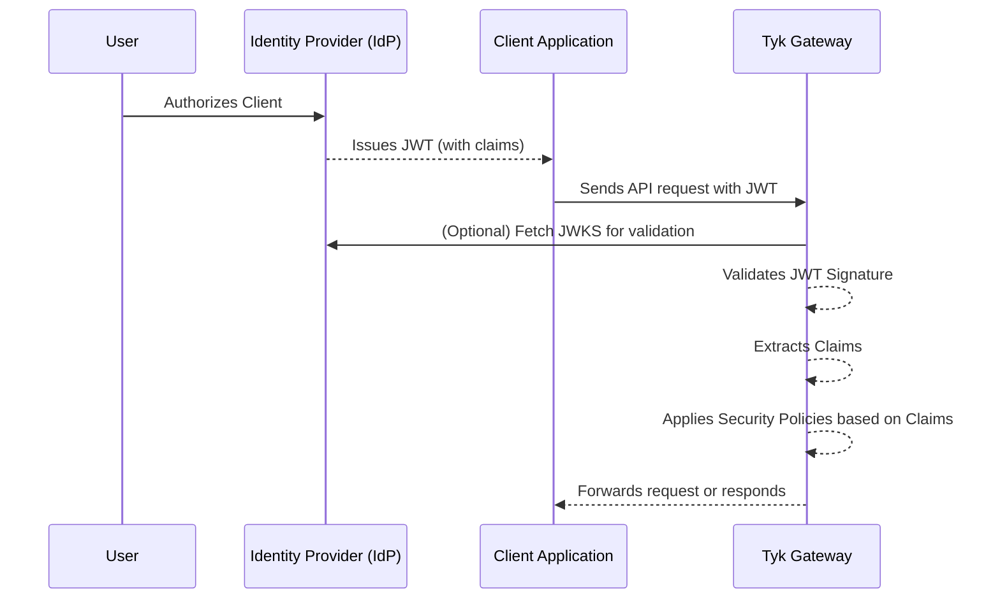

## Introduction

JSON Web Token (JWT) is an open standard ([RFC 7519](https://datatracker.ietf.org/doc/html/rfc7519)) that defines a compact and self-contained way for securely transmitting claims between parties as a JSON object. 

The information in the JSON object is digitally signed using either a secret (with the HMAC algorithm) or a public/private key pair (using RSA or ECDSA encryption) allowing the JWT to be used for client authentication.

### Key Benefits

- **Stateless Authentication**: Eliminates the need for server-side session storage, improving scalability.
- **Flexible Integration**: Works with multiple identity providers including Auth0, Okta, and custom JWT issuers.
- **Enhanced Security**: Supports multiple signature validation methods (RSA, ECDSA, HMAC) and claim verification.
- **Granular Access Control**: Leverage JWT claims for policy enforcement and scope-based permissions.
- **Performance Optimized**: Efficient token validation with minimal overhead and support for JWKS caching.

## How JWT Authentication works with Tyk

JWTs are commonly used in OAuth 2.0 and OpenID Connect flows to authenticate users and authorize access to APIs. The following diagram and steps outline the flow when using JWT Auth to secure access to your API through Tyk.


1. **Authentication and Token Issuance**

    Alice (the *user* or *resource owner*) authenticates with an Identity Provider (IdP) via the client application (steps 1 and 2).
    -  The IdP issues a JWT containing specific **claims** (permissions delegated by the user).
    -  The client application receives this authorization code and exchanges it for an access token (step 3).
    -  The client acts as the **Token Bearer**, holding the token to access protected resources on Alice's behalf.

2. **Request to Gateway**
    
    When the client sends a request to the API gateway, it includes the access token (JWT) in the request, usually in the `Authorization` header as a Bearer token (step 4).

3. **Token Validation**

    Tyk validates the token's signature using the shared secret or public key(s) of the trusted issuer (IdP). This process typically involves:
    -  Locating the JWT in the request (header, cookie, or query parameter).
    -  Decoding the JWT header to extract the `kid` (Key ID).
    -  Fetching public keys from configured JWKS URIs (or using a local static key).
    -  Searching the retrieved keys for a match to the `kid`.
    -  Validating the signature using the matching JWK.
    -  Ensuring the token is valid and not expired.
        -  *If any validation step fails, the request is rejected immediately.*

    To know more about how Tyk validates JWT signatures and claims, see [JWT Signature Validation](/nightly/api-management/authentication/jwt-signature-validation) and [JWT Claim Validation](/nightly/api-management/authentication/jwt-claim-validation).

4. **Internal Identity Creation**

    Once validated, Tyk creates an internal session for the request (step 5). This session is used to control access rights, consumption limits, and analytics. Tyk does not store user credentials; instead, it links the session to Alice using an identity [extracted from the JWT claims](/nightly/api-management/authentication/jwt-authorization#identifying-the-session-owner).

    To know more about how Tyk authorizes requests using JWT claims, see [JWT Authorization](/nightly/api-management/authentication/jwt-authorization).

5. **Policy Enforcement**

    Tyk enforces authorization by inspecting specific claims to determine which Security Policies apply (step 6):
    -  Tyk checks the **Policy Claim** (identified by the value stored in `basePolicyClaims`).
    -  It maps this claim to a configured Tyk Security Policy. If no direct map exists, a `defaultPolicy` may be applied.
    -  The applied policy configures the specific Access Rights (ACLs), rate limits, and usage quotas for that specific session.

    To know more about how Tyk identifies the policies to be applied, see [Identifying the Tyk Policies to be Applied](/nightly/api-management/authentication/jwt-authorization#identifying-the-tyk-policies-to-be-applied).

6. **Proxy to Upstream**

    If the token is valid and the policy allows the request, Tyk proxies the traffic to your upstream target service (step 7).


### JWT Workflow



## Configuration Options

The OpenAPI Specification treats JWT authentication as a variant of [bearer authentication](https://swagger.io/docs/specification/v3_0/authentication/bearer-authentication/) in the `components.securitySchemes` object using the `type: http`, `scheme: bearer` and `bearerFormat: jwt`:

```yaml
components:
  securitySchemes:
    myAuthScheme:
      type: http
      scheme: bearer
      bearerFormat: jwt

security:
  - myAuthScheme: []
```

With this configuration provided by the OpenAPI description, in the Tyk Vendor Extension we need to enable authentication, to select this security scheme and to indicate where Tyk should look for the credentials. Usually the credentials will be provided in the `Authorization` header, but Tyk is configurable, via the Tyk Vendor Extension, to support custom header keys and credential passing via query parameter or cooke.

```yaml
x-tyk-api-gateway:
  server:
    authentication:
      enabled: true
      securitySchemes:
        myAuthScheme:
          enabled: true
          header:
            enabled: true
            name: Authorization
```

**Note:** that URL query parameter keys and cookie names are case sensitive, whereas header names are case insensitive.

You can optionally [strip the user credentials](/nightly/api-management/client-authentication#managing-authorization-data) from the request prior to proxying to the upstream using the `authentication.stripAuthorizationData` field (Tyk Classic: `strip_auth_data`).

With the JWT method selected, you'll need to configure Tyk to handle the specific configuration of JSON Web Tokens that clients will be providing. All of the JWT specific configuration is performed within the `authentication.jwt` object in the [Tyk Vendor Extension](/nightly/api-management/gateway-config-tyk-oas#jwt).

### Locating the JWT in the Request

The OpenAPI Specification provides a `securitySchemes` mechanism that lets you define where the JWT should be located, for example in the request header. However, in practice, different clients may supply the token in different locations, such as a query parameter.

While OAS does not support this natively, the Tyk Vendor Extension does this by allowing configuration of alternative locations in the JWT entry in `server.authentication.securitySchemes`. Building on the previous example, we can add optional query and cookie locations as follows:

```yaml
x-tyk-api-gateway:
  server:
    authentication:
      enabled: true
      securitySchemes:
        myAuthScheme:
          enabled: true
          header:
            enabled: true
            name: Authorization
          query:
            enabled: true
            name: query-auth
          cookie:
            enabled: true
            name: cookie-auth
```

### Using Tyk Classic APIs

As noted in the Tyk Classic API [documentation](/nightly/api-management/gateway-config-tyk-classic#configuring-authentication-for-tyk-classic-apis), you can select JSON Web Token authentication using the `use_jwt` option. Tyk Classic APIs do not natively support multiple JWKS endpoints, though a [custom authentication plugin](/nightly/api-management/plugins/plugin-types#authentication-plugins) could be used to implement this functionality.
