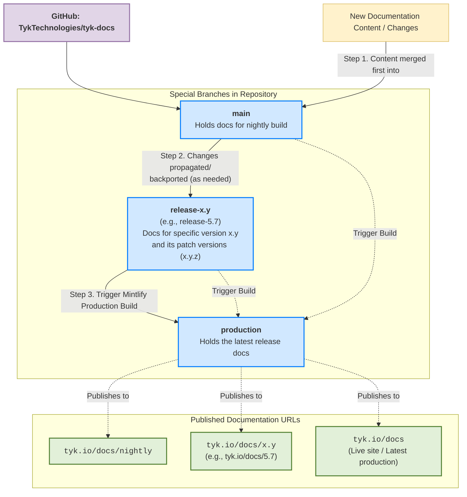

## Introduction

This document outlines the process for releasing Tyk documentation, including patch and major/minor releases. It provides a clear understanding of the versioning system, the release workflow, and the steps required to ensure that documentation is up-to-date.

## Types of Releases

Tyk has two types of releases:

1.  **Patch Release:** e.g → 5.3.5, 5.3.6, 5.7.1, 5.7.2

    A patch release includes bug fixes, small improvements, and security patches. It does not introduce any breaking changes.

2.  **Major/Minor Release:** e.g → 4.1, 4.2, 5.3, 5.4

    A major or minor release includes new features, improvements, and potentially breaking changes.

### Versioning in Tyk Docs

Tyk Docs uses a versioning system that aligns with the Tyk components. The versioning follows the Semantic Versioning of Tyk [Gateway](/nightly/developer-support/release-notes/gateway).

## Understanding the Release Workflow

Tyk Documentation is maintained in a [GitHub](https://github.com/TykTechnologies/tyk-docs) repository, and the release workflow is managed through branches. The following table outlines the special branches used in the Tyk Docs repository:

| **Special Branches** | **Description** | **Docs URL** |
| :--------------------------- | :----------------- | :-------------- |
| `main`                  | Holds docs for nightly build. | [tyk.io/docs/nighlty](https://tyk.io/docs/nighlty) |
| `release-x.y`             | Holds docs for that specific version. For example, `release-5.7` holds docs for 5.7 and its patch versions (5.7.1, 5.7.2, etc.). | [tyk.io/docs/5.7](https://tyk.io/docs/5.7) |
| `production`                  | It acts as the single source of truth for the Mintlify platform. | [tyk.io/docs](https://tyk.io/docs) |

### Production Branch

*   This is a special, **automated-only** branch. **No one should ever commit to it directly**.
*   It acts as the single source of truth for the Mintlify platform.
*   A GitHub Action (`deploy-docs.yml`) automatically builds this branch by:
    1.  Cloning the main branch and all active release- branches.
    2.  Organizing their content into versioned subfolders (e.g., /nightly/, /5.9/, /5.8/).
    3.  Generating a unified `docs.json` navigation file that contains the structure for all versions.
    Mintlify is connected only to this `production` branch and deploys any changes made to it.

### Workflow

All documentation content is always merged into the `main` branch first, and then the changes are made to the `release-x.y` branches as needed.



### Previous Releases

Tyk maintains [LTS versions](/nightly/developer-support/release-types/long-term-support#current-lts-releases-timeline). During some releases, we need to update the LTS release alongside the latest version. For example, you may need to maintain both 5.7.2 (latest) and 5.3.2 (LTS).

## Patch Release

To release a patch version, we follow a simple process that involves merging the release notes and documentation PRs into the `main` and the specific release branch (e.g., `release-5.7`).

### Pre-Requisites:

Ensure the PRs for documentation, configuration, and release notes have already been approved.

**Note:** For release notes, ensure that we have updated the Tyk component version on the [release summary page](https://tyk.io/docs/developer-support/release-notes/overview/)

### Instructions

1.  **Deploy release:**
    The PRs mentioned in the prerequisites can now be merged into the main and release branches (release-5.7)

2.  **Verify:**
    After merging the PRs on the version branch (release-5.7), it typically takes 5 minutes for the changes to be reflected on the live website. Verify these changes after release.

**Note:** We can also have a patch release for previous versions. For example, if the latest version is 5.7.2 and the new patch is 5.7.3, and a patch for LTS version 5.3.3 also needs to be released, then you will have to merge the PRs for both versions.

## Major/Minor Release

To release a major or minor version, we follow a series of steps to ensure that the documentation is updated, the latest version is deployed, and the previous versions are maintained correctly. The following steps outline the process:

### Pre-Requisites:

Ensure the PRs for documentation, configuration, and release notes have already been approved.

**Note:** For release notes, ensure that we have updated the Tyk component version on the [release summary page](https://tyk.io/docs/developer-support/release-notes/overview/)


### Instructions

1.  **Create the New Release Branch**
    From the main branch, create a new branch named release-X.Y (e.g., release-5.10). This branch will be used to maintain the documentation for the latest version.

2. **Update Redirects in docs.json**

    - In the `main` branch, edit the `docs.json` file to add all the redirects from the previous latest version.

        ```json
        "redirects": []
        ```

    - In the previous latest branch/version remove all the redirects from `docs.json` as they are no longer needed.

3.  **Update the Branch Configuration**
    In the main branch, edit the `branches-config.json` file. Add a new JSON object for the latest version. This configuration tells the build system how to handle the new version.

    *   Set isLatest to true for the new release-5.10.
    *   Set isLatest to false for the previous latest version (e.g., release-5.9).

    **Example:**

    ```json
    {
      "branch": "release-5.10",
      "isLatest": true,
      "sourceFolder": "5.10-source",
      "targetFolder": "5.10",
      "label": "v5.10 (latest)"
    }
    ```

4. **Manually Trigger the Deployment Workflow**

    1.  Go to the "Actions" tab in the GitHub repository.
    2.  Select the "Deploy Documentation" workflow.
    3.  Click "Run workflow" and choose the `production` branch to run it against.

    This will rebuild the `production` branch, creating the new versioned folder and updating the site's navigation to include v5.10 as the latest version.

5. **Update Cloudflare Worker**

    Add a new route in the `docs-rewrite-mintlify` Cloudflare Worker for the new version.

    **Example:**
    If the new version is 5.11, add the following route `*tyk.io/docs/5.11*`

6.  **Deploy release:**

    The PRs mentioned in the prerequisites can now be merged into `main` and the latest release branch.

7. **Update Postman Collections:**\
    We maintain a Postman collection for the following Tyk Components (Gateway, Dashboard, MDCB, and Developer Portal). After a major or minor release, we need to update the Postman collections.

    These instructions are for a single Tyk component and must be repeated for other components.

    1.  Download the Swagger from the docs website or the respective GitHub repository of the component.

    2.  In Postman, select the import option and drop the file you downloaded in the first step.

    3.  After the import, change the name. Refer to our previous collection name.

    5.  Add the `latest` prefix and remove the previous one. This ensures that the latest version is always displayed at the top.

8. **Update the HubSpot Banner to indicate the new release of the old docs pages.**
    **Description:** We use HubSpot to display a banner at the top of our docs page, which indicates that you are viewing old documentation and points to the latest version.\
    **Example:** [Sample Banner](https://tyk.io/docs/4.0/getting-started/key-concepts/graphql-subscriptions/).

    **Steps:** Update the HubSpot banner to indicate the new release.

9. **Add a reference to release notes in Github Releases:**
    **Description:** Developers usually refer to the GitHub release tags to view the changelog. These release tags should point to the release notes in the docs.\
    **Example:** `https://github.com/TykTechnologies/tyk/releases/tag/v5.3.8`\
    **Steps:** Modify the release tags of all components modified in a release.\
