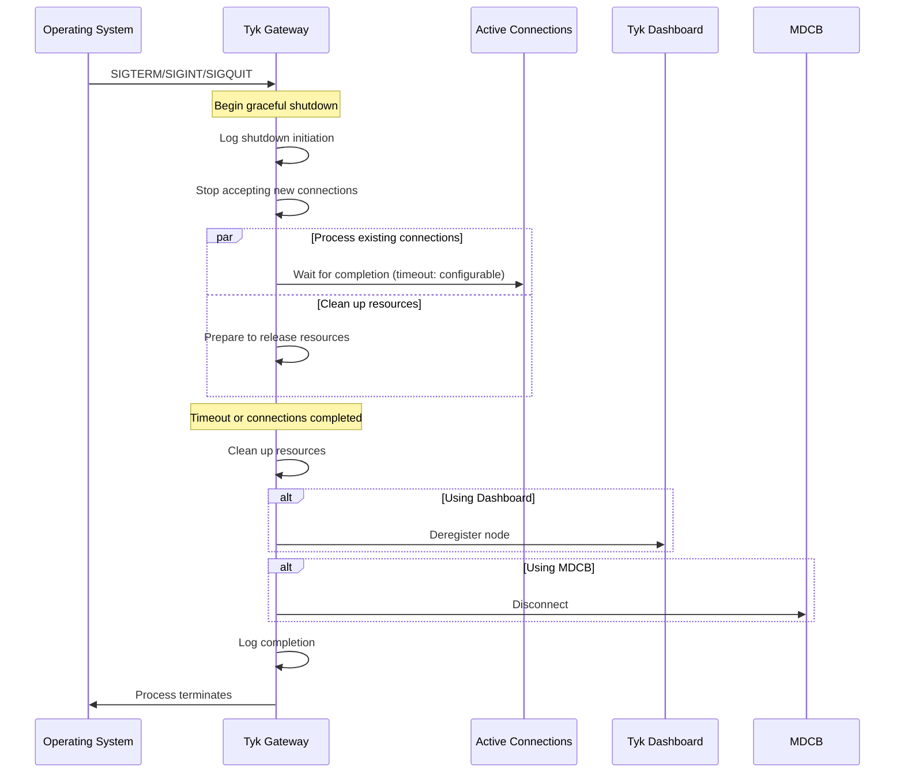
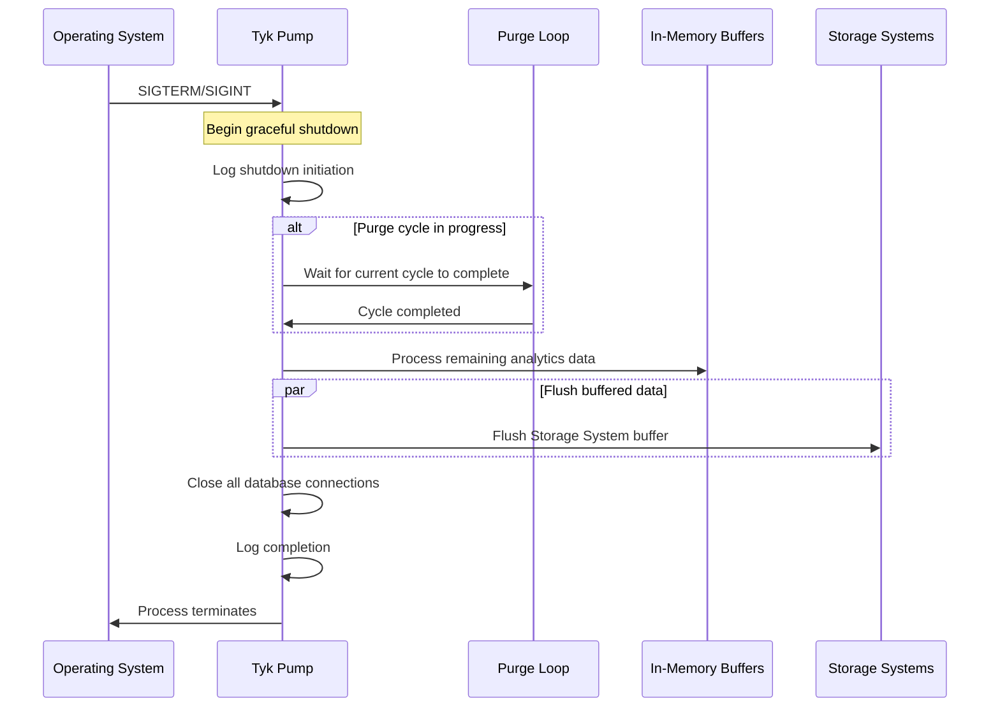

## Introduction

Tyk components implement **graceful shutdown** mechanisms to ensure data integrity and request completion during restarts or terminations. This feature is valuable during deployments, updates, or when you need to restart your Gateway in production environments. It helps to maintain high availability and reliability during operational changes to your API gateway infrastructure.

## Tyk Gateway

Tyk Gateway includes a graceful shutdown mechanism that ensures clean termination while minimizing disruption to active connections and requests. 

### Configuration

Add the [graceful_shutdown_timeout_duration](/nightly/tyk-oss-gateway/configuration#graceful_shutdown_timeout_duration) parameter to your Tyk Gateway configuration file (or set the environment variable `TYK_GW_GRACEFUL_SHUTDOWN_TIMEOUT_DURATION`):

```json
{
  "graceful_shutdown_timeout_duration": 30
}
```

| Parameter | Type | Description |
| :----------- | :------ | :------------- |
| `graceful_shutdown_timeout_duration` | integer | The number of seconds Tyk will wait for existing connections to complete before forcing termination. Default: 30 seconds. |

### How It Works

#### Signal Handling

Tyk Gateway listens for standard termination signals:

- `SIGTERM`: Sent by container orchestrators like Kubernetes
- `SIGQUIT` : Manual quit signal
- `SIGINT` : Interrupt signal (Ctrl+C)


    <Note>
    Note that Gateway will not shutdown gracefully if it receives a `SIGKILL` signal, but will stop immediately.
    </Note>

#### Shutdown Sequence

When a termination signal is received, Tyk:

- Logs that shutdown has begun
- Stops accepting new connections
- Waits for active requests to complete (up to the configured timeout)
- Cleans up resources (cache stores, analytics, profiling data)
- Deregisters from the Dashboard (if using DB configurations)
- Disconnects from MDCB (if deployed in a distributed data plane)
- Logs completion and exits



### Best Practices

- Adjust timeout for your workloads: If your APIs typically handle long-running requests, increase the timeout accordingly.
- Configure orchestration platforms: When using Kubernetes, ensure pod termination grace periods align with your Tyk graceful shutdown timeout.
- Monitor shutdown logs: Check for timeout warnings during restarts, which may indicate you need a longer duration.

### Advanced Details

If the shutdown process exceeds the configured timeout, Tyk logs a warning and forcibly terminates any remaining connections. This prevents the Gateway from hanging indefinitely if connections don't close properly.

The implementation uses Go's context with timeout to manage the shutdown process, ensuring that resources are properly released even in edge cases.

## Tyk Pump

Tyk Pump also includes a graceful shutdown mechanism that ensures clean termination while preserving analytics data integrity. Pump will wait until the current purge cycle completes before flushing the data from all Pumps that have an internal buffer. This feature is particularly important during deployments, updates, or when you need to restart your pump service in production environments.


### Configuration

The graceful shutdown behavior in Tyk Pump is primarily controlled by the [purge_delay](/nightly/tyk-pump/tyk-pump-configuration/tyk-pump-environment-variables#purge_delay) parameter in your Tyk Pump configuration file (or set the environment variable `TYK_PMP_PURGEDELAY`):

```json
{
  "purge_delay": 10
}
```

| Parameter | Type | Description |
| :----------- | :------ | :------------- |
| `purge_delay` | integer | The number of seconds between each purge loop execution. This also affects the graceful shutdown timing as Tyk Pump will complete the current purge cycle before shutting down. Default: 10 seconds. |

### How It Works

#### Signal Handling

Tyk Pump listens for standard termination signals:

- `SIGTERM`: Sent by container orchestrators like Kubernetes
- `SIGINT` : Interrupt signal (Ctrl+C)


    <Note>
    Note that Pump will not shutdown gracefully if it receives a `SIGKILL` signal, but will stop immediately.
    </Note>


#### Shutdown Sequence

When a termination signal is received, Tyk Pump:

- Logs that shutdown has begun
- Completes the current purge cycle
- Processes any data already in memory
- Triggers a final flush operation on all configured pumps
- Closes all database and storage connections
- Logs completion and exits



These pumps buffer data in-memory before sending the data to the storage and so will flush out those data before the connection is closed:
- `ElasticSearch`
- `dogstatd`
- `Influx2`

### Best Practices

- Adjust `purge_delay` for your workloads: A shorter purge delay means more frequent processing but also faster shutdown. For high-volume environments, finding the right balance is important.
- Configure orchestration platforms: When using Kubernetes, ensure pod termination grace periods are sufficient to allow for at least one complete purge cycle.
- Monitor shutdown logs: Check for any warnings during restarts that might indicate data processing issues.
- Consider redundant instances: For high-availability environments, run multiple pump instances to ensure continuous analytics processing.
