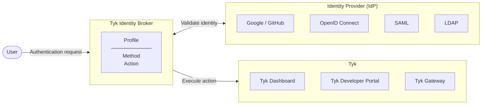
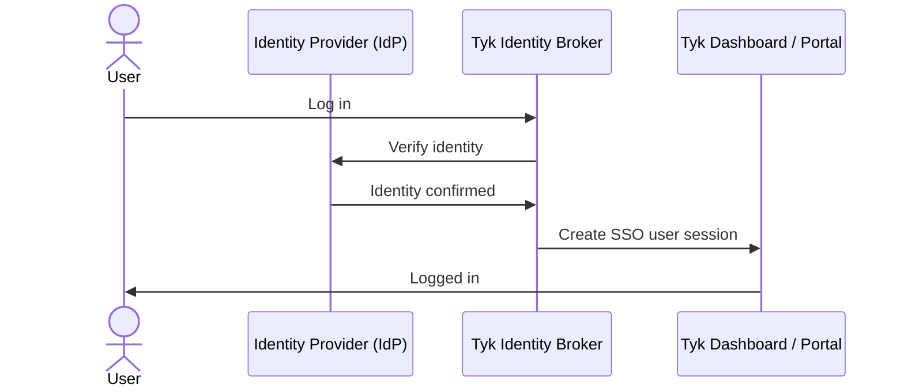
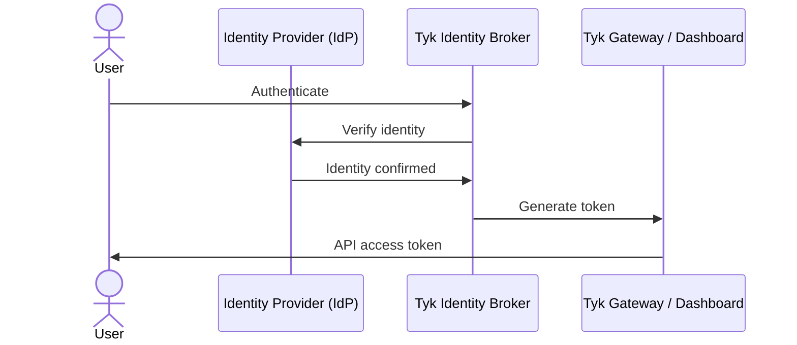

import { ResponsiveGrid } from '/snippets/nightly/ResponsiveGrid.mdx';

## What is Tyk Identity Broker?

Tyk Identity Broker (TIB) is a service that connects external identity providers (IdPs) to your Tyk installation. It handles the interaction with the IdP on your behalf, then on successful authentication instructs Tyk to take a specific action, such as logging a user into Tyk Dashboard or issuing an API access token.



## Use Cases

TIB supports two distinct use cases, each with a different outcome.

### Single Sign-On

A human user wants to log in to Tyk Dashboard or Tyk Developer Portal using their existing IdP credentials. TIB handles the interaction with the IdP and creates a user session on the Tyk platform.



### API Token Generation

An API proxy deployed on Tyk Gateway is secured using [Auth Token](/nightly/api-management/authentication/bearer-token) or [OAuth 2.0](/nightly/api-management/authentication/oauth-2). A client application authenticates its users via an external IdP, receiving a dynamically generated access token that grants access to the API proxy. There is no need for an administrator to generate the access token.



## How TIB Works

Every authentication flow in TIB is driven by three core concepts: a Profile that defines the flow, a Method that determines how TIB interacts with the IdP, and an Action that determines what happens on success.

### Profile

A *profile* is a configuration object stored in TIB that defines a complete authentication flow. It specifies how TIB should connect to the IdP, which [method](/nightly/#method) to use and therefore what protocol to follow, which [action](/nightly/#actions) to take on success, and where to send the user afterwards.

Profiles are managed via the [Tyk Identity Broker API](/nightly/tyk-identity-broker/tib-rest-api) or, when using embedded TIB, through the Tyk Dashboard or Portal UI.

Each profile has a unique ID, which forms part of the TIB authentication URL:

```
/auth/{id}/{provider}
```

`{id}` is the unique ID of the profile. `{provider}` identifies the IdP to authenticate against - its value depends on the [authentication method](/nightly/#method) configured in the profile.

When a user or application makes a request to that URL, TIB loads the corresponding profile based on the provided `{id}`.

Once the profile has been loaded, TIB initiates authentication with the IdP using the configured [method](/nightly/#method).

### Method

The method defines how TIB communicates with the IdP. TIB supports two flow types and four authentication methods, one per supported protocol.

**Redirect flow** - TIB redirects the user's browser to the IdP login page. The IdP authenticates the user and redirects back to TIB with the result. TIB maintains state across the redirect using a signed session cookie. See [Session Cookie](/nightly/#redirect-session-cookie) for configuration details.

**Passthrough flow** - TIB validates the user's credentials directly against the IdP without a browser redirect. Credentials are submitted to TIB, which proxies the validation inline.

| Method | `ProviderName` | Flow |
|---|---|---|
| Social | `SocialProvider` | Redirect |
| SAML | `SAMLProvider` | Redirect |
| LDAP | `ADProvider` | Passthrough |
| Proxy | `ProxyProvider` | Passthrough |

#### Social (`SocialProvider`)

Supports [OAuth 2.0](https://oauth.net/2/) and [OpenID Connect](https://openid.net/connect/)-compatible IdPs. Supports enterprise IdPs such as Auth0, Keycloak, Okta, and Microsoft Entra ID, as well as social logins such as Google, GitHub, and LinkedIn. `SocialProvider` also supports [JSON Web Encryption (JWE)](/nightly/api-management/single-sign-on-social-idp#json-web-encryption-jwe) for IdPs that encrypt their ID tokens.

#### SAML (`SAMLProvider`)

TIB acts as a [SAML 2.0](https://docs.oasis-open.org/security/saml/Post2.0/sstc-saml-tech-overview-2.0.html) Service Provider. The user is redirected to the IdP, which posts a signed assertion back to TIB. Commonly used with enterprise IdPs such as Microsoft Entra ID and ADFS.

#### LDAP (`ADProvider`)

TIB validates the user's credentials directly against an [LDAP](https://datatracker.ietf.org/doc/html/rfc4511) server such as Active Directory or OpenLDAP. No browser redirect is involved; credentials are submitted directly to TIB.

#### Proxy (`ProxyProvider`)

TIB forwards the authentication request to an external HTTP endpoint and treats the response as the authentication result. Useful for integrating with custom or legacy authentication systems.

### Provider Configuration

Each method requires IdP-specific connection settings in the `ProviderConfig` block of the profile. This is where you configure the details TIB needs to communicate with your IdP, for example the callback URL, the client credentials, and the discovery endpoint.

The structure of `ProviderConfig` depends entirely on the method:

| Method | Key `ProviderConfig` fields |
|---|---|
| `SocialProvider` | `CallbackBaseURL`, `FailureRedirect`, `UseProviders` (array containing `Name`, `Key`, `Secret`, and optionally `DiscoverURL` for OIDC) |
| `SAMLProvider` | `SAMLBaseURL`, `IDPMetadataURL`, `CertLocation`, `FailureRedirect` |
| `ADProvider` | `LDAPServer`, `LDAPPort`, `LDAPUserDN`, `FailureRedirect` |
| `ProxyProvider` | `TargetHost`, `OKCode`, `OKResponse`, `OKRegex` |

For the full set of fields for each method, see the [Identity Provider guides](/nightly/#what-would-you-like-to-do).

### Actions

The *action* defines what TIB should do after the IdP has confirmed the user's identity and is configured using the `ActionType` field in the profile.

There are four actions, grouped by [use case](/nightly/#use-cases):

**Single Sign-On**

| `ActionType` | Target | Behavior |
|---|---|---|
| `GenerateOrLoginUserProfile` | Tyk Dashboard or Tyk Developer Portal (admin users) | Logs a user into [Tyk Dashboard](/nightly/tyk-identity-broker/dashboard-sso) or the Developer Portal's [Admin Portal](/nightly/tyk-stack/tyk-developer-portal/enterprise-developer-portal/managing-access/enable-sso). |
| `GenerateOrLoginDeveloperProfile` | Tyk Developer Portal (API consumer users) | Logs a user into the Developer Portal's [Live Portal](/nightly/tyk-stack/tyk-developer-portal/enterprise-developer-portal/managing-access/enable-sso). |

For full details of the SSO use case, see:
- [Single Sign-On for Tyk Dashboard](/nightly/tyk-identity-broker/dashboard-sso)
- [Single Sign-On for Tyk Developer Portal](/nightly/tyk-stack/tyk-developer-portal/enterprise-developer-portal/managing-access/enable-sso)

**API Token Generation**

| `ActionType` | Token type | Behavior |
|---|---|---|
| `GenerateTemporaryAuthToken` | Auth Token | Tyk generates a [Session](/nightly/api-management/access-control/sessions-and-keys/understanding-sessions) and returns the Key (auth token) to the client application. |
| `GenerateOAuthTokenForClient` | OAuth 2.0 token | Uses the configured OAuth client to obtain an OAuth 2.0 token from Tyk Gateway's built-in authorization server on behalf of the authenticated user, and returns it to the client application via a redirect. |

For full details of the API Token use case, see [Issuing Tokens using TIB](/nightly/api-management/access-control/sessions-and-keys/issuing-tokens-via-tib).

## Embedded vs Standalone TIB

TIB is embedded in Tyk Dashboard (from v3.0) and Tyk Developer Portal (from v1.12.0). For most use cases you do not need to install or run TIB separately.

Standalone TIB is required only in the following situations:

- You are using TIB to issue API access tokens via an external IdP, which involves TIB communicating directly with Tyk Gateway.
- You are running a version of Tyk Dashboard or Tyk Developer Portal that pre-dates the embedded TIB integration.
- You have a specific infrastructure requirement that prevents use of the embedded TIB.

If you need to run standalone TIB, see [Install Standalone TIB](/nightly/tyk-identity-broker/standalone-tib).

## Redirect Session Cookie

When using a [method](/nightly/#method) that uses the redirect flow (`SocialProvider` or `SAMLProvider`), TIB needs to maintain state across the browser round-trip to the IdP and back, for example which profile is being used. It does this by storing a session cookie in the user's browser.

The cookie is signed using HMAC-SHA256 with a secret key, which prevents it from being tampered with. The content of the cookie is base64-encoded but not encrypted, so it should not contain sensitive data. The signing key is configured via the `TYK_IB_SESSION_SECRET` environment variable.

When using redirect flow with:

- Embedded TIB in Tyk Dashboard, if `TYK_IB_SESSION_SECRET` is not explicitly set, Tyk Dashboard automatically falls back to its own [`admin_secret`](/nightly/tyk-dashboard/configuration#admin_secret).
- Embedded TIB in Tyk Developer Portal, no fallback is applied and `TYK_IB_SESSION_SECRET` must be set.
- Standalone TIB, `TYK_IB_SESSION_SECRET` must always be set.

Setting `TYK_IB_SESSION_SECRET` explicitly is recommended in all production deployments.

## What Would You Like to Do?

<ResponsiveGrid>

<Card title="SSO into Tyk Dashboard" href="/nightly/tyk-identity-broker/dashboard-sso">
Log users into Tyk Dashboard using an external identity provider.
</Card>

<Card title="SSO into Tyk Developer Portal" href="/nightly/tyk-stack/tyk-developer-portal/enterprise-developer-portal/managing-access/enable-sso">
Log users into Tyk Developer Portal using an external identity provider.
</Card>

<Card title="Issue API Access Tokens" href="/nightly/api-management/access-control/sessions-and-keys/issuing-tokens-via-tib">
Use TIB to authenticate users against an external IdP and issue auth tokens or OAuth tokens on their behalf.
</Card>

<Card title="Install Standalone" href="/nightly/tyk-identity-broker/standalone-tib">
Install TIB when you don't want to or can't use it embedded in Tyk Dashboard or Tyk Developer Portal.
</Card>

<Card title="API Reference" href="/nightly/tyk-identity-broker/tib-rest-api">
Manage TIB programmatically using the Tyk Identity Broker API.
</Card>

<Card title="TIB Configuration Reference" href="/nightly/tyk-configuration-reference/tyk-identity-broker-configuration">
Full reference for the TIB configuration file (tib.conf) and environment variables.
</Card>

</ResponsiveGrid>
