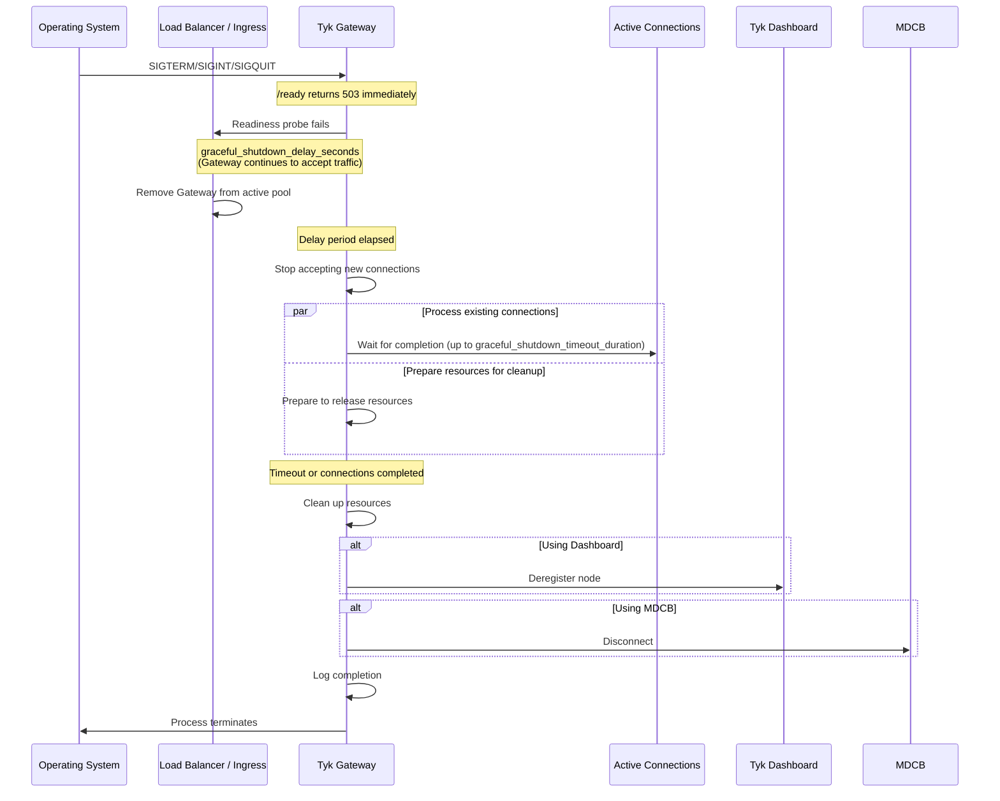
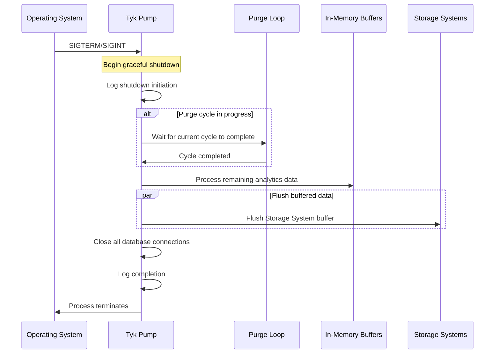

## Introduction

Tyk components implement **graceful shutdown** mechanisms to ensure data integrity and request completion during restarts or terminations. This feature is valuable during deployments, updates, or when you need to restart your Gateway in production environments. It helps to maintain high availability and reliability during operational changes to your API gateway infrastructure.

## Tyk Gateway

Tyk Gateway includes a graceful shutdown mechanism that ensures clean termination while minimizing disruption to active connections and requests. 

### Configuration

Add the following parameters to your configuration file (or the equivalent environment variables):

```json
{
  "graceful_shutdown_delay_seconds": 10,
  "graceful_shutdown_timeout_duration": 30
}
```

| Parameter | Type | Description |
| :----------- | :------ | :------------- |
| [`graceful_shutdown_timeout_duration`](/tyk-oss-gateway/configuration#graceful_shutdown_timeout_duration) | integer | The number of seconds Tyk Gateway will wait for in-flight requests to complete before forcing termination. Default: 30 seconds. |
| [`graceful_shutdown_delay_seconds`](/tyk-oss-gateway/configuration#graceful_shutdown_delay_seconds) | integer | **(From Tyk Gateway 5.14.0)** The number of seconds Tyk Gateway will continue accepting new connections after receiving a termination signal, before beginning the graceful shutdown. During this period, the `/ready` endpoint immediately returns `503 Service Unavailable`, signaling to load balancers and orchestrators to remove the Gateway from the active pool. Default: 0 seconds (disabled). |

The two settings work in sequence. The total time from receiving a termination signal to process exit is at most `graceful_shutdown_delay_seconds` + `graceful_shutdown_timeout_duration`.

### How It Works

#### Signal Handling

Tyk Gateway listens for standard termination signals:

- `SIGTERM`: Sent by container orchestrators such as Kubernetes
- `SIGQUIT`: Manual quit signal
- `SIGINT`: Interrupt signal (Ctrl+C)

<Note>
Tyk Gateway will not shut down gracefully if it receives a `SIGKILL` signal and will stop immediately.
</Note>

#### Shutdown Sequence

When a termination signal is received, Tyk Gateway:

1. Immediately marks itself as shutting down. The `/ready` endpoint (the default readiness endpoint, configurable via `readiness_check_endpoint_name`) begins returning `503 Service Unavailable`.
2. **(From Tyk Gateway 5.14.0)** If `graceful_shutdown_delay_seconds` is configured, waits for that period while continuing to accept and process new requests. This gives load balancers and orchestrators time to detect the failing readiness probe and remove the Gateway from the active pool before connections are refused.
3. Stops accepting new connections.
4. Waits for in-flight requests to complete, up to `graceful_shutdown_timeout_duration`.
5. Cleans up resources (cache stores, analytics, profiling data).
6. Deregisters from Tyk Dashboard (if using a database configuration).
7. Disconnects from MDCB (if deployed in a distributed data plane).
8. Logs completion and exits.



### Kubernetes Deployments

In Kubernetes environments, a pod receiving `SIGTERM` is removed from the Service endpoints list, but the time for that change to propagate to all load balancers and ingress controllers (such as AWS ALB) varies. During this propagation window, traffic can still be routed to a pod that has already stopped accepting connections, resulting in `HTTP 502` errors.

`graceful_shutdown_delay_seconds` addresses this by keeping the Gateway accepting traffic while the `/ready` probe fails, giving the load balancer time to complete deregistration before the Gateway stops accepting connections.

Set `graceful_shutdown_delay_seconds` to be at least as long as it takes your load balancer to detect the failing readiness probe and stop routing traffic to the pod. This depends on your readiness probe configuration (`periodSeconds` and `failureThreshold`) and your load balancer's deregistration delay setting.

For example, with a readiness probe configured as `periodSeconds: 10` and `failureThreshold: 1`, the load balancer may take up to 10 seconds to remove the pod. Setting `graceful_shutdown_delay_seconds: 15` provides a safety margin.

Also ensure that Kubernetes `terminationGracePeriodSeconds` on the pod is greater than `graceful_shutdown_delay_seconds` + `graceful_shutdown_timeout_duration`, otherwise Kubernetes will send `SIGKILL` before the shutdown sequence completes.

### Best Practices

- Adjust the drain timeout for your workloads: If your APIs handle long-running requests, increase `graceful_shutdown_timeout_duration` accordingly.
- Kubernetes deployments: Set `graceful_shutdown_delay_seconds` to exceed your load balancer's deregistration detection time, and ensure `terminationGracePeriodSeconds` is greater than `graceful_shutdown_delay_seconds` + `graceful_shutdown_timeout_duration`.
- Monitor shutdown logs: Check for timeout warnings during restarts, which may indicate you need a longer drain timeout.

### Advanced Details

If the drain period exceeds `graceful_shutdown_timeout_duration`, Tyk Gateway logs a warning and forcibly terminates any remaining connections. This prevents the Gateway from hanging indefinitely if connections do not close properly.

The implementation uses Go's context with timeout to manage the shutdown process, ensuring that resources are properly released even in edge cases.

## Tyk Pump

Tyk Pump also includes a graceful shutdown mechanism that ensures clean termination while preserving analytics data integrity. Pump will wait until the current purge cycle completes before flushing the data from all Pumps that have an internal buffer. This feature is particularly important during deployments, updates, or when you need to restart your pump service in production environments.


### Configuration

The graceful shutdown behavior in Tyk Pump is primarily controlled by the [purge_delay](/tyk-pump/tyk-pump-configuration/tyk-pump-environment-variables#purge_delay) parameter in your Tyk Pump configuration file (or set the environment variable `TYK_PMP_PURGEDELAY`):

```json
{
  "purge_delay": 10
}
```

| Parameter | Type | Description |
| :----------- | :------ | :------------- |
| `purge_delay` | integer | The number of seconds between each purge loop execution. This also affects the graceful shutdown timing as Tyk Pump will complete the current purge cycle before shutting down. Default: 10 seconds. |

### How It Works

#### Signal Handling

Tyk Pump listens for standard termination signals:

- `SIGTERM`: Sent by container orchestrators such as Kubernetes
- `SIGINT`: Interrupt signal (Ctrl+C)


<Note>
Tyk Pump will not shut down gracefully if it receives a `SIGKILL` signal and will stop immediately.
</Note>


#### Shutdown Sequence

When a termination signal is received, Tyk Pump:

1. Logs that shutdown has begun.
2. Completes the current purge cycle.
3. Processes any data already in memory.
4. Triggers a final flush operation on all configured pumps.
5. Closes all database and storage connections.
6. Logs completion and exits.



These pumps buffer data in-memory before sending the data to the storage and so will flush out those data before the connection is closed:
- `ElasticSearch`
- `dogstatd`
- `Influx2`

### Best Practices

- Adjust `purge_delay` for your workloads: A shorter purge delay means more frequent processing but also faster shutdown. For high-volume environments, finding the right balance is important.
- Configure orchestration platforms: When using Kubernetes, ensure pod termination grace periods are sufficient to allow for at least one complete purge cycle.
- Monitor shutdown logs: Check for any warnings during restarts that might indicate data processing issues.
- Consider redundant instances: For high-availability environments, run multiple Tyk Pump instances to ensure continuous analytics processing.
