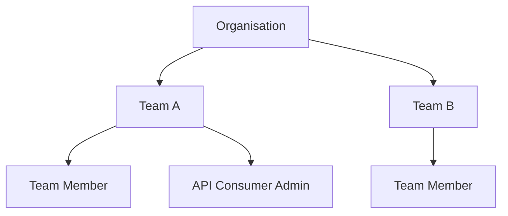

The Consuming APIs section covers everything an API Consumer needs to discover APIs, gain access, manage credentials, and integrate with services through the Tyk Developer Portal.

## Your Interface as a Consumer

The Developer Portal exposes two separate interfaces depending on your role:

- The **Live Portal** is the public-facing website where API Consumers browse API Catalogs, request access to API Products, manage their credentials, and create Developer Apps.
- The **Admin Portal** is the private management interface used by API Owners and Portal Admins to configure the portal, curate API Products, and manage access requests.

API Consumers interact exclusively through the Live Portal. The Admin Portal is reserved for API Owners and Portal Admins and is not accessible to Consumers.

For a full overview of all portal roles and concepts, see [Core Concepts](/portal/overview/concepts).

{/* TODO: Screenshot — Live Portal home page showing the catalog listing view from a logged-in API Consumer's perspective, with the navigation menu visible */}

## The Consumer Hierarchy

API Consumers exist within a three-level hierarchy that controls what content they can see and what actions they can take.

Every API Consumer belongs to exactly one **Organisation**. Within that Organisation, they can be members of one or more **Teams**. The Teams a Consumer belongs to determine which API Catalogs and Products are visible to them in the Live Portal.

### Organisations

An Organisation represents a company or business unit that consumes your APIs. Organisations are created and managed by API Owners through the Admin Portal.

Each portal deployment includes a **Default Organisation** that acts as a holding area for new users who have not yet been assigned to a custom Organisation.

### Teams

A Team is a group of users within an Organisation who share access to the same API Catalogs. Consumers can belong to multiple Teams within their Organisation, and each Team can have access to different Catalogs.

Each Organisation includes a **Default Team**. Users who register without an invite code or explicit Team assignment are placed in the Default Team.

<Note>
The Live Portal only displays API Products and Catalogs that are visible to the Teams the logged-in Consumer belongs to.
</Note>

For details on creating and managing Organisations and Teams, see [Organisations and Teams](/tyk-stack/tyk-developer-portal/enterprise-developer-portal/managing-access/manage-api-consumer-organisations).

## Consumer Roles

There are two roles for API Consumers within the Developer Portal:

### Team Member

Team Members have standard access to discover and use APIs. They can:

- Browse available API Catalogs and Products
- Request access to API Products
- Create and manage their own Developer Apps
- View API documentation
- Monitor their own API usage

Most developers consuming your APIs will have the Team Member role.

### API Consumer Admin

API Consumer Admins have elevated privileges within their Organisation. In addition to all Team Member capabilities, they can:

- Invite new users to their Organisation
- Manage Team membership for users within their Organisation
- View and manage shared Developer Apps created by other Organisation members

This role is suited for team leads or primary contacts at partner organisations who need to manage their developer community.

<Note>
The Developer Portal UI displays this role as **Org Admin** in some screens. Both terms refer to the same role.
</Note>

**How roles are assigned:**

- Users who self-register through the Live Portal receive the Team Member role by default.
- Users who accept an admin invite, or who create a new Organisation during self-registration, receive the API Consumer Admin role.
- SSO users are assigned roles based on their identity provider group mapping. See [Single Sign-On](/tyk-stack/tyk-developer-portal/enterprise-developer-portal/managing-access/enable-sso) for details.

## Developer Apps and the Hierarchy

A Developer App is a container that holds the credentials for accessing one or more API Products. Each App has a visibility setting that controls who within the Organisation can view it:

| Visibility | Who can see the App |
|---|---|
| Personal | Only the creator |
| Team | All members of the Teams the creator belongs to |
| Organisation | All members of the creator's Organisation |

API Consumer Admins can view all Apps within their Organisation regardless of the visibility setting.

<Note>
Users in the Default Organisation are restricted to Personal visibility for all Apps. Users who belong only to the Default Team of a custom Organisation can only set Personal or Organisation visibility.
</Note>

For full details on creating and managing Developer Apps, see [Developer Apps](/portal/developer-app).

## The Consumer Lifecycle

A typical API Consumer journey through the Developer Portal follows these stages:

**Register or accept an invitation.** New Consumers create an account through the Live Portal registration page or accept an email invitation from an API Consumer Admin or Portal Admin. SSO users authenticate through their identity provider.

**Join an Organisation and Team.** After registering, Consumers are placed into an Organisation and Team. This happens automatically when using an invite link or invite code. Consumers who self-register without an invite join the Default Organisation and Default Team until an API Consumer Admin reassigns them.

**Browse available API Catalogs.** Once assigned to a Team, the Consumer can see all API Products and Catalogs accessible to that Team in the Live Portal.

**Create a Developer App.** Before requesting access to an API Product, the Consumer creates a Developer App. The App serves as a container for the credentials associated with one or more API Products.

**Request access to an API Product.** The Consumer selects an API Product and Plan, attaches their Developer App, and submits an access request. Depending on the Product's configuration, access is granted immediately (auto-approval) or after review by a Portal Admin.

**Receive and use credentials.** Once access is approved, credentials such as API keys, OAuth tokens, or certificates are available in the Developer App. The Consumer uses these credentials to authenticate API calls.

**Manage credentials over time.** Consumers can view, rotate, and revoke credentials directly from the Live Portal. They can also request access to additional Products or change Plans on existing credentials.

For a step-by-step walkthrough of this process, see [Request Access to an API](/portal/request-access).

## Browsing Without an Account

An account is not required to browse **Public Catalogs**. Unauthenticated visitors can:

- View API Product listings and descriptions
- Read API documentation and OpenAPI specifications
- Explore the API Playground (where enabled on the Product)

An account is required to request access, create a Developer App, or retrieve credentials. When an unauthenticated visitor attempts these actions, the Live Portal redirects them to the login or registration page.

Private Catalogs are not visible to unauthenticated visitors.

## Single Sign-On

If your organisation uses an identity provider such as Okta, Keycloak, or Azure AD, you may access the Developer Portal through a custom SSO login URL rather than the standard username and password form. Your identity provider group membership determines your Team assignment and role within the portal hierarchy automatically.

For SSO configuration details, see [Single Sign-On](/tyk-stack/tyk-developer-portal/enterprise-developer-portal/managing-access/enable-sso).
