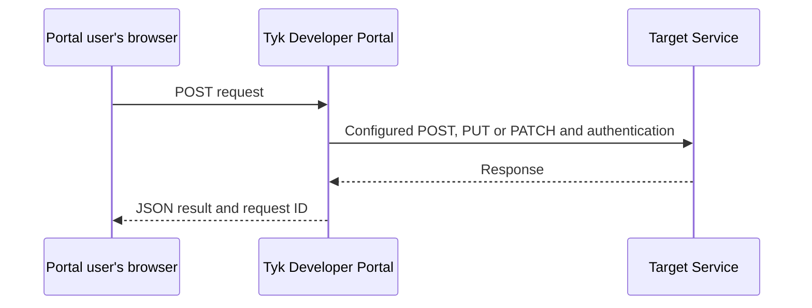

Callouts let you connect custom Pages in your Developer Portal to external services. You can build forms or use JavaScript to send data to those services and present the results to your Portal users. For example, you can add a support-request page that submits information to your ticketing system and shows whether the submission succeeded.

You configure the service URL, request method and authentication in the Admin Portal, then assign the Callout to a Page. In the Page's template, you provide the form or JavaScript that sends the request and handles the response.

Your Page's code sends Callout requests through the user's browser. Tyk Developer Portal checks the user's session, calls the configured service and returns the result. Service credentials stay on the Portal server rather than being included in the browser code. The external service is the Callout's *target*.

## How Callouts work

### Configure the integration

You configure three parts that work together:

- In a **Callout**, you define the target URL, HTTP method and authentication used to send data to the external service.
- On a **[Page](/portal/customization/pages)**, you select the Callout to use. Each Page can select one Callout, and multiple Pages can use the same Callout.
- In a **[template](/portal/customization/templates#pages)**, you add the form or JavaScript that sends requests and handles responses.

Selecting a Callout does not create the user interface or request-handling code. The [Submit a form with a Callout](/portal/how-to-guides/submit-form-with-callout) guide walks you through building a support form as one example.

### Request journey

Your Page's form or JavaScript sends a `POST` request to the Callout endpoint using the Portal user's session. The Callout's **Method** setting controls the separate request that Portal sends to the target: `POST`, `PUT` or `PATCH`.

<Info>
Callouts do not currently support `GET` requests to target services. If your integration requires `GET`, [share your use case with us](https://tyk.io/contact/). This helps us understand customer needs and assess whether and when to add GET support to our roadmap.
</Info>

{/* Diagram purpose: distinguish the browser request from the outbound request.
Structure: signed-in user's browser, Tyk Developer Portal, target service.
Key elements: browser POST; configured POST/PUT/PATCH with target authentication;
JSON responses. Access requirements below explain session and CSRF checks.
Keep Tyk Gateway optional, not a required hop. */}
<div style={{ marginBlock: '2rem' }}>



</div>

Tyk Developer Portal puts the request data inside a JSON object called an *envelope*. Its `payload` field contains the request data. If **Include user identity** is selected, an `actor` field also contains the authenticated user's Portal identifier and email address. See the [request format](#request-format) for examples.

A target can accept this envelope directly. If it expects a different format, use an intermediate API to transform the request, for example on Tyk Gateway. Tyk Gateway is optional, not a required part of a Callout integration.

Portal returns the result to the browser, where your Page's code decides how to display or use it. Unlike [webhooks](/portal/customization/webhooks), Callouts do not subscribe to Portal events or deliver requests asynchronously. They do not queue retries or prevent repeated requests from creating duplicate records.

### Portal user access

Callout requests require an active, authenticated Portal user. A Page can be publicly visible, but anonymous visitors cannot invoke its Callout.

Cross-site request forgery (CSRF) protection must also remain enabled. It checks a token sent with the request to help prevent another website from sending requests using the user's session. The [form tutorial](/portal/how-to-guides/submit-form-with-callout#add-submission-handling) shows how to send this token.

Any active, authenticated Portal user can invoke an enabled Callout if they know its endpoint URL. Hiding a form or other Page controls does not restrict access to the endpoint. Enforce any additional authorization at the target service.

## Check destination requirements

By default, destinations must use HTTPS and public IPv4 addresses on ports 80 or 443. HTTP is disabled by default, but you can enable it in the [Portal configuration](/product-stack/tyk-enterprise-developer-portal/deploy/configuration#tyk_portal_callouts_allowhttp).

For internal destinations, custom ports, host restrictions or capacity limits, see [Callouts settings](/product-stack/tyk-enterprise-developer-portal/deploy/configuration#callouts-settings). If you use OAuth authentication, these restrictions also apply to the service that issues access tokens, configured as the **Token URL**.

## Create a Callout

1. Open **Customise > Callouts** in the Admin Portal.
2. Select **Add new Callout**.
3. Enter a unique **Name**, for example `Submit support request`.
4. Enter the service's **Target URL** and select its **Method**: `POST`, `PUT` or `PATCH`.
5. Select **Authentication** and enter the required values described below.
6. Review **Include user identity**, **Timeout (seconds)** and the TLS setting.
7. Select **Test connection** to check connectivity.
8. Select **Enabled** when the Callout is ready for use, then select **Save Changes**.

<Info>
**Test connection** sends an `OPTIONS` request to the target URL. If the target does not support this method, the test fails, but the Callout may still work using its configured method. See [Test the connection](#test-the-connection) for details.
</Info>

For new Callouts, **Enabled** and **Include user identity** are not selected by default. The default timeout is 5 seconds; valid values are 1 through 10 seconds. This timeout covers OAuth token acquisition, if needed, and the target request, including its response body.

### Target authentication

Choose how Tyk Developer Portal authenticates with the target. This is separate from how your Portal users sign in.

| Option | Required values | Behavior |
| :--- | :--- | :--- |
| **Static request header** | **Header name**, **Header value** | Sends one fixed authentication header, such as `X-API-Key`. For a fixed bearer token, use `Authorization` with the complete `Bearer TOKEN` value. |
| **OAuth 2.0 client credentials** | **Token URL**, **Client ID**, **Client secret**; optional **Scopes** | Obtains an access token and sends it as a bearer token to the target. Separate scope names with spaces. |
| **None** | None | Sends no configured authentication credential to the target. A Portal user session is still required to invoke the Callout. |

For OAuth, the token endpoint must support the client credentials grant and client authentication through HTTP Basic authentication. Tyk Developer Portal reuses valid access tokens. This is service authentication, not delegated authorization with the API Consumer's OAuth credentials.

Callout credentials are separate from the access credentials issued to API Consumers through API Products and Plans. Do not put target credentials in the Page template, browser JavaScript or URL. Headers managed by Tyk Developer Portal, including `Content-Type`, `Host` and `X-Callout-Request-ID`, cannot be used as the static authentication header.

### Include user identity

Select **Include user identity** only if the target needs the authenticated user's Portal identifier (CID) and email address. This adds both values to the envelope's `actor` object; deselecting it omits the entire object. Tyk Developer Portal supplies these values from the authenticated user, not from the request payload.

This setting controls identity sent to the target. It does not remove the user CID from the Portal's execution logs. A separate request ID lets you [trace the request](#trace-a-request) with either setting.

### TLS certificates

For HTTPS connections, Tyk Developer Portal checks the target's TLS certificate to verify the server's identity.

For normal use, do not select **Allow unverified TLS certificates**. Selecting it disables certificate verification for both the target and the OAuth token endpoint, if they use HTTPS. It does not override destination restrictions.

This option requires the target URL or the OAuth token URL for the selected authentication method to use HTTPS.

<Warning>
Disabling certificate verification can expose credentials and request data to an intercepted connection. Use a certificate that Tyk Developer Portal trusts instead wherever possible.
</Warning>

## Test the connection

**Test connection** checks whether the Portal server can reach the target using the current settings in the Callout editor. It sends an `OPTIONS` request using the selected authentication method, destination policy and TLS setting, but sends no request payload and does not save the settings.

A successful result means that the target returned a 2xx response to this probe. It does not prove that the configured method or a real payload will succeed. A target that returns `405` or `501` does not support this probe; a Callout request can still work. Test through the Page as well.

For OAuth, the probe obtains a token for the current settings. Changing a destination can require you to re-enter a saved credential before testing.

## Use a Callout on a Page

Open a Page under **Customise > Pages**, select its **Callout**, and save it.

For a usable, enabled Callout, this selection gives the Page template an endpoint URL through the `.calloutAction` value. The form or JavaScript uses that URL to send data to Tyk Developer Portal, not directly to the target.

Selecting a Callout does not add a form or a sample Page to your theme. Follow the [Submit a form with a Callout](/portal/how-to-guides/submit-form-with-callout) guide for a working template and JavaScript example.

## Edit or delete a Callout

Saved **Header value** and **Client secret** fields show a standard six-symbol mask, not the secret or its length. Leave the field unchanged to retain the saved value. Enter a new value to replace it.

Re-enter the relevant credential after changing the target URL, authentication type, header name, OAuth token URL or OAuth client ID. Enabling **Allow unverified TLS certificates** also requires it. This prevents an edited destination from receiving a hidden credential without the editor supplying it again.

To remove authentication, select **None** and save. To switch authentication methods, enter the new method's credentials and save. Saving clears the credentials for the inactive method.

Deselecting **Enabled** stops new requests through that Callout without removing its Page associations. In **Pages**, the **Callout** column shows its name, **None**, **Disabled**, or **Missing**. The last state indicates that the selected Callout is no longer available.

The **Pages** count in the Callouts list shows how many Pages use each Callout. **Delete** is unavailable while any Page uses it. Select **None** or a different Callout on those Pages first. Deleting a Callout removes its configuration from use in the Portal; it does not delete the target service or its records. You cannot undo deletion in the Admin Portal.

<Note>
Deleting a Callout does not revoke its credentials at the target service or OAuth provider. Revoke or rotate those credentials when retiring the integration.
</Note>

## Request format

The browser sends a `POST` request to the URL in `.calloutAction`, which resolves to `/callouts/{calloutCID}`. Here, `calloutCID` is the selected Callout's identifier. This endpoint authenticates the user through their Portal session, separately from the Portal Management API under `/portal-api`.

Supported browser request formats are:

| Content type | Conversion to `payload` |
| :--- | :--- |
| `application/x-www-form-urlencoded` | A single value becomes a string; repeated names become arrays of strings. The `csrf_token` field is excluded. |
| `application/json` | The complete JSON value becomes `payload`, without field conversion. Send only the payload, not an already wrapped envelope. |

Send the CSRF token in the `X-CSRF-Token` header, as shown in the tutorial. For URL-encoded requests, you can instead send it in a `csrf_token` form field. Portal excludes this field from the payload sent to the target. For JSON requests, use the header.

File uploads and `multipart/form-data` are not supported.

If the target needs the signed-in user's identity, select **Include user identity** on the Callout. Portal then adds an `actor` object to the outbound envelope:

```json
{
  "payload": {
    "subject": "Unable to access the sandbox API",
    "description": "My test request returns an authorization error."
  },
  "actor": {
    "id": "PORTAL_USER_CID",
    "email": "consumer@example.com"
  }
}
```

`actor.id` is the authenticated user's Portal identifier (CID), not the numeric database ID. Deselecting **Include user identity** omits `actor`, rather than sending empty identity values. The request payload does not override the server-supplied identity.

## Handle the response

Tyk Developer Portal wraps the target's response so the browser can distinguish the target's result from a failure in Portal itself. For example, if the target returns HTTP `201` with a JSON body containing a request reference, the browser receives HTTP `200` with this envelope:

```json
{
  "ok": true,
  "upstreamStatus": 201,
  "data": {
    "id": "REQ-123"
  }
}
```

`ok` is true for a target status from 200 through 299. A target error with a valid JSON body still returns HTTP `200` to the browser, but with `ok: false` and the target's status in `upstreamStatus`. An empty target response produces `data: null`. Nonempty target responses must contain valid JSON with a JSON content type.

<Info>
Callouts return the target's entire valid JSON response body to the browser as `data`, including target error responses. Callouts do not filter response content or remove sensitive fields. Hiding a field in your Page's user interface does not prevent the user from reading it in the response.

Configure the target to return only information your Portal users may see. Alternatively, use an API on Tyk Gateway to modify the response before it reaches Portal. See [Adapt requests and responses with Tyk Gateway](/portal/how-to-guides/submit-form-with-callout#optional-adapt-requests-and-responses-with-tyk-gateway) for an example.
</Info>

If Portal cannot obtain a usable target response, it returns a non-2xx HTTP status and an error object instead of the result envelope. Read the status from the HTTP response (`response.status` in JavaScript). The JSON body contains `error.code` and `error.message`, but no HTTP status, `ok` or `upstreamStatus` fields.

For example, a timeout returns HTTP `504` with this JSON body:

```json
{
  "error": {
    "code": "callout_timeout",
    "message": "Unable to complete the request"
  }
}
```

| HTTP status | Meaning |
| :--- | :--- |
| 400 | Invalid request, for example malformed JSON or an incomplete request body; CSRF rejection also returns 400, with a plain-text body instead of JSON |
| 401 | No valid, active Portal user session |
| 404 | Callout not found |
| 413 | Request body exceeds the configured limit |
| 415 | Unsupported request content type |
| 502 | Outbound request failed, or the target response is invalid or too large |
| 503 | Callout unavailable, destination policy rejection, or concurrency limit reached |
| 504 | Outbound operation timed out |

Always check both the HTTP status and the response envelope. Authentication or middleware failures may return a different response format, so do not assume every response is JSON.

Do not automatically retry a request after a timeout or network failure. The target can complete the operation even if the response is lost. Use the request ID to investigate. Before adding retries, make sure the target can recognize a repeated request and avoid performing the operation twice.

## Trace a request

Use the request ID to follow a request from the browser through Tyk Developer Portal to the target service. Each system must record or display that ID for you to connect its observations to the same request.

For requests that reach execution, Tyk Developer Portal writes `Callout started` and `Callout completed` at the `info` log level. The records contain `request_id`, `callout_cid`, `target_host` and `actor_cid`. Completion also includes `duration` and a result such as `success`, `target_error` or `timeout`.

The same request ID is returned in the browser's `X-Callout-Request-ID` response header and sent to the target in a header with that name. Ask the target service to record it. If an intermediate API is involved, preserve the header when forwarding the request.

To investigate a Callout request:

1. Obtain the request ID returned to your Page's code, if available. Your code can display or record it to help with investigation.
2. Search the Portal's application logs for that ID and check the completion result.
3. Search the target's logs for the same ID to check what happened after it received the request.

These execution records do not contain the request payload, response body or authentication secrets. They are separate from [admin audit logs](/tyk-developer-portal/enable-audit-logs-portal). Collect and retain application logs using your deployment's logging system; Callouts has no request-history screen or built-in retention setting.

A missing execution record is not proof that the browser never sent a Callout request. Authentication, CSRF, input validation or request limits can reject a request before execution. A browser or network failure can also prevent it from reaching the Portal.

Some rejections before execution return a request ID without an execution log. CSRF rejection returns neither a Callout request ID nor an execution log. Check the HTTP status and response body as well as any request ID.

## Troubleshooting

| Symptom | What to check |
| :--- | :--- |
| Callouts is absent from the Admin Portal | Check that the account is an API Owner and ask your operator to review [Callouts settings](/product-stack/tyk-enterprise-developer-portal/deploy/configuration#callouts-settings). |
| The template has no Callout URL | Check the Page's selection and the Callout's **Enabled** setting. |
| Connection test reports an unsupported method | Check whether the target supports `OPTIONS`. Test the configured Callout request separately. |
| Save or connection test requests a credential | Re-enter the credential after changing connection settings. A mask is not a reusable credential value. |
| Request returns 400 with a plain-text body | Check the CSRF token. CSRF rejection returns `400 Bad Request`, not the Callout JSON error format. |
| Request returns 401 | Check the Portal session. The browser does not authenticate with the Callout's target credential. |
| Request returns 502 or 504 | Check target and token-endpoint connectivity, TLS, response format and timeout. A timeout does not prove the target made no change. |
| Request returns 503 | Check whether the Callout is disabled, CSRF protection is disabled, the destination is blocked, or the instance is at its concurrency limit. |
| HTTP 200 is returned but the operation failed | Inspect `ok` and `upstreamStatus` in the [response envelope](#handle-the-response). |
