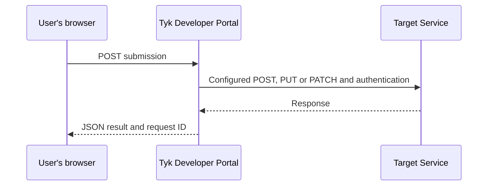

Callouts let a signed-in user submit data from a custom Page in Tyk Developer Portal to an external service. For example, a support-request form can send data to a ticketing service without exposing the service's credentials in the browser.

The browser sends the submission to Tyk Developer Portal, which makes a separate request to the external service and returns the result. The external service is the Callout's *target*.

## How Callouts work

Three parts work together:

- A **Callout** defines the target URL, HTTP method and authentication used to send data to the external service.
- A **[Page](/portal/customization/pages)** is content published in the Live Portal, the user-facing website. Each Page can select one Callout, and multiple Pages can use the same Callout.
- A **[template](/portal/customization/templates#pages)** defines how the Page appears. Templates, styles and scripts make up the Portal's [theme](/portal/customization/themes). The template supplies the form or JavaScript that sends submissions and displays results.

Selecting a Callout connects the Page to an existing configuration. It does not create the form. Follow the [Submit a form with a Callout](/portal/how-to-guides/submit-form-with-callout) guide to add the template and submission handling.

The browser always sends a `POST` request to the Callout endpoint. The Callout's **Method** setting controls the separate request to the target: `POST`, `PUT` or `PATCH`.

<Info>
Callouts do not currently support `GET` requests to target services. If your integration requires `GET`, [share your use case with us](https://tyk.io/contact/). This helps us understand customer needs and assess whether and when to add GET support to our roadmap.
</Info>

{/* Diagram purpose: distinguish the browser request from the outbound request.
Structure: signed-in user's browser, Tyk Developer Portal, target service.
Key elements: browser POST; configured POST/PUT/PATCH with target authentication;
JSON responses. Access requirements below explain session and CSRF checks.
Keep Tyk Gateway optional, not a required hop. */}

Tyk Developer Portal puts the submitted data inside a JSON object called an *envelope*. Its `payload` field contains the submitted data. If **Include user identity** is selected, an `actor` field also contains the authenticated user's Portal identifier and email address. See the [request format](/portal/how-to-guides/submit-form-with-callout#request-format) for examples.

A target can accept this envelope directly. If it expects a different format, use an intermediate API to transform the request, for example on Tyk Gateway. Tyk Gateway is optional, not a required part of a Callout integration.

The Page waits for the result. Unlike [webhooks](/portal/customization/webhooks), Callouts do not subscribe to Portal events or deliver requests asynchronously. They do not queue retries or prevent repeated submissions from creating duplicate records.

### Who can submit

Callout submissions require an active, authenticated Portal user. A Page can be publicly visible, but an anonymous visitor cannot submit a Callout request.

Cross-site request forgery (CSRF) protection must also remain enabled. It checks a token sent with the submission to help prevent another website from submitting requests using the user's session. The [form tutorial](/portal/how-to-guides/submit-form-with-callout#add-submission-handling) shows how to send this token.

Any active, authenticated Portal user can invoke an enabled Callout if they know its submission URL. Hiding the form does not restrict access to the endpoint. Enforce any additional authorization at the target service.

## Check destination requirements

By default, destinations must use HTTPS and public IPv4 addresses on ports 80 or 443. An allowed port does not enable HTTP.

For internal destinations, custom ports, host restrictions or capacity limits, see [Callouts settings](/product-stack/tyk-enterprise-developer-portal/deploy/configuration#callouts-settings). If you use OAuth authentication, these restrictions also apply to the service that issues access tokens, configured as the **Token URL**. On Tyk Cloud, confirm configuration access and outbound network connectivity with your Tyk support contact before setup.

## Create a Callout

Use an [API Owner](/portal/api-owner) account to access the Admin Portal, the administration interface. Both `super-admin` and `provider-admin` roles can manage Callouts; API Consumer administrator roles cannot.

1. Open **Customise > Callouts** in the Admin Portal.
2. Select **Add new Callout**.
3. Enter a unique **Name**, for example `Submit support request`.
4. Enter the service's **Target URL** and select its **Method**: `POST`, `PUT` or `PATCH`.
5. Select **Authentication** and enter the required values described below.
6. Review **Include user identity**, **Timeout (seconds)** and the TLS setting.
7. Select **Test connection** to check connectivity.
8. Select **Enabled** when the Callout is ready for use, then select **Save Changes**.

New Callouts start with **Enabled** and **Include user identity** cleared. The default timeout is 5 seconds; valid values are 1 through 10 seconds. This timeout covers OAuth token acquisition, if needed, and the target request, including its response body.

### Authentication

Choose how Tyk Developer Portal authenticates with the target. This is separate from the user's Portal login.

| Option | Required values | Behavior |
| :--- | :--- | :--- |
| **Static request header** | **Header name**, **Header value** | Sends one fixed authentication header, such as `X-API-Key`. For a fixed bearer token, use `Authorization` with the complete `Bearer TOKEN` value. |
| **OAuth 2.0 client credentials** | **Token URL**, **Client ID**, **Client secret**; optional **Scopes** | Obtains an access token and sends it as a bearer token to the target. Separate scope names with spaces. |
| **None** | None | Sends no configured authentication credential to the target. Portal login is still required to submit. |

For OAuth, the token endpoint must support the client credentials grant and client authentication through HTTP Basic authentication. Tyk Developer Portal reuses valid access tokens. This is service authentication, not delegated authorization with the API Consumer's OAuth credentials.

Callout credentials are separate from the access credentials issued to API Consumers through API Products and Plans. Do not put target credentials in the Page template, browser JavaScript or URL. Headers managed by Tyk Developer Portal, including `Content-Type`, `Host` and `X-Callout-Request-ID`, cannot be used as the static authentication header.

### Include user identity

Select **Include user identity** only if the target needs the authenticated user's Portal identifier (CID) and email address. This adds both values to the envelope's `actor` object; clearing it omits the entire object. Tyk Developer Portal supplies these values from the authenticated user, not from form fields.

This setting controls identity sent to the target. It does not remove the user CID from the Portal's execution logs. A separate request ID lets you [trace the submission](#trace-a-submission) with either setting.

### TLS certificates

For HTTPS connections, Tyk Developer Portal checks the target's TLS certificate to verify the server's identity.

Leave **Allow unverified TLS certificates** cleared for normal use. Selecting it disables certificate verification for both the target and the OAuth token endpoint, if they use HTTPS. It does not override destination restrictions.

This option requires the target URL or the OAuth token URL for the selected authentication method to use HTTPS.

<Warning>
Disabling certificate verification can expose credentials and submitted data to an intercepted connection. Use a certificate that Tyk Developer Portal trusts instead wherever possible.
</Warning>

## Test the connection

**Test connection** checks whether the Portal server can reach the target using the current form values. It sends an `OPTIONS` request using the selected authentication method, destination policy and TLS setting, but sends no submission payload and does not save the form.

A successful result means that the target returned a 2xx response to this probe. It does not prove that the configured method or a real payload will succeed. A target that returns `405` or `501` does not support this probe; a submission can still work. Test through the Page as well.

For OAuth, the probe obtains a token for the current form values. Changing a destination can require you to re-enter a saved credential before testing.

## Use a Callout on a Page

Open a Page under **Customise > Pages**, select its **Callout**, and save it.

For a usable, enabled Callout, this selection gives the Page template a submission URL through the `.calloutAction` value. The form or JavaScript uses that URL to send data to Tyk Developer Portal, not directly to the target.

Selecting a Callout does not add a form or a sample Page to your theme. Follow the [Submit a form with a Callout](/portal/how-to-guides/submit-form-with-callout) guide for a working template and JavaScript example.

## Edit or delete a Callout

Saved **Header value** and **Client secret** fields show a standard six-symbol mask, not the secret or its length. Leave the field unchanged to retain the saved value. Enter a new value to replace it.

Re-enter the relevant credential after changing the target URL, authentication type, header name, OAuth token URL or OAuth client ID. Enabling **Allow unverified TLS certificates** also requires it. This prevents an edited destination from receiving a hidden credential without the editor supplying it again.

To remove authentication, select **None** and save. To switch authentication methods, enter the new method's credentials and save. Saving clears the credentials for the inactive method.

Clearing **Enabled** stops new submissions through that Callout without removing its Page associations. In **Pages**, the **Callout** column shows its name, **None**, **Disabled**, or **Missing**. The last state indicates that the selected Callout is no longer available.

The **Pages** count in the Callouts list shows how many Pages use each Callout. **Delete** is unavailable while any Page uses it. Select **None** or a different Callout on those Pages first. Deleting a Callout removes its configuration from use in the Portal; it does not delete the target service or its records. You cannot undo deletion in the Admin Portal.

<Note>
Deleting a Callout does not revoke its credentials at the target service or OAuth provider. Revoke or rotate those credentials when retiring the integration.
</Note>

## Trace a submission

Use the request ID to follow a submission from the browser through Tyk Developer Portal to the target service. Each system must record or display that ID for you to connect its observations to the same request.

For requests that reach execution, Tyk Developer Portal writes `Callout started` and `Callout completed` at the `info` log level. The records contain `request_id`, `callout_cid`, `target_host` and `actor_cid`. Completion also includes `duration` and a result such as `success`, `target_error` or `timeout`.

The same request ID is returned in the browser's `X-Callout-Request-ID` response header and sent to the target in a header with that name. Ask the target service to record it. If an intermediate API is involved, preserve the header when forwarding the request.

To investigate a reported submission:

1. Obtain the request ID displayed by your custom Page, if available.
2. Search the Portal's application logs for that ID and check the completion result.
3. Search the target's logs for the same ID to check what happened after it received the request.

These execution records do not contain the submitted payload, response body or authentication secrets. They are separate from [admin audit logs](/tyk-developer-portal/enable-audit-logs-portal). Collect and retain application logs using your deployment's logging system; Callouts has no submission-history screen or built-in retention setting.

A missing execution record is not proof that the user never selected **Submit**. Authentication, CSRF, input validation or request limits can reject a request before execution. A browser or network failure can also prevent it from reaching the Portal.

Some rejections before execution return a request ID without an execution log. CSRF rejection returns neither a Callout request ID nor an execution log. Check the HTTP status and response body as well as any request ID.

## Troubleshooting

| Symptom | What to check |
| :--- | :--- |
| Callouts is absent from the Admin Portal | Check that the account is an API Owner and ask your operator to review [Callouts settings](/product-stack/tyk-enterprise-developer-portal/deploy/configuration#callouts-settings). |
| The template has no submission URL | Check the Page's selection and the Callout's **Enabled** setting. |
| Connection test reports an unsupported method | Check whether the target supports `OPTIONS`. Test the real submission separately. |
| Save or connection test requests a credential | Re-enter the credential after changing connection settings. A mask is not a reusable credential value. |
| Submission returns 400 with a plain-text body | Check the CSRF token. CSRF rejection returns `400 Bad Request`, not the Callout JSON error format. |
| Submission returns 401 | Check the Portal session. The browser does not authenticate with the Callout's target credential. |
| Submission returns 502 or 504 | Check target and token-endpoint connectivity, TLS, response format and timeout. A timeout does not prove the target made no change. |
| Submission returns 503 | Check whether the Callout is disabled, CSRF protection is disabled, the destination is blocked, or the instance is at its concurrency limit. |
| HTTP 200 is returned but the operation failed | Inspect `ok` and `upstreamStatus` in the [response envelope](/portal/how-to-guides/submit-form-with-callout#handle-the-response). |
