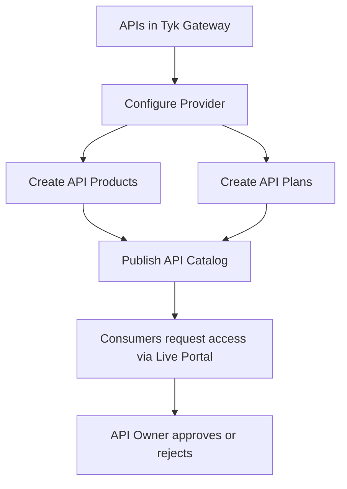

## Introduction

The Tyk Developer Portal provides two views: an Admin Portal where API Owners configure and manage an API program, and a Live Portal where [API Consumers](/portal/api-consumer) discover APIs and request access. This page explains the publishing side of that separation: what an API Owner must configure before any consumer can find and use your APIs.

Publishing an API in the Developer Portal is not the same as deploying an API in Tyk Gateway. The Portal works at a higher level: you bundle APIs into Products, define consumption terms through Plans, and organize both into Catalogs that determine what each audience can see. Each building block depends on the one before it.

## Prerequisites

Three things must be in place before you can start publishing:

- **APIs configured in Tyk Dashboard**: The APIs you want to expose must already exist in Tyk Gateway and be accessible via Tyk Dashboard. The Developer Portal surfaces APIs from the Dashboard but does not manage Gateway configuration.
- **A dedicated Tyk Dashboard API user**: The Portal needs a Dashboard user account with write access to APIs, Certificates, Keys, and Policies. This account is used when the Portal creates the access policies that back your Products and Plans.
- **An Organisation and Team**: Consumers in the Live Portal belong to an Organisation and Team. Private Catalogs restrict visibility to specific Teams, so at least one Organisation and Team must exist before you can scope Catalog access.

## The Publishing Workflow

Once the prerequisites are in place, the publishing workflow builds up in layers. Each layer depends on the one beneath it:

**Providers** connect the Developer Portal to a Tyk Dashboard instance. Without a Provider, there are no APIs to bundle and no policies to create for your Products or Plans. Providers are configured in Portal Administration, not in the Publishing APIs section, and are a prerequisite shared by the entire Developer Portal, not specific to any one Product.

**API Products** bundle one or more APIs from a Provider into a single consumable offering. When you create a Product, the Portal automatically creates a corresponding access policy in the Provider. Products define *what* the consumer can access.

**API Plans** define the terms of that access: rate limits, usage quotas, key lifetime, and whether requests require manual approval. When you create a Plan, the Portal creates a corresponding limits policy in the Provider. Plans define *how much* the consumer can use and under what conditions.

**API Catalogs** bring Products and Plans together and expose them to a defined audience. Until a Product and a Plan appear in a Catalog, neither is visible in the Live Portal. Catalogs can be public (open to all visitors) or private (restricted to members of specific Teams).

**Consumer access requests** are the trigger for the final step. Consumers discover the Catalog, find a Product, select a Plan, and submit a provisioning request. Depending on the Plan's configuration, the request is either approved automatically or requires manual review.

## The Building Blocks

### Providers

A Provider represents a connection from the Developer Portal to a Tyk Dashboard instance. It makes the APIs, policies, and authentication mechanisms in that Dashboard available for use in Products and Plans. The Developer Portal supports multiple Providers, which is useful when you manage APIs across separate environments or teams.

See [API Providers](/portal/api-provider) for configuration details.

### API Products

An API Product is the primary unit of discovery in the Live Portal. It packages related APIs into a coherent offering with documentation, descriptions, and imagery that communicates the business value to consumers.

The Publishing APIs section covers several Product types:

- **Standard Products**: bundle live APIs, allowing consumers to request credentials and make API calls
- **Documentation-only Products**: contain specifications and guides without live API access, useful for previewing upcoming APIs or publishing reference material
- **GraphQL Products**: include GraphQL APIs with an interactive Playground for schema exploration
- **Tyk Streams Products**: expose asynchronous, event-driven APIs built with [Tyk Streams](/api-management/event-driven-apis)

See [API Products](/portal/api-products) for configuration details.

### API Plans

An API Plan defines the conditions under which a consumer can use a Product. Products define access; Plans define limits. The same Product can be offered under multiple Plans, allowing you to create tiered access for different consumer segments, for example a free tier with lower rate limits alongside a premium tier with higher throughput.

Plans are not bound to a specific Product. Both Products and Plans are assigned to Catalogs independently, and consumers select a Plan at the time they request access.

See [API Plans](/portal/api-plans) for configuration details.

### API Catalogs

A Catalog is the discovery and access control layer of the Live Portal. It assembles a set of Products and Plans and makes them visible to a defined audience. A Product or Plan can appear in multiple Catalogs, so you can offer the same API to different audiences with different visibility and team restrictions.

See [API Catalogs](/tyk-stack/tyk-developer-portal/enterprise-developer-portal/managing-access/manage-catalogues) for configuration details.

## Who Does This Work

All publishing tasks are performed by **API Owners**, the administrators who have access to the Admin Portal. API Owners are responsible for the full publishing lifecycle: configuring Providers, creating Products and Plans, publishing Catalogs, and reviewing consumer access requests. They also manage user accounts and portal-wide settings.

There is no separate publishing-only role. Any API Owner can perform all of these tasks.

See [API Owners](/portal/api-owner) for account management details.
