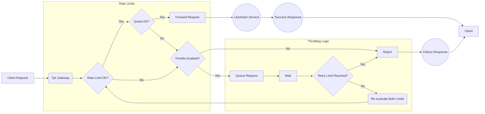

## Introduction

Tyk's Request Throttling feature provides a mechanism to manage traffic spikes by queuing and automatically retrying client requests that exceed [rate limits](), rather than immediately rejecting them. This helps protect upstream services from sudden bursts and improves the resilience of API interactions during temporary congestion.


<!-- TODO: Add an image. -->
---
## Tutorial to throttling - setup and testing guide
### Overview
In this tutorial, we will configure Request Throttling on a Tyk Security Policy to protect a backend service from sudden traffic spikes. We'll start by defining a basic rate limit on a policy, then enable throttling with specific retry settings to handle bursts exceeding that limit, associate a key with the policy, and finally test the behaviour using simulated traffic. This guide primarily uses the Tyk Dashboard for configuration.

### Prerequisites

Since we are providing a full example, we recommend installing the following, however, if you have a running deployment as a playground, please feel free to jump to [step 6: set up a policy with throttling]().

- **Docker**: We will run the entire Tyk Stack on Docker. For installation, refer to this [guide](https://docs.docker.com/desktop/setup/install/mac-install/).
- **Git**: A CLI tool to work with git repositories. For installation, refer to this [guide](https://git-scm.com/downloads)
- **Dashboard License**: We will configure Streams API using Dashboard. [Contact support](https://tyk.io/contact/) to obtain a license.
- **Curl, seq and xargs**: These tools will be used for testing.

### Instructions
#### Start up Tyk stack

1. **Clone Git Repository:**

    The [tyk-demo](https://github.com/TykTechnologies/tyk-demo) repository offers a docker-compose environment you can run locally to explore Tyk streams. Open your terminal and clone the git repository using the below command.

    ```bash
    git clone https://github.com/TykTechnologies/tyk-demo
    cd tyk-demo
    ```

2. **Add Dashboard License:**

   Create an `.env` file and populate it with the values below:

   ```bash
   DASHBOARD_LICENCE=<your-dashboard-license>
   ```

   - `DASHBOARD_LICENCE`: Add your license key. Contact [support](https://tyk.io/contact/) to obtain a license.

3. **Start Tyk Streams**

    Execute the following command:
    ```bash
    ./up.sh
    ```

    This process will take a couple of minutes to complete and will display some credentials upon completion. Copy the Dashboard **username, password, and API key**, and save them for later use.
    ```
            ▾ Tyk Demo Organisation
                  Username : admin-user@example.org
                  Password : 3LEsHO1jv1dt9Xgf
          Dashboard API Key : 5ff97f66188e48646557ba7c25d8c601
    ```

4. **Verify Setup:**

    Open Tyk Dashboard in your browser by visiting [http://localhost:3000](http://localhost:3000) or [http://tyk-dashboard.localhost:3000](http://tyk-dashboard.localhost:3000) and login with the provided **admin** credentials.

#### API set up

5.  **Create an API:**
    -   Log in to your Tyk Dashboard.
    -   Navigate to **API Management > APIs**.
    -   Click **Add New API**. 
    -   Click **Import**. 
    -   Select **Import Type** as **Tyk API**.
    -   Copy the below content in the text box and click **Import API** to create an API. 
        ```json
        {
            "components": {
                "securitySchemes": {
                    "authToken": {
                        "in": "header",
                        "name": "Authorization",
                        "type": "apiKey"
                    }
                }
            },
            "info": {
                "title": "Request Throttling Test",
                "version": "1.0.0"
            },
            "openapi": "3.0.3",
            "paths": {},
            "security": [
                {
                    "authToken": []
                }
            ],
            "servers": [
                {
                    "url": "http://tyk-gateway.localhost:8080/request-throttling-test/"
                }
            ],
            "x-tyk-api-gateway": {
                "info": {
                    "name": "Request Throttling Test",
                    "state": {
                        "active": true
                    }
                },
                "middleware": {
                    "global": {
                        "contextVariables": {
                            "enabled": true
                        },
                        "trafficLogs": {
                            "enabled": true
                        }
                    }
                },
                "server": {
                    "authentication": {
                        "enabled": true,
                        "securitySchemes": {
                            "authToken": {
                                "enabled": true
                            }
                        }
                    },
                    "listenPath": {
                        "strip": true,
                        "value": "/request-throttling-test/"
                    }
                },
                "upstream": {
                    "rateLimit": {
                        "enabled": false,
                        "per": "10s",
                        "rate": 5
                    },
                    "url": "http://httpbin.org/"
                }
            }
        }
        ```

<!-- 5. **Create an API:**

    Create a file `api.json` with the below content:

    ```json

    ```

    Create the API by executing the following command. Be sure to replace `<your-api-key>` with the API key you saved earlier:

    ```bash
    curl --location 'http://localhost:3000/api/apis/oas' \
    --header 'Content-Type: application/json' \
    --header 'Accept: application/json' \
    --header 'Authorization: Bearer <your-api-key>' \
    -d @api.json
    ```

    You should expect a response similar to the one shown below, indicating success. Note that the Meta and ID values will be different each time:
    ```bash
    {"Status":"OK","Message":"API created","Meta":"67f3b6f17bdf060001c1ae18","ID":"955871990da047146a40f1f8ceb62d79"}%                                                                   
    ``` -->

#### Policy and rate limit set up {#policy-setup}
6.  **Create and Configure an Security Policy with Rate Limiting:**

    1.  Navigate to **API Security > Policies** in the Tyk Dashboard sidebar.
    2.  Click the **Add Policy** button.
    3.  Under the **1. Access Rights** tab:
        *   In the **Add API Access Rule** section, select the `Request Throttling Test` API
    4.  Scroll down to the **Global Limits and Quota** section (still under the **1. Access Rights** tab):
        *   Set the following values for `Rate Limiting`
        *   Enter `5` into the **Requests (or connection attempts)** field.
        *   Enter `10` into the **Per (seconds):** field.
    5.  Select the **2. Configuration** tab.
    6.  In the **Policy Name** field, enter `Request Throttling Policy`.
    7.  From the **Key expire after** dropdown, select `Key never expire`.
    8.  Click the **Create Policy** button.

7.  **Associate an Access Key with the Policy:**

    1.  Navigate to **API Security > Keys** in the Tyk Dashboard sidebar.
    2.  Click the **Add Key** button.
    3.  Under the **1. Access Rights** tab:
        *   In the **Apply Policy** section, select the `Request Throttling Policy` API
    5.  Select the **2. Configuration** tab.
    6.  In the **Alias** field, enter `Request Throttling Key`.
    7.  From the **Expires** dropdown, select `Do not expire key`.
    8.  Click the **Create Key** button.
    9.  A pop-up window **"Key created successfully"** will appear displaying the key details. **Copy the Key ID (hash)** value shown and save it securely. You will need this key to make API requests in the following steps.
    10. Click **OK** to close the pop-up.

8. **Test Rate Limit**

    So far, we've created a policy for an API definition and created a key that complies with that policy. Before enabling throttling, let's observe the standard rate limiting behaviour. We'll send 10 requests in quick succession using `xargs` to simulate a burst that exceeds our configured limit (5 requests per 10 seconds).

    1.  Open your terminal.
    2.  Execute the following command, replacing `<replace-with-key-id>` with the API Key ID you saved earlier:

        ```bash
        seq 10 | xargs -n1 -P10 -I {} bash -c 'curl -s -I -H "Authorization: <replace-with-key-id>" http://tyk-gateway.localhost:8080/request-throttling-test/ | head -n 1'
        ```

    3.  **Expected Observation:** You should see some requests succeed with `HTTP/1.1 200 OK`, followed quickly by several requests failing with `HTTP/1.1 429 Too Many Requests` as the rate limit is immediately enforced. The order of `200s` vs `429s` might vary depending upon the processing time, but you will see immediate rejections once the limit is hit.

    **Sample Output (Illustrative):**

    ```bash
    HTTP/1.1 429 Too Many Requests
    HTTP/1.1 429 Too Many Requests
    HTTP/1.1 429 Too Many Requests
    HTTP/1.1 429 Too Many Requests
    HTTP/1.1 429 Too Many Requests
    HTTP/1.1 200 OK
    HTTP/1.1 200 OK
    HTTP/1.1 200 OK
    HTTP/1.1 200 OK
    HTTP/1.1 200 OK
    ```

#### Throttling set up
9.  **Configure Request Throttling by Updating the Security Policy**

    1.  Navigate to **API Security > Policies** in the Tyk Dashboard sidebar.
    2.  Click on the `Request Throttling Policy`.
    3.  Under the **1. Access Rights** tab:
        *   In the **Global Limits and Quota** section.
        *   Set the following values for `Throttling`
        *   Uncheck the `Disable Throttling` checkbox.
        *   Enter `3` into the **Throttle retries (or connection attempts)** field.
        *   Enter `2` into the **Per (seconds):** field.
    4.  Click the **Update** button.
    5.  A pop-up window will appear to confirm the changes. Click **Update** to close the pop-up.

#### Testing
10. **Test Request Throttling**

    1.  **Repeat the Test:** Open your terminal and execute the *exact same command* as in step 4:

        ```bash
        seq 10 | xargs -n1 -P10 -I {} bash -c 'curl -s -I -H "Authorization: <replace-with-key-id>" http://tyk-gateway.localhost:8080/request-throttling-test/ | head -n 1'
        ```

    2.  **Expected Observation:**
        *   You will still see the first ~5 requests return `HTTP/1.1 200 OK` quickly.
        *   Critically, the subsequent requests (6 through 10) will **not** immediately return `429`. Instead, you should observe a **delay** before their status lines appear.
        *   After the delay (`throttle_interval`), Tyk will retry the queued requests. Some might now succeed (return `200 OK`) if the rate limit window allows.
        *   If a request is retried `throttle_retry_limit` (3) times and still encounters the rate limit, *then* it will finally return `HTTP/1.1 429 Too Many Requests`.
        *   Overall, you might see more `200 OK` responses compared to the previous test, and any `429` responses will appear significantly later.

    **Sample Output (Illustrative - timing is key):**

    ```bash
    HTTP/1.1 200 OK  # Appears quickly
    HTTP/1.1 200 OK  # Appears quickly
    HTTP/1.1 200 OK  # Appears quickly
    HTTP/1.1 200 OK  # Appears quickly
    HTTP/1.1 200 OK  # Appears quickly
    # --- Noticeable pause here ---
    HTTP/1.1 200 OK
    # --- Noticeable pause here ---
    HTTP/1.1 200 OK
    # --- Noticeable pause here ---
    HTTP/1.1 200 OK
    HTTP/1.1 200 OK
    HTTP/1.1 200 OK
    ```
    *(The exact mix of 200s and 429s on the delayed requests depends heavily on timing relative to the 10-second rate limit window reset and the retry attempts).*

This comparison clearly shows how Request Throttling changes the behaviour from immediate rejection to queued retries, smoothing the traffic flow and potentially allowing more requests to succeed during bursts.

---
## Configuration Options

Request Throttling is configured within Tyk [Security Policies]() or directly on individual [Access Keys]().

The configuration involves setting two specific fields:

- `throttle_interval`: Defines the wait time (in seconds) between retry attempts for a queued request.
- `throttle_retry_limit`: Sets the maximum number of retry attempts before the request is rejected.

Both fields must be set to a value of 0 or greater to enable throttling. Setting either to `-1` (the default) disables the feature.

You can configure these settings using either the Tyk Dashboard UI or the Tyk Dashboard API.





The Tyk Dashboard provides a straightforward interface to set throttling parameters on both Policies and Keys.

**For Policies:**

1.  Navigate to **API Security > Policies** in the Tyk Dashboard sidebar.
2.  Click the **Add Policy** button.
3.  Under the **1. Access Rights** tab:
    *   In the **Add API Access Rule** section, select the required API
4.  Scroll down to the **Global Limits and Quota** section (still under the **1. Access Rights** tab):
    *   To enable `Throttling`, `Rate Limiting` should be configured.
    *   Enter some value into the **Requests (or connection attempts)** field.
    *   Enter some value into the **Per (seconds):** field.

    *   Now enable `Throttling` by setting the following values in the `Throttling` section:
    *   Uncheck the `Disable Throttling` checkbox.
    *   Enter some value into the **Throttle retries (or connection attempts)** field.
    *   Enter some value into the **Per (seconds):** field.
5.  Select the **2. Configuration** tab.
6.  In the **Policy Name** field, enter a name.
7.  From the **Key expire after** dropdown, select an option.
8.  Click the **Create Policy** button.

**For Access Keys:**

1.  Navigate to **API Security > Keys** in the Tyk Dashboard sidebar.
2.  Click the **Create Key** button.
3.  Under the **1. Access Rights** tab:
    *   Select **Choose API**.
    *   In the **Add API Access Rule** section, select the required API
4.  Scroll down to the **Global Limits and Quota** section (still under the **1. Access Rights** tab):
    *   To enable `Throttling`, `Rate Limiting` should be configured.
    *   Enter some value into the **Requests (or connection attempts)** field.
    *   Enter some value into the **Per (seconds):** field.

    *   Now enable `Throttling` by setting the following values in the `Throttling` section:
    *   Uncheck the `Disable Throttling` checkbox.
    *   Enter some value into the **Throttle retries (or connection attempts)** field.
    *   Enter some value into the **Per (seconds):** field.
5.  Select the **2. Configuration** tab.
6.  In the **Alias** field, enter a name.
7.  From the **Expires** dropdown, select an option.
8.  Click the **Create Key** button.






You can enable and configure Request Throttling by directly manipulating the Policy object or the Access Key using the Tyk Dashboard API.

**Example Configuration (Policy Object):**

Retrieve the policy object using `GET /api/portal/policies/{POLICY_ID}`. Add or modify the `throttle_interval` and `throttle_retry_limit` fields within the policy JSON object. Then, update the policy using `PUT /api/portal/policies/{POLICY_ID}` with the modified object, or create a new one using `POST /api/portal/policies/`.

```json
{
  // ... other policy fields ...
  "throttle_interval": 1,       // Wait 1 second between retries
  "throttle_retry_limit": 5,    // Attempt a maximum of 5 retries
  // ... other policy fields ...
}
```

**Example Configuration (Access Key):**

Retrieve the key's session object using `GET /api/keys/{KEY_ID}`. Add or modify the `throttle_interval` and `throttle_retry_limit` fields within the session object JSON. Then, update the key using `PUT /api/keys/{KEY_ID}` with the modified session object.

```json
{
  // ... other session object fields ...
  "throttle_interval": 2,       // Wait 2 seconds between retries
  "throttle_retry_limit": 3,    // Attempt a maximum of 3 retries
  // ... other session object fields ...
}
```

**Explanation:**

*   The first example configures a policy. Any key using this policy will inherit the throttling settings: wait 1 second between retries for queued requests, attempting up to 5 times before failing.
*   The second example configures a specific key's session object directly: wait 2 seconds between retries, attempting up to 3 times. Note: Direct key configuration overrides policy settings for that specific key.





---
## How It Works

TODO: This will work after the changes in Tyk streams is merged. For review you can copy the code and it into a mermaid editor.



Tyk's Request Throttling intercepts API requests *after* they have exceeded a configured [Rate Limit](). 

Instead of immediately rejecting these requests with a `429 Too Many Requests` error (which is the default rate-limiting behaviour), the Gateway temporarily holds them in a queue. After waiting for a specified duration (`throttle_interval`), Tyk attempts to process the request again, re-checking the rate limit status. 

This retry cycle repeats until either the request can be successfully processed (if capacity becomes available) or a configured maximum number of retries (`throttle_retry_limit`) is reached. Only after exhausting all retries does Tyk return the `429` error to the client.

Think of it like trying to access a service with a restriction on how many people can enter per minute (Rate Limit). If you arrive when the per-minute limit is full, standard behaviour is to turn you awa
y immediately. With Throttling enabled, the service instead asks you to wait briefly (the interval) and tries your entry again shortly, checking if the rate limit has freed up capacity, repeating this a f
ew times (the retry limit) before finally turning you away if access is still restricted.

---
## FAQs

### Can I disable Request Throttling?
    
Yes, you can. If you set `throttle_interval` and `throttle_retry_limit` values to smaller than `0`, the feature will not work. The default value is `-1` and means it is disabled by default.
