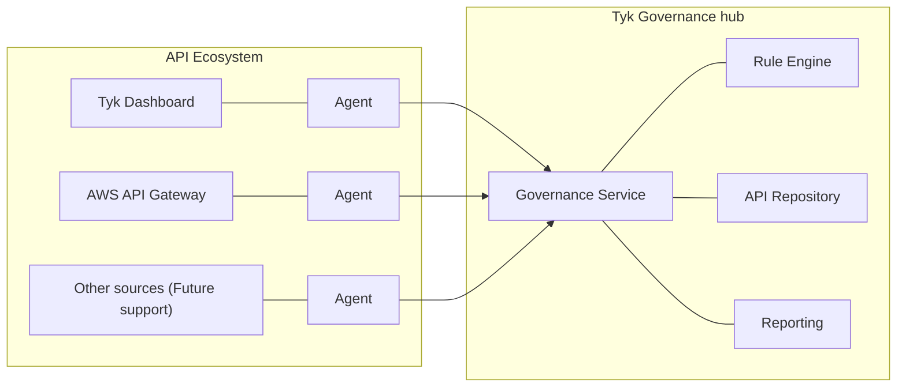
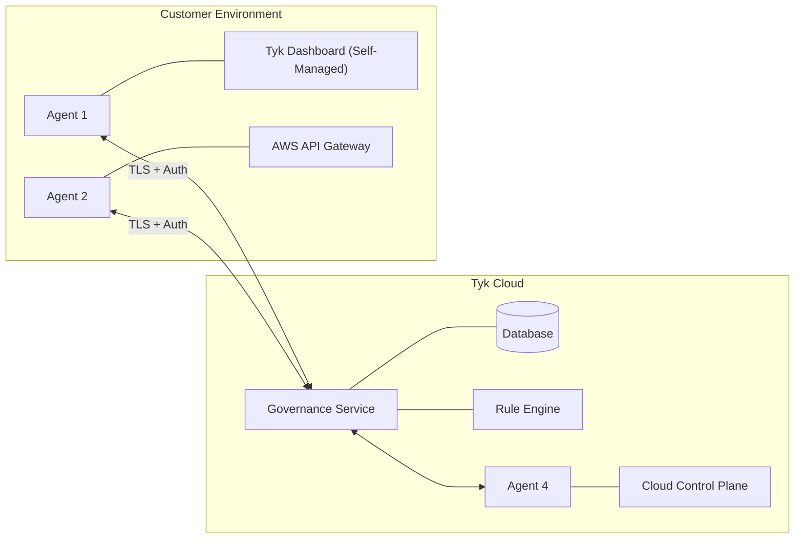
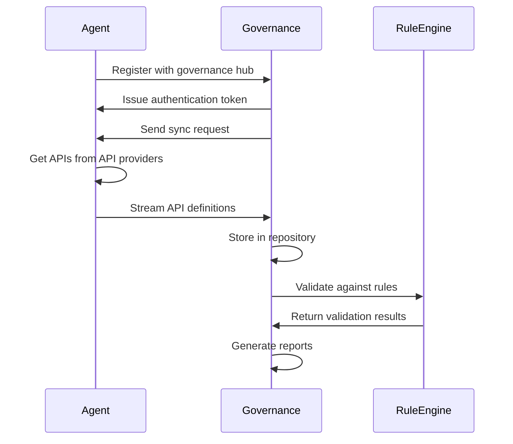

This section provides a detailed explanation of the key technical concepts that form the foundation of Tyk Governance.

## What is Tyk Governance?

Tyk Governance is a comprehensive API Governance hub designed to provide centralized visibility, control, and policy enforcement across distributed API ecosystems. It enables organizations to establish and maintain consistent standards, security practices, and compliance requirements across multiple API gateways and management platforms.

At its core, Tyk Governance is a federated control plane that sits above your existing API infrastructure, regardless of whether you're using Tyk exclusively or a mix of different API management solutions. It collects, analyzes, and governs API definitions from various sources, ensuring they adhere to your organization's standards and best practices.



## Federated API Management

Federated API management refers to the practice of managing APIs across multiple, distributed platforms while maintaining consistent governance, visibility, and control.

Organizations struggle with API sprawl, with many lacking visibility into their total number of APIs. Multiple gateways across teams create security vulnerabilities, governance gaps, and inefficiency. This "API debt" results in inconsistent security protocols, missed reuse opportunities, and increased risk from shadow APIs. Large enterprises need a solution that balances centralized governance with team autonomy—enabling visibility across different gateways while allowing teams to use their preferred tools. The ideal approach provides unified oversight without forcing consolidation, ensuring compliance while preserving innovation and operational independence.

### Tyk Governance Solutions

Tyk Governance addresses these challenges through:

1. **Unified API Repository**: A central inventory of all APIs across different providers.
2. **Cross-Platform Policy Enforcement**: Consistent application of governance policies regardless of the underlying API provider.
3. **Automated Compliance Checking**: Continuous validation of APIs against organizational standards and regulatory requirements.
4. **Maturity Assessment**: Evaluation and scoring of APIs based on design, security, documentation, and performance criteria.
5. **Centralized Reporting**: Comprehensive visibility into API compliance and governance status.

## Governance Rulesets

A governance ruleset in Tyk Governance is a set of rules and standards that APIs must adhere to. These rulesets define the requirements for API design, security, documentation, and operational characteristics.

### Ruleset Components

1. **Rules**: Individual checks that validate specific aspects of an API definition.
2. **Severity Levels**: Categorization of rules by importance (error, warning, info).
3. **Validation Functions**: The specific logic used to evaluate API definitions against rules.
4. **Remediation Guidance**: Instructions on how to fix issues when rules are violated.

### Spectral Ruleset Compatibility

Tyk Governance rulesets are compatible with the [Spectral ruleset](https://meta.stoplight.io/docs/spectral/01baf06bdd05a-rulesets) format, a widely adopted API linting and governance standard. This compatibility offers several advantages:

1. **Familiar Format**: Teams already using Spectral can easily migrate their existing rulesets.
2. **Ecosystem Integration**: Leverage the broader ecosystem of pre-built Spectral rules.
3. **Extensibility**: Create custom rules using the same format and functions as Spectral.
4. **IDE Integration**: Use existing Spectral plugins for popular code editors.

The Spectral-compatible format allows for declarative rule definitions with given/then patterns, custom functions, and detailed error messaging.

### Basic Ruleset Examples

```yaml
# Security ruleset requiring HTTPS
owasp-security-hosts-https-oas3:
  description: All server interactions MUST use the https protocol
  severity: error
  then:
    function: owaspHostsHttps

# Rate limiting ruleset
rate-limit-exists:
  description: Ensure rateLimit exists under upstream
  severity: error
  given: "$['x-tyk-api-gateway'].upstream"
  then:
    - field: rateLimit
      function: truthy
```

Rulesets can be customized to meet organizational needs and evolve as API best practices and security requirements change.

## Supported API Providers

Tyk Governance is designed to work with a wide range of API management platforms, allowing organizations to maintain governance regardless of their existing API infrastructure.

### API Provider Compatibility

| API Provider        | Tested Version | Supported API Types | Supported Features                      |
| --------------- | -------------- | ------------- | ------------------------------------------------- |
| Tyk Dashboard   | 5.3+           | Tyk OAS       | Complete integration with all governance features |
| AWS API Gateway | All            | Rest APIs     | API definition export, OAS schema export          |
| Azure | -            | -     | Coming Soon          |
| Kong  | -            | -     | Coming Soon          |
| WSO2  | -            | -     | Coming Soon          |

### Integration Capabilities

Tyk Governance integrates with these providers through specialized agents that:

1. Connect to the platform's management APIs
2. Extract API definitions and configurations
3. Convert proprietary formats to OpenAPI Specification (OAS)
4. Apply Tyk-specific extensions where applicable
5. Synchronize definitions with the central governance repository

### Future API Provider Support

The Tyk Governance roadmap includes plans to expand support to additional platforms and API Types.

## How It Works

Tyk Governance operates through a distributed architecture that combines a centralized cloud-hosted governance service with distributed agents that run in your environments.

### Technical Architecture



### Hosted Service Model

The Governance Core is a Tyk Cloud hosted and managed service, providing several benefits:

1. **Zero Infrastructure Overhead**: No need to deploy and maintain governance infrastructure.
2. **Automatic Updates**: Always access the latest features and security patches.
3. **Scalable Performance**: Handles growing API ecosystems without additional configuration.
4. **High Availability**: Built-in redundancy and failover capabilities.

### Customer-Hosted Agents

While the core service is cloud-hosted, customers can host their own agents within their environments:

1. **Credential Isolation**: Tyk Governance never directly accesses your API providers; all credentials remain within your environment.
2. **Network Security**: The agent requires accepting inbound traffic from the cloud-based governance dashboard. All communication between agents and the dashboard is secured via TLS encryption.
3. **Deployment Flexibility**: Deploy agents in any environment where they can access your API platforms.
4. **Lightweight Footprint**: Agents have minimal resource requirements and can run in containers or VMs.

### Process Sequence



### Synchronization Mechanisms

Tyk Governance uses a secure bidirectional streaming protocol for efficient synchronization:

1. **Registration**: Agents register with the Governance hub and establish a secure connection.
2. **Heartbeat**: Agents maintain a health check stream to indicate their status.
3. **Sync Request**: The Governance hub can trigger a sync operation on demand or on schedule.
4. **Streaming Response**: Agents stream API definitions back to the governance hub as they are extracted.
5. **Incremental Updates**: Only changed APIs are synchronized to minimize network traffic.

### Security Measures

The synchronization between agents and the Governance service includes multiple security layers:

1. **TLS Encryption**: All communications are encrypted using TLS 1.2+ to prevent eavesdropping.
2. **Authentication Tokens**: Agents authenticate using secure tokens that can be rotated and revoked.
3. **Minimal Privilege**: Agents use read-only access to API platforms whenever possible.
4. **Data Minimization**: Only API definitions and metadata are transmitted, not actual API traffic or payloads.
5. **Audit Logging**: All synchronization activities are logged for security monitoring.

### Data Exchange

The information exchanged between agents and the Governance service includes:

1. **From Agent to Governance**:
	- API definitions in OpenAPI format
	- API metadata (name, version, endpoints, security schemes)
	- Provider-specific configuration converted to standard formats
	- Agent status and capability information
	- Sync operation status and results

2. **From Governance to Agent**:
	- Sync requests and configuration
	- Authentication tokens and renewal information

Notably, the following are NOT transmitted:

- API keys or credentials for accessing APIs
- Actual API request/response payloads
- Customer data processed by APIs
- Internal network information beyond what's in API definitions

## Glossary of Terms

### Agent

A component that connects to API Providers (Tyk, AWS API Gateway, etc.) to extract and sync API definitions.

### API Maturity

A measure of how well an API adheres to best practices in design, security, documentation, and performance.

### API Provider

A system or platform where APIs are hosted or managed, which Tyk Governance can discover and monitor. Examples include Tyk Dashboard and AWS API Gateway.

### API Repository

A federated catalog that aggregates APIs from multiple API providers, providing a centralized view of all APIs within an organization.

### Federated API Management

An approach to managing APIs across multiple platforms and environments while maintaining centralized governance.

### Label

A key-value pair assigned to APIs or API providers for categorization and governance purposes. Examples include `domain:storefront`, `environment:production`, or `pii:true`.

### Ruleset

A collection of governance rules that can be applied to APIs to enforce best practices and compliance requirements.

### Rule

A specific condition that can be evaluated against APIs to ensure they meet governance standards. Rules include severity levels, messages, and descriptions.

### Ruleset Template

A predefined ruleset containing common governance rules that can be applied as a starting point for governance policies.

### Governance Report

A summary of API compliance with governance rules, identifying violations and suggesting remediations.

### Violation

An instance where an API fails to meet defined governance standards, categorized by severity level.

### Compliance

The degree to which an API adheres to defined governance policies and standards.

### Remediation

The structured process of addressing and resolving API governance violations.

### Risk Level

A summary metric that reflects API governance compliance across multiple APIs, considering their adherence to selected governance rulesets.

### Sync

The process of extracting API definitions from management platforms and updating the governance repository.

### Tyk-OAS Governance Extensions

Tyk-specific extensions to the OpenAPI Specification that enable advanced governance features.