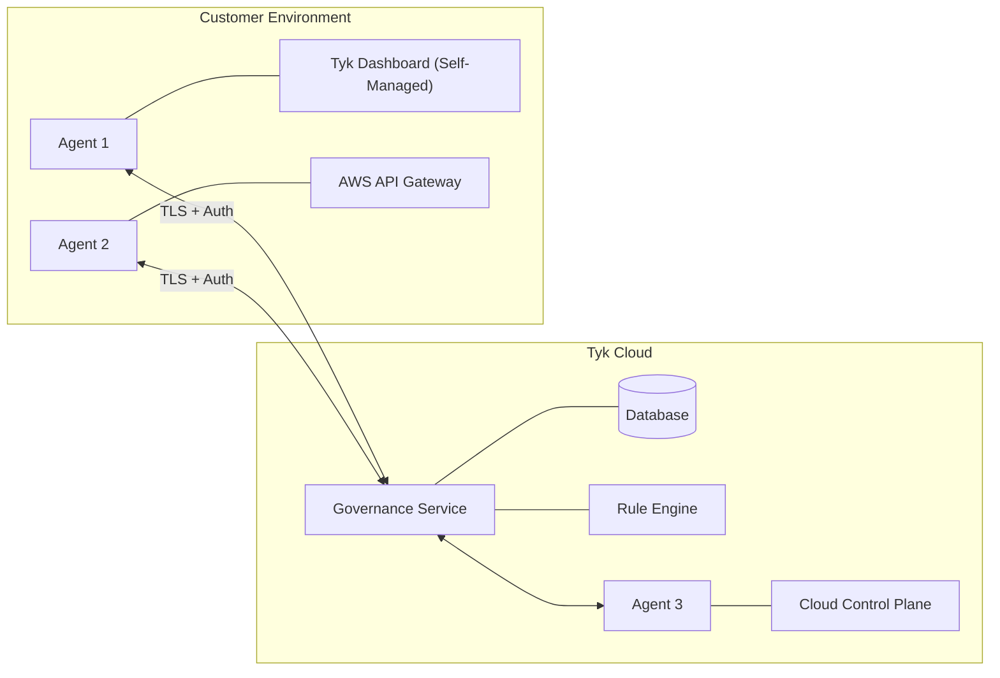
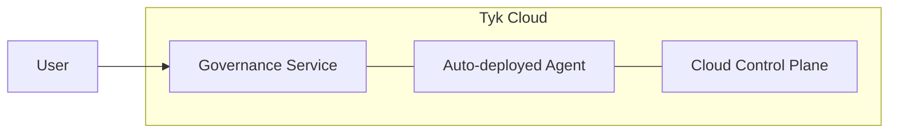
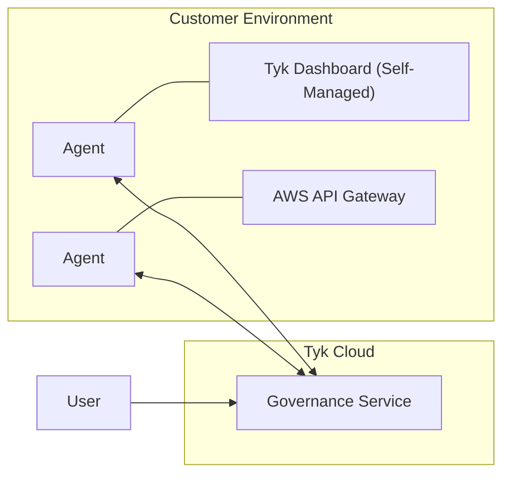
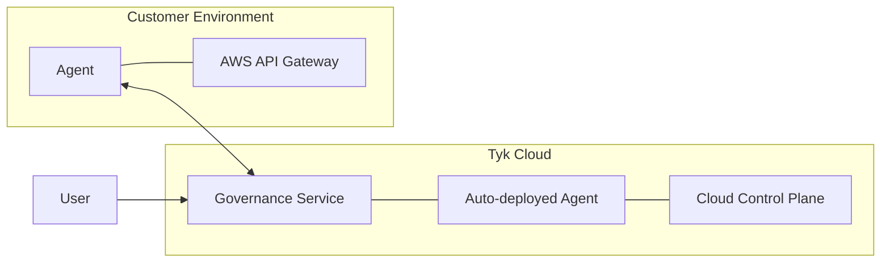

This section moves from concepts to hands-on implementation, providing the practical steps needed to start with Tyk Governance.

## Prerequisites

Before beginning the installation and setup process for Tyk Governance, ensure your environment meets the following requirements:

### License Requirements
- Valid Tyk license with Governance feature enabled

### System Requirements

**For Tyk Governance Hub:**
- No local system requirements as Tyk Governance is fully hosted and managed by Tyk in the cloud

**For Tyk Governance Agent:**
- Minimum 1 CPU core
- 512MB RAM
- 1GB available disk space
- Linux-based operating system (Ubuntu 18.04+, CentOS 7+, or equivalent)
- Docker (if using containerized deployment)
- Kubernetes (optional, for orchestrated deployments)

### Permission Requirements

**For Agent Installation:**
- Read access to your API providers (Tyk, AWS API Gateway, etc.)
- Ability to create and manage containers or services in your environment
- Network configuration permissions to establish outbound connections
- Permission to create and manage secrets for storing API credentials

### Network Requirements

**For Tyk Governance Agent:**
- Inbound access from the Tyk Governance Hub (default 50051 for gRPC)
- Outbound access to your API providers
- Outbound HTTPS (port 443) access to the Tyk Governance Hub
- If API Provider gateways run on different networks, network routes must allow the agent to communicate with those networks

## System Architecture

Tyk Governance follows a cloud-hosted service model with customer-deployed agents, creating a secure and flexible architecture that respects your network boundaries while providing centralized governance.

### High-Level Architecture



### Deployment Models

#### Tyk Cloud with Automatic Agent



**When to use this model:**
- You exclusively use Tyk Cloud for API management
- You want the simplest possible setup with minimal configuration
- You don't have any APIs on other platforms that need governance

#### Tyk Cloud with Customer-Deployed Agents



**When to use this model:**
- You use self-managed Tyk deployments (not Tyk Cloud)
- You use AWS API Gateway or other supported providers
- You need to govern APIs across providers that aren't in Tyk Cloud

#### Hybrid Deployment



**When to use this model:**
- You use a combination of Tyk Cloud and other API platforms
- You have a mix of cloud and on-premises API deployments
- You need comprehensive governance across your entire API ecosystem

## Installation

The installation process for Tyk Governance varies depending on whether you're an existing Tyk Cloud customer and which deployment model you use.

### Requesting Access to Tyk Governance

1. **Contact Tyk for Access**
	- Reach out to your Tyk Account Manager or visit [tyk.io/contact-book-a-demo](https://tyk.io/contact-book-a-demo/)
	- Specify that you're interested in access to Tyk Governance
	- Provide information about your current API management environment

2. **Receive Access Credentials**
	- After your request is processed, you'll receive an email with:
		- URL to access the Tyk Governance Hub
		- Admin credentials for initial login
		- Instructions for next steps

3. **Initial Login**
	- Navigate to the provided Governance hub URL
	- Enter the admin credentials from the email
	- You'll be prompted to change your password on first login

### Enabling Governance Feature for Cloud Control Planes

For existing Tyk Cloud managed control planes, enabling governance is straightforward:

1. **Log in to Tyk Cloud Dashboard**
	- Navigate to your Tyk Cloud dashboard
	- Ensure you have administrative privileges

2. **Access Control Plane Settings**
	- Select the Control Plane you want to enable governance for
	- Click on "Edit Details" button

3. **Enable Governance Feature**
	- Locate the "Governance Agent" toggle
	- Enable the feature
	- Save your changes

4. **Verification**
	- An agent will be automatically deployed for your Tyk Control Plane
	- You can now access the Governance dashboard via "Governance" in the Cloud UI sidebar

### Installing a Local Agent

For environments where you need to install agents manually (non-Tyk platforms or on-premises deployments), follow these steps:

**Prerequisites for Agent Installation:**
- Access to the Governance hub to generate agent tokens
- Network connectivity between the agent and both the Governance hub and your API provider
- Docker or Kubernetes for container-based deployment (recommended)

#### Generate Agent Token

Since the UI for generating agent tokens is unavailable, you'll need to use the API to create a token. After receiving your Governance hub credentials, follow these steps:

1. **Obtain an API Key**:
	 - Log in to the Governance hub using the credentials provided in your welcome email
	 - Check your Access key under the "Settings > User Profile" section

     

2. **Create an Agent using the API**:

```bash
# Replace these values with your actual information
GOVERNANCE_URL="https://your-governance-instance.tyk.io"
API_KEY="your-access-key"
AGENT_NAME="My AWS Agent (US)"

# Create agent first
curl -s -X POST --location "${GOVERNANCE_URL}/api/agents/" \
  -H "X-API-Key: ${API_KEY}" \
  -H "Content-Type: application/json" \
  -d '{
    "name": "'"${AGENT_NAME}"'"
  }'
```

Example response which shows that an agent is created in INACTIVE state:

```json
{"id":"a51d9bd0-bafe-4749-8285-e18641b151f2","name":"My AWS agent (US)","last_heartbeat":"0001-01-01T00:00:00Z","status":"INACTIVE","providers":null}
```

```bash
# Extract agent ID from response
AGENT_ID="a51d9bd0-bafe-4749-8285-e18641b151f2"
```

3. **Generate an Agent Token using the API**:

Now you can generate an access token for the agent.

```bash
# API call to create an agent token
curl -X POST "${GOVERNANCE_URL}/api/auth/token/" \
  -H "X-API-Key: ${API_KEY}" \
  -H "Content-Type: application/json" \
  -d '{
    "agent_id": "'"${AGENT_ID}"'"
  }'
```

    Example response:

    ```json
    {
      "token": "eyJhbGciOiJIUzI1NiIsInR5cCI6IkpXVCJ9...",
    }
    ```

4. **Save the token securely**:

	 - Copy the `token` value from the response
	 - Store it securely, as you'll need it for agent configuration
	 - Note: This token cannot be retrieved later, so make sure to save it

#### Prepare Configuration

Create a configuration file named `agent-config.yaml` with the following structure:

```yaml
#==============================================================================
# Tyk Governance Agent Configuration
#==============================================================================

# Your Tyk Governance license key - required for agent authentication
# This is provided by Tyk when you subscribe to the Governance service
licenseKey: "your-tyk-governace-license-key"

# Configuration for connecting to the Tyk Governance dashboard/service
governanceDashboard:
  server:
    # The gRPC endpoint URL of the Tyk Governance service
    # Format: hostname:port (without protocol)
    # This will be provided in your welcome email from Tyk
    url: "your-governance-instance.tyk.io:50051"
  
  auth:
    # Authentication token for this agent
    # Generated via API call to /auth/token endpoint
    # This token identifies and authorizes this specific agent
    token: "my-agent-token"

#==============================================================================
# API Provider Configurations
#==============================================================================
# List of API providers this agent will connect to
# Each agent can connect to multiple providers of different types
instances:
  #--------------------------------------------------------------------------
  # Tyk Provider Configuration
  #--------------------------------------------------------------------------
  - name: "tyk-provider"  # Descriptive name for this provider instance
    type: "tyk"           # Provider type: must be "tyk" for Tyk Dashboard
    config:
      # The URL of your Tyk Dashboard
      # For Kubernetes deployments, this might be an internal service URL
      host: "http://dashboard-svc-tyk-stack-tyk-dashboard.tyk.svc.cluster.local:3000"
      
      # API key with read access to the Tyk Dashboard
      # Can be obtained in Tyk Dashboard under "User" > "User Details": "Tyk Dashboard API Access Credentials"
      # Requires read permissions for APIs and policies
      auth: "your-auth-key"
  
  #--------------------------------------------------------------------------
  # AWS API Gateway Provider Configuration
  #--------------------------------------------------------------------------
  - name: "aws-provider"  # Descriptive name for this AWS API Gateway instance
    type: "aws"           # Provider type: must be "aws" for AWS API Gateway
    config:
      # AWS IAM credentials with permissions to list and get API Gateway resources
      # Recommended: Use an IAM role with minimal required permissions
      accessKeyId: "your-aws-access-key-id"
      accessKeySecret: "your-aws-access-key-secret"
      
      # AWS region where your API Gateway APIs are deployed
      # Example: us-east-1, eu-west-1, ap-southeast-2, etc.
      region: "us-east-1"
      
      # Optional: Temporary session token if using temporary credentials
      # Required only when using AWS STS temporary credentials
      sessionToken: "your-aws-session-token"

#==============================================================================
# Agent Settings
#==============================================================================

# Log level controls verbosity of agent logs
# Options: debug, info, warn, error
# Recommended: info for production, debug for troubleshooting
logLevel: debug

# Health probe configuration for monitoring agent health
# Used by container orchestration systems like Kubernetes
healthProbe:
  server:
    # Port on which the health probe server will listen
    # Ensure this port is not used by other services
    port: 5959
```

#### Deploy the Agent

  **Docker Deployment:**

```bash
# Replace it with your Tyk Governance license key
LICENSE_KEY="tyk-governance-license-key"
VERSION="latest"

docker run -d --name tyk-governance-agent \
  -v $(pwd)/agent-config.yaml:/app/config.yaml \
  -e TYK_AGENT_LICENSEKEY="$LICENSE_KEY" \
  tykio/governance-agent:$VERSION
```

  **Kubernetes Deployment:**

1. Create a Kubernetes secret for the configuration:

```bash
kubectl create secret generic agent-config \
  --from-file=config.yaml=./agent-config.yaml \
  -n your-namespace
```

2. Apply the following manifest:

```yaml
apiVersion: apps/v1
kind: Deployment
metadata:
  name: governance-agent
  namespace: your-namespace # Replace with your namespace
spec:
  replicas: 1
  selector:
    matchLabels:
      app: tyk-governance-agent
  template:
    metadata:
      labels:
        app: tyk-governance-agent
    spec:
      containers:
      - name: agent
        image: tykio/governance-agent:latest # Replace with an available version tag
        env:
        - name: TYK_AGENT_LICENSEKEY
          value: your-governance-license #Replace with your license key
        ports:
        - name: health
          containerPort: 5959
          protocol: TCP
        livenessProbe:
          httpGet:
            path: /health
            port: health
        readinessProbe:
          httpGet:
            path: /live
            port: health
        volumeMounts:
        - mountPath: /app/config.yaml
          name: agent-config
          subPath: config.yaml
      volumes:
      - name: agent-config
        secret:
          secretName: agent-config
          items:
          - key: config.yaml
            path: config.yaml

```

Apply with:

```bash
kubectl apply -f agent-deployment.yaml
```

#### Verify Agent Connection

1. Check if the agent is running properly:

    ```bash
    # For Docker
    docker logs tyk-governance-agent

    # For Kubernetes
    kubectl logs -l app=tyk-governance-agent -n your-namespace
    ```

 2. Look for log messages indicating a successful connection:

```
Starting license validation... 
License validated successfully. Valid till: ...
starting agent
agent started successfully
waiting agent to establish health check
starting health probes HTTP server","addr":":5959
authenticated and established health stream
health check established, waiting for sync stream
agent registered successfully and established sync stream with governance dashboard
waiting for sync requests from the dashboard
```

####  Trigger Initial Sync

1. In the Governance hub, navigate to "API Repository"
2. Click the "ReSync" button to initiate synchronisation


3. Monitor the sync progress in the UI or refresh the page manually.

## Examples

The following examples demonstrate common deployment scenarios and configurations for Tyk Governance.

### Example 1: Tyk Cloud with Automatic Agent

This is the simplest deployment model for existing Tyk Cloud customers.

**Configuration Steps:**

1. Requesting Access to Tyk Governance
2. Enable the Governance feature in Tyk Cloud Control Plane as described in [Enabling Governance Feature for Cloud Control Planes](#enabling-governance-feature-for-cloud-control-planes)
3. Wait for automatic agent deployment
4. Access the Governance Hub from the Cloud UI sidebar
5. Navigate to "API Repository" to view your automatically discovered APIs
6. Trigger "ReSync" to pull updates from the control planes

**Expected Outcome:**
- All APIs from your Tyk Control Plane will be automatically discovered and displayed in the API Repository

### Example 2: Multi-Platform Governance with Custom Agents

This example demonstrates how to set up governance across multiple API providers.

**Configuration Steps:**

1. Requesting Access to Tyk Governance
2. Generate agent tokens for each provider as described in [Installing a Local Agent](#installing-a-local-agent)
3. Create configuration files for each agent
4. Deploy each agent using Docker or Kubernetes as described in [Installing a Local Agent](#installing-a-local-agent)
5. Verify agent connections
6. Access the Governance Hub with the provided URL
7. Navigate to "API Repository" to view your automatically discovered APIs
8. Trigger "ReSync" to pull updates from all agents

**Expected Outcome:**
- APIs from all providers will be discovered and displayed in a unified repository