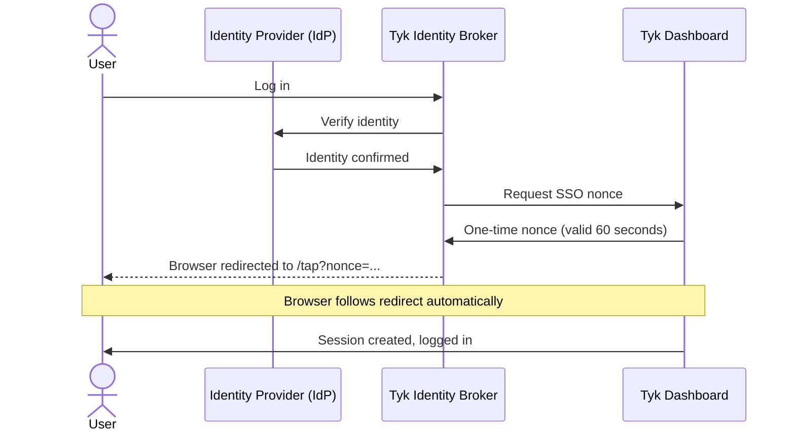
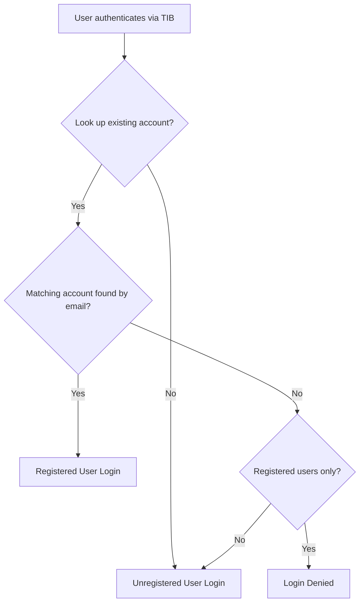

Tyk Identity Broker (TIB) enables Single Sign-On (SSO) for Tyk Dashboard, allowing users to log in using their existing identity provider (IdP) credentials rather than with a Tyk Dashboard user account and password.

<Note>
We recommend that you read the [Tyk Identity Broker overview](/tyk-identity-broker/overview) before configuring SSO for Dashboard.
</Note>

## How It Works

When a user logs in via SSO, TIB authenticates them against the configured IdP and then calls the Tyk Dashboard API to obtain a one-time nonce. TIB then redirects the user's browser to the Dashboard API's `/tap` endpoint with the nonce appended. Tyk Dashboard validates the nonce and creates a session automatically. No further action is required from the user.



Tyk Dashboard identifies SSO users by their email address.

What happens after authentication is controlled by two settings:

| Setting | Configured in | Purpose |
|---|---|---|
| [`sso_enable_user_lookup`](/tyk-dashboard/configuration#sso_enable_user_lookup) | Tyk Dashboard configuration | Whether to match the user's email address against existing Tyk Dashboard accounts. |
| `SSOOnlyForRegisteredUsers` | TIB profile | Whether to deny login if no matching account is found. |


### TIB Service Account

TIB requires valid credentials to [generate the one-time nonce](/api-management/dashboard-configuration#single-sign-on-api) from the Tyk Dashboard API.

Typically you would create a dedicated **TIB service account** on the Dashboard and set its **Tyk Dashboard API Access Credentials** key (available from **System Management > Users** in the Dashboard UI) in the TIB profile. The service account does not need any special permissions, any active account is sufficient.

### TIB Profile Management

Dashboard users who need to create and manage TIB profiles require the **Identity Management (TIB)** [permission](/api-management/user-management#user-permissions).

## Profile Configuration

Dashboard SSO uses the `GenerateOrLoginUserProfile` [action](/tyk-identity-broker/overview#actions) in the TIB profile. The following profile fields are required for all Dashboard SSO configurations:

| Field | Value |
|---|---|
| `ActionType` | `GenerateOrLoginUserProfile` |
| `ReturnURL` | `http://{dashboard-host}/tap` |
| `IdentityHandlerConfig.DashboardCredential` | API key for the dedicated [TIB service account](#tib-service-account) |

The `ProviderName`, `ProviderConfig`, and `Type` fields depend on your identity provider and are covered in the [IdP-specific guides](#set-up-sso-with-your-identity-provider).

The user permission-related fields (`SSOOnlyForRegisteredUsers`, `UserGroupMapping`, `DefaultUserGroupID`, and `CustomUserGroupField`) are optional and used for [unregistered users](#unregistered-user-login).

Two additional optional fields allow you to override which claims TIB reads from the IdP response:

| Field | Description |
|---|---|
| `CustomEmailField` | The name of the IdP claim to use as the user's email address. If not set, TIB uses the standard email claim returned by the IdP. |
| `CustomUserIDField` | The name of the IdP claim to use as the user's unique identifier. If not set, TIB uses the standard subject or user ID claim. |

These are useful when your IdP returns email or user ID under a non-standard claim name.

<Note>
The `GenerateOrLoginUserProfile` action type is also used to log admin users into Tyk Developer Portal. See [SSO into Tyk Developer Portal](/tyk-stack/tyk-developer-portal/enterprise-developer-portal/managing-access/enable-sso) for full details.
</Note>

## Registered User Login

You can track the activity of users and assign them individual permissions by enabling the Dashboard's **user lookup** system.

1. Enable `sso_enable_user_lookup: true` in the Tyk Dashboard configuration:

    ```json
    {
    "sso_enable_user_lookup": true
    }
    ```

2. Create accounts for the users in Tyk Dashboard and set their permissions. 

When a user logs in via SSO, Tyk Dashboard looks for an account with a matching email address. If found, a session is created using that account's permissions. The account persists between logins, the user appears in the Dashboard user list, and their last login is recorded. If no matching account is found, the user is treated as an [Unregistered User Login](#unregistered-user-login).

## Unregistered User Login

By default, any user authenticated by the IdP is granted access:

- Tyk Dashboard constructs a temporary in-memory user from the IdP data.
- No account is created in the user database.
- The user will not appear in the Dashboard user list and their last login is not recorded.

There are three ways to configure permissions for unregistered users, which can be used individually or combined:

| Option | Configured in | Purpose |
|---|---|---|
| [IdP Permission Claims](#idp-permission-claims) | TIB profile | Maps IdP group claims to Tyk Dashboard user groups, applying different permissions based on the user's IdP group membership. |
| [Default User Group](#default-user-group) | Tyk Dashboard configuration | Assigns a fallback [Tyk Dashboard user group](/api-management/user-management#manage-tyk-dashboard-user-groups) when no group mapping applies. |
| [Default User](#default-user) | Tyk Dashboard configuration | Sets a baseline set of permissions for all unregistered SSO users. |

When combined, the Default User Permissions provides the baseline and group permissions are merged on top. Where there is a conflict, the higher permission level wins. If the user is an [admin](/api-management/user-management#admin-users), group permissions are skipped to preserve admin rights.

### IdP Permission Claims

When a user authenticates, the IdP returns a set of attributes about them, such as their name, email address, and group membership. TIB receives these attributes as a key-value map.

The following TIB profile fields control how these attributes are mapped to Tyk Dashboard user groups:

| Profile Field | Description |
|---|---|
| `CustomUserGroupField` | The key in the IdP attributes map that contains the user's group membership. |
| `UserGroupMapping` | Maps IdP group values to Tyk Dashboard user group IDs. |
| `DefaultUserGroupID` | The Tyk Dashboard user group to use when no mapping matches. |
| `UserGroupSeparator` | The separator character when a single IdP group claim contains multiple group values. |

**Example: single group**

The IdP returns the following attributes for the authenticated user:

```json
{
  "email": "alice@example.com",
  "groups": "developers"
}
```

The TIB profile is configured as follows:

```json
{
  "CustomUserGroupField": "groups",
  "UserGroupMapping": {
    "developers": "{tyk-developer-group-id}",
    "analytics": "{tyk-analytics-group-id}"
  },
  "DefaultUserGroupID": "{tyk-default-group-id}"
}
```

TIB reads the `groups` claim, finds `"developers"` in `UserGroupMapping`, and the Dashboard applies the permissions of the `{tyk-developer-group-id}` user group to Alice's session.

**Example: multiple groups**

The IdP returns a comma-separated list of groups:

```json
{
  "email": "alice@example.com",
  "groups": "developers,analytics"
}
```

The TIB profile is configured as follows:

```json
{
  "CustomUserGroupField": "groups",
  "UserGroupMapping": {
    "developers": "{tyk-developer-group-id}",
    "analytics": "{tyk-analytics-group-id}"
  },
  "DefaultUserGroupID": "{tyk-default-group-id}",
  "UserGroupSeparator": ","
}
```

With `UserGroupSeparator` set to `","`, TIB splits the value in `groups` and checks for both values in the `UserGroupMapping`. The permissions from `{tyk-developer-group-id}` and `{tyk-analytics-group-id}` are merged, with the higher permission level winning any conflicts.


**Example: no matching group claims**

The IdP returns the following attributes for the authenticated user:

```json
{
  "email": "alice@example.com",
  "groups": "sysadmin"
}
```

The TIB profile is configured as follows:

```json
{
  "CustomUserGroupField": "groups",
  "UserGroupMapping": {
    "developers": "{tyk-developer-group-id}",
    "analytics": "{tyk-analytics-group-id}"
  },
  "DefaultUserGroupID": "{tyk-default-group-id}"
}
```

Alice's group claim (`sysadmin`) does not match any entry in the `UserGroupMapping` so she is assigned the permissions from `{tyk-default-group-id}`.


### Default User Group

<Warning>
If TIB sends no group information to the Dashboard and no `sso_default_group_id` is configured, Tyk Dashboard treats the user as an [admin](/api-management/user-management#admin-users). This applies when neither IdP permission claims nor a default group is configured.
</Warning>

Setting [`sso_default_group_id`](/tyk-dashboard/configuration#sso_default_group_id) in the Tyk Dashboard config assigns all SSO users that TIB has not assigned to a group to a specific [user group](/api-management/user-management#manage-tyk-dashboard-user-groups), from which they will inherit permissions.

<Note>
`sso_default_group_id` must reference a valid, existing user group. If the group ID does not exist, the user will authenticate successfully but will have no permissions. The admin fallback is still prevented (because a group ID is set), but the user will be unable to perform any actions in Tyk Dashboard.
</Note>

```json
{
  "sso_default_group_id": "{user-group-id}"
}
```

These permissions will be merged with any configured for the [default user](#default-user).

### Default User

In addition to the [default user group](#default-user-group) mechanism, setting [`sso_permission_defaults`](/tyk-dashboard/configuration#sso_permission_defaults) in the Tyk Dashboard config assigns SSO users that have not been assigned to a user group by TIB to a specific set of permissions, for example:

```json
{
  "sso_permission_defaults": {
    "apis": "write",
    "keys": "write",
    "policies": "write"
  }
}
```

These permissions will be merged with any configured for the [default user group](#default-user-group).


## Login Denied

To restrict SSO login to registered users only, set both:

- `sso_enable_user_lookup: true` in the Tyk Dashboard configuration
- `SSOOnlyForRegisteredUsers: true` in the TIB profile

If no matching Dashboard account is found, login is denied.

<Note>
Both flags must be set - if only one is set, the restriction has no effect.
</Note>

## Create a TIB Profile using Dashboard UI

TIB profiles are managed from the **Identity Management Profiles** page in **User Management > User Settings**.

1. Select **Create Profile**
    
2. Provide a **Name** for the profile - this will be stored as the profile `id` so must contain only alphanumeric characters and hyphens
3. Provide URLs to which users should be redirected on success and failure
4. Click **Next**
5. Choose the **Provider Type** (method) and click **Next**
    
6. Complete the configuration, which will depend upon the method chosen
    
7. Click **Create Profile**

You can view and edit the profile JSON directly from the **Raw Editor** view.

    


## Using Standalone TIB

By default, Tyk Dashboard uses its embedded TIB for SSO from v3.0 onwards. If you need to use a standalone TIB instance instead, configure the `identity_broker` block in `tyk_analytics.conf`:

```json
{
  "identity_broker": {
    "enabled": false,               //default: true
    "host": {
      "connection_string": "http://{tib-host}:{tib-port}",
      "secret": "{tib-api-secret}"
    },
    "ssl_insecure_skip_verify": false
  }
}
```

| Setting | Description |
|---|---|
| `enabled` | Enables or disables the embedded TIB. Defaults to `true`. Set to `false` to use external TIB (or to disable SSO entirely). |
| `host.connection_string` | URL of the standalone TIB instance. When set, Tyk Dashboard proxies TIB API calls to this URL instead of using the embedded TIB. |
| `host.secret` | [Shared secret](/tyk-identity-broker/standalone-tib#management-api-secret) between Tyk Dashboard and the standalone TIB instance. Must match the `Secret` field in `tib.conf`. |
| `ssl_insecure_skip_verify` | Skip TLS verification when connecting to the standalone TIB instance. Not recommended for production. |

For installation and configuration of standalone TIB, see [Install Standalone TIB](/tyk-identity-broker/standalone-tib).

## Set Up SSO with Your Identity Provider

Select your identity provider to get started:

| Identity Provider | Guide |
|---|---|
| Microsoft Entra ID (OIDC or SAML), ADFS | [SSO with Microsoft Entra ID](/tyk-identity-broker/sso-entra-id) |
| Okta (OIDC or SAML) | [SSO with Okta](/tyk-identity-broker/sso-okta) |
| Auth0 | [SSO with Auth0](/tyk-identity-broker/sso-auth0) |
| Keycloak | [SSO with Keycloak](/tyk-identity-broker/sso-keycloak) |
| Active Directory, OpenLDAP | [SSO with LDAP](/tyk-identity-broker/sso-ldap) |
| Google, GitHub, LinkedIn, and other OAuth providers | [SSO with Social Providers](/tyk-identity-broker/sso-social) |
| Custom or legacy authentication endpoints | [SSO with Proxy Provider](/tyk-identity-broker/sso-proxy) |
