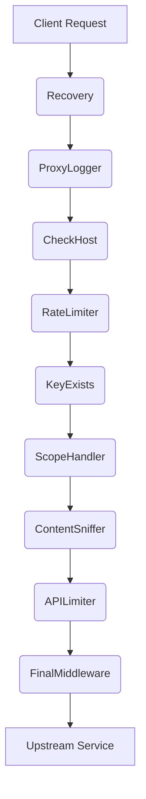

# Tyk Gateway Request Lifecycle

The Tyk Gateway is designed to process and protect your APIs. Understanding the request lifecycle is key to configuring your APIs effectively and diagnosing any issues. This document provides a high-level overview of how a request is processed by the Tyk Gateway.

## High-Level Overview

When a request comes into the Tyk Gateway, it passes through a series of middleware. Each middleware is a step in the processing chain that performs a specific function, such as authentication, rate limiting, or logging. If a middleware rejects a request, the chain is halted, and an error is returned to the client. If the request passes through all the middleware successfully, it is then proxied to your upstream service.

### Request Flow Diagram

Here is a simplified diagram illustrating the flow of a request through the Tyk Gateway's middleware chain:

## Core Middleware

The following is a list of the core middleware in the Tyk Gateway and their functions:

1.  **Recovery**: This is a panic recovery middleware. It ensures that if any part of the gateway panics, the gateway will recover gracefully without crashing.

2.  **ProxyLogger**: This middleware logs the details of the incoming request. This is useful for debugging and monitoring.

3.  **CheckHost**: This middleware checks the `Host` header of the request to ensure it matches the host configured for the API.

4.  **RateLimiter**: This middleware enforces the rate limits configured for the API key. If a key has exceeded its rate limit, the request will be rejected.

5.  **KeyExists**: This is the authentication middleware. It checks for the presence of a valid API key and authorizes the request.

6.  **ScopeHandler**: This middleware checks the OAuth scopes for the token used in the request. It ensures that the token has the required permissions to access the API.

7.  **ContentSniffer**: This middleware inspects the content of the request. It can be configured to look for specific patterns or to enforce content rules.

8.  **APILimiter**: This middleware enforces global rate limits for the API, independent of the API key.

9.  **FinalMiddleware**: This is the final step in the middleware chain. If the request has passed all the previous middleware, this middleware will proxy the request to your upstream service.

This high-level overview should give you a good understanding of the request lifecycle in the Tyk Gateway. For more detailed information, please refer to the [Plugin Developer Guide](./plugins/developer-guide.mdx).
