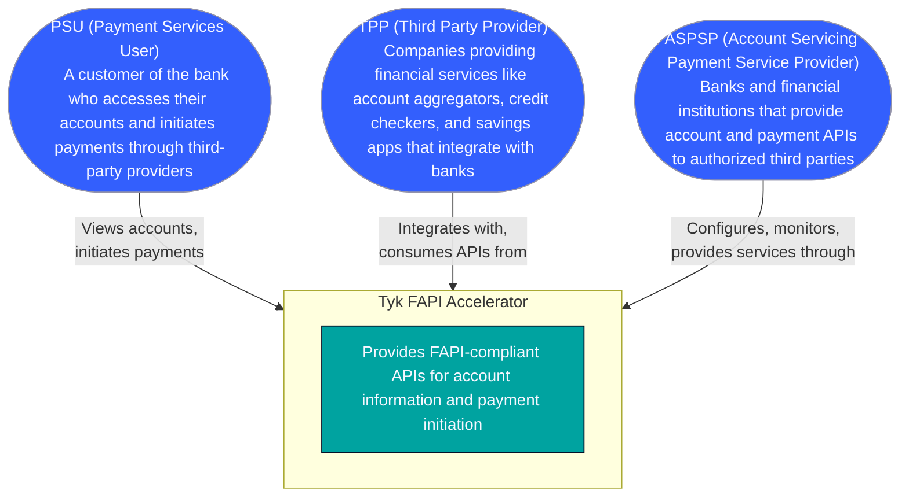
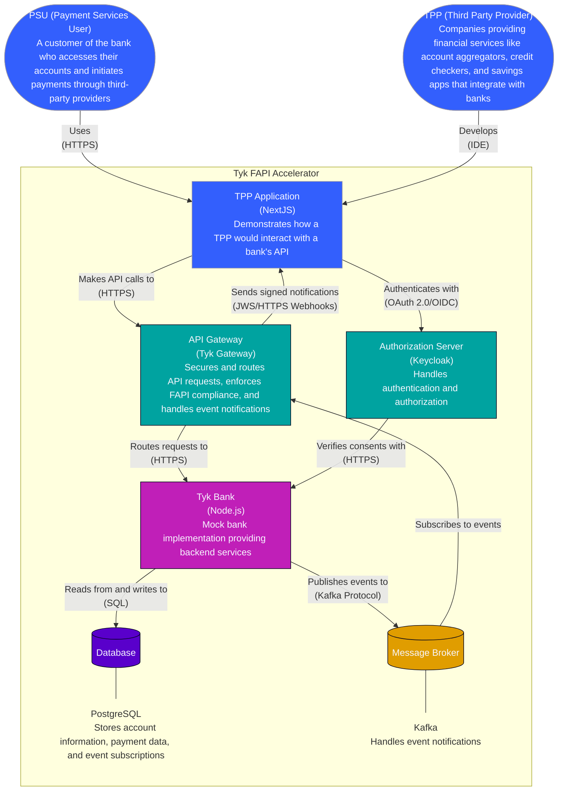
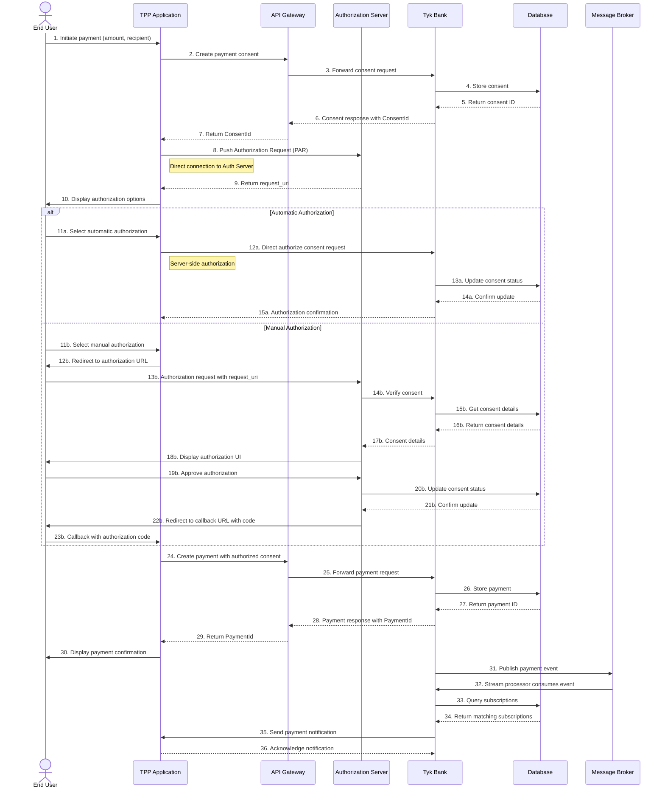
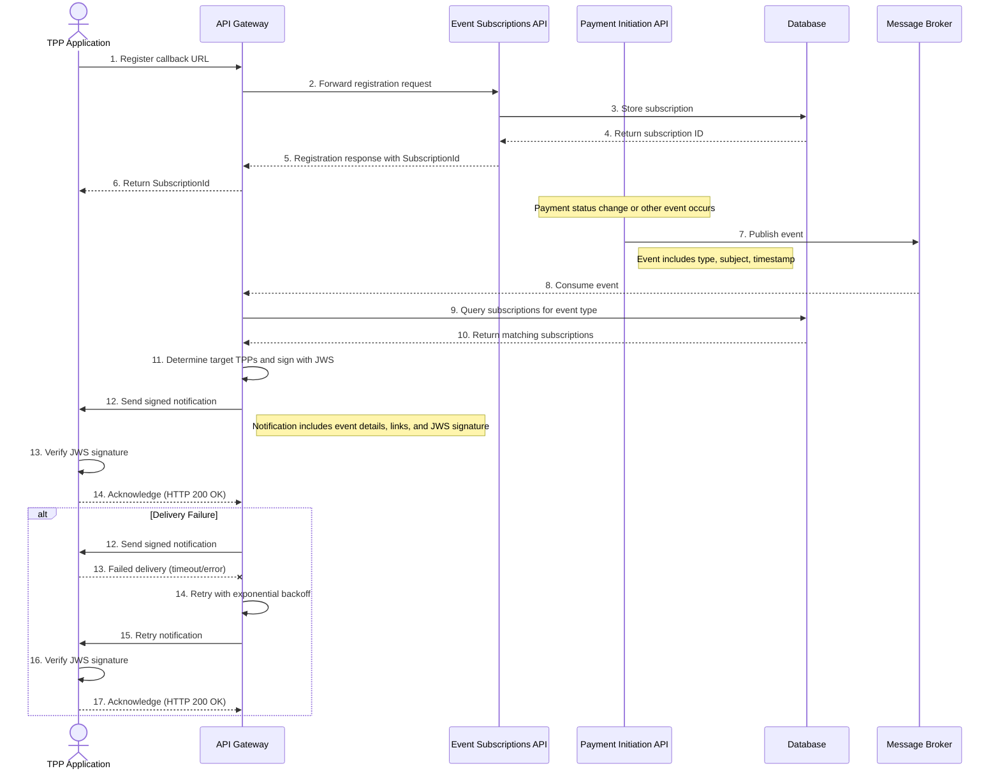

## Introduction

Open Banking is a financial services framework that enables secure data sharing between banks and third-party providers (TPPs) through standardized APIs. It fosters innovation, enhances customer experiences, and ensures compliance with regulatory requirements such as:
- **Payment Services Directive 2 (PSD2)** ([PSD2](https://www.ecb.europa.eu/press/intro/mip-online/2018/html/1803_revisedpsd.en.html)) in the European Union, mandating secure access to account information and payment services.
- **UK Open Banking** ([UK Open Banking](https://www.openbanking.org.uk/)), a UK initiative for standardized financial APIs.
- **Consumer Data Right (CDR)** ([CDR](https://www.cdr.gov.au/)) in Australia, enabling consumer data sharing.
- **Financial Data Exchange (FDX)** ([FDX](https://financialdataexchange.org/)) in the United States, an industry-led standard for data sharing.

Open Banking is enabling the banking industry to move from closed ecosystems to open standards and collaborative platforms where customer data can be securely shared with authorized third parties. However, financial institutions face challenges implementing secure, compliant, Open Banking APIs. This document explores how [Tyk API Gateway](/tyk-oss-gateway), through its [FAPI Accelerator](https://github.com/TykTechnologies/tyk-fapi), enables financial institutions to implement robust Open Banking APIs.

## Challenges in Financial Services API Implementation

Implementing Open Banking APIs presents several challenges:

1. **Stringent Security Requirements**:
   - Compliance with **Financial-grade API (FAPI)** standards, such as FAPI 2.0, which ensure high-security API interactions.
   - Ensuring data integrity, authenticity, and non-repudiation for sensitive financial transactions.

2. **Complex Authentication**:
   - Implementing **OAuth 2.0** with features like **Pushed Authorization Requests (PAR)** ([PAR](https://datatracker.ietf.org/doc/html/rfc9126)) and **Demonstrating Proof of Possession (DPoP)** ([DPoP](https://datatracker.ietf.org/doc/html/rfc9449)).
   - Managing secure user consent and authorization flows.

3. **Event Notifications**:
   - Enabling TPPs to subscribe to real-time updates about account and payment events.
   - Signing notifications with cryptographic signatures for security.

4. **Idempotency**:
   - Ensuring that duplicate requests (especially for payments) don't result in duplicate transactions.

5. **Developer Experience**:
   - Providing a seamless experience for TPP developers while maintaining high-security standards.

## What is Tyk FAPI Accelerator?

The **[Tyk FAPI Accelerator](https://github.com/TykTechnologies/tyk-fapi)** is a reference implementation provided by Tyk Technologies to help financial institutions build secure, standards-compliant Open Banking APIs. Built on the [Tyk API Gateway](/tyk-oss-gateway).

### Architecture Overview

The diagram below shows the Tyk FAPI Accelerator system in its environment, including users, external systems, and key actors.

### Tyk FAPI Accelerator

The diagram below shows all major components of the Tyk FAPI Accelerator and their interactions.

### Key Components

1. **API Gateway (Tyk Gateway)**:
   - Routes API requests to appropriate backend services
   - Implements DPoP authentication via gRPC plugin
   - Handles idempotency for payment requests
   - Signs and delivers event notifications to TPPs

2. **Authorization Server (Keycloak)**:
   - Provides FAPI 2.0 compliant OAuth 2.0 and OpenID Connect
   - Supports Pushed Authorization Requests (PAR)
   - Manages user authentication and consent

3. **Mock Bank Implementation**:
   - Implements UK Open Banking Account Information API
   - Implements UK Open Banking Payment Initiation API
   - Implements UK Open Banking Event Subscriptions API
   - Provides realistic testing environment

4. **TPP Application**:
   - Demonstrates how third parties integrate with the bank's APIs
   - Implements FAPI 2.0 security profile
   - Shows account information retrieval and payment initiation flows

### Security Features

The Tyk FAPI Accelerator implements several security features required for financial-grade APIs:

1. **DPoP (Demonstrating Proof of Possession)**:
   - Ensures the client possesses the private key corresponding to the public key in the token
   - Prevents token theft and replay attacks
   - Implemented as a gRPC plugin for Tyk Gateway

2. **JWS Signing for Event Notifications**:
   - Signs webhook notifications with JSON Web Signatures (JWS)
   - Ensures authenticity and integrity of notifications
   - Allows TPPs to verify the source of notifications

3. **Idempotency Support**:
   - Prevents duplicate transactions from repeated API calls
   - Caches responses for idempotent requests
   - Includes automatic garbage collection of expired entries

4. **OAuth 2.0 with PAR**:
   - Implements Pushed Authorization Requests for enhanced security
   - Supports both automatic and manual authorization flows
   - Complies with FAPI 2.0 security profile

## Getting Started

For detailed setup instructions, code examples, and deployment guides, please refer to the [Tyk FAPI Accelerator GitHub repository](https://github.com/TykTechnologies/tyk-fapi/tree/main?tab=readme-ov-file#getting-started).

## Implementation Examples

### Payment Flow Example

The following sequence diagram illustrates a typical payment flow in the Tyk FAPI Accelerator:

### Event Notification Example

The event notification system allows TPPs to receive updates about payment status changes:

